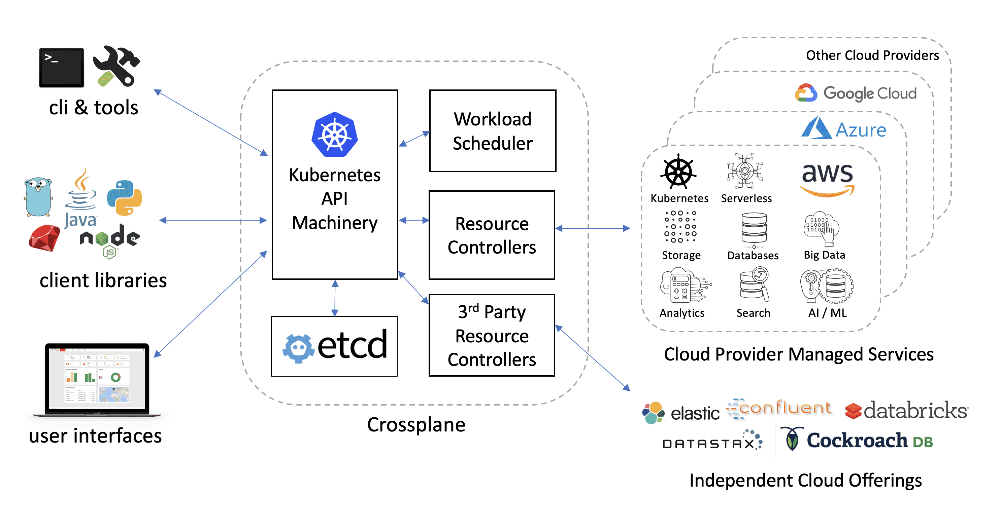

## Overview

Crossplane is an open source multicloud control plane. It introduces workload and resource abstractions on-top of existing managed services that enables a high degree of workload portability across cloud providers. A single crossplane enables the provisioning and full-lifecycle management of services and infrastructure across a wide range of providers, offerings, vendors, regions, and clusters. Crossplane offers a universal API for cloud computing, a workload scheduler, and a set of smart controllers that can automate work across clouds.

<h4 align="center"></h4>

Crossplane presents a declarative management style API that covers a wide range of portable abstractions including databases, message queues, buckets, data pipelines, serverless, clusters, and many more coming. It’s based on the declarative resource model of the popular [Kubernetes](https://github.com/kubernetes/kubernetes) project, and applies many of the lessons learned in container orchestration to multicloud workload and resource orchestration.

Crossplane supports a clean separation of concerns between developers and administrators. Developers define workloads without having to worry about implementation details, environment constraints, and policies. Administrators can define environment specifics, and policies. The separation of concern leads to a higher degree of reusability and reduces complexity.

Crossplane includes a workload scheduler that can factor a number of criteria including capabilities, availability, reliability, cost, regions, and performance while deploying workloads and their resources. The scheduler works alongside specialized resource controllers to ensure policies set by administrators are honored.

## Architecture and Vision

The full architecture and vision of the Crossplane project is described in depth in the [architecture document](https://docs.google.com/document/d/1whncqdUeU2cATGEJhHvzXWC9xdK29Er45NJeoemxebo/edit?usp=sharing). It is the best place to learn more about how Crossplane fits into the Kubernetes ecosystem, the intended use cases, and comparisons to existing projects.

## Getting Started and Documentation

For getting started guides, installation, deployment, and administration, see our [Documentation](https://crossplane.io/docs/latest).

## Contributing

Crossplane is a community driven project and we welcome contributions. See [Contributing](CONTRIBUTING.md) to get started.

## Report a Bug

For filing bugs, suggesting improvements, or requesting new features, please open an [issue](https://github.com/crossplaneio/crossplane/issues).

## Contact

Please use the following to reach members of the community:

- Slack: Join our [slack channel](https://slack.crossplane.io)
- Forums: [crossplane-dev](https://groups.google.com/forum/#!forum/crossplane-dev)
- Twitter: [@crossplane_io](https://twitter.com/crossplane_io)
- Email: [info@crossplane.io](mailto:info@crossplane.io)

## Community Meeting

A regular community meeting takes place every other [Tuesday at 9:00 AM PT (Pacific Time)](https://zoom.us/j/425148449).
Convert to your [local timezone](http://www.thetimezoneconverter.com/?t=9:00&tz=PT%20%28Pacific%20Time%29).

Any changes to the meeting schedule will be added to the [agenda doc](https://docs.google.com/document/d/1q_sp2jLQsDEOX7Yug6TPOv7Fwrys6EwcF5Itxjkno7Y/edit?usp=sharing) and posted to [Slack #announcements](https://crossplane.slack.com/messages/CEFQCGW1H/) and the [crossplane-dev mailing list](https://groups.google.com/forum/#!forum/crossplane-dev).

Anyone who wants to discuss the direction of the project, design and implementation reviews, or general questions with the broader community is welcome and encouraged to join.

* Meeting link: https://zoom.us/j/425148449
* [Current agenda and past meeting notes](https://docs.google.com/document/d/1q_sp2jLQsDEOX7Yug6TPOv7Fwrys6EwcF5Itxjkno7Y/edit?usp=sharing)
* [Past meeting recordings](https://www.youtube.com/playlist?list=PL510POnNVaaYYYDSICFSNWFqNbx1EMr-M)

## Project Status

The project is an early preview. We realize that it's going to take a village to arrive at the vision of a multicloud control plane, and we wanted to open this up early to get your help and feedback. Please see the [Roadmap](ROADMAP.md) for details on what we are planning for future releases.

### API Status

Each API supported by Crossplane is assigned its own individual status to reflect the varying maturity and stability. More details about API versioning and status in Kubernetes can be found on the Kubernetes [API versioning page](https://kubernetes.io/docs/concepts/overview/kubernetes-api/#api-versioning), but the key difference between the statuses are summarized below:

* **Alpha:** The API may change in incompatible ways in a later software release without notice, recommended for use only in short-lived testing clusters, due to increased risk of bugs and lack of long-term support.
* **Beta:** Support for the overall features will not be dropped, though details may change. Support for upgrading or migrating between versions will be provided, either through automation or manual steps.
* **Stable:** Features will appear in released software for many subsequent versions and support for upgrading between versions will be provided with software automation in the vast majority of scenarios.

| Cloud | Name     | Details           | API Group                             | Status |
| ----- | -------- | ----------------- | ------------------------------------- | ------ |
| All   | Compute  | Compute services  | compute.crossplane.io/v1alpha1        | Alpha  |
| All   | Storage  | Storage services  | storage.crossplane.io/v1alpha1        | Alpha  |
| AWS   | Compute  | Compute services  | compute.aws.crossplane.io/v1alpha1    | Alpha  |
| AWS   | Database | Database services | database.aws.crossplane.io/v1alpha1   | Alpha  |
| AWS   | Storage  | Storage services  | storage.aws.crossplane.io/v1alpha1    | Alpha  |
| Azure | Compute  | Compute services  | compute.azure.crossplane.io/v1alpha1  | Alpha  |
| Azure | Database | Database services | database.azure.crossplane.io/v1alpha1 | Alpha  |
| Azure | Storage  | Storage services  | storage.azure.crossplane.io/v1alpha1  | Alpha  |
| GCP   | Compute  | Compute services  | compute.gcp.crossplane.io/v1alpha1    | Alpha  |
| GCP   | Database | Database services | database.gcp.crossplane.io/v1alpha1   | Alpha  |
| GCP   | Storage  | Storage services  | storage.gcp.crossplane.io/v1alpha1    | Alpha  |

### Official Releases

Official releases of Crossplane can be found on the [releases page](https://github.com/crossplaneio/crossplane/releases).
Please note that it is **strongly recommended** that you use [official releases](https://github.com/crossplaneio/crossplane/releases) of Crossplane, as unreleased versions from the master branch are subject to changes and incompatibilities that will not be supported in the official releases.
Builds from the master branch can have functionality changed and even removed at any time without compatibility support and without prior notice.

## Licensing

Crossplane is under the Apache 2.0 license.

