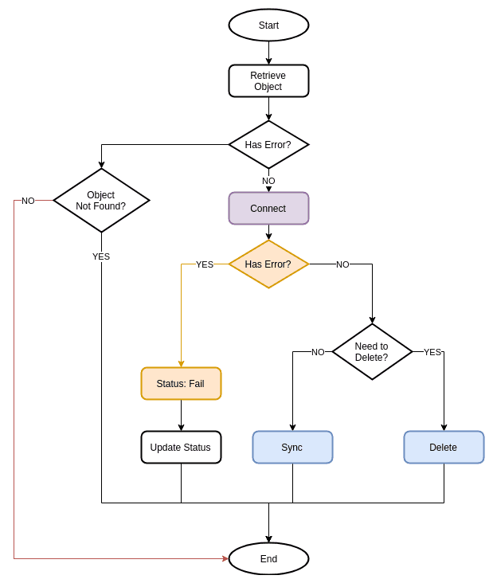
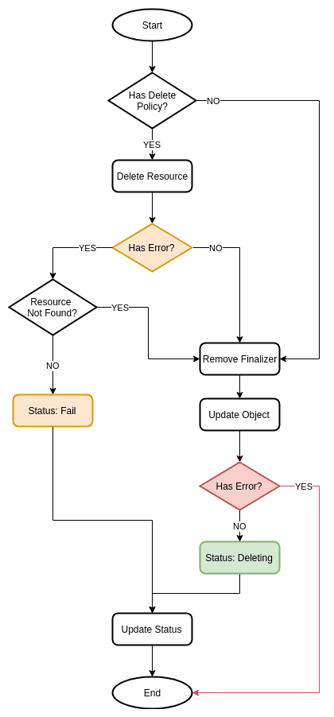
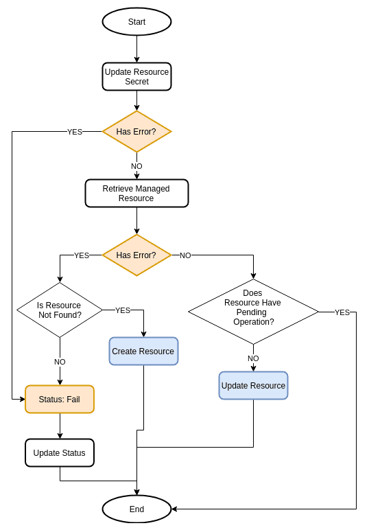
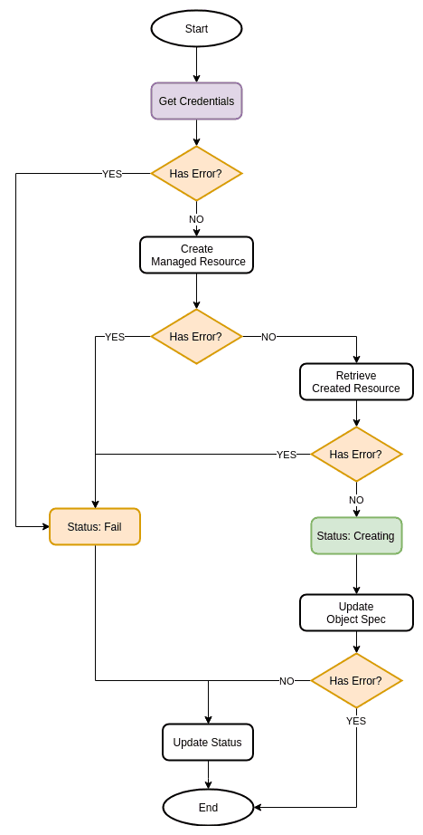
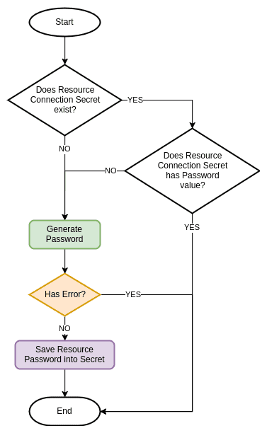
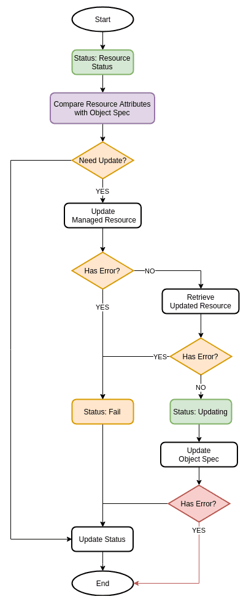

# Crossplane Reconciler Patterns
* Owner: Illya Chekrygin (@ichekrygin)
* Reviewers: Crossplane Maintainers
* Status: Defunct

While Kubernetes declarative style API probably one of the best features of Kubernetes as a platform, Kubernetes API extensibility is arguably one of the most exciting ones. 
Using Kubernetes Operators patterns user can extend Kubernetes API types to support Kubernetes internal or external resources. 
Controller-Runtime (defacto standard for Kubernetes operator frameworks: Kubebuilder, Operator SDK) does a great job simplifying the development process for Kubernetes operator by providing default project scaffolding and infrastructure libraries plumbing. Nevertheless, using a Declarative Style API (Kubernetes) to perform Imperative API operation (Managed Cloud Resources) is less than a straight-forward process.  

Crossplane developers is the expected audience for this document, and as such it is expected that readers have some familiarity with the [controller-runtime](https://github.com/kubernetes-sigs/controller-runtime).

## Goals
The primary goal of this document is to capture and communicate the lessons
learned during the development of many Crossplane controllers and reconcile
loops. This document aims to help Crossplane contributors write and extend
controllers that:

* Are readable, maintainable, and not intimidating to new contributors.
* Lend themselves to unit and integration testing.
* Learn from our mistakes, i.e. do not fall prey to known but subtle bugs and
  mispatterns and consider common but unobvious edge cases.

This document is not blindly prescriptive, but where patterns are recommended
they should be followed unless there is clear and obvious reason not to. The
recommendations made in this document should be seen as a "golden path"; a
beneficial collection of principals and patterns that the Crossplane community
have found facilitate the creation of successful controllers. While there is no
one pattern that is strictly applicable to all controllers the Crossplane
maintainers feel the project benefits from consistency in implementation where
possible.

## Terminology

*   _Crossplane Object_ refers to the CRD Type manifestation in Kubernetes API.
    *   This term is used interchangeably with Kubernetes object or object
*   _Managed Resources_ - resources create via cloud provider API’s.
*   _Reconcile Loop_ or _Function_ is a term that identifies a controller iteration cycle while processing the Crossplane object.
*   _External [Resource] Update_ - refers to the process of updating crossplane object outside of the primary controller reconcile loop (see Object State section)
*   _SyncPeriod_ - refers to the process that triggers reconciliation of all objects managed by the controller manager (see Manager SyncPeriod section)


## Status Sub-resource

Kubernetes Object is defined with status sub-resource, with crossplane common as well as a provider-resource specific set of attributes. 

*   Common attributes:
    *   Resource Id - unique identifier of the managed resource used for storage and status retrieval.
    *   Resource Status - represents managed resource status
    *   Conditions - a collection of possible conditions a given object can be at any point in time.
*   Specific attributes: this list of attributes can vary per given resource/provider.

### Resource ID

Most (if not all) managed cloud resources have a common requirement for unique resource identification (resource id). 
Crossplane by itself is not opinionated as for specific value or format of the resource id, as long as the value represents a unique identifier. 
Kubernetes API assigns a unique UID metadata value to every single Kubernetes. 
It became a common practice in crossplane (with few exception) to incorporate object UID value in managed resource naming convention. 
For example: **`gke-d8b86f26-67b8-11e9-ac04-9cb6d08bde99`** where `gke` is a prefix value, followed by the object UID. 

There are, however, exceptions to this rule for some cloud provider, resource combination. 
For example, there could be a restriction on resource name in terms of length or regex value. 

### Resource Status

The status of the managed resource reported by the cloud provider API. 

### Conditions

The enumeration of current and past object condition states as assigned by the controller. Each condition has the following attributes:

*   Active: true/false value identifies if the object currently has this condition.
*   Timestamp: when the condition has occurred for the first time or re-occurred if it entered and exited this condition state in the past.
*   Reason: for this condition, for example: when this condition has occurred.
*   Message: detailed information on this condition.

Supported object status condition type: _None_ (no conditions), _Pending_, _Ready_, and _Failed_. 

One can think of Condition value as a state in which the controller was as it was reconciling a given object. 
Conditions are expected to be unique in terms of the condition type values, i.e. there should be only one entry for a given condition type irrespective of the condition status. 
_Creating_ and _Deleting_ conditions are a clear example since one can create and delete any given object only once. 
However, the case with _Ready_, _Updating_ and _Failed_ conditions is less clear since the controller can encounter (enter/exit) those conditions multiple times throughout the object lifecycle. 
Conditions are expected to reflect the object’s current and “some” past states, i.e. Conditions can be viewed as a partial (or most recent) history of the object processing.

Since the main intent for Status Conditions to have an informational purpose the controllers <span style="text-decoration:underline;">should not</span> use condition values as a determinant for the reconciler execution path. 
Instead, in most (if not all) cases controllers <span style="text-decoration:underline;">should</span> use managed Resource Status and Properties values in reconciliation against the desired state and specs.


#### Initial Condition or No Condition

Special condition type typically indicating that the controller sees this object for the very first time. In the future, _None_ could be replaced with a default condition value representing the initial state by the mutating webhook.

#### Creating Condition

This condition is activated by the controller when it processed a create managed resource request. 
The _Creating_ condition is deactivated by the controller when the resource creation process has been completed and resulted in the activation of either:

*   _Running_ condition - if resource creation was successful
*   _Failed_ condition - if resource creation has failed.

Note, there could be other causes for the _Failed_ condition to be activated as a result of intermittent failures. In those cases, it is expected for the _Creating_ condition to remain active (see _Failed_ Condition for more details).

In addition to the create request completion, this condition can be preempted and deactivated by the Delete call, i.e. _Deleting_ condition, since it appears most cloud providers allow resource deletion irrespective of the current state.

#### Deleting Condition

This condition is activated by the controller when it has processed a delete managed resource request. 
Most commonly, this condition is very short lived due to the object being garbage collected by the Kubernetes API. 
However, there could be cases involving multiple finalizers when the object may remain in deleting stated for quite some time (this also could be an indication of the problem). 

The _Deleting_ condition is a terminal condition. 
In most cases all subsequent updates to the object specification should be ignored once this condition is activated, i.e. a user cannot issue an update to the object that previously has been deleted, even if it is still returned by the Kubernetes API. Similar to the previous conditions, in cases of intermittent failures it is possible for _Deleting_ condition to be active at the same time as _Failed_ condition (see _Failed_ Condition for more details)


#### Updating Condition

This condition is activated by the controller when it needs to adjust the managed resource configuration or settings:

*   Bring drifted resource state back into the desired state
*   Update resource to reflect new specifications
    *   Note: Only most recently added resources (Redis) provide an implementation for the resource update

Similar to _Create_ condition, the _Update_ condition can be preempted by the Delete call. 
Also similar to _Create_ condition, an active _Update_ condition can coexist with an active _Failed_ condition (see _Failed_ Condition for more details).


#### Ready Condition

This condition is activated when the managed resource status reflects that this resource is ready to be consumed. 
Note there could be multiple discrete values for managed resource state that match Ready condition. 
It is up to the resource type/controller implementation to decide the set of resource states that match this condition. 

Upon reaching this condition the controller is expected to generate or update the resource connection secret with most current values: endpoints, credentials, etc. 
In addition, controllers are expected to perform check for the spec update, if update functionality is implemented (see Updating Condition section). 
There could be some additional tasks performed by the controller for objects in _Ready_ condition, which could vary per type/controller. 

For Kubernetes internal types, once the object reaches the _Ready_ state, typically, there are no further reconciliation cycles required and the _External Update_ or _SyncPeriod_ are the only requeue triggers.  
The situation is slightly different from the external resources point of view, where resource could be changed outside of Kubernetes API scope (manually, programmatically or by the resource cloud API). 
Thus, it is important to perform routine checks on the external resource. 

The downside of using _SyncPeriod_ to manage resource states is - it has to be set to aggressively short duration period to be effective. 
For example, the default value 10h is hardly optimal when trying to detect and correct changes in managed resource state. 
The downside of the short duration period is it creates unnecessary churn since it will result in requeue of <span style="text-decoration:underline;">all objects managed by all controllers</span> under the controller manager. 

As an alternative to both `reconcile.Result{}` + `SyncPeriod`, we can a delay duration (configurable or hardcoded) for a specific type. Thus, upon successful reconciliation instead of:


```go
return reconcile.Result{Requeue: false}, nil
```


We can use:


```go
return reconcile.Result{RequeueAfter: reqeueuDelayOnSuccess}, nil
```


Where `requeueDelayOnSuccess` is specifically tailored for a given Type/Controller

Similar to all conditions above, the active _Ready _condition can coexist with the active _Failed_ condition (see _Failed_ Condition for more details).

Also similar to conditions above, the active _Ready_ condition can be preempted by the Delete call.


#### Failed Condition

This is the most tricky condition since it can be activated in multiple places and by multiple reasons.


##### Processing Errors

All errors encountered by the controller during reconciliation loop could be grouped into two categories:


*   _Handled_ - errors that are typically surfaced as a result of either object or resource operations and captured/saved into object status sub-resource_ Failed _condition
*   _Unhandled_ - these errors are commonly raised by an underlying framework (_controller-runtime_) and do not require special handling, i.e. cannot be saved into the object status, instead, those errors are propagated to the caller defined by the controller-runtime framework. There are typically two calls/places that could return an unhandled error:
    *   Failure to retrieve (get) the object for reasons other than “Not found” (404)
    *   Failure to update the object or object status sub-resource

### Resource Status

In addition to Handled errors, the Failed condition can be activated by the controller to reflect current resource status. 
The managed resource could enter a failed state as defined by the cloud provider API for multiple reasons:

*   Invalid or Incompatible resource properties during resource operation (create, update, etc.)
*   Changes to the environment (networking, authentication, and authorization, etc.)
*   Direct interaction with the resource by the user (outside of the Crossplane environment)
*   Others

These are all possible status values for [RDS DB Instance](https://docs.aws.amazon.com/AmazonRDS/latest/UserGuide/Overview.DBInstance.Status.html) and [RDS DB Cluster](https://docs.aws.amazon.com/AmazonRDS/latest/AuroraUserGuide/Aurora.Status.html). As you can see, there are multiple statuses that correspond to the resource being in a Failed state. Moreover, some failed states may be recoverable while others are not.

## Reconcile Loop

Crossplane implementation is based on the _controller-runtime_ framework where controllers are expected to provide an implementation for a Reconcile Interface

```go
func (r *Reconciler) Reconcile(req reconcile.Request) (reconcile.Result, error){
...
}
```
<sub>Fig 1. Reconcile function</sub>


### Input

**_reconcile.Request_** with key property for Kubernetes object retrieval


### Output

The Reconcile functions return **reconcile.Result** and **error** which are used by the controller to handle this object in terms of further processing.


### To Requeue or Not To Requeue”? 

That is a trick question. The answer is “Yes, Requeue”. 
The real question is “When to Requeue?”, and the answer to this question is determined by the combination of both result and error values, as well as the state of the object, and the global controller manager sync period.


#### Manager SyncPeriod

Per **_controller-runtime_** documentation: 

```
SyncPeriod determines the minimum frequency at which watched resources are
reconciled. A lower period will correct entropy more quickly, but reduce
responsiveness to change if there are many watched resources. Change this
value only if you know what you are doing. Defaults to 10 hours if unset.
```


#### Object State

Object state can be viewed in a binary “Dirty/Clean” format, with:


*   Dirty: object state has changed since the last reconciliation cycle. Note the change could be introduced as a result of:
    *   Internal Update, i.e. update to the object spec or sub-resources inside the reconcile loop
    *   External update, i.e. update outside of this controller context, i.e. via user call to Kubernetes API (kubectl apply, or from another controller/process)
*   Clean: object state did not change since the last reconciliation cycle. 


#### Requeue Matrix

<table>
  <tr>
   <td><strong>Object State</strong>
   </td>
   <td><strong>Reconcile.Result</strong>
   </td>
   <td><strong>Error</strong>
   </td>
   <td><strong>When to Requeue</strong>
   </td>
  </tr>
  <tr>
   <td>Dirty
   </td>
   <td>Any
   </td>
   <td>Any
   </td>
   <td>Immediate.
   </td>
  </tr>
  <tr>
   <td>Clean
   </td>
   <td>Any
   </td>
   <td>Error
   </td>
   <td>Exponential Backoff
   </td>
  </tr>
  <tr>
   <td>Clean
   </td>
   <td>Result{Requeue: true}
   </td>
   <td>Any
   </td>
   <td>Exponential Backoff
   </td>
  </tr>
  <tr>
   <td>Clean
   </td>
   <td>Result{Requeue: false}
   </td>
   <td>Nil
   </td>
   <td>Sync Period
   </td>
  </tr>
  <tr>
   <td>Clean
   </td>
   <td>Result{RequeueAfter: 1 minute}
   </td>
   <td>Nil
   </td>
   <td>After 1 minute delay
   </td>
  </tr>
</table>


##### Suggested Return Values

###### reconcile.Result{}, nil

Description: the controller is done with the reconciliation of this object and there are no additional operation steps needed (ever), i.e. the only ways for this object to be queued again are via _SyncPeriod_ or _External Update._

Best fit: 

*   The object is not found (deleted and garbage collected)
*   The object is successfully deleted, finalizer removed and updated.


###### reconcile.Result{Requeue: true}, nil

Description: the controller encountered and handled the error during the object reconciliation.

Best fit: The object processing which resulted in an active _Failed_ status condition. The reason why we want to explicitly set {Requeue: true} is to handle the case of multiple (or perpetual) failures. For example: when the controller attempts to create the managed resource for the first time and gets resource API error, it will set (activate) Failed condition, update the status, and return “{Requeue: true}, nil”. In this specific case, since the state of the object status has changed (i.e. “dirty state”), the value of “{Requeue: true}” is superfluous, since the object will be immediately requeued anyways. However, if during the second (and all following) reconciliation attempt the controller receives the same error, it will set (activate) Failed condition which is already active, thus updating resource status will result in “noop”, i.e. (“clean state”). This is the reason why we want to explicitly instruct the controller to “{Requeue: true}” with exponential back-off.


###### reconcile.Result{RequeueAfter: duration}, nil

Description: the controller successfully processed reconciliation of the object.

Best fit:

*   The object reconciliation was successful, however, the remote cloud API is still performing create/update operation, which typically represented by the object’s CREATING or UPDATING status. Commonly, the duration value should be set to a “granular” value, for example: “30 seconds”, etc. The actual value could vary per status and object type combination.
*   Object reconciliation was successful, and the controller would like to check on it next time in “less granular” duration, for example: “2 minutes”, etc. Similarly, the actual value could vary per status and object type combination.


##### reconcile.Result{}, err

Description: this is the case when we are returning “unhandled” error, at which point the value of “reconcile.Result{}” is irrelevant, thus all three: “reconcile.[**Result{}**,**Result{Requeue: true}**,**Result{RequeueAfter: duration}**, **err**” are semantically equivalent.


### Reconcile Loop



<sub>Fig 2. Reconcile Loop</sub>


#### Retrieve Object

One of the first steps of every reconcile function it to retrieve the kubernetes object based on request key property.  If the object retrieval results in error, this could be either:


*   Not Found (404) - the object was deleted and does not exist. There is really not much could be done at this point in terms of handling the deletion. For special deletion handling, we should leverage object **finalizer** property, which once set will prevent object removal from the API (for more detail see Delete Section).
*   Intermittent API error, in which case there is nothing could be done except to propagate the error to the caller (see Unhandled errors section above)


#### Connect

Establish a resource client base on the cloud provider credentials. If a connection results in failure, update the object status sub-resource and exit reconcile loop. If the connection is successful, the Connect should return a Resource Operation Handler which provides support for the full set of Resource and Object related operations. 


#### Check for Deletion

Check for **_DeletionTimestamp_** property to determine if this object needs to be deleted. If yes - call Delete function, update the status and return. For more details see Delete function in SyncDeleter interface section.


#### Synchronize Object and Resource

Depending on the current state of the object the controller will perform a set of tasks needed in an attempt to bring the managed resource to the desired state. For more details see Update function in SyncDeleter interface section.


### Interfaces

Controller-runtime does a great job by abstracting all operator paradigm infrastructure: watchers and listers and provides a developer with a clean and simple Reconciler interface with a single function: **Reconcile(Request) (Result, error)**. Perhaps, writing a Kubernetes internal resource reconciliation could be achieved in a single function call (although I doubt that is possible especially with the manageable cognitive complexity), it is proven hands down impossible for external (managed) resources. Crossplaine reconciliation paradigm has organically evolved (and still evolving). As a result, one can observe multiple organizational patterns:


*   Monolithic Reconcile Function
*   Reconcile Function + Phase-specific stubbed function.
*   Reconcile Function + Phase-specific interfaces
*   Reconcile Function + Resource Handler interface + Phase-Specific interfaces.

This document will focus and propose and expand on the latter, however, as mentioned earlier, the search for “perfect reconciler” is not complete.


#### Resource Operations Interface

The resource operation interface is a union of all resource operations across multiple functional areas. In Fig 2. “Connect” operation returns Resource [Operations] Handler, which implements the Resource Operations interface. 

Sample of the Resource Operations interface: 


```go
type operations interface {
	// Resource object operations
	addFinalizer()
	removeFinalizer()
	isReclaimDelete() bool
	getSpecAttrs() v1alpha1.ResourceSpecAttrs
	setSpecAttrs(*group.ResourceAttrs)
	setStatusAttrs(*group.ResouceAttrs)
	setReady()
	failReconcile(ctx context.Context, reason, msg string) error

	// Controller-runtime operations
	updateObject(ctx context.Context) error
	updateStatus(ctx context.Context) error
	updateSecret(ctx context.Context) error

	// Managed Resource Client operations
	createResource(ctx context.Context, args string) error
	deleteResource(ctx context.Context) error
	updateResource(ctx context.Context, args string) error
	getAttributes(ctx context.Context) (*group.ResourceAttrs, error)
}
```


##### Resource Object Operations

Provide a definition for operations against the given resource type (Kubernetes object). Note while there are a common set of operations across all resources (“setReady”, “isReclaimDelete”, etc), some operations may be resource type specific (“getSpecAttr”, etc). Resource operations are implemented by the Resource Handler.


##### Controller-runtime Operations

Provide a definition for the object runtime operations. Typically those are limited to above three.


##### Managed Resource Client Operations

Provide a definition for managed resource handling operations and considered as integration layer with the managed resource client libraries. 


#### Resource SyncDeleter Maker 

This interface is responsible for integrating the Resource Operations Creation process with Reconciler, with the main purpose of test enablement.

Example: 


```go
type maker interface {
	newSyncDeleter(context.Context, *v1alpha1.Resource) (syncdeleter, error)
}
```


#### Resource SyncDeleter Interface

This interface provides high-level object handling. As per Fig 2. Reconcile function performs two types of object operations: Sync or Delete. Those operations are facilitated by SyncDeleter interface. 

Example:


```go
type syncdeleter interface {
	delete(context.Context) (reconcile.Result, error)
	sync(context.Context) (reconcile.Result, error)
}
```

Both “sync” and “delete” function are expected to handle object status update and return reconcile.Result + error. 

##### Delete 

<table>
  <tr>
   <td>Delete function responsible for handling managed resource according to the Resource Retention Policy. Crossplane defines two types of managed resource retention policy: Retain and Delete
<h6>Retain Policy</h6>
<p>
The managed resource will be left behind in orphaned state. It is implied that the Crossplane administrator will manually reclaim this managed resource (if needed) and all resource-related artifacts: security groups, subnets, etc.
<h6>Delete Policy</h6>
<p>
Upon deletion of the crossplane resource object, the controller will attempt to reclaim (delete) the corresponding managed resource and all resource-related artifacts. It is up to the specific controller on how to handle cases when the managed resource is not found. Typically this results in “no-op” operation and deletion considered to be successful.
<p>
This condition typically handled as “no-op”, i.e. successful deletion.
   </td>
   <td>
   
</p>
<sub>Fig 3. Delete</sub>
   </td>
  </tr>
</table> 


#### 


##### Sync


<table>
  <tr>
   <td>The sync function is responsible for synchronizing managed resource properties and state with the properties declared in the crossplane object spec section. 
<h6>Update Connection Secret</h6>


<p>
Controller updates resource secret (typically connection) at the beginning of Sync function.
<h6>Retrieve Managed Resource</h6>


<p>
The controller will retrieve managed resource information from using a cloud provider client API. If the resource is not found, the controller will proceed to Create a new resource, otherwise, the controller will proceed to update[check] of the existing resource. 
<p>
If resource retrieval has failed, the controller will update object status appropriately, activating the failed status condition. 
<h6>Pending Operation</h6>


<p>
If the managed resource has an active operation (“creating”, “updating”, etc.) the controller should return: <strong>reconcile.Result{RequeueAfter: waitDuration}</strong>
   </td>
   <td>



<sub>Fig 4. Sync</sub>
   </td>
  </tr>
</table>


#### Resource CreateUpdater Interface

This interface provides resource Sync functionality, i.e. controller should either create or update a given managed resource. 

```go
type createupdater interface {
	create(context.Context) (reconcile.Result, error)
	update(context.Context, *storage.BucketAttrs) (reconcile.Result, error)
}
```

##### Create

<table>
  <tr>
   <td>
<h6>Preparation </h6>

Create function starts with password retrieval (see <em>Password</em> section below for more details). 
<p>
If password retrieval fails - Failed condition is activated and reconcile.Result{Requeue: true} is returned to the caller.
<p>
Note, depending on the resource there could be additional preparation
<p>
ion steps required:
<ul>

<li>Multiple credentials

<li>Other additional properties

<h6>Resource Creation</h6>


<p>
When all required preparation steps are successfully completed, controller issues Create Resource call using cloud provider Resource Client. Note, most commonly this is a non-blocking call. 
<p>
If Create Resource request resulted in an error, this means that the resource creation did not start. Most commonly the errors are due to invalid parameter/values combinations.
<p>
If Create Resource was successful, the client typically returns a tracking object reference, using which we can further interrogate the cloud provider API about the status of this operation. 
<p>
<strong>Note</strong>: it is up to the controller and/or client implementation whether to use tracking operation object. Since the managed resource state should reflect resource status, this could be a sufficient mechanism to track managed resource Readiness or Failure. However, in case of the operation failed and depending on the cloud provider the failure details could be only available via tracking operation object status.
<h6>Spec Update</h6>


<p>
When applicable, upon successful creation, the controller can perform managed resource properties retrieval in order to save them back to the object spec. This is done to capture any default property values that were set by the managed resource API. 
</li>
</ul>
   </td>
   <td>



<sub>Fig 5. Create</sub>
   </td>
  </tr>
  <tr>
   <td>
<h6>Password</h6>

Most managed resources require credentials properties upon creation (typically administrator password, etc.)
<p>
Managed resource password is generated by the crossplane controller and persisted into the Kubernetes Secret object (Secret object reference should be reflected in the resource object status sub-resource). 
<p>
First, controller checks if the connection secret already exists and if it contains a password value. If so, the controller returns that password value. Otherwise, the controller generates new password value and saves it into the connection secret before returning it to the caller. 
<p>
Note, while password generation errors are treated as Handled Errors, in reality, those are non-recoverable system errors. 
<p>
Secret upsert error is a Handled Error. 
<p>
All errors are returned to the caller.
   </td>
   <td>



<sub>Fig 6.Credentials</sub>
   </td>
  </tr>
</table>


##### Update


<table>
  <tr>
   <td>
<h6>Resource Status</h6>

The controller captures managed resource status and updates object status sub-resource (typically “state” field).
<h6>Update Check</h6>


<p>
The controller compares the managed resource attributes with the object spec to detect if there is a need for an update operation. If there is, the controller performs the update on the resource, followed by managed resource properties retrieval and object spec update (similar to create operation). If there is no need for an update, the controller should return:
<p>
<strong>reconcile.Result{RequeueAfter: successDuration}</strong>
<p>
Where successDuration is requeue delay upon successful. 
   </td>
   <td>



<sub>Fig 7. Update</sub>`
   </td>
  </tr>
</table>


## Examples

The closest examples of the controller following this design paradigm are:


*   [GCP Bucket Controller](https://github.com/crossplane/crossplane/blob/master/pkg/controller/gcp/storage/bucket.go)
*   [Azure Storage Account Controller](https://github.com/crossplane/crossplane/blob/master/pkg/controller/azure/storage/account/account.go)


## References


*   [Kubebuilder Book](https://book.kubebuilder.io/)
*   [Controller-Runtime](https://github.com/kubernetes-sigs/controller-runtime)
