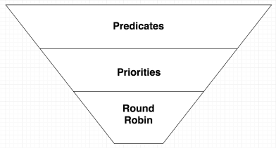

# Workload Scheduler
* Owner: Illya Chekrygin (@ichekrygin)
* Reviewers: Crossplane Maintainers
* Status: Defunct

## Abstract
From the Crossplane Intro blog:

_It includes a workload scheduler that can factor a number of criteria including capabilities, availability, reliability, cost, regions, and performance while deploying workloads and their resources._

Kubernetes did a great job implementing a rich and flexible scheduler for Pods. Today we are extending Pod scheduling for Multi-Cluster environments, expanding and optimizing it even further for non-Kubernetes workloads and resources. Workload Scheduler is an integral piece of the Crossplane platform, and it is responsible for finding the best suited compute resource to fulfill the workload objectives. Similar to Kubernetes Pod scheduler, Crossplane offers feature-rich and robust scheduling mechanism for workloads, yet it is completely flexible and extensible by the external scheduler implementations. 

### Goals
- Workload implementation limited to Kubernetes types
    - Currently: Deployment and Service

### Non-goals
This effort does not include
- Resource scheduler(s) or ResourceClass's integration 
- Kubernetes clusters autoscaling
- Workloads targets other than Kubernetes clusters:
    - Serverless
    - VM’s


## Resource and Workload
Currently, crossplane does not provide an overarching context for crossplane resources and workloads. Thus we will treat resource and workload schedulers separately. This document’s primary focus is Workload Scheduler.

### Conceptual example of the overarching context 

- The user deploys a workload that depends on a MySql Resource claim.
- The user also provides MySql Resource Claim definition which points to a specific ResourceClass.

In a "standard" (Crossplane or PV/PVC) - the MySQL Instance will be provisioned irrespective of the workload definition. Thus if it happened to be say: RDS, then the workload should be ideally scheduled on EKS cluster (just an example). As we can see the resource class has a strong influence on the workload scheduler.

It would be desirable that the ResourceClass could be dynamically adjusted by the resource scheduler based on overall context of the workload. For example: if the workload is better suited to run on GCP, it would be preferable to adjust the MySQL resource class to use CloudSQL, etc.

This type of two-way coordination is difficult to achieve w/out the overarching context.

## Resource Scheduler

#### Resource Claims:
- `ResourceClaim` is tightly coupled to the specific `ResourceClass` 
- `ResourceClass` is tightly coupled to the specific `CloudProvider`.
- By extension, `ResourceClaim` is coupled to the specific cloud provider.

#### Resource Claim Provisioning:
- `ResourceClaim` and `Workloads` have separate and distinct contexts and life-cycles. 
- `ResourceClaim` is provisioned separately from the `Workload`
- `ResourceClaim` can be referenced by multiple `Workload` instances.

Currently, there is no overarching context that combine definitions of the abstract resources and workloads.

## Workload Scheduler
Workload scheduler is inspired by the Kubernetes Pod Scheduler. 

### Use Cases

#### No (0) Kubernetes Clusters
This is one of the simplest use-cases in terms of scheduling: the workload scheduling cannot be fulfilled since there are no available Kubernetes clusters.

#### One (1) Kubernetes Cluster
The workload is provisioning to the one and only available Kubernetes cluster granted satisfied cluster predicates.

#### Many Kubernetes Clusters
This is the “main” use case for the workload scheduler: select the best matching Kubernetes Cluster for the list of available clusters and apply predicates.

## Algorithm
Workload scheduler picks the most appropriate Kubernetes cluster out of the list of candidates in two steps: predicates and filters[^2].

[^2]

### Kubernetes Clusters predicates
Predicates are pure functions which take a Kubernetes cluster and a workload and return a boolean whether that workload fits onto the Kubernetes cluster or not. 
Predicates are meant to be fast and should eliminate all the clusters that can’t fit the workload[^2]. 

#### Named Cluster
This is very similar to the current implementation (i.e no scheduler), where cluster name is provided via workload spec definition: targetCluster

```yaml
apiVersion: compute.crossplane.io/v1alpha1
kind: Workload
metadata:
  name: test-workload
spec:
  resources:
    - name: demo-mysql
  targetCluster:
    name: demo-cluster
    namespace: crossplane-system
  targetNamespace: demo
  targetDeployment:
  targetService:
```

#### Cluster Selector
Limit the selection to the clusters with matching cluster attributes and/or labels:
1. Cluster Reference
    - Cluster Name
    - Cluster Namespace
1. Built-In Cluster Labels
    - Cluster version
    - Cloud provider
    - Others (TBD)

Adding labels to Kubernetes clusters allows targeting workloads to specific clusters or group of clusters.

```yaml
apiVersion: compute.crossplane.io/v1alpha1
kind: Workload
metadata:
  name: test-workload
spec:
  clusterSelector:
    clusterVersion: '1.11.4'
    cloudProvider: GCP
    foo: bar
  resources:
    - name: demo-mysql
  targetNamespace: demo
  targetDeployment:
  targetService:
```

#### Cluster Affinity 
Cluster affinity is conceptually similar to clusterSelector – it allows you to constrain which clusters your workload is eligible to be scheduled on, based on labels on the cluster.

```yaml
apiVersion: compute.crossplane.io/v1alpha1
kind: Workload
metadata:
  name: test-workload
spec:
  affinity:
    clusterAffinity:
      requiredDuringSchedulingIgnoredDuringExecution:
        clusterSelectorTerms:
        - matchExpressions:
          - key: crossplane.io/provider
            operator: In
            values:
            - aws
      preferredDuringSchedulingIgnoredDuringExecution:
      - weight: 1
        preference:
          matchExpressions:
          - key: another-cluster-label-key
            operator: In
            values:
            - another-cluster-label-value
  resources:
    - name: demo-mysql
  targetNamespace: demo
  targetDeployment:
  targetService:	
```
	
**TODO**: Cluster Affinity needs to be defined further.

#### Inter-Workload Affinity and Anti-affinity
Inter-workload affinity and anti-affinity allow you to constrain which clusters your workload is eligible to be scheduled based on labels on 
workloads that are already running on the cluster rather than based on labels on clusters. The rules are of the form “this workload 
should (or, in the case of anti-affinity, should not) run in an X if that X is already running one or more workloads that meet rule Y”. 
Conceptually X is a topology domain like cloud provider, cloud provider zone, cloud provider region, etc. You express it using a topologyKey 
which is the key for the cluster label that the system uses to denote such a topology domain, e.g. see the label keys listed above in the section 
ClusterSelector: built-in cluster labels[^1]. 

In practical terms, Inter-Workload Affinity and Anti-affinity is important when deploying interdependent workloads, which must target the same cluster. For example, the front-end application must be deployed into the same Kubernetes cluster which is targeted by the back-end service.

```yaml
apiVersion: compute.crossplane.io/v1alpha1
kind: Workload
metadata:
  name: front-end
spec:
  affinity:
   workloadAffinity:
      requiredDuringSchedulingIgnoredDuringExecution:
      - labelSelector:
          matchExpressions:
          - key: app
            operator: In
            values:
            - back-end
        topologyKey: crossplane.io/kubernetes
    workloadAntiAffinity:
      preferredDuringSchedulingIgnoredDuringExecution:
      - weight: 100
        workloadAffinityTerm:
          labelSelector:
            matchExpressions:
            - key: app
              operator: In
              values:
              - frontend
          topologyKey: crossplane.io/kubernetes
  resources:
    - name: demo-mysql
  targetNamespace: demo
  targetDeployment:
  targetService:	
```

**TODO**: Workload Affinity and Anti-affinity need to be defined further

### Kubernetes Cluster Priorities
Priorities, much like predicates, take a Kubernetes cluster and a workload but instead of a binary value (true/false), return a “score”, an integer between 1 and 10. 
This step is called ranking and is where the algorithm ranks all the Kubernetes clusters to find the best one suited for the workload[^2].


### Extending Workload Scheduler
Crossplane will provide default workload schedulers for all workload types. In addition it will provide a faculty to extend workload scheduling functionality by means of external (to Crossplane) schedulers. 

Every workload type spec will provide support for “schedulerName” field. If field value is not provided, the “shedulerName” will be implicitly set to the default scheduler for a given workload type.

```yaml
apiVersion: compute.crossplane.io/v1alpha1
kind: Workload
metadata:
  name: test-workload
spec:
  schedulerName: my-customer-scheduler 
```

If schedulerName is provided then the workload scheduling is expected to be fulfilled by the component (controller or webhook) with matching schedulerName. 


## Road Map
- Basic Scheduler: split Workload controller onto:
    - Workload Scheduler: responsible for target cluster assignment
    - Basic Cluster Selector using cluster object name/namespace
    - Workload Propagator: responsible for delivering workload artifacts to the destination a.k.a “target” cluster.
- Pluggable and Default Schedulers: allow workload to contain information on which scheduler should be used. This is similar to the Resource Provisioner. In addition there should be a notion of the “default” workload scheduler.
- Workload Scheduler with Cluster Selector support
- Workload Scheduler with Cluster Affinity support
- Workload Scheduler with Inter-Workload Affinity support
- Extending Workload Scheduler with:
    - Multiple scheduler controllers running side-by-side with default scheduler
    - Mutating webhook 


## Phase A 

### Design:
Basic Scheduler using Cluster Name/Namespace.

Propagate a workload to the given Kubernetes cluster based on the cluster reference: Name and Namespace, i.e. currently implemented functionality. 

### Items:
- Split current Workload controller on two separate controllers:
    - Workload Scheduler - performs workload Kubernetes cluster assignment
    - Workload Propagator - performs workload artifacts propagation to the assigned cluster
- Update Workload type by adding an addition field(s):
    - `Workload.Spec`
        - `ClusterSelector` - contains list of label key/values:
            - clusterName: name 
            - clusterNamespace: namespace
            - clusterProvider: [aws,azure,gcp]
            - clusterVersion: ‘1.11.1’
    - `Workload.Status`
        - `clusterRef`: Crossplane Kubernetes cluster resource reference
- Handling:
    - Scheduler 
        - will determine target cluster based on the Workload.Spec.ClusterSelector field values. 
        - If there is no available clusters that could satisfy ClusterSelector, the Workload will get into a `Failed` state:
        - Reason: “Failed to scheduler”
        - Message: an appropriate message with additional details.
    - Propagator 
        - will use Workload.Status.clusterRef field for workload artifacts propagation.

## References:
- https://kubernetes.io/docs/concepts/configuration/assign-pod-node/
- http://alexandrutopliceanu.ro/post/scheduling-in-kubernetes/

[^1]: https://kubernetes.io/docs/concepts/configuration/assign-pod-node/
[^2]: http://alexandrutopliceanu.ro/post/scheduling-in-kubernetes/

