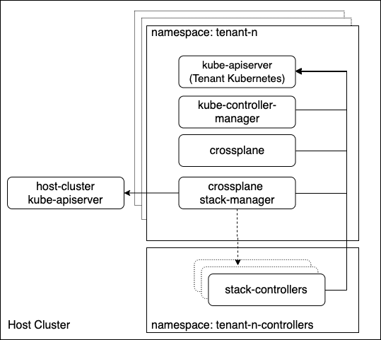

# Host Aware Stack Manager

* Owner: Hasan Turken (@turkenh)
* Reviewers: Crossplane Maintainers
* Status: Defunct

## Terminology

* _Custom Resource Definition (CRD)_: A Kubernetes type that defines a new type
  of resource that can be managed declaratively. This serves as the unit of
  management in Crossplane.
* _Host Cluster_: A Kubernetes cluster with scheduling capabilities where Crossplane,
  Stack Manager and other stack controller pods run.
* _Tenant Instance_: A Kubernetes API instance (typically Kubernetes API Server +
  controller manager with minimum number of controllers enabled) that Crossplane
  controllers watch and act for Custom Resources.

## Background

Crossplane controllers manage external resources declaratively via Kubernetes Custom Resources. They do not need
workload scheduling capabilities and only need to have access to Kubernetes API Server to act on custom resources.
Hence, it should not be mandatory to have a full Kubernetes Cluster (with scheduling capabilities) as long as
controllers are running somewhere and configured against Kubernetes API server instance.

Stack Manager is responsible for deployment of Crossplane controllers packaged as `stacks`. Currently, it assumes it is
the same Kubernetes API where controller pods deployed and custom resources exist which makes it mandatory to have a
dedicated Kubernetes Cluster per Crossplane installation.

## Goals

- Deploy multiple isolated instances of Crossplane controllers on a single Kubernetes cluster (a.k.a. Host Cluster).
- Make Stack Manager host aware so that it can deploy controller pods on Host cluster but watch and configure 
  stack controllers to watch separate Kubernetes API instances for custom resources.

## Proposal

Stack Manager should support configuring different Kubernetes API Servers for scheduling stack controllers and watching
custom resources. This will enable deploying multiple isolated Crossplane instances watching dedicated Kubernetes
API instances (i.e. multiple API instances running in different namespaces) on a single Host Kubernetes cluster.



## Required Changes

- Stack Manager Changes: 
    - It should be possible to configure Stack Manager against two different Kubernetes API Servers.
    - Stack Manager should watch `stack` related CRs on Tenant Instance API Server but should schedule stack
      installation jobs and controller deployments on Host Cluster.
    - Stack Manager should configure stack controller pods in a way that they will communicate Tenant Instance
      API Servers instead of Host Cluster API Server.

- Packaging Changes:
    - It should be possible to deploy crossplane types and roles (CRDs and RBACs) separately from Crossplane and Stack
      Manager pods.
    
### Stack Manager Changes

#### Host Cluster Access

The suggested way to access Kubernetes API from a pod is using [`in cluster config`](https://kubernetes.io/docs/tasks/access-application-cluster/access-cluster/#accessing-the-api-from-a-pod).
However, for this proposal, we need to authenticate two different Kubernetes API's inside the stack manager pod and
we can only use `in cluster config` for one of them and will take a `kubeconfig` as parameter for the other.

- Option 1: Using `in cluster config` for Host Cluster: Host Cluster already auto-mounts service account tokens which we
  can use.

- Option 2: Using `in cluster config` for Tenant Instance: This will be consistent with other controllers (Crossplane
  and stack controllers).

To leverage existing mechanisms to authenticate to host cluster, we will use Option 1. We will define RBAC rules for
stack manager which will be part of `crossplane-controllers` helm chart (see [packaging changes](#packaging-changes))
that will be deployed into host cluster. This way, we can explicitly declare permissions of stack manager on Host
Cluster.

#### Stack Installation

In case of a stack installation, Stack Manager should:

1. Create install-job on Host Cluster and read logs of install pod from Host.
2. Deploy `Stack`, `CRDs` and `RBAC` resources on Tenant Instance
3. Wait until a service account token secret is created for the stack to be installed.
4. Copy service account token secret into Host Cluster.
5. Deploy stack controller deployment by [configuring against Tenant Instance API Server](#configuring-a-pod-against-tenant-kubernetes-api-server).


##### Mapping Resources to Host

While creating resources (token secrets or controller deployments) on Host Cluster, Stack Manager will map objects
(jobs, deployments, secrets ...) on multiple namespaces of Tenant Instance into a single namespace on Host Cluster
by prepending `<namespace>.` to object name. For example:

 | Tenant Instance | Host Cluster |
 | :---: | :---: |
 | Namespace / Name | Namespace / Name |
 | crossplane-system / provider-gcp | tenant-n-controllers / crossplane-system.provider-gcp |
 | dev / stack-wordpress | tenant-n-controllers / dev.stack-wordpress |

This mapping will cause a length limit to resource names as follows:

```
len(namespace) + len(resource-name) + 1 <= 253
```

Right now, this will effect:
- Install job name
- Stack controller deployment name
- Stack controller service account name

However, considering the following, this should not cause a new limitation for Crossplane:

- There are already labels holding some resource names (e.g. `core.crossplane.io/parent-name: provider-gcp`) and Kubernetes
 Labels are [limited to 63 chars](https://kubernetes.io/docs/concepts/overview/working-with-objects/labels/#syntax-and-character-set)
- Kubernetes namespaces are limited to 63 chars
 
#### Stack Uninstallation

Stack manager can no longer rely on owner references for deletion of stack install jobs and controller deployments
since stack related custom resources and jobs/deployments live in different Kubernetes API Servers. Label based cleanup
will be implemented as a solution.

One extra artifact that needs to deleted per Stack uninstallation is the token secret created on Host Cluster. This will
be achieved by setting owner of that secret as Stack Controller Deployment which also lives same Cluster/Namespace.

### Crossplane Helm Chart Changes

We need to deploy crossplane types and roles (CRDs and RBACs) separately from Crossplane and Stack Manager pods. This
could be realized by introducing some new helm parameters to existing Crossplane helm chart, however,
[`helm 3` does not support templating in CRDs directory](https://github.com/helm/helm/issues/7083) which blocks
conditional installation.

We will introduce following two helm (helm 3) charts:

`crossplane-types`: this is the piece that will be deployed into Tenant Instance. This chart includes CRDs and
 RBACs related to CRDs.

```
.
├── Chart.yaml
├── crds
│   ├── cache.crossplane.io_redisclusters.yaml
│   ├── compute.crossplane.io_kubernetesclusters.yaml
│   ├── compute.crossplane.io_machineinstances.yaml
│   ├── database.crossplane.io_mysqlinstances.yaml
│   ├── database.crossplane.io_postgresqlinstances.yaml
│   ├── kubernetes.crossplane.io_providers.yaml
│   ├── stacks.crossplane.io_clusterstackinstalls.yaml
│   ├── stacks.crossplane.io_stackinstalls.yaml
│   ├── stacks.crossplane.io_stacks.yaml
│   ├── storage.crossplane.io_buckets.yaml
│   ├── workload.crossplane.io_kubernetesapplicationresources.yaml
│   └── workload.crossplane.io_kubernetesapplications.yaml
├── templates
│   ├── NOTES.txt
│   ├── _helpers.tpl
│   ├── crossplane-admin-clusterrole.yaml
│   ├── crossplane-clusterrole.yaml
│   ├── crossplane-clusterrolebinding.yaml
│   ├── crossplane-serviceaccount.yaml
│   ├── environment-personas-clusterroles.yaml
│   ├── namespace-personas-clusterroles.yaml
│   ├── stack-manager-clusterrolebinding.yaml
│   └── stack-manager-serviceaccount.yaml
├── values.yaml
└── values.yaml.tmpl
```

`crossplane-controllers`: this is the piece that will be deployed into Host Cluster. This chart includes deployments for
 `crossplane` and `stack-manager` deployments and also RBACs necessary for `stack-manager` on Host Cluster.

```
.
├── Chart.yaml
├── templates
│   ├── NOTES.txt
│   ├── _helpers.tpl
│   ├── crossplane-deployment.yaml
│   ├── stack-manager-deployment.yaml
│   ├── stack-manager-host-role.yaml
│   ├── stack-manager-host-rolebinding.yaml
│   └── stack-manager-host-serviceaccount.yaml
├── values.yaml
└── values.yaml.tmpl
```

Once we drop helm 2 support, we can create an umbrella chart for Crossplane which has dependency to these two charts and
use the same definitions for regular installations as well. One problem that we need to solve in this case would be to
define `requirements.yaml` to point correct helm repo/channel. This is left out of scope of this document.

### Configuring a Pod against Tenant Instance API Server

A pod created inside a Kubernetes Cluster can contact Api Server as follows:

- Connection information made available with `KUBERNETES_SERVICE_HOST` and `KUBERNETES_SERVICE_PORT` environment
  variables.
- Authentication information is automatically put inside the pod at a predefined path according to assigned
  `service account`.

See [accessing the API from a pod](https://kubernetes.io/docs/tasks/access-application-cluster/access-cluster/#accessing-the-api-from-a-pod)
for more details.

To configure a Pod against Tenant Instance API Server:

1. Set `KUBERNETES_SERVICE_HOST` environment variable in pod definition as the name of the service backed by Tenant
   Kubernetes API Server.
2. Set `KUBERNETES_SERVICE_PORT` environment variable as the port of Tenant Instance API Server, e.g. `6443`
3. To [opt out of automounting API credentials](https://kubernetes.io/docs/tasks/configure-pod-container/configure-service-account/#use-the-default-service-account-to-access-the-api-server)
    1. Set `spec.automountServiceAccountToken` as false
    2. Unset `spec.serviceAccountName`
    3. Unset `spec.deprecatedServiceAccount`
4. Mount service account token secret copied from Tenant Instance API Server to path
 `/var/run/secrets/kubernetes.io/serviceaccount`
