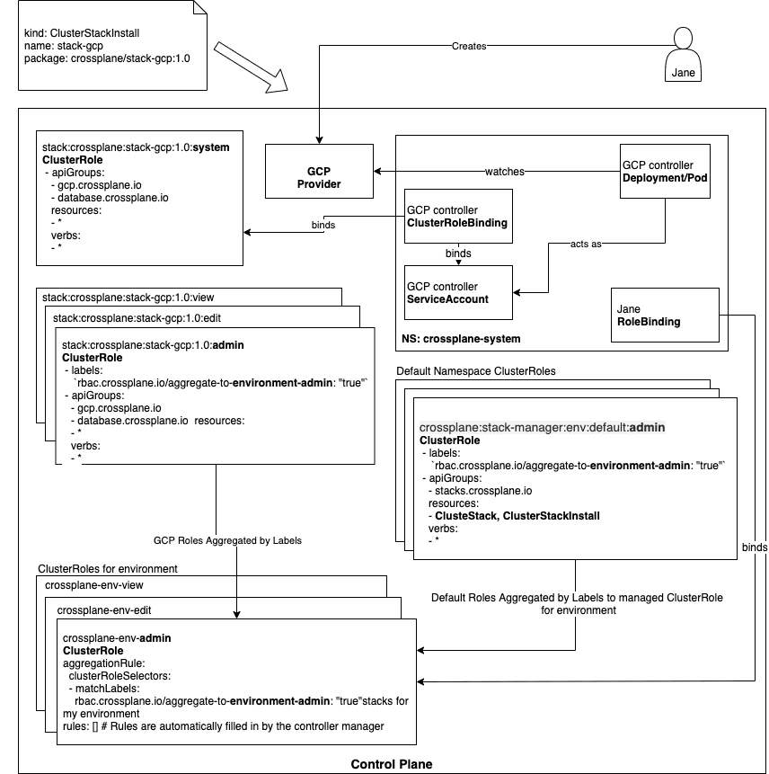
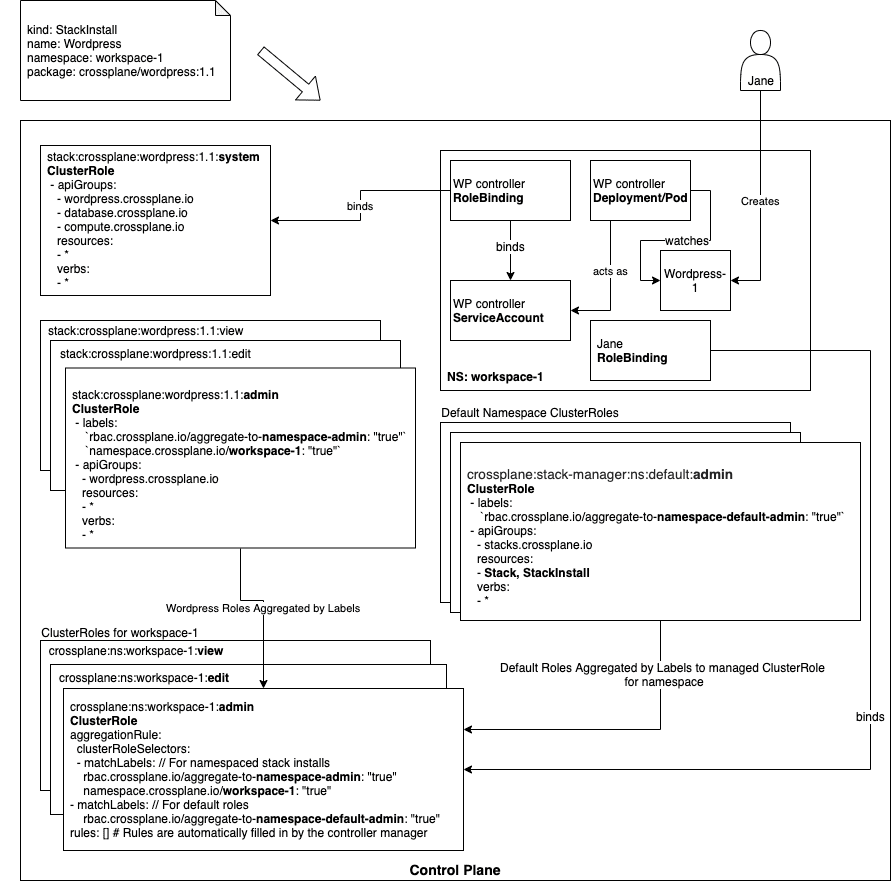

# Packages Security and Isolation

* Owner: Jared Watts (@jbw976)
* Reviewers: Crossplane Maintainers
* Status: Defunct

## Revisions

* 1.1
  * Cluster stacks may own Cluster scoped CRDs
    [#958](https://github.com/crossplane/crossplane/pull/958)
  * Namespaced stacks may depend on Cluster scoped CRDs [#958](https://github.com/crossplane/crossplane/pull/958)
* 1.2 - Dan Mangum ([@hasheddan](https://github.com/hasheddan))
  * Added section on [Package Deployment Privileges](#package-deployment-privileges).
* 1.3 - Dan Mangum ([@hasheddan](https://github.com/hasheddan))
  * Renamed `ClusterPackageInstall` / `PackageInstall` / `Stack` to `ClusterPackageInstall` / `PackageInstall` / `Package`
  * Renamed stack manager to package manager

## Background

The current model for Packages, the means of extending Crossplane with new functionality, allows the package author to declare arbitrary permissions that the package will be granted by the Package Manager.
If the Package author declares they need to update nodes or create volumes, those permissions will be granted.

However, Crossplane is not itself an arbitrary Kubernetes cluster to run typical compute and storage workloads.
Crossplane can run within an arbitrary Kubernetes cluster, but as a platform, it is not intended to run typical in-cluster workloads itself.
Instead, it is a centralized control plane intended to manage resources external to the control plane (e.g. cloud provider services) and intelligently schedule compute workloads into remote clusters to consume these services.
There is not really a need for Packages being installed into the control plane to request arbitrary permissions.
Crossplane can be more opinionated about the types of permissions granted within its control plane and lock things down in a more secure way.

Furthermore, packages are currently scoped to a single type that is used in all scenarios and by all personas.
All new types of functionality, from an end user wanting to install a simple application to an administrator wanting to install support for low level infrastructure types, are all treated the same.
They have the same approach to security and access control and the artifacts that they install have the same scope of impact to the control plane.
This one size fits all approach is not ideal though; the multiple scenarios and personas need finer grain control around security, access, and isolation.

This design doc proposes a new approach for the Crossplane Package Manager (PM) that will support a smaller set of security permissions and increased control for the installation of packages.

## Design Summary

The key differences in this design update are in the **scope** of the permissions that packages can be granted within the control plane.

* **Cluster Packages** will be given permissions to watch, access, and create resources at a **cluster level**, i.e. across **all namespaces**.
* **Namespace Packages** will be given permissions only within a **single namespace**.

This means that namespace packages should not be able to directly affect any resources outside of the specific namespace they are installed into, while cluster packages operate at a higher level of privilege and can affect the entire cluster.
This is a familiar concept to the Kubernetes permission scoping model of `ClusterRole` and `Role`.

Furthermore, the kinds of resources that packages are granted permission to access will be restricted:

* All packages will be granted permissions to a small subset of core Kubernetes resources as well as access to any CRDs they own and depend on.
* We are intentionally starting with a restrictive scope and will encourage feedback and real use cases to drive any expansion of this policy.

### CRD Scoping

To avoid a common point of confusion, let's review the available scoping of CRDs.
Custom resource **instances** can be scoped to either a single namespace or to the entire cluster.
It's important to note that this refers to the instances, not the CRD type definitions.
From the [Kubernetes documentation](https://kubernetes.io/docs/tasks/access-kubernetes-api/custom-resources/custom-resource-definitions/#create-a-customresourcedefinition):

> CustomResourceDefinitions themselves are non-namespaced and are available to all namespaces

Therefore, any time a CRD is created, it will also be at the cluster scope, even if instances of the CRD are scoped to a namespace.
This has caused confusion in the past, so it's important to clear that up here.

#### Discoverability of Scope

Because CRDs are cluster scoped, but our permission model for packages is both namespaced and global we will
 need to label CRDs to indicate which are available in a given context. As the package-installer processes a
 cluster or namespace package install it needs to add labels indicating that it's crossplane environment scoped or
 namespace scoped to a given namespace.

Labels on a CRD:
  * crossplane.io/scope={namespace|environment}
  * namespace.crossplane.io/{namespace-name}: "true" // For namespace scope only

An environment level admin could then fetch environment crd types

```sh
kubectl get crds --selector crossplane.io/scope=environment
```

A namespace admin of foo could fetch the installed CRDs

```sh
# Broken into two labels because
# namespace limit is 63 chars,
# label limit is 63 characters,
# CRDs can be shared by multiple installations in different namespaces.
kubectl get crds --selector crossplane.io/scope=namespace,namespace.crossplane.io/foo=true
```

## Allowed Resource Access

As previously stated, Crossplane is not intended to be a typical/full Kubernetes cluster to run arbitrary workloads.
Once installed into the control plane, packages will mostly target external resources and a known set of CRDs that they own and depend on.
Therefore, we can lock down the allowed permissions for packages to a subset of all available permissions in the Kubernetes API.

The `rbac.yaml` file that allows a package to specify the permissions it requires will be removed and no longer supported.
Instead, the permissions for a package can be considered **implicit**.
The following permissions will be granted to a package when it is installed:

* **Core Kubernetes API kinds:** Simple configuration and monitoring related types such as `ConfigMap`, `Secrets` and `Events`.
There should be no need for a package to create a Deployment, Pod, Volume, or other types like that.
* **Owned CRDs:** All CRDs that the package owns and are being installed by the package.
* **Depends on CRDs:** All CRDs that the package depends on and will consume to perform its primary operations (e.g. `MySQLInstance` claim).

The Package Manager will create the necessary service account, role, and binding that includes these permissions and serves as the runtime security context that the Package will operate in.
This is described in greater details in the sections below.

A few notes on the scope of access to CRDs:

* All CRDs a Namespaced package owns must be namespace scoped CRDs. Cluster scoped Packages may own cluster scoped CRDs.
* Namespaced and Cluster scoped Packages may depend on a combination of namespaced or cluster scoped CRDs.
* The allowed verbs for the CRDs the package owns and depends on will be the same. Packages will likely need full CRUD access, regardless of if the package owns or depends on the CRD.

In the future, other security modes could be enabled such as a more explicit model, and the allowed set of permissions and scope could be expanded.  We are intentionally starting
with a restrictive scope compatible with Crossplane Managed Resource Infrastructure Packages and [Resource Class Selection](https://github.com/crossplane/crossplane/blob/master/design/one-pager-simple-class-selection.md#proposal).
We will allow feedback and real use cases from the community to inform any decisions to potentially expand this security model.
Any future expansions to the model should be accompanied by a thoughtful design.

## Cluster Packages

Cluster Packages can be thought of as a higher level of privilege than other types of packages, similar to how kernel
 modules work in Linux. The controllers contained in a cluster package will usually reconcile resources that are external
 to the cluster, for example cloud provider managed services. These controllers will also likely be written as full
 fledged controller-runtime based implementations, but that is not a requirement.

Let's look at a specific example of the [GCP cluster package](https://github.com/crossplane/provider-gcp) to understand the security and isolation model more thoroughly.
First, the user will create an instance of a `ClusterPackageInstall` that specifies which cluster package they want to install.
Then, when the Package Manager installs the GCP package, a few things will happen:

* All CRDs related to GCP infrastructure and services will be installed to the cluster, such as `CloudSQLInstance`,
 `CloudSQLInstanceClass`, `GKECluster`, `GKEClusterClass`, `Network`, `Subnetwork`, etc. All CRDs will be labeled
 `crossplane.io/scope: environment` to denote that they are from a cluster scoped install and for the environment.
* A `ClusterRole` for the controller that we will denote as the system `ClusterRole` that includes the RBAC rules for
  the [allowed core Kubernetes kinds](#allowed-resource-access), the package's owned CRDs, and the CRDs that it depends
  on. This system role is in contrast to the admin, view, and edit roles, which only provide access to the installed
  CRDs of a package.
* `ClusterRoles` for admin, edit, and view will be created in the cluster scope for the packages owned CRDs.
* A `ServiceAccount` is created in the namespace that the package's controller will be running.  This will serve as the runtime identity of the controller.
* A `ClusterRoleBinding` is created at the cluster level to bind to the system `ClusterRole` and the namespaced
 `ServiceAccount`
* A `Deployment` is created in the namespace defined in the Spec of the ClusterPackageInstall and it is expected to launch
 and manage the pod that hosts the GCP controllers.

Because the package is given a `ClusterRole` and `ClusterRoleBinding`, its permissions to the allowed resources are across all namespaces.

### Architecture Diagram - Cluster Package

The diagram below summarizes the artifacts in the control plane after the GCP package has been installed and a couple example `MySQLInstance` claims have been created.



### Environment

Cluster packages are installed at the cluster level (there is only one instance of each cluster package), and there will
 be a single environment for infrastructure which will be represented by the crossplane-system namespace as well as
 cluster scoped resources, with a distinct set of `ClusterRole` objects that Crossplane provides for environment admins,
  editors, and viewers. These roles can be used to grant access to subjects such as a `User` or `Group` in the
  Crossplane control cluster with a separately created `RoleBinding` or `ClusterRoleBinding`. As such, Crossplane is
  responsible for maintaining a set of `Roles` and users are responsible for managing `Subjects` and `Bindings`.

#### Cluster Package Single Instance Version Limitation

Because there is only a single instance of the cluster package in the cluster, it is therefore shared across all
 namespaces. This means that all namespaces must use the same version of the cluster package. If an admin wants to try a
 newer version of the cluster package, it will impact all environments.

This limitation could be addressed in the future by allowing multiple versions of cluster packages installed per control
 plane, which would require additional complexity and design work. To get started, we will make the simplifying
 constraint that only a single version of a cluster package can be installed and it will be shared across all namespaces.

## Namespace Packages

Namespace Packages are likely to represent higher level "application" functionality, but are not required to do so.
 Instead of providing the infrastructure and lower level platform components for environments like a cluster package,
 they are intended to provide the functionality to support a single application. It is expected for namespace packages
 to (indirectly) consume and build on functionality from cluster packages in the form of resource claims.

For example, a namespace package could generate a `MySQLInstance` claim that is fulfilled through a default resource class
 by a cluster package in the form of a concrete MySQL database instance.

The key aspect of a namespace package is that it will be installed with permissions to only watch for resources
 **within the namespace** it is running in. This provides a nice isolation as well as versioning story.

* **Isolation:** The namespace package should not be able to read or write any resources outside of its target namespace.
* **Versioning:** Multiple versions of the namespace package can be installed within the control plane, each namespace
 can have their own independent version.

### Installation Flow

Let's look at a concrete example of what happens when the [WordPress package](https://github.com/crossplane/app-wordpress/) is installed into Crossplane in a target namespace of the user's choice:

* The user creates a `PackageInstall` and specifies the WordPress package
* All CRDs defined by the WordPress package will be installed into the cluster (remember that CRDs themselves are always cluster scoped).
 In the case of WordPress, a single CRD is installed that represents a WordPress application instance,
 `WordPressInstance`. All CRDs will be labeled `crossplane.io/scope: namespace` and
 `namespace.crossplane.io/{namespace-name}: "true"` where namespace-name is the actual namespace the package was installed
  into.
* A `ClusterRole` for the controller that we will denote as a system `ClusterRole` that includes the RBAC rules for
  the [allowed core Kubernetes kinds](#allowed-resource-access), the package's owned CRDs, and the CRDs that it depends
  on. This system role is in contrast to the admin, view, and edit roles, which only provide access to the installed
  CRDs of a package.
* `ClusterRoles` for admin, edit, and view will be created in the cluster scope for the packages owned CRDs.
* A `ServiceAccount` is created in the namespace that the package's controller will be running that will serve as the
 runtime identity of the controller.
* A namespaced `RoleBinding` is created in the target namespace to bind to the system `ClusterRole` and the namespaced
 `ServiceAccount`.
* A `Deployment` is created in the same namespace as the package and it is expected to launch and manage the pod that hosts the WordPress controller.

### Architecture Diagram - Namespace Package

The diagram below summarizes the artifacts in the control plane after the WordPress package has been installed and an example `WordPressInstance` custom resource has been created.
The diagram shows the result of the following sequence of actions:

1. The user creates a `PackageInstall` and specifies the WordPress package
1. The Package Manager installs the CRDs defined in the package, creates the necessary RBAC primitives, and starts up the
 WordPress controller in the same namespace as the package.
1. The user creates an instance of the `WordPressInstance` custom resource in the same namespace.
1. The WordPress controller is watching for events on this CRD type in the namespace it is running in.
1. In response to seeing the creation event for this `WordPressInstance` custom resource, the WordPress controller creates claims for the services that the instance will need, such as a MySQL database and a Kubernetes cluster.
    1. Note: in order to have permissions to create instances of MySQL and Kubernetes cluster claims, the Wordpress package will have to have declared those CRD types as dependencies.
    Full support of [dependency resolution](https://github.com/crossplane/crossplane/issues/434) is out of scope for this design document.
1. These claims are then serviced by the default resource classes in the environment that point to specific provisioners that were previously installed as part of a cluster package.

This flow demonstrates how a namespace package indirectly consumes a cluster package and is represented in the diagram below:



### Multiple Versions

As previously mentioned, since namespace packages will be installed per namespace, multiple instances of each namespace
 package can be installed in the control plane. This also means that multiple versions of the namespace package can be
 installed side by side. Because of the namespaced isolation, this is fine for the namespace package's controllers,
 but it does cause a potential difficulty for the CRDs.

The custom resource **definitions** themselves are always cluster scoped. If two versions of a namespace package are
 installed in the control plane and they have identical CRD versions, there could be a conflict.

To illustrate this clearly, consider the following example:

1. Namespace Package `foo-v1.0` is installed along with its CRD that has version `v1beta1`
1. A minor update to namespace package foo is released as version `foo-v1.1`
    1. This update to the namespace package adds a new field to the CRD but does **not** increment the CRD version
1. The control plane now has 2 versions of the namespace package's controllers (`foo-v1.0` and `foo-v1.1`), but only 1 version of the CRD (`v1beta`)

Which CRD schema should "win" in the control plane?

* The **new CRD schema** with the new field that the **old controller** doesn't understand?
* The **old CRD schema** without the new field that the **new controller** wants to use?

This speaks to the importance of properly versioning CRDs when they have schema changes.
Kubernetes now supports [multiple versions of CRDs](https://kubernetes.io/docs/tasks/access-kubernetes-api/custom-resources/custom-resource-definition-versioning/#specify-multiple-versions) in the cluster, so this is actually possible in more recent versions of Kubernetes, even though the experience is slightly cumbersome.
We suspect (and hope) that this newer CRD versions functionality will encourage CRD authors to adopt a more strict process of updating their CRD versions, which would avoid the issue raised in this section.

## Permissions and Privileges

### Package Manager

Currently, the Package Manager that installs packages into the cluster runs with a `ClusterRoleBinding` to the cluster-admin
 `ClusterRole` because it needs to create RBAC permissions for the arbitrary CRDs that are owned and depended on by
 arbitrary packages. A service account cannot grant RBAC permissions that it doesn't already have itself, so to support
 the arbitrary permissions needs of all packages, we are currently using the cluster-admin role.

This is a similar problem to what Helm's Tiller has historically had and we can consider revisiting this in the future.
 One possible solution would be to do more client side processing of packages (instead of in-cluster processing) using the
 credentials and permissions of the interactive user, which would be similar to
 [Helm 3's](https://github.com/helm/community/blob/master/helm-v3/000-helm-v3.md) major design change.

However, because we are limiting the [allowed set of resources](#allowed-resource-access) that a package can have access
 to, this in-cluster Package Manager model may be acceptable. Furthermore, moving to a client side model may limit the
 full lifecycle management abilities available from an in-cluster Package Manager, such as automatic package upgrades.

A full exploration of this topic is out of scope for this version of the design document.

### Package Author

The author of a package will need to specify the intended scope of permissions for their package.
This should be known at package build time because the package's controller(s) will need to know whether to watch resources
 in a single namespace or across all namespaces.

The `app.yaml` schema should be updated with a new field that captures the package author's intended permission scope:

```yaml
# Human readable title of application.
title: Sample Crossplane Stack

# Scope of permissions needed by the package once installed in the control plane,
# current supported values are:
#
# - Cluster
# - Namespaced
permissionScope: Cluster
```

### Package Install

Since cluster packages and namespace packages have differing scopes of execution in the control plane, it will be wise to
 allow differing access to request their installation. A simple way to approach this would be to create different
 installation request CRDs for each and then use RBAC to restrict access to them by different roles.

Currently, we use a single `PackageRequest` type, but going forward we should differentiate by package type:

* `ClusterPackageInstall`: requests the installation of a cluster package who's resources are all cluster scoped
* `PackageInstall`: requests the installation of a namespace package who's resources are all namespace scoped

With these two separate types, an administrator can allow access to installing cluster packages to only certain restricted
 roles, then perhaps be more permissive with access to installing namespaced packages.

If the install scope type does not match what the package author has declared within their package metadata, an error status
 should be set on the install resource and installation of the package should not proceed.

### Package Deployment Privileges

All `Deployments` for both cluster-scoped and namespace-scoped packages have their
pod and container-level security-context set to restrict root access. This can
be overridden by running the crossplane package manager with the
`--insecure-pass-full-deployment` flag, in which case the security context of
the `Deployment` provided in a package's `install.yaml` will not be modified.

The security context at the pod-level will be configured as follows by default:
```yaml
securityContext:
  runAsNonRoot: true
```

The security-context at the container-level will be configured as follows by
default:
```yaml
securityContext:
  allowPrivilegeEscalation: false
  privileged: false
  runAsNonRoot: true
```

*Note: container-level security context always overrides pod-level, but we set
the pod-level security context as well for completeness.*

###  Crossplane ClusterRoles / RBAC

Package manager and by extension Crossplane currently assumes that RBAC will be configured by an admin as an experience
 largely left to the reader, but each package-install changes the available CRDs that a particular persona need to access,
 thus creating work and friction to our extension story for packages. For a truly self-service model, a person who
 installs a package, should then be able to consume the resources that were installed as part of the machinery of
 Crossplane.

Kubernetes provides the concept of built-in roles, like cluster-admin, admin, edit, view, that provides a clear role to
 bind to for expected behavior and Crossplane should provide the same to make secure integration with crossplane even
 easier.

Cluster / Namespace scoped packages and package-manager provide a very clean way to implement a concise consumption and
 permissioning model around all Crossplane installed resources using
 [automatic role aggregation provided by Kubernetes](https://kubernetes.io/docs/reference/access-authn-authz/rbac/#aggregated-clusterroles).

 We are modeling our permissions based on default roles and bindings that kubernetes provides in
 [built-in kubernetes roles](https://kubernetes.io/docs/reference/access-authn-authz/rbac/#default-roles-and-role-bindings).

We will model our roles to define a clear separation of concerns for cluster(environment) scoped resources,
 and namespaced resources. In our model we assume that any Cluster Package resources are global will be for the
 environment or infrastructure scope, whereas any namespace package resources will be for the namespace that that package
 is installed into.

At install time:
 - Cluster Package: generate a set of `ClusterRole` objects that will be aggregated to the environment
  admin, edit, view `ClusterRole` objects.
 - Namespaced Package: generate a set of `ClusterRole` objects that will be aggregated to the namespace
  specific admin, edit, view `ClusterRole` objects.

#### Default Crossplane ClusterRoles

The following built in roles will be installed and packaged with Crossplane, and updated with role aggregation as we
 install additional packages.

The verbs supported in these roles(admin,edit,view) will model behavior based on existing logic around
 [built-in kubernetes roles](https://kubernetes.io/docs/reference/access-authn-authz/rbac/#default-roles-and-role-bindings).

|ClusterRole Name | Kubernetes Counterpart | Permissions |
|:---------------------|:----------|:----------|
| crossplane-admin | cluster-admin | Admin: ClusterPackages, Crossplane CRDs, Namespaces, (Cluster)RoleBindings, (Cluster)Roles |
| crossplane-env-admin | admin | Admin: ClusterPackages, CustomResource types installed by Cluster Scoped Packages |
| crossplane-env-edit | edit | Edit: ClusterPackages, CustomResource types installed by Cluster Scoped Packages |
| crossplane-env-view | view | View: CustomResource types installed by Cluster Scoped Packages, Not permitted: secrets |

We will provide a convenience group - `crossplane:masters` - that binds to `crossplane-admin` with a
 ClusterRoleBinding. This mirrors Kubernetes functionality for `cluster-admin` and `system:masters`. At install time you will
 then be able to impersonate a group that is bound to crossplane-admin.

Example running a command as crossplane-admin
```
kubectl {any crossplane-admin operation} --as-group=crossplane:masters
```

For discoverability of the system role (`crossplane-admin`) we will add the following labels:
 * `crossplane.io/scope: "system"`

For discoverability of the roles for the environment we will add the following labels:
 * `crossplane.io/scope: "environment"`

Match labels on these roles for auto-aggregation:
 * `rbac.crossplane.io/aggregate-to-crossplane-environment-{role}: "true"`

#### ClusterRoles for a given app namespace.

Each namespace provides a unit of isolation with namespaced packages, and thus a unique set of resources, based on the
 packages that have been installed into that namespace. If someone were allowed to install packages, it can't be assumed
 that they are cluster-admin, so the package-manager will install and manage a set of roles that will aggregate the roles
 for the installed packages into namespace specific roles for self-service. These `ClusterRoles` should be bound to subjects
 using a `RoleBinding` (not `ClusterRoleBinding`) to grant access to a particular namespace for end-user integration.

This design calls for the package-manager to act on any namespace that is labeled with `rbac.crossplane.io/managed-roles: "true"`,
ensuring that ClusterRoles in the following format are created for the labeled namespace.

 * `crossplane:ns:{ns-name}:admin`
 * `crossplane:ns:{ns-name}:edit`
 * `crossplane:ns:{ns-name}:view`

For discoverability of the roles for a given namespace we will add the following labels:
 * `crossplane.io/scope: "namespace"`
 * `namespace.crossplane.io/{namespace-name}: "true"`

Match Roles:
 * `rbac.crossplane.io/aggregate-to-namespace-{role}: "true"`
 * `namespace.crossplane.io/{namespace-name}: "true" // to match specific namespace.`

|ClusterRole Name | Kubernetes Counterpart | Permissions |
|:---------------------|:----------|:----------|
| crossplane:ns:{ns-name}:admin | admin | Admin: PackageInstalls, Packages, ConfigMaps, Secrets, CustomResource types installed by Namespace Scoped Packages |
| crossplane:ns:{ns-name}:edit | edit | Edit: PackageInstalls, ConfigMaps, Secrets, CustomResource types installed by Namespace Scoped Packages |
| crossplane:ns:{ns-name}:view | view | View: PackageInstalls, CustomResource types installed by Namespace Scoped Packages, Not permitted: secrets |


#### ClusterRoles for a given (Cluster)Package Install

For a given package version the package-manager will create a unique set of roles in the format
 `package:{repo-name}:{package-name}:{version}:{role=system|admin|edit|view}`. All of these roles are for internal use only.
 The system role is bound by the controller for the package, and will include the set of dependent resources for a given
 package. The other (admin,edit,view) will be labeled for aggregation to their appropriate namespaced or environment
 scoped crossplane managed roles.

Consider the following example for a wordpress package of version 1.1 from wordpressinc (installed in a "wordpressinc" namespace),
you would have the following set.

* `package:wordpressinc:wordpress:1.1:system` // Used by wordpress operator - package resources + dependent resources grants
 * `package:wordpressinc:wordpress:1.1:admin`
 * `package:wordpressinc:wordpress:1.1:edit`
 * `package:wordpressinc:wordpress:1.1:view`

If these were a from a cluster scoped package, they would be aggregated to the built in environment roles, and if they
 were from a namespaced `PackageInstall` they would be aggregated to the corresponding [ClusterRoles for a given app
 namespace](#clusterroles-for-a-given-app-namespace).

Labels for these roles will be for aggregation purposes:
 * `rbac.crossplane.io/aggregate-to-{install-scope}-{role}: "true"`
 * `namespace.crossplane.io/{namespace-name}: "true"` // Only included on namespaced packages install

The format for the namespace label `namespace.crossplane.io/{namespace-name}: "true"`, which may seem unintuitive
 is required to support ClusterRole aggregation. Since we will have some ClusterRoles which aggregate to more than
 multiple namespaces and label keys must be unique, we need to encode the key/value in the key.

Any additional install of this package in an additional namespace would only require the addition of a single namespace
 label to each existing role so it aggregated to those namespaces roles.

#### Default ClusterRoles for aggregation

We've defined the roles that get created that will aggregate the permissions of installed packages and are meant to be
 bound to RBAC subjects, like a group or User, but these roles themselves need to be seeded with initial permissions
 so that a user who has a namespace or environment level role could for example install the first package.

These roles share a common function to the Kubernetes `system:aggregate-to-view`, `system:aggregate-to-edit`, 
and `system:aggregate-to-admin` clusterroles.

Defaults that package-manager installs that would aggregate to the crossplane-env-{role} `ClusterRole` objects,
 for example, permission on `ClusterPackageInstall` objects.

 * `crossplane:package-manager:env:default:admin`
 * `crossplane:package-manager:env:default:edit`
 * `crossplane:package-manager:env:default:view`

Labels:
 * `rbac.crossplane.io/aggregate-to-environment-{role}: "true"`

Defaults that package-manager installs that would aggregate to the crossplane:ns:{ns-name}:{role} `ClusterRole` objects,
 for example, permissions on `PackageInstall` objects.

 * `crossplane:package-manager:ns:default:admin`
 * `crossplane:package-manager:ns:default:edit`
 * `crossplane:package-manager:ns:default:view`

Labels:
 * `rbac.crossplane.io/aggregate-to-namespace-{role}: "true"`
 * `namespace.crossplane.io/{namespace-name}: "true" // to match specific namespace.`

Namespace labels on would be updated each time a namespace was annotated or deleted.

#### Aggregation Examples for illustration

The built in crossplane-admin `ClusterRole` object

```yaml
apiVersion: rbac.authorization.k8s.io/v1
kind: ClusterRole
metadata:
  name: crossplane-admin
  labels:
    crossplane.io/scope: "system" # For discoverability for tools
aggregationRule:
  clusterRoleSelectors:
  - matchLabels:
      rbac.crossplane.io/aggregate-to-crossplane-admin: "true"
rules: [] # Rules are automatically filled in by the controller manager.
```

An example of an environment `admin` `ClusterRole` object

```yaml
apiVersion: rbac.authorization.k8s.io/v1
kind: ClusterRole
metadata:
  name: crossplane-env-admin
  labels:
    crossplane.io/scope: "environment" # For discoverability for tools
aggregationRule:
  clusterRoleSelectors:
  - matchLabels:
      rbac.crossplane.io/aggregate-to-environment-admin: "true"
rules: [] # Rules are automatically filled in by the controller manager.
```

An example of a namespace foo `ClusterRole` object

```yaml
apiVersion: rbac.authorization.k8s.io/v1
kind: ClusterRole
metadata:
  name: crossplane:ns:foo:view
  labels:
    crossplane.io/scope: "namespace" # For discoverability by tools
    namespace.crossplane.io/foo: "true"
aggregationRule:
  clusterRoleSelectors:
  - matchLabels:
      rbac.crossplane.io/aggregate-to-namespace-view: "true"
      namespace.crossplane.io/foo: "true" // Match installed packages for my namespace
rules: [] # Rules are automatically filled in by the controller manager.
```

On install of crossplane-aws package, the package-manager would create a ClusterRoles for each built in role. In the case of
 crossplane-admin it would contain full access to all CRDs in the package and look like the following for the package admin
 role.

```yaml
apiVersion: rbac.authorization.k8s.io/v1
kind: ClusterRole
metadata:
  name: package:crossplane:provider-aws:1.0:admin # Unique by package:{namespace-name}:{package-name}:{version}:{role}s
  labels:
    rbac.crossplane.io/aggregate-to-crossplane-admin: "true"
# These rules will be added to the "crossplane-admin" role based on the label above
rules:
- apiGroups: ["providers.aws.crossplane.io"]
  resources: ["Provider"]
  verbs: ["get", "list", "watch", "create", "update", "patch", "deletecollection", "delete"]
 ...
```

An example of a Wordpress namespace package's view ClusterRole that's installed in both foo and baz namespaces.

```yaml
apiVersion: rbac.authorization.k8s.io/v1
kind: ClusterRole
metadata:
  name: package:crossplane:wordpress:2.0:view # Unique by package:{namespace-name}:{package-name}:{version}:{role}
  labels:
      rbac.crossplane.io/aggregate-to-namespace-view: "true"
      namespace.crossplane.io/foo: "true"
      namespace.crossplane.io/baz: "true"
rules:
- apiGroups: ["wordpress.crossplane.io"]
  resources: ["WordpressInstance"]
  verbs: ["get", "list", "watch"]
 ...
```

### Namespaces Management Example

As part of Crossplane setup, the environment administrator would like to setup a namespace for an app team where Jane
 is the administrator.

The following would be enough for self-service.

```yaml
apiVersion: v1
kind: Namespace
metadata:
  creationTimestamp: 2019-10-16T18:25:10Z
  name: app-team-1
  labels:
    rbac.crossplane.io/managed-roles: "true" # Package manager creates and will manage namespace specific ClusterRoles when it see's this.
---
apiVersion: rbac.authorization.k8s.io/v1
# This role binding allows "jane" to admin the Crossplane app-team-1 namespace.
kind: RoleBinding
metadata:
  name: admin-namespace
  namespace: app-team-1
subjects:
- kind: User
  name: jane # Name is case sensitive
  apiGroup: rbac.authorization.k8s.io
roleRef:
  kind: ClusterRole
  name: crossplane:ns:app-team-1:admin
  apiGroup: rbac.authorization.k8s.io
```

Questions/Future ideas:

- A crossplane-admin that would be able to manage/create only crossplane annotated namespaces, and manage/create
 ClusterRole bindings only to crossplane annotated roles and types.
- It would be great if we could provide a read-acl filtered list of
 namespaces([See issue](https://github.com/kubernetes/community/issues/1486), such that a given user could list the
 namespaces they had been granted access to.
