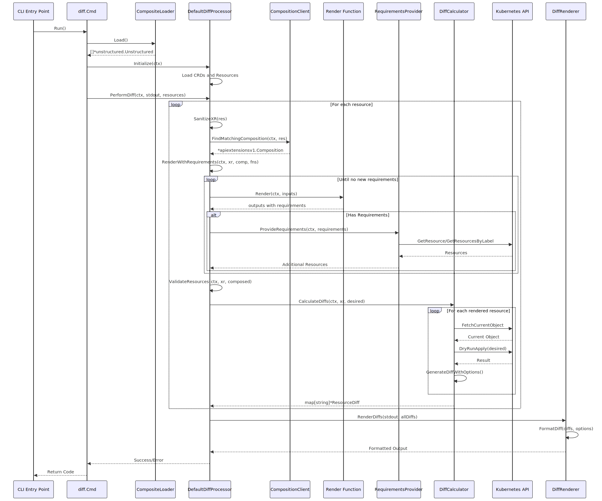

# Crossplane Diff Command - Design Document

## 1. Introduction

### 1.1 Purpose

The `crossplane beta diff` command extends the Crossplane CLI with functionality to visualize the differences between
Crossplane resources in a YAML file and their resulting state when applied to a live Kubernetes cluster. This is similar
to `kubectl diff` but with specific enhancements for Crossplane resources, particularly Composite Resources (XRs) and
their composed resources.

### 1.2 Guiding Principles

The design prioritizes the accuracy of the diff above all; we decline to proceed in the case of errors or ambiguity,
unless that ambiguity is the result of unknowable information (e.g., a dependency in a later pipeline step on the
`status` of an object rendered in an earlier step which will not be populated until the MR is applied by the provider).

To this end, the design reaches into the cluster _extensively_ for any information that is needed to produce a diff,
including functions, compositions, requirements (including environment configs), current state of the XR and any
downstream resources, and XRDs and CRDs for validation.

There is one exception, however, which is that in order to avoid API throttling, we cache resources on first discovery.

### 1.3 Scope

The Diff command enables users to:

- Preview changes before applying them to a cluster
- Visualize differences at multiple levels: both the XR itself and all downstream composed resources
- Support the full Crossplane composition mechanism, including functions
- Handle resource naming patterns (generateName)
- Detect resources that would be removed

## 2. Background

The Crossplane community has [long desired](https://github.com/crossplane/crossplane/issues/1805) a mechanism to
understand the would-be surface area of proposed changes to Crossplane resources. Platform administrators and
application teams would like the ability to review changes before they are applied, especially in GitOps workflows. This
requirement is particularly critical when working with complex compositions that result in multiple managed resources
being created or updated.

Currently, users lack visibility into how changes to Composite Resources (XRs) or their configurations translate to
changes in the underlying Managed Resources (MRs) and ultimately in the external systems. This makes it challenging to
understand the impact of changes, troubleshoot issues, and confidently apply updates to production environments.

## 3. Goals and Non-Goals

### 3.1 Goals

The `crossplane beta diff` command aims to:

1. Provide a clear, familiar way to preview changes that would be made to external resources before they are applied
2. Support GitOps workflows by enabling change review within CI/CD pipelines
3. Enhance the debugging experience when working with complex compositions
4. Provide a familiar experience similar to `kubectl diff` or `argocd app diff` for Crossplane resources

### 3.2 Non-Goals

1. Perform a dry-run in the server
2. Build a GUI for visualizing differences
3. Provide historical tracking of changes over time

### 3.3 User Personas

The Diff command is designed with several distinct user personas in mind, each with different needs and permission
levels:

#### 3.3.1 CI/CD Pipeline User

**Primary Persona (Current Focus)**

This persona represents automated CI/CD workflows that run in environments with relatively unrestricted permissions:

- Generates diffs for pull request reviews
- Validates changes before deployment
- Typically runs with service account credentials that have broad read access
- Needs reliable, programmatic output that can be incorporated into reports

The current implementation primarily targets this persona, as it requires expansive permissions to query various cluster
resources needed for accurate diffing.

#### 3.3.2 Composition Developer

This persona represents DevOps engineers and platform administrators who create and maintain compositions:

- Has broad permissions to create and modify XRs and compositions
- Needs visibility into how composition changes affect downstream resources
- Uses the diff tool interactively to debug composition issues
- Requires the ability to compare different versions of compositions (particularly Composition Revisions)
- Wants to validate how changes to compositions will impact existing XRs

The current implementation supports basic modification scenarios for this persona, but the planned support for diffing
against Composition Revisions (see section 9.2) will be particularly valuable. This will enable Composition Developers
to see exactly how downstream resources from an XR would change when moving from an older to a newer Composition
Revision, providing crucial validation before promoting new composition versions to production.

The diff command, or an enhancement to the validate command, may serve this persona better in the future by allowing
validation of provider updates and their corresponding CRD upgrades against XRs and compositions that are already in the
cluster.

#### 3.3.3 End-User Developer

This persona represents application developers who consume composite resources:

- Has limited permissions, focused on specific namespaces or resource types
- Wants to understand the impact of changes to their own XRs
- May not have visibility into all dependencies or composition details
- Needs simplified output focused on resources they care about

The current implementation may not fully support this persona due to permission requirements. Future enhancements (see
section 10) will address this by allowing requirements to be supplied on the command line instead of being queried from
the cluster, or may potentially allow proceeding naively in case of insufficient permissions to read downstream objects.

### 3.4 Required Permissions

For the current implementation, the following logical permissions are required:

1. **Read access to Crossplane definitions**:
    - XRDs (CompositeResourceDefinitions)
    - Compositions
    - Composition Functions

2. **Read access to Crossplane runtime resources**:
    - Composite Resources (XRs)
    - Claims
    - Managed Resources (MRs)

3. **Read access to Crossplane configuration**:
    - EnvironmentConfigs

4. **Read access to Kubernetes resources**:
    - CRDs (CustomResourceDefinitions)
    - Resources referenced in Requirements
    - Resources referenced in templates or functions

5. **Read access to resource hierarchies**:
    - Owner references
    - Resource relationships maintained by Crossplane

These permissions are needed to accurately render resources, resolve requirements, validate against schemas, and
identify resources that would be removed by changes. For the CI/CD and Composition Developer personas, these permission
requirements are generally not problematic. For the End-User Developer persona, these extensive permissions may be
challenging to obtain in many organizational contexts.

## 4. Integration Test Cases

Yes, these come before the design.  The test cases covered lead to the particular implementation, and so we present them 
first as a part of requirements.

To ensure the reliability and correctness of the Diff command, comprehensive integration tests verify the functionality
across a wide range of scenarios that users may encounter in real-world usage. These test cases serve as both validation
criteria and usage examples, demonstrating the expected behavior of the command in various situations. The integration
test cases cover:

### 4.1 Basic Diff Scenarios

- **New Resource Creation**: Tests that new resources show the correct additive diff output with proper color
  formatting.
- **Resource Modification**: Verifies that changes to existing resources are correctly identified and displayed.
- **Modified XR with New Downstream Resource**: Tests that when an XR is modified in a way that generates new downstream
  resources, both the modification to the XR and the creation of the new resource are properly displayed.

### 4.2 Environment Configuration Testing

- **EnvironmentConfig Incorporation**: Tests that environment configurations are correctly incorporated into the diff
  output, showing how environment-specific values affect the rendered resources.

### 4.3 External Resource Dependencies

- **External Resource References**: Verifies that the diff command correctly handles dependencies on resources that are
  referenced but not directly managed by the XR, including:
    - Field values from external ConfigMaps
    - References to external named resources
    - Changes that affect external dependencies

### 4.4 Templating and Functions

- **Go-templating Function**: Tests diffing with templated ExtraResources embedded in go-templating functions, ensuring
  that the diff correctly processes resources generated through templates.

### 4.5 Resource Hierarchy and Removal Detection

- **Resource Removal Detection**: Tests that resources which would be removed by a change are correctly identified and
  shown in the diff output.
- **Hierarchical Resource Relationships**: Verifies that parent-child relationships between resources are correctly
  understood, including cascading removal of child resources when a parent would be removed.

### 4.6 Resource Naming Patterns

- **Resources with generateName**: Tests that resources using Kubernetes generateName pattern are correctly diffed by
  matching based on owner references rather than exact names.
- **New XR with generateName**: Verifies that new XRs using generateName show the appropriate placeholder in the diff
  output.

### 4.7 Multiple Resource Handling

- **Multiple XRs**: Tests processing multiple input files containing different XRs, ensuring that all changes are
  correctly identified and summarized.

### 4.8 Composition Selection

- **Composition Selection by Reference**: Tests selecting specific compositions using a direct reference.
- **Composition Selection by Label Selector**: Verifies that compositions can be selected using label selectors.
- **Ambiguous Composition Selection**: Tests that appropriate errors are returned when composition selection is
  ambiguous.

### 4.9 Claim Handling

- **New Claim Processing**: Tests that new claims are correctly processed, showing both the claim itself and its
  resulting composed resources.
- **Modified Claim Processing**: Verifies that changes to existing claims correctly propagate to their underlying
  resources in the diff output.

### 4.10 Output Formatting and Options

- **Color Output**: Tests that color formatting is correctly applied when enabled.
- **No-color Option**: Verifies that color codes are omitted when the `--no-color` flag is used.
- **Summary Output**: Tests that the summary of changes (added, modified, removed) is correctly generated.

These comprehensive test cases ensure that the Diff command functions correctly across the full range of Crossplane
resource types and composition patterns, providing confidence in its reliability for production use. The implementation
described in the following sections is designed to satisfy all these test cases.

## 5. Architecture Overview

### 5.1 High-Level Overview

The `crossplane beta diff` command shows the changes that would result from applying Crossplane resources to a live
cluster. The command processes resources from files or stdin, compares them against the current state in the cluster,
and displays the differences in a familiar format.

The implementation leverages the existing Crossplane and/or Kubernetes machinery to:

1. Find the appropriate composition for a composite resource
2. Extract dependency information
3. Perform a simulated reconciliation
4. Use a dry-run approach to determine the changes without applying them

The process flow is:

1. Load resources from files/stdin
2. For each resource:
    1. Find the matching composition
    2. Render what the resources would look like if applied (using `render`)
    3. While there are unresolved Requirements, fetch them and try to `render` again
    4. Validate the results against the schemas loaded into the cluster (using `beta validate`)
    5. Compare against current state in the cluster (using `beta trace` for child tracking)
3. Format and display differences

### 5.2 Architectural Layers

The Crossplane Diff command follows a layered architecture pattern with clear separation of concerns. Each layer has
specific responsibilities and depends only on lower layers.


*Figure 1: Conceptual layers of the Crossplane Diff command architecture and their responsibilities*

#### 5.2.1 Command Layer

The top-level layer that handles command-line arguments, flags, and coordinates the execution flow.

**Key Components:**

- `Cmd`: Main command structure that processes arguments and flags
- Help functions: Provides usage instructions to users

**Responsibilities:**

- Command parsing
- Argument validation
- Help text generation
- Entry point coordination

#### 5.2.2 Application Layer

The orchestration layer that initializes the application context and coordinates the overall diff process.

**Key Components:**

- `AppContext`: Holds application-wide dependencies and clients
- `DiffProcessor`: The main component responsible for executing the diff workflow
- `Loader`: Handles loading resources from files or stdin

**Responsibilities:**

- Context management
- Client initialization
- Process coordination
- Resource loading
- Result aggregation

#### 5.2.3 Domain Layer

The business logic layer containing the core diff functionality, resource management, and rendering.

**Key Components:**

- `DiffCalculator`: Computes differences between resources
- `SchemaValidator`: Validates resources against their schemas
- `ResourceManager`: Manages resource-related operations
- `RequirementsProvider`: Resolves requirements for resource rendering
- `DiffRenderer`: Formats and displays diffs
- `Render Function`: Handles resource composition rendering; normally a reference to the `render` package

**Responsibilities:**

- Diff calculation
- Resource rendering
- Resource management
- Schema validation
- Requirement processing
- Diff visualization

#### 5.2.4 Client Layer

The infrastructure access layer that interfaces with Kubernetes and Crossplane.

**Key Components:**

- Kubernetes Clients: `ApplyClient`, `ResourceClient`, `SchemaClient`, `TypeConverter`
- Crossplane Clients: `CompositionClient`, `DefinitionClient`, `EnvironmentClient`, `FunctionClient`,
  `ResourceTreeClient`

**Responsibilities:**

- Kubernetes API interaction
- Crossplane resource access
- Resource conversion
- Type handling
- Server-side apply

#### 5.2.5 External Systems

The actual Kubernetes API server and cluster resources that the command interacts with.

**Responsibilities:**

- Kubernetes API server
- Resources in cluster
- CRDs and schemas


*Figure 2: Clean layered architecture showing the main components in each layer*

### 5.3 Data Flow

The data flow through the system follows these key steps:


*Figure 3: Data flow through the Crossplane Diff command system*

1. **Input Processing**:
    - YAML files or stdin content is loaded and parsed into unstructured resources

2. **Processing**:
    - For each Composite Resource (XR):
        - Find the matching composition
        - Render the XR and composed resources using Crossplane functions
        - Discover and resolve requirements for rendering
        - Validate the rendered resources against schemas
        - Calculate diffs between current and desired states

3. **Output**:
    - Format and display diffs to the console

## 6. Component Design


*Figure 4: DiffProcessor architecture showing its subcomponents and their relationships*

### 6.1 DiffProcessor

The `DiffProcessor` is the central component that coordinates the diff workflow. It uses a dependency injection pattern
with factories for its subcomponents.

#### 6.1.1 Interfaces and Implementation

```go
// DiffProcessor interface for processing resources.
type DiffProcessor interface {
   // PerformDiff processes all resources and produces a diff output
   PerformDiff(ctx context.Context, stdout io.Writer, resources []*un.Unstructured) error
   
   // Initialize loads required resources like CRDs and environment configs
   Initialize(ctx context.Context) error
}
```

The `DefaultDiffProcessor` implements this interface and uses several subcomponents:

- `fnClient`: Handles function-related operations
- `compClient`: Handles composition-related operations
- `schemaValidator`: Validates resources against schemas
- `diffCalculator`: Calculates differences between resources
- `diffRenderer`: Formats and displays diffs
- `requirementsProvider`: Handles requirements for resource rendering

#### 6.1.2 Configuration

The `ProcessorConfig` structure provides configuration options:

- `Namespace`: The namespace for resources
- `Colorize`: Whether to colorize the output
- `Compact`: Whether to show compact diffs
- `Logger`: The logger to use
- `RenderFunc`: The function to use for rendering resources
- `Factories`: Factory functions for creating components

### 6.2 DiffCalculator

The `DiffCalculator` is responsible for calculating differences between resources.

#### 6.2.1 Interfaces and Implementation

```go
// DiffCalculator calculates differences between resources.
type DiffCalculator interface {
   // CalculateDiff computes the diff for a single resource
   CalculateDiff(ctx context.Context, composite *un.Unstructured, desired *un.Unstructured) (*dt.ResourceDiff, error)
   
   // CalculateDiffs computes all diffs for the rendered resources and identifies resources to be removed
   CalculateDiffs(ctx context.Context, xr *cmp.Unstructured, desired render.Outputs) (map[string]*dt.ResourceDiff, error)
   
   // CalculateRemovedResourceDiffs identifies resources that would be removed and calculates their diffs
   CalculateRemovedResourceDiffs(ctx context.Context, xr *un.Unstructured, renderedResources map[string]bool) (map[string]*dt.ResourceDiff, error)
}
```

The `DefaultDiffCalculator` handles:

- Retrieving current resources from the cluster
- Performing dry-run applies to see what would happen
- Generating text-based diffs between resources
- Identifying resources that would be removed

### 6.3 ResourceManager

The `ResourceManager` handles resource-related operations such as fetching current resources and managing ownership
references.


*Figure 8: Resource loading and validation architecture showing how resources are loaded and validated*

#### 6.3.1 Interfaces and Implementation

```go
// ResourceManager handles resource-related operations like fetching, updating owner refs,
// and identifying resources to be removed.
type ResourceManager interface {
   // FetchCurrentObject retrieves the current state of an object from the cluster
   FetchCurrentObject(ctx context.Context, composite *un.Unstructured, desired *un.Unstructured) (*un.Unstructured, bool, error)
   
   // UpdateOwnerRefs ensures all OwnerReferences have valid UIDs
   UpdateOwnerRefs(parent *un.Unstructured, child *un.Unstructured)
}
```

The `DefaultResourceManager` handles:

- Looking up resources by name
- Looking up resources by labels and annotations
- Handling resources with generateName
- Managing owner references

### 6.4 SchemaValidator

The `SchemaValidator` validates resources against their schemas, ensuring they are valid before calculating diffs.

#### 6.4.1 Interfaces and Implementation

```go
// SchemaValidator handles validation of resources against CRD schemas.
type SchemaValidator interface {
   // ValidateResources validates resources using schema validation
   ValidateResources(ctx context.Context, xr *un.Unstructured, composed []cpd.Unstructured) error
   
   // EnsureComposedResourceCRDs ensures we have all required CRDs for validation
   EnsureComposedResourceCRDs(ctx context.Context, resources []*un.Unstructured) error
}
```

The `DefaultSchemaValidator` handles:

- Loading CRDs from the cluster
- Converting XRDs to CRDs
- Validating resources against schemas

### 6.5 RequirementsProvider

The `RequirementsProvider` handles requirements for resource rendering, providing additional resources needed by
Crossplane functions.

#### 6.5.1 Implementation

The `RequirementsProvider` handles:

- Caching frequently used resources
- Fetching resources by name or label selectors
- Converting between resource formats

### 6.6 DiffRenderer

The `DiffRenderer` formats and displays diffs in a human-readable format.


*Figure 6: Diff rendering architecture showing how diffs are formatted and displayed*

#### 6.6.1 Interfaces and Implementation

```go
// DiffRenderer handles rendering diffs to output.
type DiffRenderer interface {
   // RenderDiffs formats and outputs diffs to the provided writer
   RenderDiffs(stdout io.Writer, diffs map[string]*dt.ResourceDiff) error
}
```

The `DefaultDiffRenderer` handles:

- Formatting diffs with colors and context
- Supporting compact mode for large diffs
- Summarizing changes

### 6.7 Kubernetes and Crossplane Clients

The client layer provides interfaces to interact with Kubernetes and Crossplane resources.


*Figure 5: Kubernetes and Crossplane client architecture showing the interfaces and implementations*

#### 6.7.1 Kubernetes Clients

- `ApplyClient`: Handles server-side apply operations
- `ResourceClient`: Handles basic CRUD operations
- `SchemaClient`: Handles schema-related operations
- `TypeConverter`: Handles conversion between Kubernetes types

#### 6.7.2 Crossplane Clients

- `CompositionClient`: Handles composition-related operations
- `DefinitionClient`: Handles definition-related operations
- `EnvironmentClient`: Handles environment-related operations
- `FunctionClient`: Handles function-related operations
- `ResourceTreeClient`: Handles resource tree operations

## 7. Key Workflows


*Figure 7: Call sequence diagram showing the interaction between components during a diff operation*

### 7.1 Diff Workflow

1. The `Cmd` parses arguments and initializes the application context
2. The `Loader` loads resources from files or stdin
3. The `DiffProcessor` initializes and loads required schemas
4. For each resource:
    - The `DiffProcessor` finds the matching composition
    - The `DiffProcessor` renders the resource using the render function
    - The `RequirementsProvider` resolves any requirements
    - The `SchemaValidator` validates the rendered resources
    - The `DiffCalculator` calculates diffs between current and desired states
    - The `DiffRenderer` formats and displays the diffs

### 7.2 Resource Rendering Workflow

1. The `DiffProcessor` calls the render function with the XR and composition
2. The render function executes the composition pipeline:
    - It sets up the initial state with the XR
    - It executes each function in the pipeline
    - It returns the desired state with the XR and composed resources
3. The `DiffProcessor` resolves any requirements and reruns the render function if needed
4. The rendered resources are validated and used for diff calculation

## 8. Implementation Details

### 8.1 Basic Usage

The command's basic usage would be:

```
crossplane beta diff [FILE]...
```

Similar to `kubectl diff`, the command will:
1. Accept input from files or stdin (when `-` is specified)
2. Process multiple files when provided
3. Display a diff of the changes that would be made if the resources were applied

Examples:
```
# Show changes that would result from applying an XR from a file
crossplane diff xr.yaml

# Show changes from stdin
cat xr.yaml | crossplane diff -

# Process multiple files
crossplane diff xr1.yaml xr2.yaml xr3.yaml

# Specify namespace
crossplane diff -n other-namespace xr.yaml
```

### 8.2 Output Format

The output will follow familiar diff format conventions. There will be a standard mode and a compact mode:

```
+++ Resource/new-resource-(generated)
+ apiVersion: nop.crossplane.io/v1alpha1
+ kind: NopResource
+ metadata:
+   annotations:
+     cool-field: I'm new!
+     crossplane.io/composition-resource-name: nop-resource
+     setting: value1
+   generateName: new-resource-
+   labels:
+     crossplane.io/composite: new-resource
+ spec:
+   forProvider:
+     conditionAfter:
+     - conditionStatus: "True"
+       conditionType: Ready
+       time: 0s

---
--- XNopResource/removed-resource-downstream
- apiVersion: diff.example.org/v1alpha1
- kind: XNopResource
- metadata:
-   name: removed-resource-downstream
- spec:
-   coolField: goodbye!
-   parameters:
-     config:
-       setting1: value1
-       setting2: value2

---

~~~ Resource/to-be-modified
  apiVersion: diff.example.org/v1alpha1
  kind: XNopResource
  metadata:
    name: to-be-modified
- spec:
-   oldValue: something
+ spec:
+   newValue: something-else
---

Summary: 1 added, 1 modified, 1 removed
```

The diff output will be colorized by default (can be disabled with `--no-color`), and supports a compact mode with the
`--compact` flag that shows minimal context around changes.

```
###### modifications, compact with 2 lines of context:

~~~ Resource/to-be-modified
  metadata:
    name: to-be-modified
- spec:
-   oldValue: something
+ spec:
+   newValue: something-else
---

```

## 9. Design Considerations

### 9.1 Dependency Injection and Inversion of Control

The design uses dependency injection extensively, making the code more testable and modular. Factory functions are used
to create components, allowing for easy customization and testing.

The Diff command leverages the Kong CLI framework's binding mechanisms to implement a sophisticated dependency injection
system. In the `Cmd.AfterApply` method, various components are initialized and then bound to the Kong context:

```go
   ctx.Bind(appCtx) // appCtx is a container that holds refs to all the clients we use for initializing dependencies
   ctx.BindTo(proc, (*dp.DiffProcessor)(nil))
   ctx.BindTo(loader, (*internal.Loader)(nil))
```

This approach allows the command to:

1. Inject different implementations of interfaces for testing
2. Maintain clear boundaries between components
3. Support inversion of control, where higher-level components are not dependent on specific implementations of
   lower-level ones
4. Keep the main execution flow clean by having dependencies provided rather than created inline

The binding mechanism is particularly valuable for CLI commands, as it allows the Run method to receive exactly the
dependencies it needs without having to construct them itself:

```go
// Run executes the diff command.
func (c *Cmd) Run(k *kong.Context, log logging.Logger, appCtx *AppContext, proc dp.DiffProcessor, loader internal.Loader) error { 
	// Implementation that uses the injected dependencies
}
```

This clean separation demonstrates proper inversion of control - the `Run` method depends on abstractions (interfaces)
rather than concrete implementations, and the concrete implementations are provided externally through Kong's binding
mechanism.

### 9.2 Caching

Several components use caching to improve performance, particularly for frequently accessed resources.  This represents
a trade-off between performance and accuracy, as the cache may not always reflect the latest state of the cluster. It is 
the only time in the design where we knowingly sacrifice some accuracy because we worry about API throttling in the case
of large changes. 

### 9.3 Error Handling

Errors are propagated up the call stack and wrapped with context to make debugging easier.  We short-circuit the diff 
if a specific XR fails to diff, but we continue processing other XRs.  This allows the user to see all the diffs that 
were successful, even if one or more has failed, however any failure is enough to mark the command as failed.

### 9.4 Logging

A structured logger is injected throughout the components, allowing for detailed logs with context.  Running with the 
`--verbose` flag will show detailed logs, while the default behavior is to show only errors and warnings.

### 9.5 Integration with Existing Crossplane CLI Components

The Diff command has been designed to leverage several existing components from the Crossplane CLI ecosystem, promoting
code reuse and maintaining consistency across the Crossplane tooling:

#### 9.5.1 Resource Loading

The command uses a shared `Loader` implementation that has been promoted to the `internal` package, enabling consistent
resource loading across different CLI commands:

```go
// Loader interface defines the contract for different input sources.
type Loader interface {
    Load() ([]*unstructured.Unstructured, error)
}
```

This shared loader provides:
- Consistent handling of YAML files, directories, and stdin
- Support for splitting multi-document YAML files
- Extraction of embedded resources from Composition pipeline inputs
- Standardized error handling for resource loading

By reusing this component, the Diff command maintains behavioral consistency with other Crossplane CLI commands that
process YAML resources.

#### 9.5.2 Schema Validation

The command integrates with the schema validation code from the `validate` command:

```go
// Use the validation logic from the validate command
if err := validate.SchemaValidation(ctx, resources, v.crds, true, true, loggerWriter); err != nil {
    return errors.Wrap(err, "schema validation failed")
}
```

This validation:
- Ensures resources conform to their CRD schemas
- Provides consistent validation messages across commands
- Shares the same validation rules as other Crossplane tools
- Reduces code duplication and maintenance burden

#### 9.5.3 Resource Rendering

The Diff command calls the same `render.Render` function used by other components:

```go
// Perform render to get requirements
output, renderErr := p.config.RenderFunc(ctx, p.config.Logger, render.Inputs{
    CompositeResource: xr,
    Composition:       comp,
    Functions:         fns,
    ExtraResources:    renderResources,
})
```

This shared rendering functionality:
- Ensures consistent composition processing
- Handles the same function execution pipeline as Crossplane itself
- Processes requirements consistently
- Maintains compatibility with the Crossplane rendering mechanism

#### 9.5.4 Resource Tree Evaluation

The Diff command leverages the resource tree evaluation capability from the `trace` command:

```go
// Try to get the resource tree
resourceTree, err := c.treeClient.GetResourceTree(ctx, xr)
```

This shared functionality:
- Traverses resource relationships consistently
- Identifies composed resources with the same logic as other commands
- Uses the same parent-child relationship model
- Enables accurate identification of resources to be removed

#### 9.5.5 Benefits of Component Reuse

Leveraging these existing components provides several advantages:

1. **Consistency**: Ensures the Diff command behaves consistently with other Crossplane tools
2. **Maintainability**: Reduces duplication and centralizes fixes in shared components
3. **Reliability**: Utilizes battle-tested code paths that are already in use
4. **Development Efficiency**: Accelerates development by building on existing foundations
5. **Feature Parity**: Ensures that improvements to shared components benefit multiple commands

This approach of building on existing components aligns with software engineering best practices of code reuse and
modular design, while ensuring the Diff command integrates seamlessly into the broader Crossplane CLI ecosystem.

#### 9.5.6 Modifications to Existing Components and Integration Challenges

While leveraging existing components provides numerous benefits, it also required some modifications to ensure they meet
the needs of the Diff command:

##### Modified Render Output Contract

The most significant change was the alteration of the `render.Outputs` structure to add `Requirements` as a member:

```go
// Outputs contains all outputs from the render process.
type Outputs struct {
    // the rendered xr
    CompositeResource *ucomposite.Unstructured
    // the rendered mrs derived from the xr
    ComposedResources []composed.Unstructured
    // the Function results (not render results)
    Results []unstructured.Unstructured
    // the Crossplane context object
    Context *unstructured.Unstructured
    // the Function requirements - Added for Diff command
    Requirements map[string]fnv1.Requirements
}
```

This change was necessary to support the iterative requirements discovery process in the Diff command, which needs to:
1. Capture requirements from the render process
2. Resolve those requirements
3. Re-render with the resolved requirements
4. Detect when no new requirements are needed

This modification required coordination with the maintainers of the `render` package to ensure backward compatibility
while adding this functionality.

##### Render Iterative Requirements Loop

The Diff command needed to implement an iterative requirements discovery process that wasn't previously needed in other
commands. This required developing a new pattern to handle the discovery and resolution of requirements:

```go
// RenderWithRequirements performs an iterative rendering process that discovers and fulfills requirements.
func (p *DefaultDiffProcessor) RenderWithRequirements(
    ctx context.Context,
    xr *cmp.Unstructured,
    comp *apiextensionsv1.Composition,
    fns []pkgv1.Function,
    resourceID string,
) (render.Outputs, error) {
    // Start with environment configs as baseline extra resources
    var renderResources []un.Unstructured
    
    // Track resources we've already discovered to detect when we're done
    discoveredResourcesMap := make(map[string]bool)
    
    // Set up for iterative discovery
    const maxIterations = 10 // Prevent infinite loops
    var lastOutput render.Outputs
    var lastRenderErr error
    
    // Iteratively discover and fetch resources until we have all requirements
    for iteration := 0; iteration < maxIterations; iteration++ {
        // Perform render to get requirements
        output, renderErr := p.config.RenderFunc(ctx, p.config.Logger, render.Inputs{...})
        
        // Process requirements and check if we need to continue iterating
        // ...
    }
    
    return lastOutput, lastRenderErr
}
```

This implementation pattern may be valuable to extract into a shared utility if other commands need similar requirements
discovery capabilities in the future.

#### 9.5.6.3 Client Abstraction Layer

The Diff command required a more abstract client layer to facilitate testing and to properly separate concerns. This led
to the development of the client interfaces and implementations described in previous sections. These abstractions could
potentially be moved to a shared location for use by other commands that need similar capabilities.

#### 9.5.6.4 Build Challenges

The unit tests for this command follow the existing patterns for Crossplane CLI commands, and there are some valuable
e2e tests due to the level of interaction with a real cluster, but the Diff command adds an intermediary layer of
integration testing built on kubernetes `envtest`. This is much faster and more robust than running the related e2es,
but it does require a bit of extra setup: not least, it requires docker to be accessible at `go test` time, which
requires us to use the `WITH DOCKER` command in Earthly. This requires privileged access, so as it stands the unit tests
must be run in privileged mode with `-P`. At the very least, this has ripple effects in documentation, if not also CI
and/or any security implications.

## 10. Future Enhancements

Several potential enhancements could be made to the Diff command:

1. **File Output**: Add support for writing diffs to a file
2. **Diff Against Composition Revisions**: Support diffing against a new version of a composition, allowing Composition
   Developers to visualize the impact of composition changes on existing XRs when upgrading from one revision to another
3. **Diff Against Unreleased Components**: Support diffing against upgraded schemas or compositions that aren't yet
   applied
4. **Diff Provider Changes**: Support diffing changes to provider configurations to understand how they might affect
   managed resources, particularly with regard to schema changes
5. **Selective Diff**: Allow diffing only specific resources or resource types
6. **Additional Output Formats**: (e.g. gnu .diff) for programmatic consumption
7. **Integration with Policy Tools**: Evaluate changes against compliance rules
8. **Web UI Visualization**: For complex differences
9. **Save/Export Diffs**: For review or documentation purposes
10. **Crank Refactoring**: Several commands have similar code for loading resources and/or initializing kubernetes
    clients. It would be valuable to refactor this code into a shared package to reduce duplication and improve
    maintainability.
11. **Command-line Requirements**: Support providing requirements directly on the command line instead of querying the
    cluster, reducing permission requirements for the End-User Developer persona
12. **Local Rendering Mode**: Support a mode where rendering is performed without accessing the cluster for all
    dependency resolution, using only locally available information and command-line inputs.  This has considerable 
    overlap with the existing functionality of `crossplane render`.
13. **Targeted Permission Sets**: Define more granular permission sets for specific diff operations, allowing for
    least-privilege implementations in restricted environments
14. **Persona-specific Output Formats**: Provide different output formats optimized for each user persona (e.g.,
    machine-readable JSON for CI, verbose explanations for composition developers, simplified views for end users)

These enhancements would expand the utility of the Diff command and make it more accessible to all user personas.

## 11. Alternatives Considered

1. **External diffing tool**: Building a completely separate tool outside of Crossplane. This would require duplicating
   significant logic from crank and would be harder to maintain.

2. **Server-side diffing**: Implementing diffing functionality server-side in Crossplane controllers. While this would
   potentially be more accurate and efficient, it would be more complex to implement and require changes to both the
   server and the CLI. Isolating our changes to the CLI reduces the blast radius significantly.

## 12. Conclusion

The Crossplane Diff command provides a powerful tool for visualizing changes to Crossplane resources before they are
applied to a cluster. The layered architecture with clear separation of concerns makes the code modular, testable, and
maintainable.

The extensive use of interfaces and dependency injection allows for easy customization and testing. The caching
mechanisms improve performance for frequently accessed resources.

The comprehensive test coverage ensures that the command correctly handles the wide variety of scenarios users may
encounter, from simple resource modifications to complex composition hierarchies with external dependencies.

While the current implementation primarily targets the CI/CD Pipeline User persona due to its permission requirements,
the design is flexible enough to evolve and better support other personas in the future. The planned enhancements
outlined in this document will gradually expand accessibility to Composition Developers and End-User Developers by
reducing permission requirements and providing more targeted functionality.

Overall, the design provides a solid foundation for the Diff command and allows for future enhancements to improve
usability and functionality across all user personas.

## 13. List of Figures

1. Figure 1: Conceptual layers of the Crossplane Diff command architecture and their responsibilities
2. Figure 2: Clean layered architecture showing the main components in each layer
3. Figure 3: Data flow through the Crossplane Diff command system
4. Figure 4: DiffProcessor architecture showing its subcomponents and their relationships
5. Figure 5: Kubernetes and Crossplane client architecture showing the interfaces and implementations
6. Figure 6: Diff rendering architecture showing how diffs are formatted and displayed
7. Figure 7: Call sequence diagram showing the interaction between components during a diff operation
8. Figure 8: Resource loading and validation architecture showing how resources are loaded and validated
