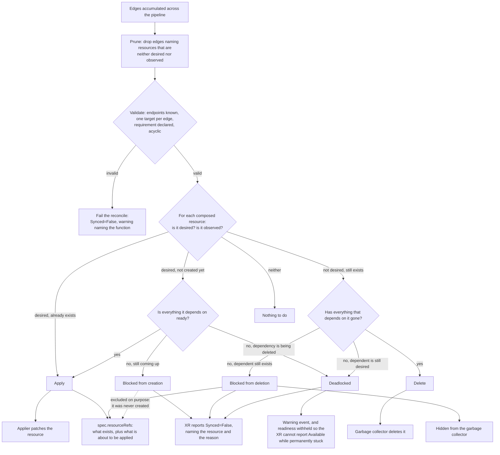

# Composed Resource Ordering <!-- omit in toc -->

* Owner: Steven Borrelli (@stevendborrelli)
* Reviewers: Crossplane Maintainers
* Status: Draft

## Table of Contents <!-- omit in toc -->

* [Background](#background)
* [Proposal](#proposal)
* [Goals](#goals)
* [Non-Goals](#non-goals)
* [Proposed Implementation](#proposed-implementation)
  * [Updating `RunFunctionRequest` and `RunFunctionResponse` to Support Dependencies](#updating-runfunctionrequest-and-runfunctionresponse-to-support-dependencies)
  * [Add the ability to Depend on a Required Resource in the gRPC Message](#add-the-ability-to-depend-on-a-required-resource-in-the-grpc-message)
  * [Dependencies accumulate like Desired Resources](#dependencies-accumulate-like-desired-resources)
  * [Backward Compatibility for Functions](#backward-compatibility-for-functions)
  * [Validation in the Core Engine for Valid and Acyclic Graphs](#validation-in-the-core-engine-for-valid-and-acyclic-graphs)
  * [Using the Graph to Order Creation and Deletion](#using-the-graph-to-order-creation-and-deletion)
    * [Determining Readiness](#determining-readiness)
    * [Blocked resources must still be reported](#blocked-resources-must-still-be-reported)
  * [Dealing With Contradictions in the Graph](#dealing-with-contradictions-in-the-graph)
    * [Resources waiting for Dependencies to be Created](#resources-waiting-for-dependencies-to-be-created)
    * [Resources pending Deletion](#resources-pending-deletion)
  * [Persisting Dependencies in `spec.resourceRefs`](#persisting-dependencies-in-specresourcerefs)
  * [Dependency Lifecycle: create-before-destroy](#dependency-lifecycle-create-before-destroy)
* [Performance at Scale](#performance-at-scale)
  * [In a cluster](#in-a-cluster)
  * [Interaction with the realtime compositions circuit breaker](#interaction-with-the-realtime-compositions-circuit-breaker)
  * [Compared with `function-sequencer`](#compared-with-function-sequencer)
* [Enabling Adoption with `function-ordering`](#enabling-adoption-with-function-ordering)
  * [How it works](#how-it-works)
* [API Impact and Capabilities](#api-impact-and-capabilities)
* [Comparison to Function Ordered Deletion](#comparison-to-function-ordered-deletion)
* [Alternatives Considered](#alternatives-considered)

## Background

See
[assets/design-doc-composed-resource-ordering/background.md](assets/design-doc-composed-resource-ordering/background.md)
for the background that led to this proposal.

## Proposal

Implement a directed resource graph in order to enable the ordered creation and
deletion of Composed Resources. This will be accomplished by having the function
pipeline define dependency pairs and core Crossplane managing the graph.

## Goals

* Enable Crossplane's reconciler to sequence creation and deletion of resources.
* Make dependency a first-class representation in the function protocol, so that
  "this resource is waiting" is distinguishable from "this resource is not
  wanted."
* Make it easy for Composition Authors to define dependencies between resources.
* Let Crossplane report accurately when an XR's composition is incomplete
  because a resource is blocked.
* Enable a composed resource's creation to depend on a required resource, so
  that it can depend on a resource outside the XR.
* Maintain consistency with Crossplane patterns: dependencies are accumulated in
  the pipeline, graphs are created by the core.
* Stay backward compatible with functions built with previous SDK versions, and
  enable tooling to adopt dependencies in legacy Compositions.
* Represent dependencies in the XR `resourceRefs` so external tools can read the
  graph.
* Enable ordering policies: for example, create a resource before another is
  deleted.
* Enable a pathway for deprecating Managed Resource References.

## Non-Goals

* Ordering the deletion of resources that belong to different Composite
  Resources. Deletion ordering is scoped to a single XR.
* Changing how a provider determines a managed resource's readiness. For
  composed resources this proposal consumes the readiness verdict the pipeline
  already produces.
* Making the function pipeline run during XR deletion. Ordering on teardown is
  driven by the graph persisted on the XR instead, so it does not need the
  pipeline to run.

## Proposed Implementation

* Update the gRPC messages to support dependency information.
* Update XR types in Crossplane runtime to support composition name and
  `dependsOn` in `spec.resourceRefs`.
* Implement a directed graph in the core composition engine.
* Update Applicator to support ordered creation and deletion.

### Updating `RunFunctionRequest` and `RunFunctionResponse` to Support Dependencies

A dependency is a pair of resources that must be created and deleted in order. A
Subnet cannot be created until the Network exists, and the Subnet must be
deleted before the Network.

```test
Subnet dependsOn Network
```

This is accomplished by adding top-level `dependencies` field to
`RunFunctionRequest` and `RunFunctionResponse`, alongside `desired`, `observed`,
and `context`:

```protobuf
message Dependency {
  // Name of the composed resource that has the dependency.
  // A key into State.resources.
  string resource = 1;

  // Name of the composed resource it depends on.
  // A key into State.resources.
  string depends_on = 2;

  // How this dependency constrains the order its endpoints are created and
  // deleted. Defaults to symmetric ordering. See "Dependency Lifecycle" below.
  DependencyLifecycle lifecycle = 3;
}

enum DependencyLifecycle {
  // Create `depends_on` first, delete it last. The default.
  DEPENDENCY_LIFECYCLE_UNSPECIFIED = 0;

  // `resource` may be created without waiting for `depends_on` to be deleted.
  // It must still exist and be Ready before `depends_on` is deleted.
  DEPENDENCY_LIFECYCLE_CREATE_BEFORE_DESTROY = 1;
}

// Wrapped in a message, not a bare repeated field, so that unset can be told
// apart from empty.
message Dependencies {
  repeated Dependency items = 1;
}

message RunFunctionRequest {
  // ...existing fields: meta = 1, observed = 2, desired = 3, input = 4,
  // context = 5, extra_resources = 6 [deprecated], credentials = 7,
  // required_resources = 8, required_schemas = 9...
  Dependencies dependencies = 10; // next unused field number
}

message RunFunctionResponse {
  // ...existing fields: meta = 1, desired = 2, results = 3, context = 4,
  // requirements = 5, conditions = 6, output = 7...
  Dependencies dependencies = 8; // next unused field number
}
```

A `Dependency` carries no copy of either resource — `resource` and `depends_on`
are the same string keys already used in `State.Resources`. That keeps the
marginal cost of this feature low: a Composite with a few dozen composed
resources rarely has more than a handful of ordering constraints per resource,
so `dependencies` stays small even though `desired` and `observed` already carry
full resource payloads on every call.

Dependencies are defined as resource pairs using desired composed resource
names, so that any step in the pipeline can create and modify the dependency
graph:

```text
[ // (resource, depends_on)
  (subnet-a, vpc),
  (subnet-b, vpc),
  (route-table-a, vpc),
  (route-a, route-table-a)
]
```

This creates a clear separation of responsibility; the Function is responsible
for returning dependency pairs. The Composition engine reads the pairs and
generates the resource graph which it uses to create and delete resources in
order.

### Add the ability to Depend on a Required Resource in the gRPC Message

Dependencies on resources outside the Composite Resource can also be defined
using Kubernetes references and selectors to support use cases where creation
depends on the existence of a centralized Configuration or a resource like a
shared VPC.

Crossplane already has the plumbing. A function declares
`requirements.resources`, core fetches the matching objects and returns them in
`RunFunctionRequest.required_resources`, and the core already tracks those
resources for watches, matched by name or label, alongside the XR's composed
resources. The event that unblocks a required-resource dependency therefore
already reaches the reconciler; nothing new is needed to make a blocked resource
wake up. As a replacement for Managed Resource References lookups and resource
fetching are removed from the Provider Pod and into the Crossplane engine.

The target of an edge becomes a `oneof`:

```protobuf
message Dependency {
  // Name of the composed resource that has the dependency.
  // A key into State.resources.
  string resource = 1;

  // What `resource` depends on.
  oneof depends_on {
    // Name of another composed resource. A key into State.resources.
    string composed_resource = 2;

    // A resource the pipeline required, rather than composed.
    RequiredResourceDependency required_resource = 4;
  }

  // How this dependency constrains the order its endpoints are created and
  // deleted. Only DEPENDENCY_LIFECYCLE_UNSPECIFIED is valid when depends_on
  // is a required resource.
  DependencyLifecycle lifecycle = 3;
}

message RequiredResourceDependency {
  // The requirement name. A key into RunFunctionRequest.required_resources,
  // and into a RunFunctionResponse's requirements.resources.
  string requirement_name = 1;

  // Optional name of a single resource within the set the requirement
  // matched. If unset, every matched resource must be ready.
  optional string name = 2;

  // Namespace of name for a namespaced resource. Leave unset for a
  // cluster-scoped resource.
  optional string namespace = 3;
}
```

A requirement can match objects in more than one namespace, so `name` on its own
is not necessarily unique. Naming a namespaced resource therefore requires
`namespace` as well; an edge that sets `name` without it, where the matched
resources are namespaced, is rejected by the validation below rather than
resolved arbitrarily. `namespace` stays unset for cluster-scoped resources,
where `name` is unique on its own.

The same pair notation extends to required resources. An edge naming only the
requirement waits on every object that requirement matched; adding `name`
narrows it to a single one of them, and `namespace` qualifies that name when the
resource is namespaced:

```text
[ // (resource, depends_on)
  (subnet-a, required(shared-vpc)),
  (subnet-b, required(shared-vpc)),
  (route-table-a, required(shared-vpc, name=vpc-prod)),
  (database, required(platform-config, name=prod, namespace=platform))
]
```

Because the XR does not own the lifecycle of a Required resource, the effect of
a dependency differs from one within the composition:

* **It only supports Creation ordering** Any `lifecycle` other than
  `DEPENDENCY_LIFECYCLE_UNSPECIFIED` should be rejected by the core engine.
* **Missing/Multiple requirements affect the graph** Crossplane returns an empty
  `Resources` message when a requirement matched no objects, which will block
  the creation of Composed resources. When a requirement matches several objects
  and `name` is unset, all of them must be ready to unblock creation.
* **Readiness is read from the object.** Ready means a `Ready: True` status
  condition, or, for object kinds that have no `Ready` condition at all,
  existence. We may need to examine the real-world effects of this, as `Ready`
  state is often set at the end of the pipeline.

Validation gains one check: a `requirement_name` must correspond to a
requirement the pipeline actually declared. An edge naming a requirement no
function requested is the same class of error as an edge naming a composed
resource that exists in neither desired nor observed state. Required resources
are always leaves in the graph, so they cannot introduce cycles.

This facilitates ordering across Composite Resources. If the resource an XR
requires happens to be another XR, this expresses "don't create my resource
until that XR is ready" in a read-only mode. It is enforced only on the create
side. Sequencing the deletion of resources across XR boundaries remains
out of scope, and remains what `Usage` is for.

### Dependencies accumulate like Desired Resources

Every function receives the full `dependencies` list accumulated so far and
returns the full list it wants going forward, the same way `desired` already
works. A function with no ordering opinion copies `request.dependencies` into
`response.dependencies` unchanged. SDKs should make this the default behavior of
their request and response builders, so unaware function code doesn't have to do
anything special to avoid dropping edges it doesn't understand.

### Backward Compatibility for Functions

Functions compiled against SDK versions that predate the implementation will
have no way to know they are expected to carry forward the `dependencies` field,
like they do with desired state. In the proposal a `Dependencies` message is
used to wrap a repeated field. By using this pattern (which is also used by the
`State` message) there is a clear difference between a function returning no
data and one returning an empty list of dependencies.

When building the request for pipeline step N+1, Crossplane will default
`dependencies` to what step N received if step N's response left the field
unset. "Unset" means "unchanged," never "empty." A function only needs to touch
`dependencies` when it actually has an opinion about ordering. In this way
functions can be upgraded over time without affecting the overall dependency
graph.

By convention many Function SDKs implement a `to()` function that sets the
response at the start of a pipeline. SDKs should be updated to include the
dependencies from previous functions in the pipeline as an additional
improvement.

### Validation in the Core Engine for Valid and Acyclic Graphs

Validation runs once, after the pipeline has finished, against the graph the
whole pipeline accumulated. It cannot run per response: dependencies accumulate,
so a function is free to declare an edge whose endpoint a later function adds,
and pruning that edge as each response arrives would delete it before the
function that satisfies it ever runs. Crossplane checks:

1. Every `resource` and `depends_on` name is resolved against the union of
   `Desired.Resources` and `Observed.Resources`. A composed resource dropped
   from `Desired`, because a function decided it should be deleted, but still
   present in `Observed` is exactly the case where a dependency edge matters
   most: it is what tells the reconciler not to delete it yet.
2. An edge naming a composed resource in neither is pruned, not rejected. A
   function with a fixed rule set goes on declaring edges for resources it has
   finished deleting, and core cannot tell a typo from a completed deletion, so
   rejecting them would fail composition permanently.
3. An edge naming an undeclared *requirement* is an error - but "declared" means
   declared by any function in this run, not present in the request. A function
   returns `requirements.resources` and the edges over them together, and
   Crossplane fetches required resources only after seeing that response, so the
   first request carries none. Validating against the request alone would reject
   every required-resource edge on its first pass and never recover.
4. The accumulated edge set remains acyclic.

A violation is reported the way Crossplane reports other invalid function
output: the pipeline run fails, and Crossplane records a warning event and a
`Synced: False` condition on the XR, naming the function whose response
introduced the violation.  Doing both checks in Crossplane means every SDK
doesn't need to separately implement validation.

### Using the Graph to Order Creation and Deletion

The graph's primary consumer is Crossplane's own applier and garbage collector
that runs as part of the reconciler loop.

* **Create.** The applier issues the first patch for a composed resource only
  once every resource it `depends_on` is ready. Ordering gates creation, not
  updates: a resource that already exists keeps reconciling, so a dependency
  that goes un-ready cannot freeze it.
* **Delete.** The garbage collector issues a delete only once every resource
  that `depends_on` it has left observed state.

One pass over the graph produces one decision per composed resource, and those
decisions define how Crossplane's applicator will behave.



A resource blocked this reconcile is picked up on a later pass, so no new
scheduling primitive is needed. With realtime compositions enabled the
reconciler does not requeue on a fixed interval. The later pass comes from the
watch Crossplane already establishes on each composed resource through its
dependency tracker: a dependency becoming ready is itself the event that
unblocks its dependents.

#### Determining Readiness

"Ready" here means the pipeline's own verdict — the value Crossplane already
derives from `Resource.ready` in the final desired state and uses to compute the
XR's `Ready` condition. That keeps a single definition of composed resource
readiness rather than introducing a second: a function that already influences
readiness, `function-auto-ready` being the common case, influences gating the
same way. A resource absent from desired state has no verdict, and so never
satisfies a dependency. Required resources are the documented exception: they
have no verdict either, so core reads their status directly — see "Add the
ability to Depend on a Required Resource in the gRPC Message."

#### Blocked resources must still be reported

`Compose` returns a `[]ComposedResource` that the reconciler uses to compute the
XR's `Synced` and `Ready` conditions, and today that slice is built from the
resources the applier actually patched. A resource held back by the graph has to
appear in it as not synced, with a reason. Otherwise the XR reports `Synced:
True` while composition is deliberately incomplete.

### Dealing With Contradictions in the Graph

The `Deadlocked` condition is for cases where the graph contradicts the desired
state. For example, if the pipeline drops a resource from desired state while
another resource that depends on it stays desired.

#### Resources waiting for Dependencies to be Created

Resources waiting on dependencies before being created are not populated in
`spec.resourceRefs`, as they have not been applied to the cluster.

#### Resources pending Deletion

Deferred deletes must stay in `spec.resourceRefs`. Crossplane rebuilds the XR's
`spec.resourceRefs` from desired state, and observes composed resources next
reconcile by reading it. A resource whose deletion the graph defers is by
definition not in desired state, so it would drop out of the references array
and become invisible on the next pass. Therefore, references must be the union
of desired state and the resources still present in observed state.

### Persisting Dependencies in `spec.resourceRefs`

Edge data can be persisted in `spec.resourceRefs` using two new fields
`resourceName` and `dependsOn`. These additional fields will require
Crossplane-runtime schemas to be updated:

```yaml
resourceRefs:
- apiVersion: ec2.aws.upbound.io/v1beta1
  kind: Subnet
  name: my-xr-subnet-a-p4m9x
  resourceName: subnet-a       # composition resource name
  dependsOn: [vpc]             # composition resource names
```

`resourceName` is what makes `dependsOn` resolvable: that name lives only in the
`crossplane.io/composition-resource-name` annotation today, so recording it here
also answers "which reference is which template" without reading every composed
resource.

On teardown core rebuilds the edges from the references, prunes those naming
resources that have left observed state, and asks the same `Decide` the live
path uses. No function runs.

`dependsOn` records the edge but deliberately not its `lifecycle`. The only
lifecycle value is create-before-destroy, which says a replacement must exist
and be ready before its predecessor goes away. That question cannot arise
during teardown, where nothing is desired and no replacement is coming, and
honoring the flag there would hold every such edge open waiting for one.
Teardown therefore treats every edge as ordinary, which is the behavior
create-before-destroy asks for once there is nothing to create.

An XR whose references predate these fields carries neither, so core finds no
edges and tears it down exactly as it does today, in no particular order. The
graph appears on the next reconcile that runs the pipeline, and teardown is
ordered from then on. Enabling the feature therefore changes nothing about an
existing XR until its pipeline has run once more, and never leaves one stuck.

The XR grows with the number of edges rather than the number of resources, so
the cost is set by how interconnected a composition is and not by how large it
is. Compositions are mostly shallow: a thousand resources hanging off one
`VPC` is 999 edges, and the resources in a realistic graph depend on a handful
of things each. A deliberately dense test graph - 400 resources with 7,600
edges between them - put `dependsOn` at 69KB of a 132KB XR, which is well
inside etcd's 1.5MiB object limit at a density no real composition approaches.

The graph becomes readable by any tool with a `GET` on the XR, so `crossplane
resource trace` and dashboards can render it without replaying a pipeline. And
unlike references, `dependsOn` comes from function output, so an XR deleted
before the pipeline next succeeds tears down by the previous graph which
describes what was actually built.

End users can run commands to extract dependencies:

```shell
kubectl get xordering ordered -o jsonpath='{range .spec.crossplane.resourceRefs[*]}{.resourceName}{" <- "}{.dependsOn}{"\n"}{end}'
```

### Dependency Lifecycle: create-before-destroy

The default for every edge is symmetric: forward order for create, strict
reverse for delete. That covers the common cases, like a VPC before a subnet, or
a subnet before an instance. Some replacements need the opposite on the way out,
where the new resource should exist before the old one is torn down, as in a
Kubernetes node pool.

Rather than introduce a second edge type, each edge carries a `lifecycle` enum,
whose `DEPENDENCY_LIFECYCLE_CREATE_BEFORE_DESTROY` value mirrors Terraform's
`create_before_destroy`. When set, the reconciler may create `resource` without
waiting for `depends_on` to be deleted first, but must still wait for `resource`
to exist and be ready before deleting `depends_on`. This keeps the graph a
single, simple structure: the value changes only which side of a transition may
proceed early, not the topology.

Using an enum enables the API to include other lifecycle policies in the future,
like
Pulumi's [`deletedWith`](https://www.pulumi.com/docs/iac/concepts/resources/options/deletedwith/).

## Performance at Scale

It is not unusual to come across a Crossplane environment where hundreds of
resources are managed in a Composite Resource, so the cost of processing the
graph matters.

Ordering issues no extra API calls, adds no watches, and stores nothing
beyond the two fields on `spec.resourceRefs`. The concern is one pass over the
graph per reconcile, and the fact that reconciles are most frequent exactly
when a large graph is converging. With realtime compositions every composed
resource that changes wakes its XR, so creating or tearing down `n` resources
costs on the order of `n` passes.

A pass is `O(n+m)` in `n` composed resources and `m` edges. The prototype
indexes the graph's adjacency once when it is built — outgoing edges by
resource, dependents by target, the lifecycle by the pair it belongs to — so
every question the decision logic asks is a map lookup.

That was not the first implementation. The graph was originally a flat edge
list scanned on every question, which made a pass quadratic in the size of the
composition, and worse with width than with depth: finding a resource's
dependents walked every edge, and then each dependent's lifecycle walked them
again. Measured per pass on an M-series laptop:

| Graph | Scanning | Indexed |
| --- | --- | --- |
| 500-resource chain | 1.06 ms | 0.18 ms |
| 1000-resource chain | 4.08 ms | 0.37 ms |
| 2000-resource chain | 14.19 ms | 0.74 ms |
| 500 resources, 980 edges, ten levels | 2.31 ms | 0.65 ms |
| 1000 resources, 1980 edges, ten levels | 8.92 ms | 1.48 ms |
| 500 resources, ten edges each | 22.98 ms | 0.50 ms |
| 1000 resources, ten edges each | 103.10 ms | 1.13 ms |

Growth is now linear in both dimensions: doubling the resource count doubles
the cost, where it previously quadrupled. The worst shape measured — a thousand
resources with ten dependencies each, denser than compositions normally are —
costs about a millisecond per pass, against a function pipeline that takes
1–100 ms and the API round trips that dominate any reconcile of that size.

The benchmarks live in
`internal/xfn/ordering/decide_bench_test.go` and cover chains, dense fan-in and
the layered shape a wide composition of independent branches actually takes, so
a regression to quadratic behavior shows up as a benchmark result rather than
as a production incident.

### In a cluster

A pass over the graph being cheap does not establish that a large composition
converges quickly, so the same shapes were run end to end on an 8-vCPU VM
running kind. Composed resources are ConfigMaps, which core composes directly
with no provider in the loop, and which are ready the moment they exist — so
what is measured is Crossplane rather than a provider's reconcile rate. The
control for each run is the same resources composed with no edges at all.

| Run | Creation | Reconciles | Core CPU | Mean reconcile |
| --- | --- | --- | --- | --- |
| fanout-500 ordered | 6s | 2 | 3.7s | 1842ms |
| fanout-500 unordered | 5s | 1 | 3.4s | 3389ms |
| fanout-100 ordered | 3s | 6 | 2.9s | 478ms |
| fanout-100 unordered | 3s | 5 | 2.7s | 550ms |
| chain-100 ordered | 32s | 104 | 31.5s | 303ms |
| chain-100 unordered | 3s | 5 | 2.7s | 547ms |
| chain-50 ordered | 10s | 54 | 9.8s | 182ms |
| chain-50 unordered | 3s | 10 | 3.0s | 295ms |
| fanout-1000 ordered | 9s | 2 | 7.2s | 3585ms |
| fanout-1000 unordered | 9s | 4 | 11.5s | 2887ms |
| layered-200, 6400 edges, 5 waves | 5s | 12 | 4.6s | 382ms |
| layered-200 unordered | 3s | 4 | 3.2s | 801ms |
| layered-500, 9600 edges, 25 waves | 43s | 31 | 41.8s | 1348ms |
| layered-500 unordered | 6s | 5 | 7.5s | 1500ms |

Width is free. Ordering a 1000-wide fanout costs no extra reconciles over
composing the same 1000 resources at once, and in these runs cost less core
CPU than the unordered control.

Density is close to free. `layered-200` is 6,400 edges over 200 resources —
32 dependencies each, far denser than a real composition — and converges in 5s
against a 3s unordered control.

Depth is what costs, at one pass per wave, which is not an implementation
choice: a hundred waves cannot be released in fewer than a hundred passes. A
pass runs from 180ms to 1.3s here and scales with how many resources the wave
applies, not with how many edges the graph holds. `layered-500` is the clearest
case — 43s for 25 waves of 20 resources, against `chain-100`'s 32s for 100
waves of one. Its 9,600 edges cost nothing; its 25 levels cost everything.

Notably the mean reconcile is *lower* ordered than unordered in every pair,
because an ordered pass applies a slice of the resources rather than all of
them. The graph work does not register as a per-pass cost at this scale, which
is what the microbenchmarks above predict. What ordering costs is passes, not
the cost of a pass.

One caution for anyone reproducing this, because it is large enough to
invert conclusions. The same shapes run against a provider measure the
provider: a 50-link chain of `NopResource`s takes 158s where the same chain of
ConfigMaps takes 10s, and the 6,400-edge `layered-200` takes 82s rather than
5s, because every wave waits for the provider to notice it. An earlier sweep
appeared to show ordering performing catastrophically, and a later one
appeared to show dense graphs being expensive; both were this effect. A
saturated provider and a slow graph are indistinguishable from the XR.

The harness is in `design/assets/design-doc-composed-resource-ordering/scale/`.

### Interaction with the realtime compositions circuit breaker

The measurements above raise `--circuit-breaker-burst` far above any run's
event count, so that what is measured is the ordering. At the shipped defaults
— `burst=100`, `refill-rate=1/s`, a 5m cooldown and a 30s half-open probe — a
deep graph does not converge:

| chain of ConfigMaps | Breaker raised | Breaker at defaults |
| --- | --- | --- |
| 50 | 10s | 49/50, still going at 601s |
| 100 | 32s | 73/100, still going at 901s |

`chain-50` opened the breaker twice and dropped 133 of 339 events; `chain-100`
opened it five times and dropped 325.

Ordering converges over many reconciles by design, one per wave, and each pass
applies resources whose updates are themselves watch events — so a chain
generates events superlinearly in its depth while spending exactly the budget
the breaker meters. The breaker is doing its job: an XR reconciling a hundred
times in thirty seconds is the runaway it exists to stop, and it cannot
currently tell that apart from a graph converging normally.

Width is unaffected, since a fanout is two waves whatever its size. This is a
depth problem, like every other cost here, and it is unresolved. It needs a
decision about how the two features interact: whether reconciles the graph
asks for should be metered at all, whether the breaker should count waves
rather than events, or whether enabling ordering should raise the burst. Until
then, a composition deep enough to matter needs the burst raised, and that
should be documented alongside the feature flag rather than discovered.

### Compared with `function-sequencer`

The mechanism this proposal replaces can be measured directly: compose the
same resources, then order them with `function-sequencer` instead of with
edges. Creation only — `function-sequencer` orders deletion with Usages, which
this proposal does not propose to replace.

| 20 resources, readiness taking 2s | Creation | Reconciles |
| --- | --- | --- |
| chain, graph | 192s | 100 |
| chain, `function-sequencer` | 192s | 105 |
| fanout, graph | 3s | 6 |
| fanout, `function-sequencer` | 192s | 101 |

For a chain the two are the same, and a chain of ConfigMaps is likewise 3s
either way. That is worth stating plainly: **the graph does not create faster
than `function-sequencer`, and the case for it is not creation throughput.**

The difference is what each can express. `function-sequencer` takes an ordered
list, and a list can say "after" but cannot say "these are unrelated", so
flattening a graph into one adds every constraint the graph deliberately left
out — nineteen independent leaves become nineteen serial steps, and the
sequencer takes exactly as long on a fanout as on a chain. The chain rows are
the control: where the graph really is a list, the two agree.

## Enabling Adoption with `function-ordering`

If we required every function author to adopt a new SDK version and emit
`dependencies`, the feature would arrive slowly and unevenly.

Thanks to the accumulation of state in Crossplane functions, we can place a
function at the end of the pipeline that defines dependency pairs.

[**`function-ordering`**](https://github.com/stevendborrelli/function-ordering) is a fork of **`function-sequencer`**, that keeps
its input schema and its user-facing behavior but emits `dependencies` edges.

### How it works

The fork reads the same `rules` block Composition authors already write, and
translates it into edges over composed resource names:

```yaml
  - step: order-resources
    functionRef:
      name: function-dependency-graph
    input:
      apiVersion: ordering.fn.crossplane.io/v1beta1
      kind: Input
      rules:
        - sequence: [vpc, subnet, security-group]
```

becomes the edge set `subnet -> vpc`, `security-group -> vpc`, `security-group
-> subnet`. Note that this is every predecessor pair, not just adjacent ones,
matching `function-sequencer`'s existing semantics: a resource at position *i*
waits on all of `sequence[:i]`, not only on `sequence[i-1]`.

Three properties make this the right shape for adoption:

* **No other function has to change.** The shim is a pipeline step operating on
  composed resource names in accumulated state. Whatever produced those
  resources — a templating function, a general-purpose function, a function
  compiled years before this proposal — is unaffected and unaware. A Composition
  adopts the graph by changing one `functionRef`.
* **Pattern matching stays out of the protocol.** `function-sequencer`'s regex
  rules expand against the names present in desired and observed state at
  translation time, so the wire format can stay exact-name-only while authors
  keep writing `first-subresource-.*`. Expansion is a user-experience concern;
  edges are the interchange format. This is a better split than teaching core to
  match patterns.
* **It degrades to today's behavior.** If Crossplane doesn't advertise the
  dependencies capability, the fork does exactly what `function-sequencer` does
  now — hold resources back by omission, compose `Usage` objects for teardown,
  and set `resetCompositeReadiness` if configured. One function works against
  old and new cores, and the same Composition keeps working through an upgrade.

In graph mode `resetCompositeReadiness` becomes unnecessary: core knows a
resource is blocked and reports it, which is the whole point of moving the
signal into the protocol.

Two of `function-sequencer`'s inputs have no equivalent in a symmetric edge. Its
per-rule `deleteOnly` and `createOnly` modifiers decouple the create and delete
directions of a sequence, and its per-rule CEL `condition` disables creation
sequencing while deliberately keeping teardown order. Rather than grow the
protocol a lifecycle knob per case, the fork keeps those rules on the legacy
path: a rule that sets any of the three is evaluated the way
`function-sequencer` evaluates it today, and only plain rules become edges. A
Composition can mix both in one step, and nothing an author already wrote stops
working. If demand for asymmetric edges turns out to be real, it is an additive
field later — but the evidence for it is one contrib function's options, not a
constraint the graph cannot otherwise meet.

## API Impact and Capabilities

This proposal changes a wire protocol that every installed Composition Function
and every running Crossplane core already depends on, so its compatibility
impact needs to stand on its own rather than be inferred from the rest of this
document.

**No new API version is required.** Adding a field with a previously-unused
number is wire-compatible by construction. `proto/fn/v1/run_function.proto` has
already grown this way several times without ever moving to a `v2` package:
`required_resources` shipped in Crossplane v1.15, `credentials` in v1.16,
`conditions` in v1.17, and `required_schemas` alongside the `capabilities`
mechanism itself in v2.2.

**Runtime behavior compatibility is handled by the existing capability
mechanism, extended by one value.** `RequestMeta.capabilities` already exists so
a function can tell "this core doesn't support X" apart from "this core predates
capability advertising entirely" — which is what the `CAPABILITY_CAPABILITIES`
value itself is for. Without a capability flag here, a function talking to an
older core would have its `dependencies` silently accepted on the wire, because
protobuf servers don't reject fields they don't recognize, but never enforced,
with nothing telling the function that happened. A new capability value closes
that gap the same way it is already closed for every other optional feature in
this protocol.

At a glance, the concrete additions to `proto/fn/v1/run_function.proto` and
where they land:

* **`Dependency`** and **`RequiredResourceDependency`** — new top-level
  messages. No existing message changes shape.
* **`RunFunctionRequest.dependencies`**, field `10`. Additive; unset on old
  clients, and carried forward by the runtime rather than by the function.
* **`RunFunctionResponse.dependencies`**, field `8`. Additive; unset means "no
  opinion," not "empty."
* **`CAPABILITY_DEPENDENCIES`**, `Capability` enum value `6`. Additive; lets a
  function detect an older core that will accept the field without enforcing it.

Functions should treat the capability's absence as "this core will not enforce
ordering," not as an error, the same graceful-degradation posture the protocol
already expects for every other optional capability.

## Comparison to Function Ordered Deletion

* [function-ordered-deletion](https://github.com/crossplane/crossplane/pull/7242) is a design where deletion ordering is handled by the functions using a new gRPC message.

The difference that decides it is that ordered teardown here needs no pipeline
run at all. The graph is persisted on the XR in
`spec.crossplane.resourceRefs[].dependsOn`, so the reconciler rebuilds it from
the XR's own references, observes what is left, and deletes a wave at a time.
Functions are never called. The `TeardownSurvivesRestart` end-to-end test
passes for this reason: Crossplane is killed mid-teardown and the replacement
process finishes in order, having never run the pipeline for that XR.

Under function-ordered-deletion, teardown ordering is a property of the
pipeline running, and deleting an XR is often part of decommissioning the very
configuration that defined it. The Function package may be uninstalled, its
image unpullable, its endpoint down. lsviben's POC raises exactly this case: a
Composition deleted before its XRs, which is easy to do by deleting a
Configuration, and which leaves those XRs unable to be torn down in order at
all. The discussion there settles on falling back to unordered deletion. A
persisted graph holds through all of it, because core needs nothing but the XR
— which is the state every XR reaches eventually.

There are further issues with offloading responsibility to functions:

* Gating is still handled by the functions, which increases complexity and the probability of bugs. This Modelplane branch demonstrates running the code reductions using a DAG in Crossplane. Multiple gating `if` statements and the `compose-usages` functions are removed <https://github.com/modelplaneai/modelplane/compare/main...stevendborrelli:modelplane:composed-resource-ordering?expand=1>.
* Dependency information is hidden from Crossplane any any consumers. In this proposal Crossplane knows which resources have yet to exist, so we don't have to hack the XR's Synced status as function-sequencer does. The composition engine emits events 

    ```text
    Normal   ComposeResources        28m                defined/compositeresourcedefinition.apiextensions.crossplane.io  Ordering is holding back 4 composed resource(s): gateway waiting for [gateway-class] to be ready; gateway-class waiting for [traefik] to be ready; metallb-l2 waiting for [metallb] to be ready; metallb-pool waiting for [metallb] to be ready. Function pipeline took 549ms.`
    ```

* The graph architecture has clear Separation of Concern. Functions emit edges, the Graph is managed by Crossplane. In the function-ordered-deletion proposal functions must manage graph state.
* All functions in a function-ordered-deletion Pipeline need to be updated, slowing adoption of the feature. In this proposal a single function (like function-sequencer) can emit edges, and existing functions that don't support ordering have no impact on the graph.
* This proposal enables a path to deprecation of Managed Resource References by embedding implicit references support in the SDKs. For example a Subnet uses a field like `vpcId: ref(vpc.externalName())`, the SDK can create the edge automatically.
* Since this proposal supports required resources, Managed Resource References where `matchControllerRef: false` can be replaced with a required resource dependency. The Modelplane fork above demonstrates this pattern as a real-world example <https://github.com/stevendborrelli/modelplane/blob/ea0b8f62092403169d4f4c908a4c3010f9c02678/functions/compose-inference-cluster/function/fn.py#L710>.
* Testability: it is difficult to surmise the state of dependencies from desired state gating and Usages. With graph edges represented in the XR, testing can be extended to the graph edges emitted from the pipeline.
* Integration with tooling: with graph edges represented in the XR, external tools can visualize dependencies and state.
* Reduction of API errors. Managed Resource Refs emit resources that generate Kubernetes API errors until the dependency is resolved. Usages block deletion, triggering errors and exponential backoff.

## Alternatives Considered

* **Leaving ordering to `function-sequencer` as it exists today.** The
  status-quo already covers the common case: declarative rules, pattern
  matching, works with any upstream function, ships now, no core changes. This
  proposal aims to move ordering into Crossplane instead of using delayed
  rendering and Usages.
* **Composing `Usage` resources instead of declaring edges.** The mechanism
  `function-sequencer` and `function-deletion-protection` both use. Usage
  enforcement at the Kubernetes API level applies even when there is a deletion
  attempt on the XR itself. There are several problems with using Usages for
  ordering. Each Usage is an extra resource on the cluster and it is not
  symmetric with creation. It can be difficult to generate complex dependency
  graphs using Usages. With ordering moved to the core the role of Usage is
  clarified to protecting deletion of critical resources.
* **Leaving ordering to observed-state gating written by hand in each
  function.** Possible today, and not rejected — it remains the right mechanism
  for anything conditional on more than existence and readiness, such as waiting
  for a Job to report success. Rejected as the *only* mechanism because it
  requires every function to implement a per-resource state machine, which is
  why `function-sequencer` exists at all.
* **Expressing ordering entirely through patches.** Piping a value from one
  resource's status into another's spec forces an implicit order, and is how
  many Compositions sequence resources today. Rejected as the sole mechanism
  because it can only express an order that coincides with a data dependency.