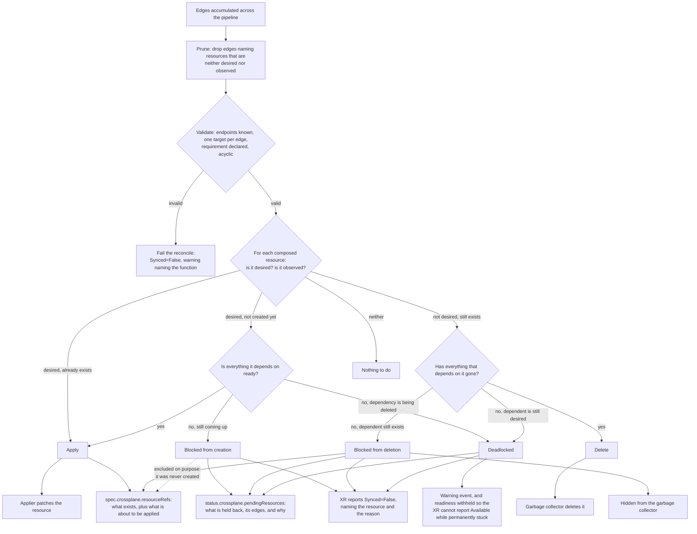

# Composed Resource Ordering <!-- omit in toc -->

* Owner: Steven Borrelli (@stevendborrelli)
* Reviewers: Crossplane Maintainers
* Status: Draft

## Table of Contents <!-- omit in toc -->

* [Background](#background)
* [Proposal](#proposal)
* [Goals](#goals)
* [Non-Goals](#non-goals)
* [Proposed Implementation](#proposed-implementation)
  * [Updates to `RunFunctionRequest` and `RunFunctionResponse`](#updates-to-runfunctionrequest-and-runfunctionresponse)
    * [Add a `Dependencies` Message](#add-a-dependencies-message)
    * [Support the Ability to Depend on a Required Resource in the gRPC Message](#support-the-ability-to-depend-on-a-required-resource-in-the-grpc-message)
    * [Dependency Lifecycle: create-before-destroy](#dependency-lifecycle-create-before-destroy)
    * [Dependencies Accumulate like Desired Resources](#dependencies-accumulate-like-desired-resources)
  * [Backward Compatibility for Functions](#backward-compatibility-for-functions)
  * [Validation in the Core Engine for Valid and Acyclic Graphs](#validation-in-the-core-engine-for-valid-and-acyclic-graphs)
  * [Using the Graph to Order Creation and Deletion](#using-the-graph-to-order-creation-and-deletion)
    * [Dealing With Contradictions in the Graph](#dealing-with-contradictions-in-the-graph)
    * [Determining Readiness](#determining-readiness)
  * [Representing Graph State in `spec` and `status`](#representing-graph-state-in-spec-and-status)
    * [Persisting Dependencies in `spec.crossplane.resourceRefs`](#persisting-dependencies-in-speccrossplaneresourcerefs)
    * [Resources Pending Deletion](#resources-pending-deletion)
    * [Reporting on Pending Resources](#reporting-on-pending-resources)
    * [`PendingResource` Example](#pendingresource-example)
* [Performance Considerations](#performance-considerations)
  * [Graph Performance](#graph-performance)
  * [Performance in a Cluster](#performance-in-a-cluster)
  * [Interaction with the Realtime Compositions Circuit Breaker](#interaction-with-the-realtime-compositions-circuit-breaker)
  * [Compared with `function-sequencer`](#compared-with-function-sequencer)
* [Enabling Adoption with `function-ordering`](#enabling-adoption-with-function-ordering)
  * [How It Works](#how-it-works)
* [API Impact and Capabilities](#api-impact-and-capabilities)
* [Comparison to Function Ordered Deletion](#comparison-to-function-ordered-deletion)
* [Alternatives Considered](#alternatives-considered)

## Background

See
[assets/design-doc-composed-resource-ordering/background.md](assets/design-doc-composed-resource-ordering/background.md)
for the background that led to this proposal.

## Proposal

Implement a directed resource graph in order to enable the ordered creation and
deletion of Composed Resources. This will be accomplished by having the function
pipeline define dependency pairs with core Crossplane managing the graph and
applying resources based on graph order.

## Goals

* Enable Crossplane's reconciler to sequence creation and deletion of resources.
* Make dependency a first-class representation in the function protocol, so that
  "this resource is waiting" is distinguishable from "this resource is not
  wanted."
* Make it easy for Composition Authors to define dependencies between resources.
* Let Crossplane report accurately when an XR's composition is incomplete
  because a resource is blocked.
* Enable a composed resource's creation to depend on a required resource, so
  that it can depend on a resource outside the XR.
* Maintain consistency with Crossplane patterns: dependencies are accumulated in
  the pipeline, ordering is managed by controllers in the core.
* Stay backward compatible with functions built with previous SDK versions, and
  enable tooling to adopt dependencies in legacy Compositions.
* Represent dependencies in the XR `resourceRefs` so external tools can read the
  graph.
* Represent pending resources and the reason they are pending in the XR so
  external tools know the state of all resources in the composition.
* Enable ordering policies: for example, create a resource before another is
  deleted.
* Enable a pathway for deprecating Managed Resource References.

## Non-Goals

* Ordering the deletion of resources that belong to different Composite
  Resources. Deletion ordering is scoped to a single XR.
* Changing how a provider determines a managed resource's readiness. For
  composed resources this proposal consumes the readiness verdict the pipeline
  already produces.
* Making the function pipeline run during XR deletion. Ordering on teardown is
  driven by the graph persisted on the XR instead, so it does not need the
  pipeline to run. This is handled by the proposal in
  [#7242](https://github.com/crossplane/crossplane/pull/7242).

## Proposed Implementation

The tasks to implement ordered creation and deletion are roughly:

* Update the gRPC messages to support the accumulation of dependency pairs.
* Update XR types in Crossplane runtime to support composition name and
  `dependsOn` in `spec.crossplane.resourceRefs`. Add a
  `status.crossplane.pendingResources` field for expressing the state of objects
  to be applied in the future.
* Implement a directed graph in the core composition engine.
* Gate the composer's apply and garbage collection steps on the graph's
  decisions.

### Updates to `RunFunctionRequest` and `RunFunctionResponse`

#### Add a `Dependencies` Message

A dependency is a pair of resources that must be created and deleted in order. A
Subnet cannot be created until the Network exists, and the Subnet must be
deleted before the Network.

```text
Subnet dependsOn Network
```

This is enabled in the function pipeline by adding a top-level `dependencies`
field to `RunFunctionRequest` and `RunFunctionResponse`, alongside `desired`,
`observed`, and `context`:

```protobuf
message Dependency {
  // Name of the composed resource that has the dependency.
  // A key into State.resources.
  string resource = 1;

  // Name of the composed resource it depends on.
  // A key into State.resources.
  string depends_on = 2;

  // How this dependency constrains the order its endpoints are created and
  // deleted. Defaults to symmetric ordering. See "Dependency Lifecycle" below.
  DependencyLifecycle lifecycle = 3;
}

enum DependencyLifecycle {
  // Create `depends_on` first, delete it last. The default.
  DEPENDENCY_LIFECYCLE_UNSPECIFIED = 0;

  // `resource` may be created without waiting for `depends_on` to be deleted.
  // It must still exist and be Ready before `depends_on` is deleted.
  DEPENDENCY_LIFECYCLE_CREATE_BEFORE_DESTROY = 1;
}

// Wrapped in a message, not a bare repeated field, so that unset can be told
// apart from empty.
message Dependencies {
  repeated Dependency items = 1;
}

message RunFunctionRequest {
  // ...existing fields: meta = 1, observed = 2, desired = 3, input = 4,
  // context = 5, extra_resources = 6 [deprecated], credentials = 7,
  // required_resources = 8, required_schemas = 9...
  Dependencies dependencies = 10; // next unused field number
}

message RunFunctionResponse {
  // ...existing fields: meta = 1, desired = 2, results = 3, context = 4,
  // requirements = 5, conditions = 6, output = 7...
  Dependencies dependencies = 8; // next unused field number
}
```

In a `Dependency`, `resource` and `depends_on` are the same string keys already
used in `State.Resources`, reducing the overhead of the feature. In graph terms,
each dependency is a directed edge from `resource` to `depends_on`. The
accumulated edges form a directed acyclic graph, where targets are created first
and deleted last. The Function pipeline accumulates the list of dependencies
alongside desired state:

```text
[ // (resource, depends_on)
  (subnet-a, vpc),
  (subnet-b, vpc),
  (route-table-a, vpc),
  (route-a, route-table-a)
]
```

This model separates responsibility; the Function is responsible for returning
dependency pairs, leaving the processing of the graph to Crossplane itself.

#### Support the Ability to Depend on a Required Resource in the gRPC Message

Another proposed feature is creating dependencies on resources outside of the
Composite resource to support use cases where creation depends on the existence
of a centralized Configuration or a resource like a shared VPC.

Crossplane already supports external lookups using Required Resources. A
Function declares `requirements.resources`, Crossplane fetches the matching
objects and returns them in `RunFunctionRequest.required_resources`.

To enable this feature the target of a `Dependency` edge becomes a `oneof`. This
definition replaces the `Dependency` message above:

```protobuf
message Dependency {
  // Name of the composed resource that has the dependency.
  // A key into State.resources.
  string resource = 1;

  // What `resource` depends on.
  oneof depends_on {
    // Name of another composed resource. A key into State.resources.
    string composed_resource = 2;

    // A resource the pipeline required, rather than composed.
    RequiredResourceDependency required_resource = 4;
  }

  // How this dependency constrains the order its endpoints are created and
  // deleted. Only DEPENDENCY_LIFECYCLE_UNSPECIFIED is valid when depends_on
  // is a required resource.
  DependencyLifecycle lifecycle = 3;
}

message RequiredResourceDependency {
  // The requirement name. A key into RunFunctionRequest.required_resources,
  // and into a RunFunctionResponse's requirements.resources.
  string requirement_name = 1;

  // Optional name of a single resource within the set the requirement
  // matched. If unset, every matched resource must be ready.
  optional string name = 2;

  // Namespace of name for a namespaced resource. Leave unset for a
  // cluster-scoped resource.
  optional string namespace = 3;
}
```

A requirement can match objects in more than one namespace, so `name` on its own
is not necessarily unique. Naming a namespaced resource therefore requires
`namespace` as well; an edge that sets `name` without it, where the matched
resources are namespaced, is rejected by the validation below rather than
resolved arbitrarily. `namespace` stays unset for cluster-scoped resources,
where `name` is unique on its own.

The same pair notation extends to required resources. An edge naming only the
requirement waits on every object that requirement matched; adding `name`
narrows it to a single one of them, and `namespace` qualifies that name when the
resource is namespaced:

```text
[ // (resource, depends_on)
  (subnet-a, required(shared-vpc)),
  (subnet-b, required(shared-vpc)),
  (route-table-a, required(shared-vpc, name=vpc-prod)),
  (database, required(platform-config, name=prod, namespace=platform))
]
```

Because the XR does not own the lifecycle of a Required resource, the effect of
a dependency differs from one within the composition:

* **It only supports Creation ordering.** Any `lifecycle` other than
  `DEPENDENCY_LIFECYCLE_UNSPECIFIED` should be rejected by the core engine.
* **Missing/Multiple requirements affect the graph.** Crossplane returns an
  empty `Resources` message when a requirement matched no objects, which will
  block the creation of Composed resources. When a requirement matches several
  objects and `name` is unset, all of them must be ready to unblock creation.
* **Readiness is read from the object.** Ready means a `Ready: True` status
  condition, or, for object kinds that have no `Ready` condition at all,
  existence. We may need to examine the real-world effects of this, as `Ready`
  state is often set at the end of the pipeline.

One more validation is needed when depending on a Required Resource:
`requirement_name` must correspond to a requirement the pipeline actually
declared, so the graph does not depend on a resource that can never be present
in the XR.

Depending on a Required Resource allows Composition authors to order creation of
resources that depend on objects outside the XR. Sequencing the deletion of
resources across XR boundaries is out of scope, as this use case is already
handled by Crossplane
[`Usages`](https://docs.crossplane.io/latest/managed-resources/usages/).

#### Dependency Lifecycle: create-before-destroy

The default for every edge is symmetric: forward order for create, strict
reverse for delete. That covers the common cases, like a VPC before a subnet, or
a subnet before an instance. Some replacements need the opposite on the way out,
where the new resource should exist before the old one is torn down, as in a
Kubernetes node pool.

Rather than introduce a second edge type, each edge carries a `lifecycle` enum,
whose `DEPENDENCY_LIFECYCLE_CREATE_BEFORE_DESTROY` value mirrors Terraform's
`create_before_destroy`. When set, the reconciler may create `resource` without
waiting for `depends_on` to be deleted first, but must still wait for `resource`
to exist and be ready before deleting `depends_on`. This keeps the graph a
single, simple structure: the value changes only which side of a transition may
proceed early, not the topology.

Using an enum enables the API to include other lifecycle policies in the future,
like Pulumi's
[`deletedWith`](https://www.pulumi.com/docs/iac/concepts/resources/options/deletedwith/).

#### Dependencies Accumulate like Desired Resources

Every function receives the full `dependencies` list accumulated so far and
returns the full list it wants going forward, the same way `desired` already
works. A function with no ordering opinion copies `request.dependencies` into
`response.dependencies` unchanged. SDKs should make this the default behavior of
their request and response builders, so unaware function code doesn't have to do
anything special to avoid dropping edges it doesn't understand.

### Backward Compatibility for Functions

This proposed feature is designed to have minimal impact on existing Crossplane
environments. The initial implementation will be turned off by default and gated
behind an alpha flag. The feature is advertised as a Capability
`CAPABILITY_DEPENDENCIES` to the function pipeline, so that function authors can
check for support and transition their code over time.

When ordering is disabled in Crossplane, the Composition engine will function as
it does today. Function pipelines that do not accumulate any dependency pairs
will work as they do today.

Functions compiled against SDK versions that predate the implementation will
have no way to know they are expected to carry forward the `dependencies` field,
like they do with desired state. In the proposal a `Dependencies` message is
used to wrap a repeated field. By using this pattern (which is also used by the
`State` message) there is a clear difference between a function returning no
data and one returning an empty list of dependencies.

When building the request for pipeline step N+1, Crossplane will default
`dependencies` to what step N received if step N's response left the field
unset. "Unset" means "unchanged," never "empty." A function only needs to touch
`dependencies` when it actually has an opinion about ordering. In this way
functions can be upgraded over time without affecting the overall dependency
graph.

By convention many Function SDKs implement a `to()` function that sets the
response at the start of a pipeline. SDKs should be updated to include the
dependencies from previous functions in the pipeline as an additional
improvement.

### Validation in the Core Engine for Valid and Acyclic Graphs

After the pipeline has finished, validation runs once against the graph the
whole pipeline accumulated. It cannot run per response: dependencies accumulate,
so a function is free to declare an edge whose endpoint a later function adds,
or a step can request a Required Resource that will be used in later steps of
the pipeline.

There are a number of graph validation checks that will be required:

* Edges must have targets: `a dependsOn(null)` is invalid.
* An edge cannot depend on itself `a dependsOn(a)`.
* Graph cycles are invalid `a dependsOn(b), b dependsOn(a)`, including
  transitive dependencies.
* A required resource edge must name a requirement that some function in the
  pipeline declared.

Before validation, edges naming a composed resource that is in neither `desired`
nor `observed` state are pruned rather than rejected. A function with a fixed
rule set goes on declaring edges for resources it has finished deleting, and
Crossplane cannot tell that apart from a typo, so rejecting them would fail
composition permanently. Crossplane emits an event naming the pruned edges
instead. An edge whose resource is only in `observed` is kept: the resource has
been dropped from desired state, and the edge is what blocks its deletion until
its dependents are gone.

A violation is reported the way Crossplane reports other invalid function
output: the pipeline run fails, and Crossplane records a warning event and a
`Synced: False` condition on the XR, naming the function whose response
introduced the violation. Doing these checks in Crossplane means every SDK
doesn't need to separately implement validation.

### Using the Graph to Order Creation and Deletion

Once a valid graph has been created, Crossplane will use it to order the
creation and deletion of resources. For every resource in the graph Crossplane
creates a Decision, and based on the decision composes resources.

For example, any resource that has a `blocked` decision due to a dependency is
filtered from garbage collection, even if it is no longer in desired state.

The following flowchart documents the prototype's behavior.


```mermaid
flowchart TD
    A["Edges accumulated across the pipeline"]
    A --> B["Prune: drop edges naming resources that are<br/>neither desired nor observed"]
    B --> C{"Validate: endpoints known, one target per edge,<br/>requirement declared, acyclic"}
    C -- invalid --> X["Fail the reconcile:<br/>Synced=False, warning naming the function"]
    C -- valid --> D{"For each composed resource:<br/>is it desired? is it observed?"}

    D -- "desired, already exists" --> AP["Apply"]
    D -- "desired, not created yet" --> G1{"Is everything it depends on ready?"}
    D -- "not desired, still exists" --> G2{"Has everything that depends on it gone?"}
    D -- "neither" --> Z["Nothing to do"]

    G1 -- yes --> AP
    G1 -- "no, still coming up" --> W1["Blocked from creation"]
    G1 -- "no, dependency is being deleted" --> DL["Deadlocked"]

    G2 -- yes --> DE["Delete"]
    G2 -- "no, dependent still exists" --> W2["Blocked from deletion"]
    G2 -- "no, dependent is still desired" --> DL

    AP --> PATCH["Applier patches the resource"]
    DE --> GC["Garbage collector deletes it"]
    W2 --> HIDE["Hidden from the garbage collector"]

    AP --> REFS["spec.crossplane.resourceRefs:<br/>what exists, plus what is about to be applied"]
    W2 --> REFS
    W1 -. "excluded on purpose:<br/>it was never created" .-> REFS

    W1 --> PEND["status.crossplane.pendingResources:<br/>what is held back, its edges, and why"]
    W2 --> PEND
    DL --> PEND

    W1 --> SYNC["XR reports Synced=False,<br/>naming the resource and the reason"]
    W2 --> SYNC
    DL --> SYNC
    DL --> WARN["Warning event, and readiness withheld so the<br/>XR cannot report Available while permanently stuck"]
```

A resource blocked this reconcile is picked up on a later pass, so no new
scheduling primitive is needed. With realtime compositions enabled the
reconciler does not requeue on a fixed interval; a dependency becoming ready is
itself the event that unblocks its dependents.

Deletion ordering does not depend on the function pipeline. While the XR is
live, the pipeline decides what to drop from desired state and the graph decides
when it goes. When the XR itself is deleted the pipeline does not run at all,
and the reconciler rebuilds the graph from `spec.crossplane.resourceRefs`.
Either way, deletion proceeds in waves:

1. A resource leaves desired state, or the XR is being deleted.
2. If something that depends on it still exists, the graph hides it from
   Crossplane's composed resource garbage collector. Otherwise the garbage
   collector deletes it, which sets its `deletionTimestamp`.
3. The provider, or the API server for resources without one, finishes the
   deletion, and the resource leaves observed state.
4. The next reconcile recomputes the graph, and resources that were waiting on
   it are released to the garbage collector.

#### Dealing With Contradictions in the Graph

A resource is deadlocked when the graph contradicts the desired state, for
example when the pipeline drops a resource from desired state while another
resource that depends on it stays desired. Waiting cannot resolve a deadlock, so
Crossplane reports it as `deadlocked: true` in
`status.crossplane.pendingResources`, with a warning event and `Synced: False`
on the XR.

#### Determining Readiness

When ordering resources, it is important to know when to create dependent
resources and when to remove a resource. A Subnet needs to wait for a VPC, and
we don't want to delete an EKS cluster until all workloads on it have been
removed. (This is a possible future enhancement: a Lifecycle for items like
provider-helm Releases where we don't care to track deletion if the Cluster it
is running on is also being torn down).

Crossplane already provides the readiness signal creation ordering needs.
Dependent resources are created when the resources they depend on reach the
`Ready` state returned at the end of a pipeline run.

A benefit of this approach is the XR's state now accurately represents the
complete state of all composed resources, avoiding workarounds like
function-sequencer's
[`resetCompositeReadiness`](https://github.com/crossplane-contrib/function-sequencer#composite-readiness)
flag.

### Representing Graph State in `spec` and `status`

This proposal significantly improves the observability of Composite resources.
The XR will represent the graph edges and pending resources. Crossplane users
can watch the XR for updates and have visibility into resources that will be
created in the future, or are waiting to be deleted.

#### Persisting Dependencies in `spec.crossplane.resourceRefs`

In a Composite Resource, resources are tracked in
`spec.crossplane.resourceRefs`. We propose to persist edges using two new fields
`resourceName` and `dependsOn`. These additional fields will require
Crossplane-runtime schemas to be updated:

```yaml
spec:
  crossplane:
    resourceRefs:
    - apiVersion: ec2.aws.m.upbound.io/v1beta1
      kind: Subnet
      name: my-xr-subnet-a-p4m9x
      resourceName: subnet-a       # composition resource name
      dependsOn: [vpc]             # composition resource names
```

`resourceName` is what makes `dependsOn` resolvable: that name lives only in the
`crossplane.io/composition-resource-name` annotation today, so recording it here
also answers "which reference is which template" without reading every composed
resource.

`dependsOn` records the edge but not its `lifecycle`. Right now the only
non-default lifecycle is `create-before-destroy`, which is not in effect during
teardown. This may be a future improvement as the lifecycle option matures.

Existing XRs that do not have any dependencies will not populate these fields,
retaining backwards compatibility. Once a Function pipeline has been updated,
the graph will be created on the next pipeline run, and the fields populated,
enabling a transition to the ordering feature.

This does limit downgrading Crossplane. The schema fields are added whether or
not ordering is enabled, so turning the feature flag off keeps them. An XR
restored to, or downgraded onto, a Crossplane version that predates these fields
has them pruned, and loses the graph it needs for ordered teardown.

The XR grows with the number of edges rather than the number of resources, so
the cost is set by how interconnected a composition is and not by how large it
is. Compositions are mostly shallow: a thousand resources hanging off one `VPC`
is 999 edges, and the resources in a realistic graph depend on a handful of
things each. A deliberately dense test graph - 400 resources with 7,600 edges
between them - put `dependsOn` at 69KB of a 132KB XR, which is well inside
etcd's 1.5MiB object limit at a density no real composition approaches.

The graph becomes readable by any tool with a `GET` on the XR, so
`crossplane resource trace` and dashboards can render it without replaying a
pipeline. Because the edges are written only when the pipeline succeeds, an XR
deleted while its pipeline is failing tears down by the last graph that
succeeded, which describes what was actually built.

End users and tools can read the graph straight from the XR. A preview tool such
as the proposed `crossplane simulate` could use it to show the order in which
changes would be applied. For example, to list each resource's dependencies:

```shell
kubectl get network prod -n team-a -o jsonpath='{range .spec.crossplane.resourceRefs[*]}{.resourceName}{" <- "}{.dependsOn}{"\n"}{end}'
```

#### Resources Pending Deletion

Deferred deletes must stay in `spec.crossplane.resourceRefs`. Crossplane
rebuilds the XR's `spec.crossplane.resourceRefs` from desired state, and
observes composed resources next reconcile by reading it. A resource whose
deletion the graph defers is by definition not in desired state, so it would
drop out of the references array and become invisible on the next pass.
Therefore, references must be the union of desired state and the resources still
present in observed state.

#### Reporting on Pending Resources

`spec.crossplane.resourceRefs` lists the objects that exist or are about to be
applied. With ordering, a resource can be desired but held back from creation,
so it has no reference at all. Or it can be dropped from desired state but held
back from deletion, so its reference says nothing about why it still exists.

A proposed `status.crossplane.pendingResources` will store this information,
allowing platform consumers to understand pending changes and any issues in the
graph. As the XR converges, `pendingResources` will converge to zero items as
resources either migrate to `resourceRefs` during creation or are removed during
teardown.

Each entry in `status.crossplane.pendingResources` has:

| Field | Meaning |
| --- | --- |
| `apiVersion`, `kind` | The composed resource's type. Always set. |
| `resourceName` | The composition resource name, the key a function uses and the name edges refer to. Always set. |
| `operation` | `Create` or `Delete`, the change being held back. Always set. |
| `name` | The composed object's name. Set only for `Delete`, because only then does the object exist. |
| `namespace` | Set only on cluster-scoped XRs. A namespaced XR composes into its own namespace, so there is nothing to record. |
| `dependsOn` | What a pending creation waits on. Each entry has a `type` of `ComposedResource` (the default, with `name`) or `RequiredResource` (with `requirement.name`, and optionally `requirement.resourceName` and `requirement.namespace`). |
| `reason` | Why, in words meant for a person. |
| `deadlocked` | `true` when waiting cannot resolve it and someone has to act. |

#### `PendingResource` Example

A namespaced `Network` XR composes a VPC, subnets, a NAT gateway and a database.
The database also depends on a `platform-config` resource that the pipeline
requires but does not compose. Partway through a change, the pipeline has
dropped the NAT gateway, its route and a legacy security group. The VPC exists
and is not ready yet, and nothing matches `platform-config`. The XR reads:

```yaml
apiVersion: example.crossplane.io/v1
kind: Network
metadata:
  name: prod
  namespace: team-a
spec:
  crossplane:
    resourceRefs:
    - apiVersion: ec2.aws.m.upbound.io/v1beta1
      kind: VPC
      name: prod-vpc-8d2kq
      resourceName: vpc
    - apiVersion: ec2.aws.m.upbound.io/v1beta1
      kind: NATGateway
      name: prod-nat-gateway-x7c4m
      resourceName: nat-gateway
      dependsOn: [vpc]
    - apiVersion: ec2.aws.m.upbound.io/v1beta1
      kind: Route
      name: prod-route-private-b2n9t
      resourceName: route-private
      dependsOn: [nat-gateway]
    - apiVersion: ec2.aws.m.upbound.io/v1beta1
      kind: SecurityGroup
      name: prod-legacy-sg-q4w8e
      resourceName: legacy-sg
      dependsOn: [vpc]
    - apiVersion: ec2.aws.m.upbound.io/v1beta1
      kind: Instance
      name: prod-bastion-z5r1p
      resourceName: bastion
      dependsOn: [legacy-sg]
status:
  crossplane:
    pendingResources:
    - apiVersion: rds.aws.m.upbound.io/v1beta1
      kind: Instance
      resourceName: database
      operation: Create
      dependsOn:
      - name: subnet-a
      - type: RequiredResource
        requirement:
          name: platform-config
          resourceName: prod
          namespace: platform
      reason: waiting for [subnet-a] to be ready; waiting for [requirement platform-config] to match a resource
    - apiVersion: ec2.aws.m.upbound.io/v1beta1
      kind: SecurityGroup
      name: prod-legacy-sg-q4w8e
      resourceName: legacy-sg
      operation: Delete
      reason: 'cannot be satisfied: the pipeline still wants [bastion], which depends on it'
      deadlocked: true
    - apiVersion: ec2.aws.m.upbound.io/v1beta1
      kind: NATGateway
      name: prod-nat-gateway-x7c4m
      resourceName: nat-gateway
      operation: Delete
      reason: waiting for [route-private] to be deleted
    - apiVersion: ec2.aws.m.upbound.io/v1beta1
      kind: Subnet
      resourceName: subnet-a
      operation: Create
      dependsOn:
      - name: vpc
      reason: waiting for [vpc] to be ready
```

Read together, the two lists account for every composed resource:

* **`subnet-a` and `database` are waiting to be created.** Neither has a
  reference, because neither exists. Their entries are the only place they
  appear, so each carries its own edges and no `name`. `database` waits on both
  a composed resource and a required one, and the typed `dependsOn` tells them
  apart. Without `type`, a composition waiting on a Secret someone else has to
  create would look like one waiting on a resource it composes.
* **`route-private` is being deleted and is not listed.** Nothing depends on it,
  so nothing holds it back. Once it leaves observed state, `nat-gateway` is
  released and its entry disappears.
* **`nat-gateway` is waiting to be deleted.** It still exists, so it keeps its
  reference and its edges stay there. The entry adds its `name` and the reason,
  which names the dependent it waits on.
* **`legacy-sg` is deadlocked.** The pipeline dropped it but still wants
  `bastion`, which depends on it, so no amount of waiting deletes it. This is a
  mistake in the composition, and `deadlocked: true` is what an alert matches
  on, not the wording of the reason.
* **`vpc` and `bastion` are not listed.** They exist and are desired, so
  ordering is not holding back any change to them.

Entries are sorted by `resourceName`, so the same situation always produces the
same status. Tools can read the field directly:

```shell
kubectl get network prod -n team-a -o jsonpath='{range .status.crossplane.pendingResources[*]}{.operation}{" "}{.resourceName}{": "}{.reason}{"\n"}{end}'
```

The XR's `Synced` condition and events still say ordering is holding resources
back. The field holds the details, which the event cuts off after the first few
resources.

**Both directions, from one place.** A resource that cannot be created yet and
one that cannot be deleted yet are the same decision seen from either side, and
the engine already reports them through a single path. Splitting them — a field
for one, a formatted string for the other — is how the two drift apart.

**It is never authoritative.** Teardown reads `spec.crossplane.resourceRefs`,
which is where the graph that survives a restart lives. Nothing reads this field
to make a decision, so losing it costs visibility until the next reconcile and
nothing more. That is what keeps it free: it is derived from the same decisions
the engine has already made.

**It sits under `status.crossplane`.** Modern XRs configure their Crossplane
machinery under `spec.crossplane`, and report it under `status.crossplane` to
match — someone who knows where `resourceRefs` lives can guess where this does.
Legacy v1 XRs still order their resources: their references carry the same
`resourceName` and `dependsOn` fields, kept at `spec.resourceRefs` rather than
`spec.crossplane.resourceRefs`. They don't report pending resources, though, and
their status schema gains no new field. Claims don't report it either: a claim
composes nothing, so it has nothing to hold back.

**Reasons must hold still.** Crossplane skips the status write when status has
not changed, so `pendingResources` costs a write only on the passes where the
set actually changes — roughly one per wave, against the several reconciles a
wave provokes. A reason containing an elapsed time or a counter would move on
its own and make every reconcile a write, and every write a watch event on the
XR. How long something has been waiting belongs in a condition's
`lastTransitionTime`, which records it for free.

Teardown populates the field itself. It rebuilds the graph from the XR's own
references and runs the same decision, so no function has to have run — the
property this path exists to have. Without that, a deleting XR keeps whatever
the last pipeline run left, and reports resources as waiting to be created while
they are being deleted.

On Modelplane's serving stack, 18 composed resources over 5 waves, the field
tracks a full rebuild:

```text
deleting  holding back  7  Delete:ai-gateway-crds, Delete:cert-manager, ...
deleting  holding back  1  Delete:provider-config-helm
alive     holding back 16  Create:ai-gateway, Create:ai-gateway-crds, ...
alive     holding back  4  Create:ai-gateway, Create:envoy-gateway, ...
alive     holding back  0
```

Deletions draining in reverse dependency order, the ProviderConfigs last, then
creations released wave by wave. None of those resources appeared anywhere in
the API before this field existed.

## Performance Considerations

### Graph Performance

It is not unusual to come across a Crossplane environment where hundreds of
resources are managed in a Composite Resource, so the cost of processing the
graph matters.

Ordering issues no extra API calls, adds no watches, and stores nothing beyond
the two fields on `spec.crossplane.resourceRefs` and
`status.crossplane.pendingResources`, which is written only when its contents
change. The concern is one pass over the graph per reconcile, and the fact that
reconciles are most frequent exactly when a large graph is converging. With
realtime compositions every composed resource that changes wakes its XR, so
creating or tearing down `n` resources costs on the order of `n` passes.

A pass is `O(n+m)` in `n` composed resources and `m` edges. The prototype
indexes the graph's adjacency once when it is built — outgoing edges by
resource, dependents by target, the lifecycle by the pair it belongs to — so
every question the decision logic asks is a map lookup.

That was not the first implementation. The graph was originally a flat edge list
scanned on every question, which made a pass quadratic in the size of the
composition, and worse with width than with depth: finding a resource's
dependents walked every edge, and then each dependent's lifecycle walked them
again. Measured per pass on an M-series laptop:

| Graph | Scanning | Indexed |
| --- | --- | --- |
| 500-resource chain | 1.06 ms | 0.18 ms |
| 1000-resource chain | 4.08 ms | 0.37 ms |
| 2000-resource chain | 14.19 ms | 0.74 ms |
| 500 resources, 980 edges, ten levels | 2.31 ms | 0.65 ms |
| 1000 resources, 1980 edges, ten levels | 8.92 ms | 1.48 ms |
| 500 resources, ten edges each | 22.98 ms | 0.50 ms |
| 1000 resources, ten edges each | 103.10 ms | 1.13 ms |

Growth is now linear in both dimensions: doubling the resource count doubles the
cost, where it previously quadrupled. The worst shape measured — a thousand
resources with ten dependencies each, denser than compositions normally are —
costs about a millisecond per pass, against a function pipeline that takes 1–100
ms and the API round trips that dominate any reconcile of that size.

The benchmarks live in `internal/xfn/ordering/decide_bench_test.go` and cover
chains, dense fan-in and the layered shape a wide composition of independent
branches actually takes, so a regression to quadratic behavior shows up as a
benchmark result rather than as a production incident.

### Performance in a Cluster

The prototype was run end-to-end on an 8-vCPU GCP VM running kind on Linux.
ConfigMaps were used as the Composed Resource, so what is measured is Crossplane
rather than a provider's reconcile rate. The control for each run is the same
resources composed with no edges at all.

| Run | Creation | Reconciles | Core CPU | Mean reconcile |
| --- | --- | --- | --- | --- |
| fanout-500 ordered | 6s | 2 | 3.7s | 1842ms |
| fanout-500 unordered | 5s | 1 | 3.4s | 3389ms |
| fanout-100 ordered | 3s | 6 | 2.9s | 478ms |
| fanout-100 unordered | 3s | 5 | 2.7s | 550ms |
| chain-100 ordered | 32s | 104 | 31.5s | 303ms |
| chain-100 unordered | 3s | 5 | 2.7s | 547ms |
| chain-50 ordered | 10s | 54 | 9.8s | 182ms |
| chain-50 unordered | 3s | 10 | 3.0s | 295ms |
| fanout-1000 ordered | 9s | 2 | 7.2s | 3585ms |
| fanout-1000 unordered | 9s | 4 | 11.5s | 2887ms |
| layered-200, 6400 edges, 5 waves | 5s | 12 | 4.6s | 382ms |
| layered-200 unordered | 3s | 4 | 3.2s | 801ms |
| layered-500, 9600 edges, 25 waves | 43s | 31 | 41.8s | 1348ms |
| layered-500 unordered | 6s | 5 | 7.5s | 1500ms |

A flat graph is essentially free. Ordering a 1000-wide fanout costs no extra
reconciles over composing the same 1000 resources at once, and in that run used
less core CPU than the unordered control. The 100- and 500-wide fanouts used
7–9% more.

A dense graph is close to free. `layered-200` is 6,400 edges over 200 resources
— 32 dependencies each, far denser than a real composition — and converges in 5s
against a 3s unordered control.

Depth is what costs, at one pass per wave, which is not an implementation
choice: a hundred waves cannot be released in fewer than a hundred passes. A
pass runs from 180ms to 1.3s here and scales with how many resources the wave
applies, not with how many edges the graph holds. `layered-500` is the clearest
case — 43s for 25 waves of 20 resources, against `chain-100`'s 32s for 100 waves
of one. Its 9,600 edges cost nothing; its 25 levels cost everything.

The mean reconcile is *lower* ordered than unordered in every pair except
`fanout-1000`, because an ordered pass applies a slice of the resources rather
than all of them. The graph work does not register as a per-pass cost at this
scale, which is what the microbenchmarks above predict. What ordering costs is
passes, not the cost of a pass.

At scale performance is more likely to be degraded outside the graph: the XR
circuit breaker tripping (see below), provider performance at
scale, and processing time for function pipelines.

The harness is in `design/assets/design-doc-composed-resource-ordering/scale/`.

### Interaction with the Realtime Compositions Circuit Breaker

The measurements above raise `--circuit-breaker-burst` far above any run's event
count, so that what is measured is the ordering. At the shipped defaults —
`burst=100`, `refill-rate=1/s`, a 5m cooldown and a 30s half-open probe — a deep
graph does not converge:

| chain of ConfigMaps | Breaker raised | Breaker at defaults |
| --- | --- | --- |
| 50 | 10s | 49/50, still going at 601s |
| 100 | 32s | 73/100, still going at 901s |

`chain-50` opened the breaker twice and dropped 133 of 339 events; `chain-100`
opened it five times and dropped 325.

Ordering converges over many reconciles by design, one per wave, and each pass
applies resources whose updates are themselves watch events — so a chain
generates events superlinearly in its depth while spending exactly the budget
the breaker meters. The breaker is doing its job: an XR reconciling a hundred
times in thirty seconds is the runaway it exists to stop, and on its own it
cannot tell that apart from a graph converging normally.

But ordering can tell it which events matter. A wave is released by one event,
a dependency changing — usually becoming ready — and nothing else will wake the
XR, so dropping that event is what stalls the graph until the next half-open
probe. The XR already records what it is waiting for in
`status.crossplane.pendingResources`. So the dependants watch exempts an event
from the breaker when its source is a composed resource that a pending creation
depends on. Each source may wake a given XR that way at most once every two
seconds, the breaker's sustained rate for Update events, so a dependency that
flaps without becoming ready is still metered. Every other event is metered as
before, and once the dependent exists its dependency's events are metered too.
Legacy XRs report no pending resources, so nothing about them changes.

Measured against the prototype without it, with the same harness and the
breaker at its defaults:

| chain of ConfigMaps | Without the exemption | With the exemption |
| --- | --- | --- |
| 50 | 50/50 in 599s | 50/50 in 7s |
| 100 | 96/100, timed out at 1201s | 100/100 in 15s |

The breaker still opened on `chain-100` and dropped 505 events, but no wave
waited more than a second after its dependencies were ready. Core spent the same
time reconciling either way — 15.0s over 100 reconciles against 14.1s over 96 —
so the difference is all waiting. Layered and fanout shapes have not been
measured with the exemption. The measurements are in `notes-scale-findings.md`,
and the change is in the prototype, in
`internal/controller/apiextensions/definition/ordering_exemption.go`.

### Compared with `function-sequencer`

The mechanism this proposal replaces can be measured directly: compose the same
resources, then order them with `function-sequencer` instead of with edges.
Creation only — `function-sequencer` orders deletion with Usages, which this
proposal does not propose to replace.

| 20 resources, readiness taking 2s | Creation | Reconciles |
| --- | --- | --- |
| chain, graph | 192s | 100 |
| chain, `function-sequencer` | 192s | 105 |
| fanout, graph | 3s | 6 |
| fanout, `function-sequencer` | 192s | 101 |

For a chain the two are the same, and a chain of ConfigMaps is likewise 3s
either way. That is worth stating plainly: **the graph does not create faster
than `function-sequencer`, and the case for it is not creation throughput.**

The difference is what each can express. `function-sequencer` takes an ordered
list, and a list can say "after" but cannot say "these are unrelated", so
flattening a graph into one adds every constraint the graph deliberately left
out — nineteen independent leaves become nineteen serial steps, and the
sequencer takes exactly as long on a fanout as on a chain. The chain rows are
the control: where the graph really is a list, the two agree.

## Enabling Adoption with `function-ordering`

If we required every function author to adopt a new SDK version and emit
`dependencies`, the feature would arrive slowly and unevenly.

Thanks to the accumulation of state in Crossplane functions, we can place a
function at the end of the pipeline that defines dependency pairs.

[**`function-ordering`**](https://github.com/stevendborrelli/function-ordering)
is a fork of **`function-sequencer`** that keeps its input schema and its
user-facing behavior but emits `dependencies` edges. It is a prototype,
published as `ghcr.io/stevendborrelli/function-ordering`, and builds against a
`function-sdk-go` branch that carries the new protocol messages.

### How It Works

The fork reads the same `rules` block Composition authors already write, and
translates it into edges over composed resource names:

```yaml
  - step: order-resources
    functionRef:
      name: function-ordering
    input:
      apiVersion: sequencer.fn.crossplane.io/v1beta1
      kind: Input
      rules:
        - sequence: [vpc, subnet, security-group]
```

becomes the edge set `subnet -> vpc`, `security-group -> vpc`,
`security-group -> subnet`. Note that this is every predecessor pair, not just
adjacent ones, matching `function-sequencer`'s existing semantics: a resource at
position *i* waits on all of `sequence[:i]`, not only on `sequence[i-1]`.

The input keeps `function-sequencer`'s API group, so the rules an author
already wrote work unchanged. Nothing is removed from desired state, so
Crossplane can report what it is holding back, and no `Usage`s are composed:
Crossplane orders deletion from the same edges, including when the XR itself is
deleted, without a foreground cascade.

One case keeps `function-sequencer`'s behavior even against a Crossplane that
orders resources. When a sequence entry matches no resource at all,
`function-sequencer` holds its successors back until one exists. An edge
naming a resource Crossplane doesn't know about is pruned, which would let
them through, so the fork holds those successors back by omission instead.

Three properties make this the right shape for adoption:

* **No other function has to change.** The shim is a pipeline step operating on
  composed resource names in accumulated state. Whatever produced those
  resources — a templating function, a general-purpose function, a function
  compiled years before this proposal — is unaffected and unaware. A Composition
  adopts the graph by changing one `functionRef`.
* **Pattern matching stays out of the protocol.** `function-sequencer`'s regex
  rules expand against the names present in desired and observed state at
  translation time, so the wire format can stay exact-name-only while authors
  keep writing `first-subresource-.*`. Expansion is a user-experience concern;
  edges are the interchange format. This is a better split than teaching core to
  match patterns.
* **It degrades to today's behavior.** If Crossplane doesn't advertise the
  dependencies capability, the fork does exactly what `function-sequencer` does
  now — hold resources back by omission, compose `Usage` objects for teardown,
  and set `resetCompositeReadiness` if configured. One function works against
  old and new cores, and the same Composition keeps working through an upgrade.

In graph mode `resetCompositeReadiness` becomes unnecessary for anything
expressed as an edge: core knows a resource is blocked and reports it, which is
the whole point of moving the signal into the protocol. It still applies to
resources held back by omission.

Two of `function-sequencer`'s inputs have no equivalent in a symmetric edge. Its
per-rule `deleteOnly` and `createOnly` modifiers decouple the create and delete
directions of a sequence, and its per-rule CEL `condition` disables creation
sequencing while deliberately keeping teardown order. Rather than grow the
protocol a lifecycle knob per case, the fork keeps those rules on the legacy
path: a rule that sets any of the three is evaluated the way
`function-sequencer` evaluates it today, and only plain rules become edges. A
Composition can mix both in one step, and nothing an author already wrote stops
working. If demand for asymmetric edges turns out to be real, it is an additive
field later — but the evidence for it is one contrib function's options, not a
constraint the graph cannot otherwise meet.

## API Impact and Capabilities

This proposal changes a wire protocol that every installed Composition Function
and every running Crossplane core already depends on, so its compatibility
impact needs to stand on its own rather than be inferred from the rest of this
document.

**No new API version is required.** Adding a field with a previously-unused
number is wire-compatible by construction. `proto/fn/v1/run_function.proto` has
already grown this way several times without ever moving to a `v2` package:
`required_resources` shipped in Crossplane v1.15, `credentials` in v1.16,
`conditions` in v1.17, and `required_schemas` alongside the `capabilities`
mechanism itself in v2.2.

**Runtime behavior compatibility is handled by the existing capability
mechanism, extended by one value.** `RequestMeta.capabilities` already exists so
a function can tell "this core doesn't support X" apart from "this core predates
capability advertising entirely" — which is what the `CAPABILITY_CAPABILITIES`
value itself is for. Without a capability flag here, a function talking to an
older core would have its `dependencies` silently accepted on the wire, because
protobuf servers don't reject fields they don't recognize, but never enforced,
with nothing telling the function that happened. A new capability value closes
that gap the same way it is already closed for every other optional feature in
this protocol.

At a glance, the concrete additions to `proto/fn/v1/run_function.proto` and
where they land:

* **`Dependency`** and **`RequiredResourceDependency`** — new top-level
  messages. No existing message changes shape.
* **`RunFunctionRequest.dependencies`**, field `10`. Additive; unset on old
  clients, and carried forward by the runtime rather than by the function.
* **`RunFunctionResponse.dependencies`**, field `8`. Additive; unset means "no
  opinion," not "empty."
* **`CAPABILITY_DEPENDENCIES`**, `Capability` enum value `6`. Additive; lets a
  function detect an older core that will accept the field without enforcing it.

Functions should treat the capability's absence as "this core will not enforce
ordering," not as an error, the same graceful-degradation posture the protocol
already expects for every other optional capability.

Two additions land outside the protocol, in the schema `crossplane-runtime`
generates for every XR:

* **`spec.crossplane.resourceRefs[].resourceName`** and **`.dependsOn`** — what
  makes the graph rebuildable without a pipeline run.
* **`status.crossplane.pendingResources`** — what ordering is holding back.
  Additive and never read to make a decision, so an XR that predates it, or one
  whose status is lost in a restore, tears down exactly as it would have.

Neither appears on a Claim: a claim composes nothing, so it has no graph and
nothing to hold back.

One addition lands in tooling. `crossplane render` runs Crossplane's own
composer, so it orders composed resources only when it runs with the feature
on, the way Crossplane does. Without that, a Composition that relies on
ordering renders differently from how it runs: a function that checks for
`CAPABILITY_DEPENDENCIES` takes its fallback, and dependencies declared
anyway are ignored, so everything renders at once. `crossplane internal
render` takes `--enable-composed-resource-ordering`, which `crossplane
composition render` passes through when asked. Rendering then shows one
reconcile's worth - the first wave composed, the rest in
`status.crossplane.pendingResources`.

## Comparison to Function Ordered Deletion

[function-ordered-deletion](https://github.com/crossplane/crossplane/pull/7242)
is a design where deletion ordering is handled by the functions using a new gRPC
message.

One major difference is that ordered teardown in this proposal needs no pipeline
run at all. The graph is persisted on the XR in
`spec.crossplane.resourceRefs[].dependsOn`, so the reconciler rebuilds it from
the XR's own references, observes what is left, and deletes a wave at a time.
Functions are never called. The `TeardownSurvivesRestart` end-to-end test passes
for this reason: Crossplane is killed mid-teardown and the replacement process
finishes in order, having never run the pipeline for that XR.

Under function-ordered-deletion, teardown ordering is a property of the pipeline
running, and deleting an XR is often part of decommissioning the very
configuration that defined it. The Function package may be uninstalled, its
image unpullable, its endpoint down. lsviben's proof of concept, discussed on
[#7242](https://github.com/crossplane/crossplane/pull/7242), raises exactly this
case: a Composition deleted before its XRs, which is easy to do by deleting a
Configuration, and which leaves those XRs unable to be torn down in order at
all. The discussion there settles on falling back to unordered deletion. A
persisted graph holds through all of it, because core needs nothing but the XR —
which is the state every XR reaches eventually.

There are further issues with offloading responsibility to functions:

* Gating is still handled by the functions, which increases complexity and the
  probability of bugs. This Modelplane branch shows the code that moving the DAG
  into Crossplane removes. Multiple gating `if` statements and the
  `compose-usages` functions are removed
  <https://github.com/modelplaneai/modelplane/compare/main...stevendborrelli:modelplane:composed-resource-ordering?expand=1>.
* Dependency information is hidden from Crossplane and any consumers. In this
  proposal Crossplane knows which resources have yet to exist, so we don't have
  to hack the XR's Synced status as function-sequencer does. The composition
  engine emits events:

    ```text
    Normal   ComposeResources        28m                defined/compositeresourcedefinition.apiextensions.crossplane.io  Ordering is holding back 4 composed resource(s): gateway waiting for [gateway-class] to be ready; gateway-class waiting for [traefik] to be ready; metallb-l2 waiting for [metallb] to be ready; metallb-pool waiting for [metallb] to be ready. Function pipeline took 549ms.
    ```

* The graph architecture has a clear separation of concerns. Functions emit
  edges, the Graph is managed by Crossplane. In the function-ordered-deletion
  proposal functions must manage graph state.
* All functions in a function-ordered-deletion Pipeline need to be updated,
  slowing adoption of the feature. In this proposal a single function (like
  function-sequencer) can emit edges, and existing functions that don't support
  ordering have no impact on the graph.
* This proposal enables a path to deprecation of Managed Resource References by
  embedding implicit reference support in the SDKs. For example, if a Subnet
  uses a field like `vpcId: ref(vpc.externalName())`, the SDK can create the
  edge automatically.
* Since this proposal supports required resources, Managed Resource References
  where `matchControllerRef: false` can be replaced with a required resource
  dependency. The Modelplane fork above demonstrates this pattern as a
  real-world example
  <https://github.com/stevendborrelli/modelplane/blob/ea0b8f62092403169d4f4c908a4c3010f9c02678/functions/compose-inference-cluster/function/fn.py#L710>.
* Testability: it is difficult to surmise the state of dependencies from desired
  state gating and Usages. With graph edges represented in the XR, testing can
  be extended to the graph edges emitted from the pipeline.
* Integration with tooling: with graph edges represented in the XR, external
  tools can visualize dependencies and state.
* Reduction of API errors. Managed Resource Refs emit resources that generate
  Kubernetes API errors until the dependency is resolved. Usages block deletion,
  triggering errors and exponential backoff.

## Alternatives Considered

* **Leaving ordering to `function-sequencer` as it exists today.** The status
  quo already covers the common case: declarative rules, pattern matching, works
  with any upstream function, ships now, no core changes. This proposal aims to
  move ordering into Crossplane instead of using delayed rendering and Usages.
* **Composing `Usage` resources instead of declaring edges.** The mechanism
  `function-sequencer` and `function-deletion-protection` both use. Usage
  enforcement at the Kubernetes API level applies even when there is a deletion
  attempt on the XR itself. There are several problems with using Usages for
  ordering. Each Usage is an extra resource on the cluster and it is not
  symmetric with creation. It can be difficult to generate complex dependency
  graphs using Usages. With ordering moved to the core the role of Usage is
  clarified to protecting deletion of critical resources.
* **Leaving ordering to observed-state gating written by hand in each
  function.** Possible today, and not rejected — it remains the right mechanism
  for anything conditional on more than existence and readiness, such as waiting
  for a Job to report success. Rejected as the *only* mechanism because it
  requires every function to implement a per-resource state machine, which is
  why `function-sequencer` exists at all.
* **Expressing ordering entirely through patches.** Piping a value from one
  resource's status into another's spec forces an implicit order, and is how
  many Compositions sequence resources today. Rejected as the sole mechanism
  because it can only express an order that coincides with a data dependency.
