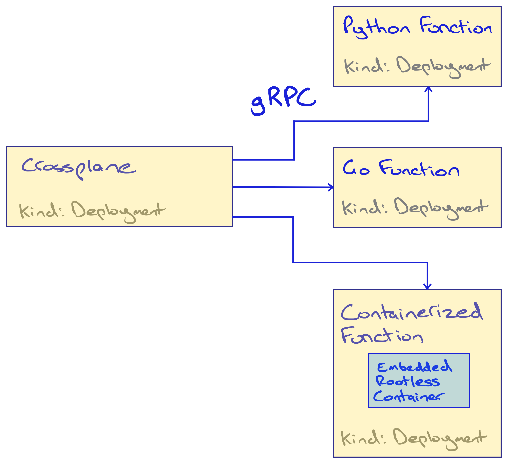
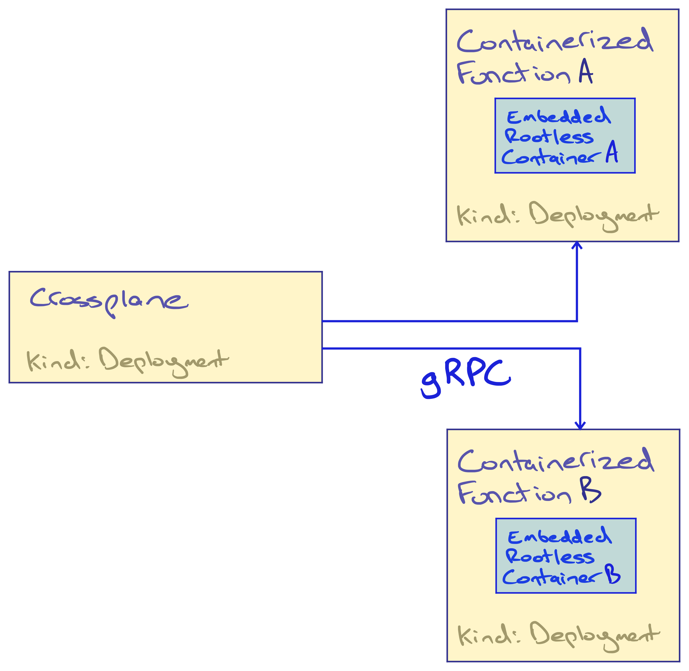

 # Composition Functions: Beta

* Owners: Nic Cope (@negz)
* Reviewers: Hasan Turken (@turkenh), Jared Watts (@jbw976)
* Status: Accepted

## Background

Crossplane is a framework for building cloud native control planes. These
control planes sit one level above the cloud providers and allow you to
customize the APIs they expose. Platform teams use Crossplane to offer the
developers they support simpler, safer, self-service interfaces to the cloud.

To build a control plane with Crossplane you:

1. Define the APIs you’d like your control plane to expose.
1. Extend Crossplane with support for orchestrating external resources (e.g.
   AWS).
1. Configure which external resources to orchestrate when someone calls your
   APIs.

Crossplane offers a handful of extension points that layer atop each other to
help make this possible:

* Providers extend Crossplane with Managed Resources (MRs), which are high
  fidelity, declarative representations of external APIs. Crossplane reconciles
  MRs by orchestrating an external system (e.g. AWS).
* Configurations extend Crossplane with Composite Resources (XRs), which are
  essentially arbitrary APIs, and Compositions. Crossplane reconciles XRs by
  orchestrating MRs. Compositions teach Crossplane how to do this.

The functionality enabled by XRs and Compositions is typically referred to as
simply Composition. Support for Composition was added in Crossplane [v0.10.0]
(April 2020). From our [terminology documentation][term-composition]:

> Folks accustomed to Terraform might think of a Composition as a Terraform
> module; the HCL code that describes how to take input variables and use them
> to create resources in some cloud API. Folks accustomed to Helm might think of
> a Composition as a Helm chart’s templates; the moustache templated YAML files
> that describe how to take Helm chart values and render Kubernetes resources.

A Crossplane `Composition` consists of an array of one or more 'base'
resources. Each of these resources can be 'patched' with values derived from the
XR. The functionality enabled by a `Composition` is intentionally limited - for
example there is no support for conditionals (e.g. only create this resource if
the following conditions are met) or iteration (e.g. create N of the following
resource, where N is derived from an XR field).

Below is an example `Composition`:

```yaml
apiVersion: apiextensions.crossplane.io/v1
kind: Composition
metadata:
  name: example
spec:
  compositeTypeRef:
    apiVersion: database.example.org/v1alpha1
    kind: AcmeCoDatabase
  resources:
  - name: cloudsqlinstance
    base:
      apiVersion: database.gcp.crossplane.io/v1beta1
      kind: CloudSQLInstance
      spec:
        forProvider:
          databaseVersion: POSTGRES_9_6
          region: us-central1
          settings:
            tier: db-custom-1-3840
            dataDiskType: PD_SSD
    patches:
    - type: FromCompositeFieldPath
      fromFieldPath: spec.parameters.storageGB
      toFieldPath: spec.forProvider.settings.dataDiskSizeGb
```

The goals of the Crossplane maintainers in designing Composition were to:

* Empower platform teams to provide a platform of useful, opinionated
  abstractions.
* Enable platform teams to define abstractions that may be portable across
  different infrastructure providers and application runtimes.
* Enable platform teams to share and reuse the abstractions they define.
* Leverage the Kubernetes Resource Model (KRM) to model applications,
  infrastructure, and the product of the two in a predictable, safe, and
  declarative fashion using low or no code.
* Avoid imposing unnecessary opinions, assumptions, or constraints around how
  applications and infrastructure should function.

The design document for Composition [captures these goals][composition-design]
using somewhat dated parlance.

Our approach to achieving our goals was heavily informed by Brian Grant’s
[Declarative application management in Kubernetes][declarative-app-management].
Brian’s document is an excellent summary of the gotchas and pitfalls faced by
those attempting to design new configuration management tools, informed by his
experiences designing Kubernetes, its precursor Borg, and many generations of
configuration languages at Google, including [BCL/GCL][bcl]. In particular, we
wanted to:

* Avoid organically growing a new configuration Domain Specific Language (DSL).
  These languages tend to devolve to incoherency as stakeholders push to “bolt
  on” new functionality to solve pressing problems at the expense of measured
  design. Terraform’s DSL [supporting the count argument in some places but not
  others][terraform-count] is a great example of this. Inventing a new DSL also
  comes with the cost of inventing new tooling to test, lint, generate, etc,
  your DSL.
* Stick to configuration that could be modeled as a REST API. Modeling
  Composition logic as a schemafied API resource makes it possible to validate
  that logic and provide feedback to the platform team at configuration time. It
  also greatly increases interoperability thanks to broad support across tools
  and languages for interacting with REST APIs.

It was also important to avoid the “worst of both worlds” - i.e. growing a new,
fully featured DSL modeled as a REST API. To this end we omitted common language
features such as conditionals and iteration. Our rationale being that these
features were better deferred to a General Purpose Programming Language (GPL) or
a mature, existing configuration DSL, with an established ecosystem of tooling
and documentation.

Since its inception the Crossplane maintainers’ vision has been that there
should essentially be two variants of Composition:

* For simple cases, use contemporary "Patch and Transform" (P&T) Composition.
* For advanced cases, use your DSL or GPL of choice.

Note that the Composition logic (whether P&T, DSL, or GPL) is always "behind the
API line" (behind an XR). This means the distinction is only important to the
people _authoring_ the Compositions, never to the people consuming them.

In the time since P&T Composition became available we've seen that:

* Folks want to use Composition for more complex cases than we anticipated. Many
  XRs fan out into tens of composed resources, sometimes nested.
* Many Compositions call for a high level of expressiveness - conditionals,
  iteration, merging data from multiple fields, etc.
* The lack of a more expressive alternative to P&T Composition _has_ set us down
  the path of organically growing a new DSL. (e.g. [#1972], [#2352], [#4051],
  [#3917], [#3919], [#3989], [#3498], [#3458], [#3316], [#4036], [#4065],
  [#4026])
* Organically growing a new DSL is not only undesirable, but _slow_. Because
  each addition to P&T Composition changes Crossplane's core API we must be
  careful about what we accept. Changes take a long time to reach consensus.
  They're coupled to Crossplane's release cycle, which means changes can take a
  long time to become available, and aren't backported to older versions.
* How folks would ideally configure Composition varies. Some folks prefer a
  particular configuration DSL, others look for webhooks written in a GPL, etc.

To address these issues, we added support for 'Composition Functions' in
Crossplane v1.11. Functions are an alpha feature and are off by default. In the
[alpha design][alpha-design] we proposed that how a Function was implemented
could vary in at least two ways:

* By `type` - i.e. `type: Container`, `type: Webhook`.
* By "runner" implementation - i.e. how a `type: Container` Function is run.

We implemented a "default" or "reference" `type: Container` Function runner with
known scalability and compatibility constraints, but didn't lay out a clear path
for others to build alternative Function runners. Since alpha, no alternative
Function runners have appeared.

The aforementioned limitations of the reference Function runner lead to a demand
to support webhook Functions as an alternative. Ultimately we were reluctant to
support this because it fragments the Function ecosystem. When a Function can be
an OCI container or a webhook (or more in future?) there is no one artifact that
constitutes "a Function". This makes discovery and distribution of Functions
more complicated than we would like.

This document is an iteration on (and supersedes) the [previous design
document][alpha-design] based on what we've learned since the feature was
launched. In particular, it is motivated by the desire to identify a single kind
of Function artifact suitable for most people - similar to Providers.

## Goals

The proposal put forward by this document should:

* Support 'advanced' composition logic such as loops and conditionals.
* Let folks specify composition logic in their DSL or GPL of choice.
* Make it easy to extend Crossplane with new ways to 'do composition'.
* Decouple adding new ways to 'do composition' from the core release cycle.
* Make it easy to discover and share new ways to 'do composition'.
* Be possible to keep behind a feature flag until it is generally available.

## Proposal

This document proposes that a new `mode` field be added to the existing
`Composition` type. A Composition in `mode: Pipeline` must specify a `pipeline`
- an array of Function calls. This array of Functions would be called in order
to determine how an XR should be composed. The array of Functions acts as a
pipeline; the output of each Function is passed as the input to the next. The
output of the final Function call tells Crossplane what must be done to
reconcile the XR.

When in `mode: Pipeline` the `resources` and `patchSets` fields of a
Composition's spec are ignored. Put otherwise, a Composition must specify
P&T-style `resources`, or a `pipeline`. It cannot specify both. The new `mode`
field must be optional. The default value is `mode: Resources`, which honors
(only) the P&T `resources` as do GA Compositions today.

```yaml
apiVersion: apiextensions.crossplane.io/v2alpha1
kind: Composition
metadata:
  name: example
spec:
  compositeTypeRef:
    apiVersion: database.example.org/v1
    kind: XPostgreSQLInstance
  # This Composition uses a pipeline of Functions instead of (P&T) resources.
  mode: Pipeline
  pipeline:
    # Each step in the pipeline calls one Composition Function.
  - step: compose-xr-using-go-templates
    # The functionRef tells the Composition which Function to call. Crossplane
    # passes the desired and observed state of the XR and any existing composed
    # resources as 'arguments' to the Function call.
    functionRef:
      name: go-templates
    # A Function call may optionally accept input. Think of this like an
    # additional, optional argument to the Function call. The input is a nested
    # KRM resource - i.e. it has an apiVersion and kind.
    input:
      apiVersion: example.org/v1
      kind: GoTemplate
      source: Remote
      remote: git://github.com/example/my-xpostgresql-go-templates
    # A pipeline can have multiple steps. Each step is processed in order. This
    # validation step is passed the desired state accumulated by the prior step.
  - step: validate-composed-resources
    functionRef:
      name: cel-validation
```

The updated API would affect only the `Composition` type - no changes would be
required to the schema of `CompositeResourceDefinitions`, XRs, etc.

Notably the Functions would not need to be responsible for interacting with the
API server to create, update, or delete composed resources. Instead, they
instruct Crossplane which resources should be created, updated, or deleted.
Under the proposed design Functions could also be used for purposes besides
rendering composed resources, for example validating the results of earlier
Functions in the `pipeline`.

Before you can use a Function, you must install it. Installing a Function works
just like installing a Provider:

```yaml
apiVersion: pkg.crossplane.io/v1beta1
kind: Function
metadata:
  name: go-templates
spec:
  package: xpkg.upbound.io/negz/go-templates:v0.1.0
```

The Function package's `metadata.name` corresponds to the `functionRef` in the
previous example Composition. A Composition specifies which Function to run by
referencing the package's name.

### Calling a Function

Despite the name, a 'Function' is actually more like a 'function server'. Under
this proposal, Functions are long-running processes. When you install one, the
package manager deploys it using a Kubernetes Deployment - the same way it would
deploy a Provider.



Crossplane makes a gRPC `RunFunctionRequest` to the Function it wishes to
invoke. The Function should respond with a `RunFunctionResponse`. These RPCs are
defined as follows:

```protobuf
syntax = "proto3";

import "google/protobuf/struct.proto";
import "google/protobuf/duration.proto";

// A FunctionRunnerService is a Composition Function.
service FunctionRunnerService {
  // RunFunction runs the Composition Function.
  rpc RunFunction(RunFunctionRequest) returns (RunFunctionResponse) {}
}

// A RunFunctionRequest requests that the Composition Function be run.
message RunFunctionRequest {
  // Metadata pertaining to this request.
  RequestMeta meta = 1;

  // The observed state prior to invocation of a Function pipeline. State passed
  // to each Function is fresh as of the time the pipeline was invoked, not as
  // of the time each Function was invoked.
  State observed = 2;

  // Desired state according to a Function pipeline. The state passed to a
  // particular Function may have been accumulated by previous Functions in the
  // pipeline.
  State desired = 3;

  // Optional input specific to this Function invocation. A JSON representation
  // of the 'input' block of the relevant entry in a Composition's pipeline.
  optional google.protobuf.Struct input = 4;
}

// A RunFunctionResponse contains the result of a Composition Function run.
message RunFunctionResponse {
  // Metadata pertaining to this response.
  ResponseMeta meta = 1;

  // Desired state according to a Function pipeline. Functions may add desired
  // state, and may mutate or delete any part of the desired state they are
  // concerned with. A Function must pass through any part of the desired state
  // that it is not concerned with.
  State desired = 2;

  // Results of the Function run. Results are used for observability purposes.
  repeated Result results = 3;
}

// RequestMeta contains metadata pertaining to a RunFunctionRequest.
message RequestMeta {
  // An opaque string identifying the content of the request. Two identical
  // requests should have the same tag.
  string tag = 1;
}

// ResponseMeta contains metadata pertaining to a RunFunctionResponse.
message ResponseMeta {
  // An opaque string identifying the content of the request. Must match the
  // meta.tag of the corresponding RunFunctionRequest.
  string tag = 1;

  // Time-to-live of this response. Deterministic Functions with no side-effects
  // (e.g. simple templating Functions) may specify a TTL. Crossplane may choose
  // to cache responses until the TTL expires.
  optional google.protobuf.Duration ttl = 2;
}

// State of the composite resource (XR) and any composed resources.
message State {
  // The state of the composite resource (XR).
  Resource composite = 1;

  // The state of any composed resources.
  map<string, Resource> resources = 2;
}

// A Resource represents the state of a resource.
message Resource {
  // The JSON representation of the resource.
  google.protobuf.Struct resource = 1;

  // The resource's connection details.
  // 
  // * Crossplane will set this field in a RunFunctionRequest to communicate the
  //   the observed connection details of a composite or composed resource.
  //
  // * A Function should set this field in a RunFunctionResponse to indicate the
  //   desired connection details of the composite resource.
  //
  // * A Function should not set this field in a RunFunctionResponse to indicate
  //   the desired connection details of a composed resource. This will be
  //   ignored.
  map<string, bytes> connection_details = 2;

  // Ready indicates whether the resource should be considered ready.
  // 
  // * Crossplane will never set this field in a RunFunctionRequest.
  //
  // * A Function should set this field to READY_TRUE in a RunFunctionResponse
  //   to indicate that a desired composed resource is ready.
  //
  // * A Function should not set this field in a RunFunctionResponse to indicate
  //   that the desired composite resource is ready. This will be ignored.
  Ready ready = 3;
}

// Ready indicates whether a composed resource should be considered ready.
enum Ready {
  READY_UNSPECIFIED = 0;

  // True means the composed resource has been observed to be ready.
  READY_TRUE = 1;

  // False means the composed resource has not been observed to be ready.
  READY_FALSE = 2;
}

// A Result of running a Function.
message Result {
  // Severity of this result.
  Severity severity = 1;

  // Human-readable details about the result.
  string message = 2;
}

// Severity of Function results.
enum Severity {
  SEVERITY_UNSPECIFIED = 0;

  // Fatal results are fatal; subsequent Composition Functions may run, but
  // the Composition Function pipeline run will be considered a failure and
  // the first fatal result will be returned as an error.
  SEVERITY_FATAL = 1;

  // Warning results are non-fatal; the entire Composition will run to
  // completion but warning events and debug logs associated with the
  // composite resource will be emitted.
  SEVERITY_WARNING = 2;

  // Normal results are emitted as normal events and debug logs associated
  // with the composite resource.
  SEVERITY_NORMAL = 3;
}
```

This RPC is essentially the `RunFunctionRequest` from the [alpha Functions
design][alpha-design] with the [`FunctionIO`][functionio-schema] elevated from
opaque YAML-encoded bytes to 'native' RPC code. Kubernetes resources are
represented using the [`google.protobuf.Struct` well-known
type][google-protobuf-struct], which can encode arbitrary JSON.

Some key differences between the alpha `FunctionIO` and the proposed beta
`RunFunctionRequest`:

* `observed.resources` and `desired.resources` are a map keyed by resource name,
  not an array of objects with name fields. The previous pattern was a result of
  `FunctionIO` attempting to be an idiomatic KRM object, which is not a
  constraint for `RunFunctionRequest`. This is should make it easier to lookup
  resources by name when developing Functions.
* Entries in `desired.resources` can no longer return 'derived' connection
  secrets or readiness checks, similar to an entry in the P&T resources array.
  Instead a Function is intended to set XR connection details and/or readiness
  by mutating them directly.

The package manager is responsible for creating a headless Kubernetes Service
where each Function's Deployment can be reached. The address of the Service will
be exposed as the `status.endpoint` of the active FunctionRevision resource. The
Service must be headless in order for Crossplane's gRPC client to load-balance
connections when there are multiple Function replicas.

Note that the fact this endpoint is powered by a Service is an implementation
detail; it may be possible for Functions to be reached (and indeed deployed) by
other means in future (see [Runtime Configuration](#runtime-configuration)).

```yaml
apiVersion: pkg.crossplane.io/v1beta1
kind: Function
metadata:
  name: go-templates
spec:
  package: xpkg.upbound.io/negz/go-templates:v0.1.0
status:
  # The gRPC endpoint where Crossplane will send RunFunctionRequests.
  endpoint: https://go-templates-9sdfn2
```

gRPC communication between Crossplane and a Function will be secured by mutual
transport layer security (mTLS). Crossplane has an established pattern for
setting up mTLS certificate bundles - we do this today to secure communication
between the API server and our validation webhooks, and between Crossplane and
External Secret Stores. We might want to [rethink this][cert-per-entity] in
future, but to begin with we'll stick with the established pattern, i.e.:

* The Helm chart creates an empty Secret for the client bundle.
* The core init container bootstraps the client bundle.
* The package manager creates a Secret for each Function's server bundle.
* The package manager bootstraps each Function's server bundle.

See [#3884] for an example of this pattern.

The frequency with which Crossplane will call each Function is relative to how
frequently each XR is reconciled. There are two main triggers to reconcile an XR:

1. A watch-triggered reconcile, i.e. because the XR changed.
2. A poll-triggered reconcile, by default once per 60 seconds.

XRs rely on poll-triggered reconciliation to promptly correct drift of their
composed resources. The poll interval can be set using the `--poll-interval`
flag. The XR controller does not know what kinds of resources it will compose
when started, so it cannot start a watch for them.

Note that there is no watch on the Composition type. XRs consume a Composition
via a CompositionRevision. Each time the Composition changes a new revision is
created. The XR is pinned to a specific revision of a Composition until it is
updated to consume a new one. This update would trigger a reconcile due to the
watch on the XR.

Assume:

* There are 100 XRs, all of the same type, and all using the same Composition.
* The XRs have all reached a steady state, polling at the default 60s frequency.
* The Composition includes 1 Function call.

In this case the Function would be called __100 * 1 = 100 times per 60s__.

Most gRPC server implementations can serve multiple requests concurrently. For
example in Go [each RPC is invoked in its own goroutine][go-grpc-concurrency].
The gRPC project maintains a [suite of benchmarks][grpc-benchmarks]. At the time
of writing these benchmarks show that an 8-core Python server can serve ~3,500
trivial requests per second, while an 8-core Go server can serve ~180,000 per
second. This should be considered a ceiling rather than indicative of real-world
Function performance. In practice the throughput of a particular Function will
be determined by the language it's written in, and what it does.

Inevitably some Functions will be called frequently enough to exhaust the
processing capacity of a single pod. A few potential approaches are possible to
scale Functions include:

* Tune the `--poll-interval`, e.g. to every 5m or 10m, to reduce calls.
* Scale heavily used Functions horizontally, by increasing Deployment replicas.
* Cache the responses of deterministic Function calls (see [Caching](#caching)).
* Eliminate poll-triggered XR reconciliation to reduce calls (see [Dynamic
  Composed Resource Watches](#dynamic-composed-resource-watches)).

### Developing a Function

I believe it's critical that Composition Functions are easy to develop - much
easier than developing a Crossplane Provider.

Not everyone will want or need to develop Functions. Some Functions will be
_generic_. A generic Function would be able to work with any kind of XR.
Consider for example a `go-templates` Function that effectively "outsourced" the
entire Composition logic of an XR to a set of Go templates - a familiar
authoring experience to anyone who has used Helm.

Despite the potential for generic Functions, I feel it must be easy to "roll
your own" because:

* We want to make it really easy to make new generic Functions! The easier
  Functions are to build, the more community members can contribute to the
  ecosystem.
* Sometimes there won't be a perfect Function for your unique use-case. The
  easier Functions are to build, the more likely you are to be able to help
  yourself.
* Some folks just _prefer_ to configure how to take an XR and produce a set of
  composed resources using the expressiveness and familiarity of a
  general-purpose programming language. The more complex your Composition logic
  becomes, the more appealing this approach is.

I propose we do three things to make Functions easy to develop:

1. Provide SDKs for popular languages - e.g. Go, Python, TypeScript.
2. Provide tooling to scaffold, build, push, and test Functions.
3. Support providing Function logic as an OCI container that runs to completion.

Consider this section a medium-resolution sketch of the Function development
experience. Likely each of these components (tooling, SDKs, etc) warrant at
least a one-pager of their own, and they may not look exactly as proposed here.
This section intends only to paint a picture of what Functions enable.

#### Use Language SDKs

Consider for example the following experience for writing a Go Function. Keep in
mind a similar experience would also exist for other languages.

```shell
# Initialize a new Function that uses the Go SDK.
$ kubectl crossplane init function --template="github.com/crossplane/fn-template-go"

# This generates boilerplate that uses the Go SDK.
$ ls
crossplane.yaml  fn.go  fn_test.go  go.mod  main.go

# At a minimum you need to add your Function logic to fn.go
vim fn.go
```

Note that Functions have package metadata (in `crossplane.yaml` by convention)
just like a Provider or Configuration. A Function may declare dependencies - for
example a Function could depend on a Provider to indicate that it composes that
Provider's MRs.

After you initialize a Function using the Go SDK you must update fn.go to
provide your composition logic. When you first open fn.go you’ll see that
`kubectl crossplane init function` added boilerplate like this:

```go
package main

import (
    "context"

    function "github.com/crossplane/fn-sdk-go"
    "github.com/crossplane/fn-sdk-go/pb"
    "github.com/crossplane/fn-sdk-go/errors"
)

// Function defines the logic of your Function.
func Function(ctx context.Context, req *pb.RunFunctionRequest) (*pb.RunFunctionResponse, error) {
  // Get the desired XR from the request.
  xr := function.NewEmptyCompositeResource()
  if err := function.GetCompositeResource(req, xr); err != nil {
      return errors.Wrap(err, "could not get composite resource")
  }

  // TODO: Replace this with your function logic. :)
  rsp := function.NewResponseTo(req)
  function.Normalf(rsp, "successfully read desired composite resource %q", xr.GetName())

  return rsp, nil
}
```

To write a Function, replace the boilerplate with your own logic. Here’s an
example that uses a mockup of a Go SDK to achieve the same goal as lab 4 from
[the Kubecon EU ContribFest][kubecon-eu-contribfest].

```yaml
apiVersion: contribfest.crossplane.io/v1alpha1
kind: XRobotGroup
metadata:
  name: somename
spec:
  count: 5
```

This example takes an `XRobotGroup` XR and uses its `spec.count` to compose the
desired number of Robot resources:

```go
package main

import (
    "context"
    "fmt"
    "math/rand"

    "github.com/upbound/provider-dummy/apis/iam/v1alpha1"

    function "github.com/crossplane/fn-sdk-go"
    "github.com/crossplane/fn-sdk-go/pb"
    "github.com/crossplane/fn-sdk-go/errors"
)

var colors = []string{"red", "green", "blue", "yellow", "orange"}

// Function defines the logic of your Function.
func Function(ctx context.Context, req *pb.RunFunctionRequest) (*pb.RunFunctionResponse, error) {
  // Get the desired XR from the request.
  xr := function.NewEmptyCompositeResource()
  function.GetCompositeResource(req, xr)

  // Get the desired resource count from the XR.
  count, err := xr.GetInteger("spec.count")
  if err != nil {
      return errors.Wrap(err, "could not get desired resource count")
  }

  // Create a response to return. This deep-copies any existing desired state.
  rsp := function.NewResponseTo(req)

  // Ensure the desired number of robots exist.
  for i := 0; i < int(count); i++ {
      name := fmt.Sprintf("robot-%d")

      // Get the desired composed resource (if any) from the request.
      // Since we're using Go we can import and work with API types if we want.
      robot := &v1alpha1.Robot{}
      function.GetComposedResource(req, name, robot)

      // The robot's external name should be derived from the XR's.
      function.SetExternalName(robot, fmt.Sprintf("%s-%s", function.GetExternalName(xr), name))

      // Give this robot a random color!
      if robot.Spec.ForProvider.Color != "" {
          c := colors[rant.Intn(len(colors))]
          robot.Spec.ForProvider.Color = c

          // Add a result indicating that we set the color. Crossplane will
          // surface this as a Kubernetes event and a debug log.
          function.Normalf(rsp, "set robot %q color to %q", name, c)
      }

      // Set our new desired robot state. This will be a no-op if our robot
      // already existed.
      function.SetComposedResource(rsp, name, robot)
  }

  return rsp, nil
}
```

The goals of a Composition Function SDK are to:

* Eliminate boilerplate - make it feel like writing a function, not a server.
* Expose an API that makes writing Functions intuitive and self-documenting.
* Steer Function authors toward best practices, and away from anti-patterns.

This mockup only touches on very basic functionality. A fully featured SDK would
cover more use cases - for example reading Function-specific input and working
with connection details.

Once you’ve written your Function code you can test it using the tooling for
your chosen language - in this case `go test`. `kubectl crossplane` would create
boilerplate for unit tests.

You build and push a Function just like you would a Provider or Configuration.
There are already GitHub Actions that allow this to be done as part of a CI/CD
pipeline.

```shell
# Building the Function produces an installable Function package.
$ kubectl crossplane function build

# Push the package to any OCI registry.
$ kubectl crossplane function push xpkg.upbound.io/negz/function-many-robots:v0.1.0
```

Note that leveraging gRPC makes it possible to generate server stubs for [many
languages][grpc-supported-languages]. I would not consider these server stubs to
be 'an SDK' - they don't make writing Functions intuitive and self-documenting,
or steer Function authors toward best practices. They do however go a long way
toward eliminating boilerplate, including generating language-specific
representations of a `RunFunctionRequest` and `RunFunctionResponse`.

#### Use an OCI Container

In the [alpha iteration of Composition Functions][alpha-design] all Functions
are binaries that run to completion. These processes are packaged as an OCI
container. A sidecar container in the Crossplane pod - `xfn` - runs each of them
in a rootless container.

This doesn't scale very well, but it does offer a way to build a Function for
folks who don't want to write code; you can get a long way just using a tool
like https://github.com/mikefarah/yq. It also offers a way to build Functions in
languages that don't have a 'first class' SDK available. Think of this like AWS
Lambda, which supports 9-10 first class languages, and OCI containers as a
catch-all for everything else.

I propose we move the `xfn` Function runner out of crossplane/crossplane,
simplify it, and offer it as an alternative way to build a Function. You could
think of this as a special kind of Composition Function SDK that builds a
Composition Function from an OCI container, rather than building a Function a
literal _function_ (e.g. written in Go).



Under this design each containerized Function is "wrapped" in an `xfn`-like
Composition Function. This means each Function exists as its own Deployment.

This design merges the Protobuf `RunFunctionRequest` with the YAML `FunctionIO`
types from the alpha design, so instead of reading a `FunctionIO` from stdin a
containerized Function would read a JSON-encoded `RunFunctionRequest`, and write
a `RunFunctionResponse` to stdout.

Building a containerized Function would work as follows.

Start with a simple container that reads a JSON `RunFunctionRequest` on stdin
and writes a JSON `RunFunctionResponse` to stdout. This one simply adds a label
(credit to @pedjak in https://github.com/crossplane/crossplane/issues/4293) for
the idea).

```Dockerfile
FROM alpine:3.18
RUN apk add --no-cache jq
ENTRYPOINT ["/bin/sh", "-c", "jq '(.desired.resources[] | .resource.metadata.labels) |= {\"labelizer.xfn.crossplane.io/processed\": \"true\"} + .' | .desired"]
```

Then build a Function from the image. We want the image to run in its own
container, not the Function container. This allows the OCI container to run
within its own namespaces without interfering with (or being interfered with by)
the `xfn`-like 'adaptor'. To do this we bake the container into the Function
artifact:

```shell
# Build your OCI image.
$ docker build .
Successfully built 202dc6e5df4c

# Save your OCI image to a tarball.
$ docker save | gzip > function.tgz

# Add some package metadata for your Function.
$ vim crossplane.yaml

# Build a Function from the tarball.
$ kubectl crossplane function build --from-oci-tarball=function.tgz

# Push the package to any OCI registry.
$ kubectl crossplane function push xpkg.upbound.io/negz/function-labelizer:v0.1.0
```

The `function build --from-oci-tarball` command creates a Function powered by an
`xfn`-like adaptor that:

1. Prepares an OCI runtime bundle from the supplied tarball at startup.
2. Listens for `RunFunctionRequest` RPCs.
3. Prepares `RunFunctionResponse` RPCs by using an OCI runtime (e.g. `crun`) to
   invoke the embedded Function in a rootless container.

Note that most of this functionality already exists in `xfn`. This makes it
cheap enough to implement this Function variant that I believe it's worth doing,
even if it ends up covering a relatively niche case.

### Installing a Function

Before you can use a Function, you must install it. Installing a Function works
just like installing a Provider:

```yaml
apiVersion: pkg.crossplane.io/v1beta1
kind: Function
metadata:
  name: go-templates
spec:
  package: xpkg.upbound.io/negz/go-templates:v0.1.0
```

Like any other package, the Function type will have a corresponding
FunctionRevision type. The package manager will reconcile the active revision by
creating a Deployment - similar to how it installs a Provider.

Functions can have and be dependencies, just like a Provider or Configuration.
For example a Configuration could depend on the Functions its Compositions use,
and a Function could depend on the Providers and Configurations whose resources
it will compose.

### Calling a Function

Composition Functions are very flexible, so the user experience could vary a
lot. However the general pattern is:

1. Find (or build!) a Function you want to use.
2. Install the Function using the package manager.
3. Reference the Function in a Composition.
4. Provide Function input in the Composition, where necessary.

Again, consider this section a medium-resolution sketch of the Function
experience. The generic Functions demonstrates here don't actually exist (yet!).
They may not look exactly as proposed here. This section intends only to paint a
picture of what Functions enable.

Consider the hypothetical generic "Go templates" Function put forward at the
[beginning of this proposal](#proposal). Such a Function would make it possible
to write a Composition that used familiar, Helm-like moustache templates with
support for iteration and conditionals.

If we take the [contribfest][kubecon-eu-contribfest] example again, this might
look something like this:

```yaml
apiVersion: apiextensions.crossplane.io/v2alpha1
kind: Composition
metadata:
  name: example
spec:
  compositeTypeRef:
    apiVersion: database.example.org/v1
    kind: XPostgreSQLInstance
  mode: Pipeline
  pipeline:
  - step: compose-xr-using-go-templates
    functionRef:
      name: go-templates
    input:
      apiVersion: example.org/v1
      kind: GoTemplate
      source: Inline  # Or Remote, if you want to pull templates from git.
      inline: |
        {{- range $i := until ( . desired.composite.resource.spec.count ) }}
        ---
        apiVersion: iam.dummy.upbound.io/v1alpha1
        kind: Robot
        metadata:
          annotations:
            crossplane.io/external-name: {{ .desired.composite.resource | getExternalName }}-robot-{{ $i }}
        spec:
          forProvider:
          {{- if $i | printf "robot-%d" | getComposedResource }}
            # This resource already exists - use the same color.
            color: {{ .spec.forProvider.color }}
          {{ else }}
            # The robot doesn't exist. Pick a new color.
            color: {{ randomChoice "red" "green" "blue }}
          {{- end }}
        {{- end }}
```

This example is functionally identical to [the Go example](#use-language-sdks),
but uses a DSL - Go templates with http://masterminds.github.io/sprig/ and a
few Crossplane-specific Functions.

Here's another example of a generic Function. This one lets Composition authors
express their Composition logic in arbitrary, inline [Starlark][starlark].

```yaml
apiVersion: apiextensions.crossplane.io/v2alpha1
kind: Composition
metadata:
  name: example
spec:
  compositeTypeRef:
    apiVersion: database.example.org/v1
    kind: XPostgreSQLInstance
  mode: Pipeline
  pipeline:
  - step: compose-xr-using-go-templates
    functionRef:
      name: starlark
    input:
      apiVersion: example.org/v1
      kind: StarlarkScript
      script: |
        # main is passed a RunFunctionRequest as a (Python-like) dictionary.
        # It must return a RunFunctionResponse-shaped dictionary.
        def main(req):
          rsp = {desired=req["desired"]}
          xr = req["observed"]["composite"]["resource"]

          for i in range(int(xr["spec"]["count"])):
            name = "robot-{}".format(i)

            # We already created this one during a previous reconcile.
            if name in req["observed"]["resources"]:
              rsp["desired"]["resources"][name] = req["observed"]["resources"][name]
              continue

            # This robot should exist, but doesn't.
            rsp["desired"]["resources"][name] = {
              "resource": {
                "apiVersion": "iam.dummy.upbound.io/v1alpha1",
                "kind": "Robot",
                "metadata": {
                  "annotations": {
                    "crossplane.io/external-name": "{parent}-robot-{number}".format(
                      parent=xr["metadata"]["annotations"]["crossplane.io/external-name"],
                      number=i,
                    )
                  },
                },
                "spec": {
                  "forProvider": {
                    # Starlark is deterministic so these Robots are always purple. :)
                    "color": "purple",
                  },
                },
              }
            }

          return rsp
```

Starlark is a (very) limited dialect of Python designed for configuration. It
embeds into many languages, including Go. This makes it a great candidate to
build a generic Function that allows Composition authors to provide _inline_
logic in a general-purpose-ish programming language. This is similar to the
["GitHub Script"][github-script] GitHub Action that lets you plug some arbitrary
logic into a GitHub Action pipeline when no existing Action does quite what you
need.

#### Iterating on Compositions

Getting fast feedback on a Crossplane Composition has historically been a pain
because the Composition logic has been encapsulated in a Kubernetes controller.
In order to know whether your Composition works as intended you need to:

1. Deploy (the right version of!) Crossplane to a Kubernetes cluster.
2. Install Providers and Configurations for any resources you want to compose.
3. Apply your XRD and Composition (potentially via a Configuration).
4. Create an XR (or claim).
5. See whether it works.

Moving Composition logic out of Crossplane and into versioned Functions makes it
a lot easier to test and iterate on, client-side. For example a `function test`
command could test a single Function in isolation:

```shell
# Test a single Function by passing it a JSON RunFunctionRequest. This pulls and
# starts the Function, makes the request, stops it, then returns the result.
$ kubectl crossplane function test xpkg.upbound.io/negz/go-templates:v0.1.0 run-function-request.json
{
  # JSON encoded RunFunctionResponse omitted for brevity.
}
```

You could similarly imagine a more holistic, `helm template`-like experience
that locally rendered an entire Composition by pulling and running its templates
locally:

```shell
$ kubectl crossplane composition render composition.yaml xr.yaml
---
# YAML stream omitted for brevity.
```

Assuming a 'pure' Composition consisting only of Functions with no P&T
resources, this command would need only to iterate through the Composition's
`pipeline`, and for each Function:

1. Pull and start it.
2. Form a `RunFunctionRequest` from the XR and any prior `RunFunctionResponse`.
3. Print the `desired` block of final `RunFunctionResponse` as a YAML stream.

This isn't quite an end-to-end test of Composition. The composed resources are
not actually created and reconciled with an external system, so its not possible
for example to derive XR status from composed resource status. (Though that
could perhaps be simulated by providing fake observed resources.) It's also not
possible in isolation to determine whether the rendered composed resources are
schematically valid. It does however give you a good idea of whether your
Composition will produce the set of composed resources that you'd expect - just
like `helm template`.

The advantage of Functions in this regard is that the `composition render`
command would need to duplicate much less code from the Crossplane Composition
controller than if it were to try to recreate Crossplane's hardcoded P&T logic.

## Future Improvements

The following functionality is out-of-scope for the beta implementation, but may
be added in future.

### Function Input Custom Resources

In the current alpha implementation of Functions, and this design, Function
input is a custom-resource-like inline resource (i.e. an
`x-kubernetes-embedded-resource`):

```yaml
  pipeline:
  - step: compose-xr-using-go-templates
    functionRef:
      name: starlark
    input:
      apiVersion: example.org/v1
      kind: StarlarkScript
      script: ...
```

In future it may be useful for a Function to be able to deliver this type as a
custom resource definition (CRD). This would allow a single input to be more
easily shared by multiple Compositions. A Composition could reference a Function
input custom resource:

```yaml
  pipeline:
  - step: compose-xr-using-go-templates
    functionRef:
      name: starlark
    inputRef:
      apiVersion: example.org/v1
      kind: StarlarkScript
      name: make-some-purple-robots
```

At this stage I suggest holding off on building this functionality until there
is clear demand. 

### Metrics and Tracing

Crossplane does not currently expose its own metrics. It relies on [the set
it gets from controller-runtime][controller-runtime-metrics], and metrics that
may be [derived from the Kubernetes events it emits][event-exporter-metrics].

These metrics pertain to Kubernetes controllers, and will be insufficient when a
significant portion of Composition logic is 'outsourced' to Functions. It will
be important to establish a pattern for instrumenting Functions (e.g. as part of
the Function SDKs). Request tracing in particular is likely to be useful in
order to debug slow or failing Functions in a pipeline.

Metrics and tracing for Functions must be implemented before the feature becomes
generally available (GA).

### Caching

The API proposed by this design accommodates caching. The `RunFunctionRequest`
includes a `meta.tag` field. The tag identifies a unique Function input. How the
tag is generated is up to the caller (i.e. Crossplane), but two functionally
identical Function inputs should have the same tag. A Function can optionally
signal that its response is valid for the same input for a period of time by
returning a non-zero `meta.ttl`. This allows Crossplane (or an intermediary such
as a reverse proxy) to cache the responses of deterministic and side-effect-less
Functions.

Building caching support is not in scope for beta. This will likely prove to be
a requirement for GA.

### Dynamic Composed Resource Watches

Ideally XR reconciliation would be purely watch-triggered - this would result in
less work for the XR controller, and far fewer Function calls.

The XR controller currently watches the XR type, but is also poll-triggered, by
default polling desired state every 60 seconds. This interval can be changed by
the `--poll-interval` flag. The XR reconciler is poll-triggered because it wants
to know when composed resources change, in order to correct drift.

An XR controller doesn't know what kinds of resources it will compose at start
time, which is typically when a controller's watches are configured.
Furthermore, two different XRs of the same kind might compose completely
different types of resources due to using different Compositions.

This is something we should revisit regardless of Functions. For example it may
be possible to:

1. Make one controller responsible (only) for selecting a Composition for an XR.
2. Start another controller for every unique (XR, Composition) tuple.
3. Restart the (XR, Composition) controller whenever the XR's
   `spec.resourceRefs` changes, watching all referenced types.

### Runtime Configuration

This design proposes Functions be long-running processes, installed by the
package manager. Deploying Functions as Kubernetes Deployments (with Services,
Service Accounts, etc) will no doubt necessitate something like a Provider's
ControllerConfig type.

We've identified that we [don't want to proceed][controllerconfig-deprecation]
with ControllerConfig, but don't yet have a suitable alternative. Rather than
propagating a ControllerConfig-like pattern I propose we prioritize finding an
alternative. I intend to open a separate, simultaneous design to address this
since it will affect Provider packages as well as Functions.

### Patch-and-Transform as a Function

A key benefit of Functions is that composition logic is decoupled from the core
Crossplane release cycle. Moving composition logic out-of-tree and versioning it
separately from Crossplane allows us to iterate faster, and experiment more
freely.

P&T style Composition could enjoy these benefits if it were not a special case,
and were just another Function. Imagine for example wanting a new type of patch
or a new type of transform and being able to simply fork the implementation to
experiment without affecting everyone who uses Crossplane.

P&T Composition as a Function might look like this:

```yaml
apiVersion: apiextensions.crossplane.io/v1
kind: Composition
metadata:
  name: example
spec:
  compositeTypeRef:
    apiVersion: database.example.org/v1alpha1
    kind: AcmeCoDatabase
  mode: Pipeline
  pipeline:
  - step: patch-and-transform
    functionRef:
      name: patch-and-transform
    input:
      apiVersion: apiextensions.crossplane.io/v1
      kind: Resources
      resources:
      - name: cloudsqlinstance
        base:
          apiVersion: database.gcp.crossplane.io/v1beta1
          kind: CloudSQLInstance
          spec:
            forProvider:
              databaseVersion: POSTGRES_9_6
              region: us-central1
              settings:
                tier: db-custom-1-3840
                dataDiskType: PD_SSD
        patches:
        - type: FromCompositeFieldPath
          fromFieldPath: spec.parameters.storageGB
          toFieldPath: spec.forProvider.settings.dataDiskSizeGb
```

Removing P&T support from the Composition type would be a breaking API change -
not something we could do easily. One approach could be to deprecate and
'freeze' the API, recommending folks who prefer P&T style use the generic P&T
Function instead.

## Alternatives Considered

See the [alpha design document][alpha-design].


[term-composition]: https://crossplane.io/docs/v1.9/concepts/terminology.html#composition
[v0.10.0]: https://github.com/crossplane/crossplane/releases/tag/v0.10.0
[composition-design]: https://github.com/crossplane/crossplane/blob/e02c7a3/design/design-doc-composition.md#goals
[declarative-app-management]: https://docs.google.com/document/d/1cLPGweVEYrVqQvBLJg6sxV-TrE5Rm2MNOBA_cxZP2WU/edit
[bcl]: https://twitter.com/bgrant0607/status/1123620689930358786?lang=en
[terraform-count]: https://www.terraform.io/language/meta-arguments/count
[alpha-design]: defunct/design-doc-composition-functions.md
[#1972]: https://github.com/crossplane/crossplane/pull/1972
[#2352]: https://github.com/crossplane/crossplane/pull/2352
[#4051]: https://github.com/crossplane/crossplane/pull/4051
[#3917]: https://github.com/crossplane/crossplane/pull/3917
[#3919]: https://github.com/crossplane/crossplane/pull/3919
[#3989]: https://github.com/crossplane/crossplane/pull/3989
[#3498]: https://github.com/crossplane/crossplane/pull/3498
[#3458]: https://github.com/crossplane/crossplane/pull/3458
[#3316]: https://github.com/crossplane/crossplane/pull/3316
[#4036]: https://github.com/crossplane/crossplane/issues/4036
[#4065]: https://github.com/crossplane/crossplane/issues/4065
[#4026]: https://github.com/crossplane/crossplane/issues/4026
[google-protobuf-struct]: https://protobuf.dev/reference/protobuf/google.protobuf/#struct
[cert-per-entity]: https://github.com/crossplane/crossplane/issues/4305
[#3884]: https://github.com/crossplane/crossplane/pull/3884
[go-grpc-concurrency]: https://github.com/grpc/grpc-go/blob/master/Documentation/concurrency.md#servers
[grpc-benchmarks]: https://grpc.io/docs/guides/benchmarking/
[functionio-schema]: https://github.com/crossplane/crossplane/blob/v1.12.2/apis/apiextensions/fn/io/v1alpha1/functionio_types.go#L28
[kubecon-eu-contribfest]: https://github.com/crossplane-contrib/contribfest/blob/main/lab-composition-functions/xfn-many/main.go
[grpc-supported-languages]: https://grpc.io/docs/languages/
[starlark]: https://github.com/bazelbuild/starlark/blob/master/spec.md
[github-script]: https://github.com/actions/github-script
[controller-runtime-metrics]: https://book.kubebuilder.io/reference/metrics-reference.html
[event-exporter-metrics]: https://github.com/caicloud/event_exporter
[controllerconfig-deprecation]: https://github.com/crossplane/crossplane/issues/2468