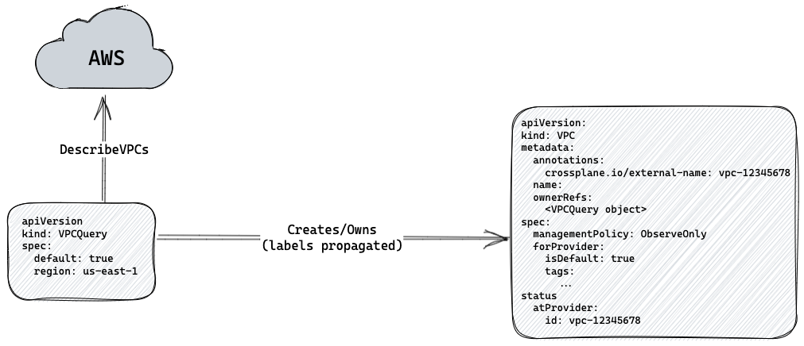

 # Observe Only Resources

* Owners: Hasan Turken (@turkenh)
* Reviewers: Crossplane Maintainers
* Status: Accepted

## Background

When using Crossplane to manage resources, we typically create a Managed
resource that represents the desired state of the resource at a provider.
Crossplane takes ownership of the resource, starts acting as the source of
truth, and ensures configuration matches the desired state.

Sometimes, we want to "observe" an existing resource without taking ownership of
it. This could be useful in several scenarios, which could be grouped as
follows:

- Referencing existing resources without managing them
  - In your managed resource, you want to reference network resources like VPC
  and subnets that are managed by another tool or team. _For example, you want
  to create an RDS instance in Crossplane, but you want it to use an existing
  Subnet Group managed by Terraform._
- Fetching data from existing resources
  - You need information about an existing VPC, such as its CIDR range and the
  subnets it contains. Or, you need to know OIDC information of an existing
  EKS cluster to configure IRSA permissions for your application.
- Gradual migration of existing/legacy infrastructure to Crossplane
  - You have existing infrastructures managed by Terraform, and you want to
  migrate them gradually to Crossplane.
  - You have a legacy infrastructure that you want to migrate to Crossplane,
  but you want to experiment with the managed resources before taking ownership
  of the underlying resources.
  - For an existing resource, you don’t want to provide full configuration
  spec that might override the actual configuration. You want to late-initialize
  all fields, including the ones that would be required otherwise.
- Only observing some fields after the initial creation
  - You want to create an EKS Node Group with a scaling configuration where you
  configured an initial desired size. After the creation, you want to only
  observe changes in the size which is now being controlled by the cluster
  autoscaler.

Currently, Crossplane does not have a built-in way of observing resources
without taking ownership of them. There are two workarounds used by the
community as an interim solution for this gap:

- Using the provider-terraform to observe resources with the help of Terraform
data sources.
- Wrapping resources with provider-kubernetes to observe resources managed by
Crossplane but as a shared object between multiple Compositions.

In this document, we aim to introduce a solution to observe resources with
Crossplane without taking ownership of them.
This would allow users to integrate existing cloud resources with the Crossplane
ecosystem without giving full ownership.

## Goals

- Introduce a way to observe existing resources without taking ownership of them
in Crossplane.
- Enable seamless integration of existing cloud resources with the Crossplane
ecosystem.

### Non-goals

- Partially managing a resource by observing a subset of fields.

This may seem similar to the concept of observing resources, but there is a
fundamental difference. In this scenario, we want to use certain parameters
during the creation of the resource, whereas observing resources is intended to
be a completely read-only operation that should never make any changes to the
external system, including during the creation process.

## Proposal

We will introduce a new `managementPolicy` field in the spec of Managed
Resources with `ObserveOnly` as one of the options. Additionally, we will change
the API of the Managed Resources to include all the fields in the
`spec.forProvider` under the `status.atProvider` to represent the full state of
the resource on the external system. This will enable a clear separation between
the desired state and the observed state of the resource and when the
`managementPolicy` is set to `ObserveOnly`, only `status.atProvider` will be
updated with the latest observation of the resource.

### Management Policy
> [!NOTE]
> The management policy was significantly changed in a
subsequent design for [ignore changes]. Keeping this section for historical
purposes.

To support observing resources without taking ownership, we will introduce a new
spec named `managementPolicy` to the Managed Resources. We will also deprecate
the existing `deletionPolicy` in favor of the new spec since they will be
controlling the same behavior; that is, how should the changes on the CR affect
the external cloud resource.

This new policy will have the following values:

- `FullControl`(Default): Crossplane will fully manage and control the external
resource, including deletion when the CR is deleted
(same as `deletionPolicy: Delete`).
- `OrphanOnDelete`: Crossplane will orphan the external resource when the CR is
deleted (same as `deletionPolicy: Orphan`).
- `ObserveOnly`: Crossplane will only observe the external resource and will not
make any changes or deletions.

As indicated above, `FullControl` and `OrphanOnDelete` policies will behave
precisely the same as the deletion policies we have today, including keeping the
default behavior the same. We will introduce the new behavior with the
`ObserveOnly` option, which would be pretty similar to what we have today to
[import existing managed resources], but instead of starting to manage after
import, we will not make any modifications to the external resource and only
sync status back.

```yaml
apiVersion: ec2.aws.crossplane.io/v1beta1
kind: VPC
metadata:
  annotations:
    crossplane.io/external-name: vpc-12345678
  name: observe-vpc
spec:
  managementPolicy: ObserveOnly
  forProvider:
    region: us-east-1
```

> Note: `spec.forProvider.region` is an identifier field and is required for
> identifying the resource rather than stating the desired state. See the 
> [identifier fields](#identifier-fields) section for more details.

### API Changes - Full State under `status.atProvider`

We will include all the fields in the `spec.forProvider` under the
`status.atProvider` to represent the full state of the resource on the external
system. In other words, the `status.atProvider` will be a superset of the
`spec.forProvider` by including all the fields that are available in the API of
the external resource.

```yaml
apiVersion: ec2.aws.crossplane.io/v1beta1
kind: VPC
metadata:
  annotations:
    crossplane.io/external-name: vpc-12345678
  name: observe-vpc
spec:
  managementPolicy: ObserveOnly
  forProvider:
    region: us-east-1
status:
  atProvider:
    cidrBlock: 172.16.0.0/16
    enableDnsHostNames: false
    enableDnsSupport: true
    instanceTenancy: default
    region: us-east-1
    tags:
      - key: managed-by
        value: terraform
  conditions:
  - lastTransitionTime: "2023-01-26T14:30:19Z"
    reason: ReconcileSuccess
    status: "True"
    type: Synced
```

Please note, the `status.atProvider` will be populated with the full state of
the resource no matter what the `managementPolicy` is. This will also help
identify any drifts between the actual state and the desired state of the
resource for policies other than `ObserveOnly`.

**Late-initialization** of the `spec.forProvider` is an exceptional case that
worth special consideration. We will not do late-initialization when the policy
is `ObserveOnly`, since the primary purpose of it is getting existing defaults
from the cloud provider and using them to represent the full desired state of
the resource under `spec.forProvider` as Managed Resource being the source of
truth. With `ObserveOnly` policy however, this is not the case, and it would be
misleading if resource spec changes after the late-initialization.

### Implementation

Crossplane providers already manage external resources by implementing the
Crossplane runtime's `ExternalClient` interface, which includes the four methods
listed below.

```go
type ExternalClient interface {
	Observe(ctx context.Context, mg resource.Managed) (ExternalObservation, error)
	Create(ctx context.Context, mg resource.Managed) (ExternalCreation, error)
	Update(ctx context.Context, mg resource.Managed) (ExternalUpdate, error)
	Delete(ctx context.Context, mg resource.Managed) error
}
```

We will leverage the fact that we have an already implemented Observe method for
all managed resources by calling only it when the Management Policy is set to
`ObserveOnly`. This will require minor modifications in the Managed Reconciler
code (in the Crossplane Runtime) that will return early in the reconcile loop
and prevent invocation of the other methods, namely, Create, Update and Delete.
These modifications will implement the following logic at a high level:

Right after the `Observe` method invocation, if `ObserveOnly`:

- Return error if the resource does not exist.
- Publish connection details.
- Ignore late-initialization result and never call `client.Update` method to
  update the resource spec.
- Report success and return early.

We will also need the following changes per resource:

- Update the API schema to have all the fields under `spec.forProvider` under
  `status.atProvider` as well.
- Update the `Observe` method implementation to populate the `status.atProvider`
  with the full state of the resource.

#### Feature Gating

Similar to all other new features being added to Crossplane, we will ship this
new policy as an alpha feature that will be off by default and will be
controlled by `--enable-alpha-management-policies` flag in Providers.

This will not prevent the field from appearing in the schema of the managed
resources. However, we will ignore the `spec.managementPolicy` when the feature
is not enabled.

#### Deprecation of `deletionPolicy`

With the new `managementPolicy` covering the existing `deletionPolicy`, we will
deprecate the latter in favor of the former.

Until we drop the `deletionPolicy` from the schema altogether, we need to be
careful with the conflicting combinations shown in the below table which only
exists with deletion:

| Deletion Policy | Management Policy | Should Observe? | Should Create? | Should Update? | Should Delete? |
| --- | --- | --- | --- | --- | --- |
| Delete | Full | Yes | Yes | Yes | Yes |
| Orphan | OrphanOnDelete | Yes | Yes | Yes | No |
| Delete | ObserveOnly | Yes | No | No | Conflict (No) |
| Orphan | Full | Yes | Yes | Yes | Conflict (No) |
| Delete | OrphanOnDelete | Yes | Yes | Yes | Conflict (No) |
| Orphan | ObserveOnly | Yes | No | No | No |

For conflicting cases, we will decide based on the non-default configuration
which means "not deleting the external resource" for all 3 conflicting cases.
This way, we will also err on the side of caution by leaving the actual resource
untouched, avoiding any accidental deletion or modification.

> Another solution could be simply throwing an error and preventing
> reconciliation during conflict. This would be more explicit but would require
> some manual actions and degraded UX for the usage of the feature, for example:
> 
> - Creating an ObserveOnly resource will require both setting `managementPolicy`
> to `ObserveOnly` and `deletionPolicy` to `Orphan` .
> - If there are existing resources with `deletionPolicy: Orphan` when the feature
> is enabled, they will start failing to reconcile until their
> `managementPolicy`’s updated to `OrphanOnDelete`.

#### Required Fields

The proposed approach here involves utilizing the same CR, hence schema, for
both managing and observing resources. The caveat here is that some fields are
required for creating the resources but not for observing. This means that it
won’t be possible to create an observe-only resource without providing a value
for any required fields, because the Kubernetes API checks for the presence of
these fields before allowing the CR to be created.

> Please note this is already the case with [importing existing managed resources]
> today.

We will fix this by leveraging the [Common Expression Language (CEL)], which was
graduated to beta (i.e. enabled by default) as of Kubernetes 1.25. See the
following diff for the required changes we need for making [CIDRBlock] parameter
of AWS VPC required only if not `ObserveOnly`:

```diff
		// CIDRBlock is the IPv4 network range for the VPC, in CIDR notation. For
        // example, 10.0.0.0/16.
-       // +kubebuilder:validation:Required
        // +immutable
-       CIDRBlock string `json:"cidrBlock"`
+       CIDRBlock *string `json:"cidrBlock,omitempty"`

        // The IPv6 CIDR block from the IPv6 address pool. You must also specify Ipv6Pool
        // in the request. To let Amazon choose the IPv6 CIDR block for you, omit this
@@ -170,6 +169,7 @@ type VPC struct {
        metav1.TypeMeta   `json:",inline"`
        metav1.ObjectMeta `json:"metadata,omitempty"`

+       // +kubebuilder:validation:XValidation:rule="self.managementPolicy == 'ObserveOnly' || has(self.forProvider.cidrBlock)",mess
age="cidrBlock is a required parameter"
        Spec   VPCSpec   `json:"spec"`
        Status VPCStatus `json:"status,omitempty"`
 }
```

##### Identifier Fields

Please note that certain fields are required as identifiers for external
resources, such as the `region` in AWS VPC or database `instance` in GCP SQL
Database. These fields are essential for locating the resource in the external
system. Therefore, they will still be required for `ObserveOnly` resources to
ensure they are always available.

#### New Import Procedure

The [import procedure][import existing managed resources] documented today has
some limitations and caveats as follows:

1. Users need to provide all the required fields in the spec of the resource
   with correct values even though they are not used for importing the resource.
   A wrong value for a required field will result a configuration update which
   is not desired.
2. Any typo in the external name annotation or some mistake in the identifying
   arguments (e.g. `region`) will result creation of a new resource instead of
   importing the existing one.

While it is not directly related to this proposal, we will also address these
issues by introducing a new import procedure that will be made available with
the new `ObserveOnly` policy. The new procedure will be as follows:

1. Create a new resource with `ObserveOnly` policy.
   1. With external name annotation set to the external name of the resource to be imported.
   2. Only provide the identifying arguments (e.g. `region`) in the spec of the
      resource and skip all the other fields including the required ones ( which 
      would no longer be required, see the previous section).
2. Expect the existing resource to be observed successfully indicating that the
   existing resource is found.
3. Change the policy to `Full` and provide the required fields by copying them
   from `status.atProvider` to give full control of the resource to Crossplane.

**Example: I want to import an existing database instance in GCP and give full
control of it to Crossplane.**

1. Create the following resource with `ObserveOnly` policy:

  ```yaml
  apiVersion: sql.gcp.upbound.io/v1beta1
  kind: DatabaseInstance
  metadata:
    annotations:
      crossplane.io/external-name: existing-database-instance
    name: existing-database-instance
  spec:
    managementPolicy: ObserveOnly
    forProvider:
      region: "us-central1"
  ```

2. Resource is found and observed successfully and `status.atProvider` is populated with
   the values of the existing resource.

  ```yaml
  apiVersion: sql.gcp.upbound.io/v1beta1
  kind: DatabaseInstance
  metadata:
    annotations:
      crossplane.io/external-name: existing-database-instance
    name: existing-database-instance
  spec:
    managementPolicy: ObserveOnly
    forProvider:
      region: us-central1
  status:
    atProvider:
      connectionName: crossplane-playground:us-central1:existing-database-instance
      databaseVersion: POSTGRES_14
      deletionProtection: true
      firstIpAddress: 35.184.74.79
      id: existing-database-instance
      publicIpAddress: 35.184.74.79
      region: us-central1
      <truncated-for-brevity>
      settings:
      - activationPolicy: ALWAYS
        availabilityType: REGIONAL
        diskSize: 100
        <truncated-for-brevity>
        pricingPlan: PER_USE
        tier: db-custom-4-26624
        version: 4
    conditions:
    - lastTransitionTime: "2023-02-22T07:16:51Z"
      reason: Available
      status: "True"
      type: Ready
    - lastTransitionTime: "2023-02-22T07:16:51Z"
      reason: ReconcileSuccess
      status: "True"
      type: Synced
  ```

3. Change the policy to `Full` and move all required fields from the
   `status.atProvider` to `spec.forProvider` to give full control of the
    resource to Crossplane.

```yaml
apiVersion: sql.gcp.upbound.io/v1beta1
kind: DatabaseInstance
metadata:
  annotations:
    crossplane.io/external-name: hasan-test-o-o
  creationTimestamp: "2023-02-22T07:14:56Z"
  finalizers:
  - finalizer.managedresource.crossplane.io
  generation: 7
  name: hasan-test-o-o
  resourceVersion: "41275"
  uid: c3f5a1c9-d720-415e-8dcf-a16e80db7e6e
spec:
  managementPolicy: Full
  forProvider:
    databaseVersion: POSTGRES_14
    region: us-central1
    settings:
    - diskSize: 100
      tier: db-custom-4-26624
status:
  atProvider:
    <removed-for-brevity>
  conditions:
  - lastTransitionTime: "2023-02-22T07:16:51Z"
    reason: Available
    status: "True"
    type: Ready
  - lastTransitionTime: "2023-02-22T11:16:45Z"
    reason: ReconcileSuccess
    status: "True"
    type: Synced
```

#### Observe Only Example Usages

**Referencing an Existing Resource**

The following example shows how to create a Subnet in an existing VPC using
`ObserveOnly` policy.

```yaml
apiVersion: ec2.aws.crossplane.io/v1beta1
kind: VPC
metadata:
  name: existing-vpc
  annotations:
    crossplane.io/external-name: vpc-0f8da654a40cb68cb
spec:
  managementPolicy: ObserveOnly
  forProvider:
    region: us-east-1
---
apiVersion: ec2.aws.crossplane.io/v1beta1
kind: Subnet
metadata:
  name: sample-subnet1
spec:
  forProvider:
    region: us-east-1
    availabilityZone: us-east-1b
    cidrBlock: 172.16.1.0/16
    vpcIdRef:
      name: existing-vpc
    mapPublicIPOnLaunch: true
```

After the first reconciliation, we will have the following VPC resource as
observed:

```yaml
apiVersion: ec2.aws.crossplane.io/v1beta1
kind: VPC
metadata:
  annotations:
    crossplane.io/external-name: vpc-0f8da654a40cb68cb
  name: existing-vpc
spec:
  deletionPolicy: Delete
  forProvider:
    region: us-east-1
  managementPolicy: ObserveOnly
  providerConfigRef:
    name: default
status:
  atProvider:
    cidrBlock: 172.16.0.0/16
    enableDnsHostNames: false
    enableDnsSupport: true
    instanceTenancy: default
    region: us-east-1
    tags:
      - key: managed-by
        value: terraform
  conditions:
  - lastTransitionTime: "2023-01-26T14:30:19Z"
    reason: ReconcileSuccess
    status: "True"
    type: Synced
```

**Reading data from an external resource**

Here, we would like to observe an existing EKS cluster in AWS, to get OIDC
issuer URL for an existing EKS cluster, we will create the following
`ObserveOnly` resource:

```yaml
apiVersion: eks.aws.crossplane.io/v1beta1
kind: Cluster
metadata:
  name: existing-eks-cluster
spec:
  managementPolicy: ObserveOnly
  forProvider:
    region: us-west-2
```

The `ObserveOnly` policy will make sure that only the `Observe` method is called
and no modifications are made to the external resource. After the resource is
reconciled, we will have the following resource where the `spec.forProvider`
late-initialized and `status.atProvider` populated.

```yaml
apiVersion: eks.aws.crossplane.io/v1beta1
kind: Cluster
metadata:
  annotations:
    crossplane.io/external-name: existing-eks-cluster
  name: existing-eks-cluster
spec:
  deletionPolicy: Delete
  forProvider:
    region: us-west-2
  managementPolicy: ObserveOnly
  providerConfigRef:
    name: default
status:
  atProvider:
    arn: arn:aws:eks:us-west-2:123456789012:cluster/eks-cluster-argocd-7sz2t-nxp5n
    certificateAuthorityData: REDACTED
    createdAt: "2022-11-30T19:45:32Z"
    endpoint: https://F8C1E7B9B2A56C73A8E95C123508ACDF.yl4.us-west-2.eks.amazonaws.com
    identity:
      oidc:
        issuer: https://oidc.eks.us-west-2.amazonaws.com/id/F8C1E7B9B2A56C73A8E95C123508ACDF
    logging:
      clusterLogging:
        - enabled: false
          types:
            - api
            - audit
            - authenticator
            - controllerManager
            - scheduler
    region: us-west-2
    resourcesVpcConfig:
      clusterSecurityGroupId: sg-08d05b318db73172b
      endpointPrivateAccess: true
      endpointPublicAccess: true
      publicAccessCidrs:
        - 0.0.0.0/0
      securityGroupIds:
        - sg-01a328726b00a8729
      subnetIds:
        - subnet-03bfe3917165fed12
        - subnet-065318210004bc0f7
        - subnet-098fe35ce8828fd7d
        - subnet-06babff85d2d21cf2
      vpcId: vpc-06eeba34a0b0d1d75
    roleArn: arn:aws:iam::123456789012:role/existing-eks-cluster
    tags:
      managed-by: terraform
    version: "1.23"
    outpostConfig: {}
    platformVersion: eks.5
    status: ACTIVE
  conditions:
  - lastTransitionTime: "2023-01-26T14:13:41Z"
    reason: Available
    status: "True"
    type: Ready
  - lastTransitionTime: "2023-01-26T14:13:41Z"
    reason: ReconcileSuccess
    status: "True"
    type: Synced
```

We can now retrieve the OIDC issuer URL from the 
`status.atProvider.identity.oidc.issuer`.

## Future Work

### Querying and Filtering

Querying and filtering cloud resources is another common use case that could be
relevant to making an observation. Terraform uses [Data Sources] to observe
existing resources by supporting some querying and filtering with a set of
parameters specific to data source type. One can find and fetch data for the
[most recent AMI] and a VPC with [desired tags].

We will not support querying and filtering at *managed resources level* since it
violates a fundamental principle with the managed resources, that is, having a
one-to-one relationship between a managed resource and the external resource
that it represents. When it comes to querying and filtering, it is possible
that:

- There are more than one matching resources
- There are no matching resources
- The matching resource may change in time, e.g., most-recent AMI

Hence, we will leave implementing this functionality *in an upper layer*, which
in turn will own managed resources with `managementPolicy: ObserveOnly`. In this
model, it is totally fine if matching resources change in time, including having
more than one or no matches where we would expect corresponding managed
resources to come and go at runtime.

We have two options to implement this functionality:

**Option A: Introduce a new resource type `Query Resource`:**

- This will no longer be a Managed Resource but a new type positioned on top of
it, which will own and manage the lifecycle of Observe Only Managed Resources.
- They will have their own kind and schema, e.g., to query/filter VPCs; we will
have a `VPCQuery` resource.
- Each provider implements Query Resources per type.
- Leverages existing mechanisms in the provider (secret, IRSA, workload
identity, etc.) to authenticate to the Cloud API.




**Option B: Defer this to the Composition layer, specifically, Compositions Functions:**

- Compositions already operate as an upper layer by owning and managing the
lifecycle of managed resources.
- Querying and filtering are more like an imperative action that does not change
the state of the external world and could be considered as part of auxiliary
actions for compositing the infrastructure.
- Authentication to the Cloud APIs is a problem that needs to be solved which is
the biggest caveat of this approach. In the first pass of the composition
functions design, even [passing sensitive configuration] to functions is not
covered yet, and we would eventually need support for other authentication
mechanisms.

We expect a composition like the following to output an `Observe Only` managed
VPC that could be referenced by other composed resources.

```yaml
apiVersion: apiextensions.crossplane.io/v2alpha1
kind: Composition
metadata:
  name: example
spec:
  compositeTypeRef:
    apiVersion: database.example.org/v1alpha1
    kind: XPostgreSQLInstance
  functions:
    - name: query-aws
      type: Container
      container:
        image: xkpg.io/query-aws:0.1.0
        # We need to access AWS API to make the queries. 
        network: Accessible
      config:
        apiVersion: query.aws.upbound.io/v1alpha1
        kind: VPC
        metadata:
          name: find-default-vpc
        spec:
          region: us-east-1
          default: true
```

Both options have some pros and cons and there could also be other options like
combining both approaches, e.g. once/if a [`type: Webhook` composition function]
supported, providers could expose an API and functions may leverage them to make
Cloud API calls.

For now, we want to leave this open as a future work until we get composition
functions feature landed and matured a bit. In the meantime, we can focus on
implementing the management policy and support Observe Only resources as
proposed and collect more ideas on the best possible solution for querying and
filtering.

## Alternatives Considered

### **Dedicated types that only Observe**

This was about introducing a new kind with a dedicated schema that only observes
existing resources. This would be closer to the Terraform's [Data Sources] where
they have a separate type for fetching data from external resources.

If we don't want to support querying and filtering, this approach would not add
much more value than the proposed approach other than being more explicit
(i.e. a `VPCObservation` kind vs `VPC` with `managementPolicy: ObserveOnly`) at
the cost of doubling the number of CRDs. Another possible advantage is having
dedicated schemas for observation types which in turn having less fields than
the managed resource type which could provide a better UX for the users.

Supporting querying and filtering by leveraging dedicated schemas (e.g. we could
have a `mostRecent: true` field which does only make sense for an Observation
type) would add some real value compared to the proposed approach. However,
this wouldn't fit well with the current definition of a _Managed Resource_ where
we always have a one-to-one relationship between a managed resource and the
external resource that it represents. Careful readers may have noticed that the
first option _Querying and Filtering_ above (Option A) is quite similar to this
approach. However, instead of creating and owning a Managed Resource, the
resulting data would be at the status of the Observation Resource. In this case,
we would not be able to use the existing resource referencing mechanism, and we
would lose the benefits of having a one-to-one relationship such as leveraging
it as a migration path to Crossplane.

[import existing managed resources]: https://docs.crossplane.io/v1.11/concepts/managed-resources/#importing-existing-resources
[Common Expression Language (CEL)]: https://kubernetes.io/blog/2022/09/23/crd-validation-rules-beta/
[CIDRBlock]: https://github.com/crossplane-contrib/provider-aws/blob/ff84c3884b18befa693d87d37c51954b7f18903f/apis/ec2/v1beta1/vpc_types.go#L82
[Data Sources]: https://developer.hashicorp.com/terraform/language/data-sources
[most recent AMI]: https://registry.terraform.io/providers/hashicorp/aws/latest/docs/data-sources/ami#most_recent
[desired tags]: https://registry.terraform.io/providers/hashicorp/aws/latest/docs/data-sources/vpc#tags
[passing sensitive configuration]: https://github.com/crossplane/crossplane/pull/2886#discussion_r862615416
[`type: Webhook` composition function]: https://github.com/crossplane/crossplane/blob/master/design/design-doc-composition-functions.md#using-webhooks-to-run-functions
[ignore changes]: https://github.com/crossplane/crossplane/blob/ad0ff7d6d0e4850168883905ed8e1509089cea15/design/one-pager-ignore-changes.md