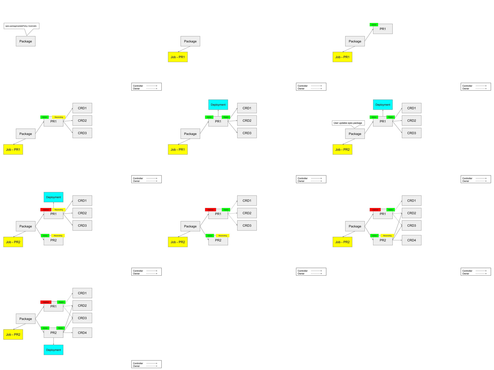

# Packages v2
* Owner: Dan Mangum (@hasheddan)
* Reviewers: Crossplane Maintainers
* Status: Draft

## Background

Crossplane currently supports installing controllers and new CRDs into a
Kubernetes cluster that the Crossplane package manager is running in. While
there are many other packaging formats in the Kubernetes ecosystem, Crossplane
supports its own for the following reasons:

- Crossplane is [opinionated about the capabilities of a
  controller](https://github.com/crossplane/crossplane/blob/master/design/one-pager-packages-security-isolation.md#allowed-resource-access)
  that can be installed to extend its functionality. For instance, controllers
  [may not run as
  root](https://github.com/crossplane/crossplane/blob/master/design/one-pager-packages-security-isolation.md#package-deployment-privileges)
  or request cluster admin RBAC.
- Crossplane [allocates and aggregates various
  ClusterRoles](https://github.com/crossplane/crossplane/blob/master/design/one-pager-packages-security-isolation.md#crossplane-clusterroles--rbac)
  to automatically provide permissions for users in the Kubernetes cluster to
  view / edit / create / delete CRDs installed by a package.
- Crossplane guards against conflicting CRDs being installed into a cluster.
- Crossplane adds [additional metadata to
  CRDs](https://github.com/crossplane/crossplane/blob/master/design/one-pager-stack-ui-metadata.md#crd-annotation-example)
  to provide additional context for displaying their configuration in a UI.
- Crossplane [adds labels to
  CRDs](https://github.com/crossplane/crossplane/blob/master/design/one-pager-stack-relationship-labels.md#example-wordpress-crdyaml-parented-by-stackinstall)
  in an attempt to establish parent-child relationships between CRDs.

In addition, the following unimplemented features are goals of the Crossplane
package manager:

- The ability to resolve dependencies listed in a package for CRDs that do not
  yet exist in the cluster.
- The ability to upgrade installed package artifacts simply by updating a CR.

As part of these guarantees, Crossplane supports installing packages at both the
cluster (`ClusterPackageInstall`) and namespace scope (`PackageInstall`). The
primary difference between these two installation units is that a
`ClusterPackageInstall` can only be installed once, and the installed
controller's `ServiceAccount` is bound to its `ClusterRole` with a
`ClusterRoleBinding`, meaning it can watch the resources for which it requested
RBAC at the cluster scope. A `PackageInstall`, on the other hand, has its
controller's `ServiceAccount` bound to its `ClusterRole` with a `RoleBinding`
that only allows the controller to watch resources in its own namespace.

The advantage of a `PackageInstall` is that it theoretically allows for multiple
versions of the same package to be installed in a cluster at the same time
because its controller is only watching for objects in its own namespace.
However, because CRDs are cluster-scoped objects, there cannot be conflicting
CRDs installed by two different versions of a `PackageInstall`. So while the
goal of the `PackageInstall` is to enable multiple versions of a package to
exist simultaneously in a cluster, the limitations of CRDs makes it less
effective than desired in practice.

The current package infrastructure, though well thought out, has become somewhat
convoluted and redundant with the introduction of
[composition](https://github.com/crossplane/crossplane/blob/master/design/design-doc-composition.md)
into the Crossplane ecosystem.

Composition solves the following goals originally intended to be addressed by a
`PackageInstall` and [template
stacks](https://github.com/crossplane/crossplane/blob/master/design/one-pager-resource-packs.md):

- Ability to publish infrastructure abstractions to specific namespaces.
  - The `PackageInstall` allowed packages to install a namespace-scoped CRD and
    a controller that only watched for resources in its namespace. Composition
    enables this by creating a namespace-scoped CRD using an
    `InfrastructurePublication` and restricting the namespace in which it can be
    provisioned using RBAC.
- Ability to create new packages without writing any code.
  - The templating controller enabled this by allowing a user to create a
    `behavior.yaml` file and automatically using the templating controller image
    (configured with the `behavior.yaml`) when one was not supplied in the
    package. Composition enables this without having to install a new
    controller. The composition controllers run as part of core Crossplane and
    dynamically reconcile new types that are created in response to the creation
    of an `InfrastructureDefinition` / `InfrastructurePublication`.

## Goals

Because composition serves the same purposes as these existing packaging
primitives, the current packaging system can be narrowed in scope while also
supporting a similar set of use-cases. The immediate goals of this refactor are:

- Deprecation and subsequent removal of the `PackageInstall` and
  `StackDefinition` types.
- Standardization on a single `Package` type as a unit of installation.
- Support for upgrading a `Package` that is installed and running in a cluster.
- Support for native installation of composition types, including
  `InfrastructureDefinition`, `InfrastructurePublication`, and `Composition`.

The refactor will involve abandoning the following goals of the current model:

- Supporting running multiple versions of the same package in a cluster at the
  same time. This includes installing the same CRDs from multiple packages.

## Proposal

Related Issues:
- [Package versioning and
  upgrading](https://github.com/crossplane/crossplane/issues/879)
- [Package dependency resolution
  design](https://github.com/crossplane/crossplane/issues/434)

This proposal broadly encompasses the following components, which presents a
more declarative interface where a user creates a `Package` when they desire a
package to be present in the cluster, as opposed to a `PackageInstall` when they
desire for Crossplane to install a package on their behalf:

- `Package`: a cluster-scoped CRD that represents the existence of a package in
  a cluster. Users create / update / delete `Package` instances to manage the
  packages present in their cluster.
- `PackageLock`: a cluster-scoped CRD that represents the state of packages,
  CRDs and composition types in a cluster. Only one instance of the
  `PackageLock` type exists in a cluster.
- `PackageRevision`: a cluster-scoped CRD that represents a version of a package
  that may or may not be active in a cluster. Many `PackageRevision` instances
  may exist for a single `Package`, but only one can be active at a given time.
  `PackageRevision` instances are named the `sha256` hash of the image they are
  represent.
- _`Package` controller_: a controller responsible for observing events on
  `Package` instances, creating new `PackageRevision` instances, and resolving
  dependencies.
- _`PackageRevision` controller_: a controller responsible for observing events
  on `PackageRevision` instances, installing new CRDs /
  `InfrastructureDefinition` / `InfrastructurePublication` / `Composition`
  objects, starting packaged controllers, and cleaning up these objects when a
  package is upgraded.

These types and controllers overlap in functionality with some of the existing
types and controllers that are currently present in the package manager
ecosystem. However, their implementation should not immediately break any of the
current features supported by the package manager. Removal of
`ClusterPackageInstall`, `PackageInstall`, and `StackDefinition`, as well as
refactor of `Package` and all controllers should follow a deprecation schedule
that allows users to move to the new format.

## Current Workflow

In order to accurately describe the steps required for implementing this
refactor. It is important to understand, at least at a high-level, the current
workflow the package manager uses for installing a `Package`. We will use a
`ClusterPackageInstall` for the example here as the namespace-scoped
`PackageInstall` is intended to be removed as part of this refactor.

1. User creates a `ClusterPackageInstall`.
2. The _`ClusterPackageInstall` controller_ observes the `ClusterPackageInstall`
   creation and creates a `Job` that runs a `Pod` with an initContainer running
   the image supplied on the `ClusterPackageInstall` and a container running the
   same image the package manager itself is running. The `initContainer` serves
   to only copy the contents of the package directory from the supplied image
   into a `Volume`. That `Volume` is then mounted on the `container` running the
   package manager image, which is executed with the `unpack`
   [argument](https://github.com/crossplane/crossplane/blob/a0d139f7cf269599ba916ed15af3fd68ffeabbdf/cmd/crossplane/package/unpack/unpack.go#L52).
3. The `unpack` container walks the filepath of the package directory, using the
   information provided to construct a `Package` object. It then
   [writes](https://github.com/crossplane/crossplane/blob/a0d139f7cf269599ba916ed15af3fd68ffeabbdf/pkg/packages/unpack.go#L204)
   the `Package` object and all CRDs in the package to
   [stdout](https://github.com/crossplane/crossplane/blob/a0d139f7cf269599ba916ed15af3fd68ffeabbdf/cmd/crossplane/package/unpack/unpack.go#L53).
4. The _`ClusterPackageInstall` controller_ waits for the `Job` to complete
   successfully before reading the logs from the `Pod`. When the `Job` is
   complete, it reads the logs and creates all of the objects that were
   printed, making a [few modifications as well as annotating and labelling
   appropriately](https://github.com/crossplane/crossplane/blob/6fc50822fbf11a7d31f8a9dabde5c8948c3b36ac/pkg/controller/packages/install/installjob.go#L259).
5. The _`Package` controller_ observes the `Package` creation and assumes the
   following responsibilities:
  - Setting up all RBAC described in the [Background](#background) section.
  - Annotating all CRDs with the proper labels.
  - Creating the `ServiceAccount` for the controller `Deployment`, binding it to
    its `ClusterRole` and starting the controller (i.e. creating the
    `Deployment`).
  - Making any modifications, such as
    [syncing](https://github.com/crossplane/crossplane/blob/6fc50822fbf11a7d31f8a9dabde5c8948c3b36ac/pkg/controller/packages/pkg/pkg.go#L696)
    the `Secret` for the `ServiceAccount` that are required for running the
    controller in [host aware
    mode](https://github.com/crossplane/crossplane/blob/master/design/one-pager-host-aware-stack-manager.md).

The process for a `PackageInstall` is very similar, but the packages using the
templating controller have the additional step of first producing a
`StackDefinition` in the install `Job`, then translating that to a `Package` in
the [_`StackDefinition`
controller_](https://github.com/crossplane/crossplane/blob/6fc50822fbf11a7d31f8a9dabde5c8948c3b36ac/pkg/controller/packages/templates/stackdefinition_controller.go#L53).

## Implementation

This following sections describe the changes to the current package manager that
are required to support the goals listed above.

- [Phase 1 - Establish Package and PackageRevision, Implement Naive Package
  Upgrade](#phase-1)
- [Phase 2 - Establish PackageLock, Implement Naive Dependency
  Management](#phase-2)
- [Phase 3 - Implement Automatic Dependency Resolution](#phase-3)
- [Related Efforts](#related-efforts)
  - [Package Resolution by CRD](#package-resolution-by-crd)
  - [Package Format](#package-format)
  - [Package Installation Configuration](#package-installation-configuration)
  - [Crossplane CLI Refactor](#crossplane-cli-refactor)
  - [RBAC Generation for Users](#rbac-generation-for-users)

## Phase 1

_Phase 1 should be completed by release of Crossplane v0.13_

Related Issues:
- [Minimal happy path upgrade
  support](https://github.com/crossplane/crossplane/issues/1334)
- [Merge Package and
  PackageInstall](https://github.com/crossplane/crossplane/issues/1089)
- [Package manager should redeploy package controllers if they do not
  exist](https://github.com/crossplane/crossplane/issues/1042)
- [ClusterPackageInstall should be Cluster
  Scoped](https://github.com/crossplane/crossplane/issues/981)
- [Support Packaged controller
  configuration](https://github.com/crossplane/crossplane/issues/974)
- [Env var support for packages to enable users to supply proxy
  credentials](https://github.com/crossplane/crossplane/issues/1638)
- [Package API documentation is
  incomplete](https://github.com/crossplane/crossplane/issues/898)
- [Check required fields and better error messages for Package
  Install](https://github.com/crossplane/crossplane/issues/896)
- [Deletion of Packages should be careful about that Extension still being in
  use](https://github.com/crossplane/crossplane/issues/527)
- [Package status should be constructed from the observable
  environment](https://github.com/crossplane/crossplane/issues/510)
- [Proposing update to icons array return
  types](https://github.com/crossplane/crossplane/issues/1119)
- [Proposing update to SVG file type
  processing](https://github.com/crossplane/crossplane/issues/1120)

The main purpose of Phase 1 is to establish the `Package` and `PackageRevision`
types with an API that will accommodate future improvements to package
management.

### Package API

*Package will be introduced at version v1beta1*

The current `ClusterPackageInstall` will serve as the basis for the new
`Package` type. The current `ClusterPackageInstall` schema is as follows:

```go
// +kubebuilder:object:root=true

// ClusterPackageInstall is the CRD type for a request to add a package to Crossplane.
// +kubebuilder:resource:categories=crossplane
// +kubebuilder:subresource:status
// +kubebuilder:printcolumn:name="READY",type="string",JSONPath=".status.conditionedStatus.conditions[?(@.type=='Ready')].status"
// +kubebuilder:printcolumn:name="SOURCE",type="string",JSONPath=".spec.source"
// +kubebuilder:printcolumn:name="PACKAGE",type="string",JSONPath=".spec.package"
// +kubebuilder:printcolumn:name="CRD",type="string",JSONPath=".spec.crd"
// +kubebuilder:printcolumn:name="AGE",type="date",JSONPath=".metadata.creationTimestamp"
type ClusterPackageInstall struct {
  metav1.TypeMeta   `json:",inline"`
  metav1.ObjectMeta `json:"metadata,omitempty"`

  Spec   PackageInstallSpec   `json:"spec,omitempty"`
  Status PackageInstallStatus `json:"status,omitempty"`
}

// PackageInstallSpec specifies details about a request to install a package to
// Crossplane.
type PackageInstallSpec struct {
  PackageControllerOptions `json:",inline"`

  // Source is the domain name for the package registry hosting the package
  // being requested, e.g., registry.crossplane.io
  Source string `json:"source,omitempty"`

  // Package is the name of the package package that is being requested, e.g.,
  // myapp. Either Package or CustomResourceDefinition can be specified.
  Package string `json:"package,omitempty"`

  // CustomResourceDefinition is the full name of a CRD that is owned by the
  // package being requested. This can be a convenient way of installing a
  // package when the desired CRD is known, but the package name that contains
  // it is not known. Either Package or CustomResourceDefinition can be
  // specified.
  CustomResourceDefinition string `json:"crd,omitempty"`
}

// PackageControllerOptions allow for changes in the Package extraction and
// deployment controllers. These can affect how images are fetched and how
// Package derived resources are created.
type PackageControllerOptions struct {
  // ImagePullSecrets are named secrets in the same workspace that can be used
  // to fetch Packages from private repositories and to run controllers from
  // private repositories
  ImagePullSecrets []corev1.LocalObjectReference `json:"imagePullSecrets,omitempty"`

  // ImagePullPolicy defines the pull policy for all images used during
  // Package extraction and when running the Package controller.
  // https://kubernetes.io/docs/concepts/configuration/overview/#container-images
  ImagePullPolicy corev1.PullPolicy `json:"imagePullPolicy,omitempty"`

  // ServiceAccount options allow for changes to the ServiceAccount the
  // Package Manager creates for the Package's controller
  ServiceAccount *ServiceAccountOptions `json:"serviceAccount,omitempty"`
}

// ServiceAccountOptions augment the ServiceAccount created by the Package
// controller
type ServiceAccountOptions struct {
  Annotations map[string]string `json:"annotations,omitempty"`
}

// PackageInstallStatus represents the observed state of a PackageInstall.
type PackageInstallStatus struct {
  xpv1.ConditionedStatus `json:"conditionedStatus,omitempty"`

  InstallJob    *corev1.ObjectReference `json:"installJob,omitempty"`
  PackageRecord *corev1.ObjectReference `json:"packageRecord,omitempty"`
}
```

The following changes will be made to the `ClusterPackageInstall` schema.

Fields to be added:

- `spec.revisionActivationPolicy`: specifies how a package should update to a
  new version. Options are `Automatic` or `Manual`. If set to `Manual`,
  `PackageRevision`s will be created, but must be manually activated. Defaults
  to `Automatic`.
- `spec.revisionHistoryLimit`: number of `Inactive` `PackageRevision`s to keep.
  Once a `PackageRevision` is outside of this range, it and all of the objects
  that only it owns will be cleaned up. Defaults to 1. If set to 0,
  `PackageRevision`s will not be garbage collected.
- `status.currentRevision`: a string that is the name of the `PackageRevision`
  that matches the `sha256` hash of the package image specified in
  `spec.package`.

Fields to be removed:

- `spec.source`: the purpose of this field was to override the source of the
  packaged controller image. Packages are meant to specify the exact controller
  they are bringing, this should not be customizable.
- `status.installJob`: a reference to the install `Job` for the
  `ClusterPackageInstall`.
- `status.packageRecord`: a reference to the `Package` that represents the
  installation unit for the `ClusterPackageInstall`. The `PackageRevision` is
  now discoverable by name at the cluster scope.
- `spec.crd`: this will be added when the ability to install a package by
  specifying a CRD it brings is implemented.

*Note: while the field is unchanged, `spec.imagePullSecrets` will only allow for
usage of secrets in the namespace in which the package manager `Pod` is running.
Previously, `ClusterPackageInstall` was a namespace-scoped resource, so the
secrets were required to be present in the namespace in which the
`ClusterPackageInstall` was created.*

The full schema for the `Package` will be as follows:

```go
// +kubebuilder:object:root=true

// Package is the CRD type for a request to add a package to Crossplane.
// +kubebuilder:resource:categories=crossplane
// +kubebuilder:subresource:status
// +kubebuilder:printcolumn:name="READY",type="string",JSONPath=".status.conditionedStatus.conditions[?(@.type=='Ready')].status"
// +kubebuilder:printcolumn:name="SOURCE",type="string",JSONPath=".spec.source"
// +kubebuilder:printcolumn:name="PACKAGE",type="string",JSONPath=".spec.package"
// +kubebuilder:printcolumn:name="CRD",type="string",JSONPath=".spec.crd"
// +kubebuilder:printcolumn:name="AGE",type="date",JSONPath=".metadata.creationTimestamp"
type Package struct {
  metav1.TypeMeta   `json:",inline"`
  metav1.ObjectMeta `json:"metadata,omitempty"`

  Spec   PackageSpec   `json:"spec,omitempty"`
  Status PackageStatus `json:"status,omitempty"`
}

// PackageSpec specifies details about a request to install a package to
// Crossplane.
type PackageSpec struct {
  PackageControllerOptions `json:",inline"`

  // Package is the name of the package that is being requested. It should
  // be either an OCI image or a Git source.
  Package string `json:"package"`

  // RevisionActivationPolicy specifies how the package controller should
  // update from one revision to the next. Options are Automatic or Manual.
  // Default is Automatic.
  RevisionActivationPolicy *string `json:"revisionActivationPolicy,omitempty"`

  // RevisionHistoryLimit dictates how the package controller cleans up old
  // inactive package revisions.
  // Defaults to 1. Can be disabled by explicitly setting to 0.
  RevisionHistoryLimit *int64 `json:"revisionHistoryLimit,omitempty"`
}

// PackageControllerOptions allow for changes in the Package extraction and
// packaged controller, if applicable. These can affect how images are fetched and how
// Package derived resources are created.
type PackageControllerOptions struct {
  // ImagePullSecrets are named secrets in the same workspace that can be used
  // to fetch Packages from private repositories and to run controllers from
  // private repositories
  ImagePullSecrets []corev1.LocalObjectReference `json:"imagePullSecrets,omitempty"`

  // ImagePullPolicy defines the pull policy for all images used during
  // Package extraction and when running the packaged controller, if applicable.
  ImagePullPolicy corev1.PullPolicy `json:"imagePullPolicy,omitempty"`

  // ServiceAccount options allow for changes to the ServiceAccount the
  // Package Manager creates for the PackageRevision's controller, if applicable.
  ServiceAccount *ServiceAccountOptions `json:"serviceAccount,omitempty"`
}

// ServiceAccountOptions augment the ServiceAccount created by the Package
// controller
type ServiceAccountOptions struct {
  Annotations map[string]string `json:"annotations,omitempty"`
}

// PackageInstallStatus represents the observed state of a PackageInstall.
type PackageInstallStatus struct {
  xpv1.ConditionedStatus `json:"conditionedStatus,omitempty"`

  CurrentRevision string `json:"currentRevision,omitempty"`
}
```

### PackageRevision API

*PackageRevision will be introduced at version v1beta1*

The current `Package` will serve as the basis for the new `PackageRevision`
type. The current `Package` schema is as follows:

```go
// +kubebuilder:object:root=true

// A Package that has been added to Crossplane.
// +kubebuilder:resource:categories=crossplane
// +kubebuilder:subresource:status
// +kubebuilder:printcolumn:name="READY",type="string",JSONPath=".status.conditionedStatus.conditions[?(@.type=='Ready')].status"
// +kubebuilder:printcolumn:name="VERSION",type="string",JSONPath=".spec.version"
// +kubebuilder:printcolumn:name="AGE",type="date",JSONPath=".metadata.creationTimestamp"
type Package struct {
  metav1.TypeMeta   `json:",inline"`
  metav1.ObjectMeta `json:"metadata,omitempty"`

  Spec   PackageSpec   `json:"spec,omitempty"`
  Status PackageStatus `json:"status,omitempty"`
}

// PackageSpec specifies the desired state of a Package.
type PackageSpec struct {
  AppMetadataSpec `json:",inline"`
  CRDs            CRDList         `json:"customresourcedefinitions,omitempty"`
  Controller      ControllerSpec  `json:"controller,omitempty"`
  Permissions     PermissionsSpec `json:"permissions,omitempty"`
}

// AppMetadataSpec defines metadata about the package application
type AppMetadataSpec struct {
  Title         string            `json:"title,omitempty"`
  OverviewShort string            `json:"overviewShort,omitempty"`
  Overview      string            `json:"overview,omitempty"`
  Readme        string            `json:"readme,omitempty"`
  Version       string            `json:"version,omitempty"`
  Icons         []IconSpec        `json:"icons,omitempty"`
  Maintainers   []ContributorSpec `json:"maintainers,omitempty"`
  Owners        []ContributorSpec `json:"owners,omitempty"`
  Company       string            `json:"company,omitempty"`
  Category      string            `json:"category,omitempty"`
  Keywords      []string          `json:"keywords,omitempty"`
  Website       string            `json:"website,omitempty"`
  Source        string            `json:"source,omitempty"`
  License       string            `json:"license,omitempty"`

  // DependsOn is the list of CRDs that this package depends on. This data
  // drives the RBAC generation process.
  DependsOn []PackageInstallSpec `json:"dependsOn,omitempty"`

  // +kubebuilder:validation:Enum=Provider;Stack;Application;Addon
  PackageType string `json:"packageType,omitempty"`

  // +kubebuilder:validation:Enum=Cluster;Namespaced
  PermissionScope string `json:"permissionScope,omitempty"`
}

// PackageInstallSpec specifies details about a request to install a package to
// Crossplane.
type PackageInstallSpec struct {
  PackageControllerOptions `json:",inline"`

  // Source is the domain name for the package registry hosting the package
  // being requested, e.g., registry.crossplane.io
  Source string `json:"source,omitempty"`

  // Package is the name of the package package that is being requested, e.g.,
  // myapp. Either Package or CustomResourceDefinition can be specified.
  Package string `json:"package,omitempty"`

  // CustomResourceDefinition is the full name of a CRD that is owned by the
  // package being requested. This can be a convenient way of installing a
  // package when the desired CRD is known, but the package name that contains
  // it is not known. Either Package or CustomResourceDefinition can be
  // specified.
  CustomResourceDefinition string `json:"crd,omitempty"`
}

// PackageControllerOptions allow for changes in the Package extraction and
// deployment controllers. These can affect how images are fetched and how
// Package derived resources are created.
type PackageControllerOptions struct {
  // ImagePullSecrets are named secrets in the same workspace that can be used
  // to fetch Packages from private repositories and to run controllers from
  // private repositories
  ImagePullSecrets []corev1.LocalObjectReference `json:"imagePullSecrets,omitempty"`

  // ImagePullPolicy defines the pull policy for all images used during
  // Package extraction and when running the Package controller.
  // https://kubernetes.io/docs/concepts/configuration/overview/#container-images
  ImagePullPolicy corev1.PullPolicy `json:"imagePullPolicy,omitempty"`

  // ServiceAccount options allow for changes to the ServiceAccount the
  // Package Manager creates for the Package's controller
  ServiceAccount *ServiceAccountOptions `json:"serviceAccount,omitempty"`
}

// CRDList is the full list of CRDs that this package owns and depends on
type CRDList []metav1.TypeMeta

// ControllerSpec defines the controller that implements the logic for a
// package, which can come in different flavors.
type ControllerSpec struct {
  // ServiceAccount options allow for changes to the ServiceAccount the
  // Package Manager creates for the Package's controller
  ServiceAccount *ServiceAccountOptions `json:"serviceAccount,omitempty"`

  Deployment *ControllerDeployment `json:"deployment,omitempty"`
}

// PermissionsSpec defines the permissions that a package will require to
// operate.
type PermissionsSpec struct {
  Rules []rbac.PolicyRule `json:"rules,omitempty"`
}

// PackageStatus represents the observed state of a Package.
type PackageStatus struct {
  xpv1.ConditionedStatus `json:"conditionedStatus,omitempty"`
  ControllerRef                     *corev1.ObjectReference `json:"controllerRef,omitempty"`
}
```

The following changes will be made to the `Package` schema.

Fields to be added:

- `spec.infrastructureDefinitions`: list of `InfrastructureDefinition`s
  installed by the package.
- `spec.infrastructurePublications`: list of `InfrastructurePublication`s
  installed by the package.
- `spec.compositions`: list of `Composition`s installed by the package.
- `spec.desiredState`: the desired state, which can be one of `Active` or
  `Inactive`.
- `spec.installJobRef`: a reference to the `Job` that was used to unpack the
  package. The `PackageRevision` must be able to access it to create the objects
  it installs.
- `spec.revision`: the number revision that this `PackageRevision` is for its
  parent `Package`. This is a strictly incrementing value set by the `Package`
  controller. If an existing `PackageRevision` is transitioned from `Inactive`
  to `Active`, its revision number will be set to one more than the greatest
  revision number of all existing `PackageRevision`s for the `Package`. This
  number is used by the `Package` controller to garbage collect old
  `PackageRevision`s.

Fields to be modified:

- `spec.dependsOn`: this field is intended to be used for resolving
  dependencies, but in practice it is only used to make sure that required CRDs
  are present and that the controller in the package is given RBAC to manage
  them. It is currently a slice of `PackageInstallSpec` (which would be
  `PackageSpec` in the new vernacular). In the future, we want the ability to
  resolve dependencies on either an explicit package (specified by the name of
  the image), or on CRD(s). However, a package specifying fields like the
  `imagePullSecrets` for a dependency in its manifests does not make sense
  because the package author cannot make assumptions about a secret that will be
  present in the cluster in which it is installed. While out of scope for Phase
  1, a better model would be to pass any `imagePullSecrets` from the parent
  `Package` down to any dependencies it requires. The same can be said for
  `ServiceAccountOptions` and `ImagePullPolicy`. If a user wanted to make it
  such that dependencies used different configuration than their parent
  `Package`, they could install the dependency `Package` manually first, then
  install the parent, which would be have its dependency satisfied by the
  already extant child. For these reasons, this field will be updated to be of
  type `[]Dependency` which has mutually exclusive fields `package`, `crd`, and
  `crossplane`. The `crd` field should always be a GVK, and the `package` field
  should be an image reference, with a semver range. The `crossplane` field
  should only be a semver range, indicating the versions of Crossplane the
  package is compatible with.

*Note: `spec.dependsOn` will also no longer be used to drive RBAC generation.
Declaring a dependency means that the package requires that the dependency
(whether another package or a CRD) exists in the cluster. It does not indicate
that the package wants to be able to reconcile the type. Any additional
permissions that may be required for a packaged controller should be included in
the `spec.permissions` field.*

Fields to be removed:

- All fields in `AppMetadataSpec` (except for `spec.dependsOn`, which is
  discussed above) will be moved to annotations to allow for more flexibility in
  defining packaging format in the future. This is more in-line with Kubernetes
  patterns as the metadata is consumed by external systems but is not used by
  the `PackageRevision` controller to reconcile state.

In addition, `PackageRevision` will be cluster-scoped type, rather than the
current namespace-scoped `Package`. The current schema for `Package` can be
viewed
[here](https://doc.crds.dev/github.com/crossplane/crossplane/packages.crossplane.io/Package/v1alpha1@v0.12.0).

The full schema for the `PackageRevision` will be as follows:

```go
type PackageRevisionDesiredState string

const (
  PackageRevisionActive   PackageRevisionDesiredState = "Active"
  PackageRevisionInactive PackageRevisionDesiredState = "Inactive"
)

// +kubebuilder:object:root=true

// A PackageRevision that has been added to Crossplane.
// +kubebuilder:resource:categories=crossplane
// +kubebuilder:subresource:status
// +kubebuilder:printcolumn:name="READY",type="string",JSONPath=".status.conditionedStatus.conditions[?(@.type=='Ready')].status"
// +kubebuilder:printcolumn:name="VERSION",type="string",JSONPath=".spec.version"
// +kubebuilder:printcolumn:name="AGE",type="date",JSONPath=".metadata.creationTimestamp"
type PackageRevision struct {
  metav1.TypeMeta   `json:",inline"`
  metav1.ObjectMeta `json:"metadata,omitempty"`

  Spec   PackageRevisionSpec   `json:"spec,omitempty"`
  Status PackageRevisionStatus `json:"status,omitempty"`
}

// PackageRevisionSpec specifies the desired state of a PackageRevision.
type PackageRevisionSpec struct {
  CustomResourceDefinitions            []metav1.TypeMeta           `json:"customResourceDefinitions,omitempty"`
  InfrastructureDefinitions            []metav1.TypeMeta           `json:"infrastructureDefinitions,omitempty"`
  InfrastructurePublications           []metav1.TypeMeta           `json:"infrastructurePublications,omitempty"`
  Compositions                         []metav1.TypeMeta           `json:"compositions,omitempty"`
  Controller                           ControllerSpec              `json:"controller,omitempty"`
  InstallJobRef                        *corev1.ObjectReference     `json:"installJobRef,omitempty"`
  Permissions                          PermissionsSpec             `json:"permissions,omitempty"`
  DependsOn                            []Dependency                `json:"dependsOn,omitempty"`
  DesiredState                         PackageRevisionDesiredState `json:"desiredState"`
  Revision                             int64                       `json:"revision"`
}

// Dependency specifies the dependency of a package.
type Dependency struct {
  // Package is the name of the package package that is being requested, e.g.,
  // myapp. Either Package or CustomResourceDefinition can be specified.
  Package string `json:"package,omitempty"`

  // CustomResourceDefinition is the full name of a CRD that is owned by the
  // package being requested. This can be a convenient way of installing a
  // package when the desired CRD is known, but the package name that contains
  // it is not known. Either Package or CustomResourceDefinition can be
  // specified.
  CustomResourceDefinition string `json:"crd,omitempty"`
}

// ControllerSpec defines the controller that implements the logic for a
// package, which can come in different flavors.
type ControllerSpec struct {
  // ServiceAccount options allow for changes to the ServiceAccount the
  // Package Manager creates for the Package's controller
  ServiceAccount *ServiceAccountOptions `json:"serviceAccount,omitempty"`

  Deployment *ControllerDeployment `json:"deployment,omitempty"`
}

// PermissionsSpec defines the permissions that a package will require to
// operate.
type PermissionsSpec struct {
  Rules []rbac.PolicyRule `json:"rules,omitempty"`
}

// PackageRevisionStatus represents the observed state of a PackageRevision.
type PackageRevisionStatus struct {
  xpv1.ConditionedStatus `json:"conditionedStatus,omitempty"`
  ControllerRef                     *corev1.ObjectReference `json:"controllerRef,omitempty"`
}
```

In order to continue to support the current functionality of
`ClusterPackageInstall`, `PackageInstall`, and `StackDefinition` the underlying
`Package` type will be renamed to `LegacyPackage`. The existing `Package` type
will be refactored to look like the current `ClusterPackageInstall` schema with
the following modifications.

### Package Controller

The `Package` controller is responsible for watching the create / update /
delete a `Package`, unpacking it, and creating the corresponding
`PackageRevision`. It is knowledgeable of and modifies instances of both the
`Package` and `PackageRevision` types. For Phase 1, the `Package` controller
will operate with the following behavior.

**`Package` Created with `spec.revisionActivationPolicy: Automatic`**

1. Observe `spec.package` and create `Job` to unpack the package.
2. When `Job` is complete, create `PackageRevision` from `Job` output with
   `spec.desiredState: Active`.
3. Set `status.currentRevision` to full image name used for `PackageRevision`
   (this can be obtained from the `Pod` in the install `Job`)
4. Report status of `PackageRevision` in the status of the `Package`.

**`Package` Created with `spec.revisionActivationPolicy: Manual`**

1. Observe `spec.package` and create `Job` to unpack the package.
2. When `Job` is complete, create `PackageRevision` from `Job` output with
   `spec.desiredState: Inactive`.
3. Set `status.currentRevision` to full image name used for `PackageRevision`
   (this can be obtained from the `Pod` in the install `Job`)
4. Report status of `PackageRevision` in the status of the `Package`.

User is responsible for manually setting the `PackageRevision` to `Active`.

**Existing `Package` with `spec.revisionActivationPolicy: Automatic` Modified**

1. Observe difference in `spec.package` and `status.currentRevision`. If an
   install `Job` had previously failed to pull a package image and only the
   `spec.imagePullSecrets` changed, the `Job` would be retried with the new
   `spec.imagePullSecrets`.
2. Create install `Job` to unpack new package version.
3. When `Job` is complete, mark `Active` `PackageRevision` as
   `spec.desiredState: Inactive`, and create new `PackageRevision` as
   `spec.desiredState: Active`.
4. Set `status.currentRevision` to full image name used for new
   `PackageRevision` (this can be obtained from the `Pod` in the install `Job`).
5. Clean up any install `Job` for any `PackageRevision` that has successfully
   transitioned to `Inactive` state.

**Existing `Package` with `spec.revisionActivationPolicy: Manual` Modified**

1. Observe difference in `spec.package` and `status.currentRevision`. If an
   install `Job` had previously failed to pull a package image and only the
   `spec.imagePullSecrets` changed, the `Job` would be retried with the new
   `spec.imagePullSecrets`.
2. Create install `Job` to unpack new package version.
3. When `Job` is complete, create new `PackageRevision` with `spec.desiredState:
   Inactive`.
4. Wait for user to set new `PackageRevision` to `spec.desiredState.Active`.
5. Mark existing `PackageRevision` as `Inactive` and set
   `status.currentRevision` to full image name used for new `PackageRevision`
   (this can be obtained from the `Pod` in the install `Job`).
6. Clean up any install `Job` for any `PackageRevision` that has successfully
   transitioned to `Inactive` state.

**`Package` Deleted**

All the `Package` controller has to do in this case is remove its finalizer from
the `Package`. All of its `PackageRevision`s will be garbage collected by their
owner being deleted.

*Note: every `PackageRevision` created on behalf of a `Package` should have a
controller reference to that `Package`.*

**Garbage Collecting Old `PackageRevision`s**

Users may specify the `spec.revisionHistoryLimit` field on a `Package` to
control how the `Package` controller cleans up old `PackageRevision`s. In some
cases, users may want to keep old `PackageRevision`s for a period of time if a
new revision drops support for a type and they need time to manually clean up
the old instances before the CRDs are deleted.

> Note: installed resources, such as CRDs, have an owner reference to their
> parent `PackageRevision`. If the parent is deleted and no additional owner
> references exist, the resource will be cleaned up by Kubernetes garbage
> collection. More information on this in the [PackageRevision Controller
> section](#packagerevision-controller).

The `Package` controller is responsible for garbage collecting any
`PackageRevision`s that fall outside the limit specified in
`spec.revisionHistoryLimit`.

The `Package` controller will not garbage collect a `PackageRevision` that is
currently `Active`. However, in the case that multiple `PackageRevision`s have
been created using `revisionActivationPolicy: Manual` since the currently
`Active` revision, it is possible that when one of the newer `PackageRevision`s
is marked as `Active` that the currently `Active` `PackageRevision` will be
marked as `Inactive`, then immediately cleaned up if it falls outside of the
`spec.revisionHistoryLimit`.

### PackageRevision Controller

The `PackageRevision` controller is responsible for watching the create / update
/ delete of a `PackageRevision` and managing its installation. It is not
knowledgeable of the parent `Package` and operates independently of any other
`PackageRevision`. For Phase 1, the `PackageRevision` controller will operate
with the following behavior.

**`PackageRevision` Created as `Active`**

1. Observe creation of `PackageRevision` with `spec.desiredState: active`.
2. Attempt to establish control of CRDs / InfraDefs / Compositions by setting an
   owner reference with `controller: true` if one does not already exist. If
   there is another `PackageRevision` that is in the process of becoming
   `Inactive`, then the new `PackageRevision` will fail to establish control.
   Once control is established, the `PackageRevision` should ensure that each
   object matches the one specified in its install `Job`, and update it if that
   is not the case. If an object is net new then the `PackageRevision` will be
   able to create it with controller reference.
3. Create `ServiceAccount` and bind necessary RBAC based on objects installed
   and permissions requested (`spec.permissions`).
4. Create controller `Deployment` with the `ServiceAccount`. The controller
   should start successfully if the necessary objects were installed and
   permissions were granted.

**`PackageRevision` Modified to be `Inactive`**

1. Observe modification and `spec.desiredState: Inactive`.
2. Delete `Deployment`, `ServiceAccount`, and any RBAC resources.
3. Remove controller reference from all objects, but keep owner reference.

**`PackageRevision` Deleted**

Deleting an `Active` or `Inactive` `PackageRevision` should not require
additional steps from the controller. If it is the sole owner of an object it
will be cleaned up.

### A Note on Backup and Restore

`Package`s are able to establish ownership of `PackageRevision`s and `Job`s even
if their UID differs in their entry in the object's owner references.
`PackageRevision`s are able to establish ownership over any of their installed
objects without matching UID. This enables backup and restore scenarios where
the UID of the owners are changed.

### Simple Case Package Upgrade Example

A simple case of upgrading a single package to a new version is illustrated
below:



### Action Items

- [ ] Rename `Package` to `LegacyPackage`
- [ ] Add `Package`, and `PackageRevision` types
- [ ] Implement `Package` and `PackageRevision` controllers
- [ ] Deprecate `ClusterPackageInstall`, `PackageInstall`, `StackDefinition`,
  and `LegacyPackage`

## Phase 2

_Phase 2 should be completed by release of Crossplane v0.14_

Related Issues:
- [Package dependency resolution
  design](https://github.com/crossplane/crossplane/issues/434)
- [Check required fields and better error messages for Package
  Install](https://github.com/crossplane/crossplane/issues/896)

The main purpose of Phase 2 is to establish the `PackageLock` type and implement
the building blocks for dependency management. However, there is no intention to
resolve dependencies for packages at this stage. Instead, users will be provided
more granular information about how they can manually resolve dependencies to
make the installation of a package successful. For example, in Phase 1, when a
user creates a `Package` a `PackageRevision` will always be created and it will
try to install everything it brings. If it is unsuccessful, the `Package` will
reflect that in its `status`, but will be no more granular than specifying which
`PackageRevision` is failing and perhaps what operation it is failing on.

In Phase 2, the `Package` controller will instead check the current set of
packages in the cluster and refuse to create the `PackageRevision` if there is a
known violation. To do so, the `Package` controller must be able to read and
write the state of the packages it manages in a "concurrency-safe" manner. Let's
look at an example.

**Package A (PA) and Package B (PB) Both Want to Install CRD1 and CRD2**

In the model established in Phase 1, this scenario could result in one of three
outcomes:

1. PA successfully installs and controls CRD1 and CRD2. It starts its packaged
   controller and runs without issue.
2. PB successfully installs and controls CRD1 and CRD2. It starts its packaged
   controller and runs without issue.
3. PB successfully installs and controls CRD1, but before it can install CRD2,
   PA installs and controls it. Neither one of the package installations are
   successful and none of the packaged controllers are started.

While each of the controllers in this scenario are acting in a deterministic
manner, the observed behavior is not consistent. Because Kubernetes is
eventually consistent, we can never guarantee that a certain package will win a
conflict such as this, but we can guarantee that one package will win (barring
other violations) by introducing a locking mechanism.

Kubernetes establishes consistency by applying a [resource
version](https://kubernetes.io/docs/reference/using-api/api-concepts/#resource-versions)
to all objects. This ensures that a client reading and writing to an object will
fail to modify it if another client has modified it in the interim. We can take
advantage of this property by establishing a singleton resource that serves as a
source of truth for ownership and dependency in a cluster.

### PackageLock API

The `PackageLock` type is a cluster-scoped singleton resource type that keeps a
record of ownership and dependencies of Crossplane packages.

```go
// A PackageLock keeps track of Crossplane packages.
type PackageLock struct {
  metav1.TypeMeta   `json:",inline"`
  metav1.ObjectMeta `json:"metadata,omitempty"`

  Spec   PackageLockSpec   `json:"spec,omitempty"`
  Status PackageLockStatus `json:"status,omitempty"`
}

type PackageLockSpec struct {
  Packages                  []PackageDependencies `json:"packages,omitempty"`
  Compositions              map[string]string     `json:"compositions,omitempty"`
  CustomResourceDefinitions map[string]string     `json:"customResourceDefinitions,omitempty"`
}

type PackageDependencies struct {
  Name         string   `json:"name,omitempty"`
  Image        string   `json:"image,omitempty"`
  Dependencies []string `json:"dependencies,omitempty"`
}
```

> Note that `Composition` resources are the only type that is listed separately
> from `CustomResourceDefinitions`. This is due to the fact the
> `InfrastructureDefinitions` and `InfrastructurePublications` ultimately result
> in the creation of a `CustomResourceDefinition`, so we require uniqueness on
> CRD since they cannot be created if a CRD of the same kind already exists.

### Package Controller Modifications

With the introduction of the `PackageLock` type. The `Package` controller will
be modified to both establish control of installed objects and check for missing
dependencies prior to creating a new `PackageRevision`. It should report events
and update the status of the `Package` to inform users of missing dependencies
and conflicting ownership.

### Action Items

- [ ] Add `PackageLock` type
- [ ] Update `Package` controller to handle dependency management
- [ ] Deprecate `app-wordpress`
- [ ] Update `stack-aws-sample` to use new `Package` format and composition
- [ ] Update `stack-azure-sample` to use new `Package` format and composition
- [ ] Update `stack-gcp-sample` to use new `Package` format and composition

`ClusterPackageInstall`, `PackageInstall`, `StackDefinition`, and
`LegacyPackage` and their corresponding controllers are marked as deprecated.
All stacks should be migrated to use packages that install composition types.

## Phase 3

_Phase 3 should be completed by release of Crossplane v0.15_

While notifying users of the steps required to make a package installation
successful is helpful, the package manager should be able to automatically
resolve and install dependencies such that users may install a single package
and have its entire dependency tree be populated. Adding basic best effort
resolution (i.e. install the latest version within a semver range of a
dependency) would only entail creating a `Package` for all missing dependencies
when a `Package` was created. While this system is not extremely robust, it is
anticipated that most Crossplane packages will likely have one or very few
levels of dependencies, so the depth of transitive dependency resolution will be
less of an issue than in traditional package managers, such as those for
programming languages.

Full implementation details will be informed by user feedback following the
release of Phases 1 and 2.

## Related Efforts

The following sections describe tangential efforts in the package management
space that are not required to be addressed before implementing each of the
phases of this proposal.

### Package Resolution by CRD

Once a registry is developed that allows for resolving packages by the CRDs that
they install, Crossplane should support declaring dependencies and installing
packages by specifying a CRD. This should be a fairly straightforward addition
as the underlying mechanics of package installation will not change, there will
just be an additional CRD to package resolution step prior to installation. 

### Package Format

Related Issues:
- [install.yaml allows a full Deployment spec to be declared which can be
  problematic](https://github.com/crossplane/crossplane/issues/1441)
- [Package images should not require a
  shell](https://github.com/crossplane/crossplane/issues/1325)
- [Package unpack format should be typed and
  well-defined](https://github.com/crossplane/crossplane/issues/1248)
- [Package resources are all in single resources
  directory](https://github.com/crossplane/crossplane/issues/836)

A Crossplane package is an OCI image that contains a `.registry/` directory in
its filesystem. While the image is really just serving as a file format, it has
a few properties that make it advantageous:

- Allows integration with existing OCI image registries and tooling.
- Allows a package to also include a binary that it intends to be run after
  install is complete (i.e. the controller).
- Allows package metadata schema and filesystem format to change over time
  without having to modify the package manager because the logic can be included
  in the package image to allow it to "unpack" itself in a format that the
  package manager understands.

In reality, the second two properties are somewhat mutually exclusive.
Currently, a package does not unpack itself, but rather has its `.registry/`
directory copied into the filesystem of an unpacking container that provides the
logic for translating the manifests into a format that the package manager
understands. This means that the `ENTRYPOINT` of the package image can be
invoked directly in the `Deployment` that is created as part of installation,
but also means that the package author must conform to whatever "unpack" image
is being used, rather than building it into the package image itself.

OCI images are valuable in part because they are essentially an open playground
that allows you to do almost anything. In contrast, Crossplane packages are
extremely scoped and are opinionated about how you structure your image. For
this reason, it makes sense to abstract the image building process from the
package author, such that they only define their package contents and use the
Crossplane CLI to build and push the package.

*Note: this would not preclude someone from building the package image
themselves, but it would make it much easier for them to defer that
responsibility.*

As part of this abstraction, the ability to also include the binary that is
intended to be executed as the package's controller would be removed. The
original purpose of this functionality was to not require a package author to
build and push a controller image, then have to reference it in the package's
`install.yaml`, which defines the `Deployment` that should be created.

### Package Installation Configuration

Related Issues:
- [Env var support for packages to enable users to supply proxy
  credentials](https://github.com/crossplane/crossplane/issues/1638)
- [NodeSelector on
  ClusterPackageInstaller](https://github.com/crossplane/crossplane/issues/1656)

Installing packages in different settings requires supplying custom
configuration values at install time. For instance, a controller that is
authenticating to a cloud provider may be utilizing an SDK that allows for
values to be overridden by supplying environment variables to the `Deployment`.
Situations such as this may be able to be supported by configuration on the
package's `Provider` type. However, other configuration, such as scheduling the
packaged controller to a certain node in the Kubernetes cluster is a
control-plane level decision and must be set on creation of the `Deployment`.

Continuously adding new fields to the `Package` type to configure installation
of packages is likely to be a cumbersome process, so it may make sense to
implement translation hooks in the package manager for packages to specify their
own configuration schema that will affect how they are provisioned. These
configuration values could be supplied in a `ConfigMap` and attached to the
`Package` type, then translated as the package specifies.

### Crossplane CLI Refactor

Related Issues:
- [Linting and error checking for package
  developers](https://github.com/crossplane/crossplane/issues/920)

The Crossplane CLI should enhance the UX of interacting with packages in
Crossplane by assisting in authorship, installation, and management.

### RBAC Generation for Users

Currently the package manager is responsible for not only generating RBAC for
the packaged controllers it installs, but also for groups of users in a cluster.
This responsibility is currently not reflected in this design and will likely be
deferred to another controller or managed exclusively by cluster administrators.
