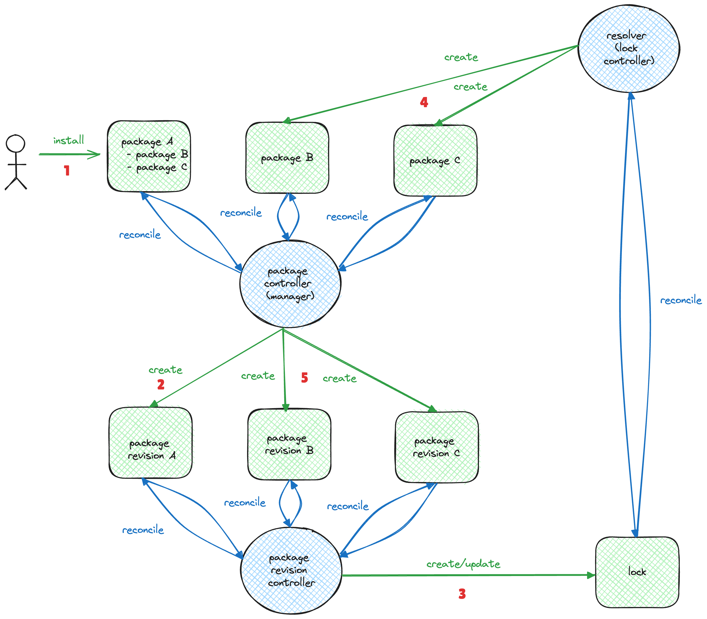

# Automatic Dependency Version Downgrades

* Owner: Ezgi Demirel Karabag (@ezgidemirel)
* Reviewers: Crossplane Maintainers
* Status: Accepted

## Background

Crossplane's package manager has traditionally handled missing dependencies by installing the latest valid versions 
available using the lock Kubernetes object and a controller reconciles on it. This straightforward approach allowed for 
quick setup but could not handle dynamic environments where dependency version change is required. In cases where the 
dependency was installed but the constraints were no longer satisfied, the lock reconciler gives no error and package 
revision reconciler notices the invalid version issue and returns an error to the user for manual intervention.

[With recent updates](https://github.com/crossplane/crossplane/pull/6017), the package manager has gained the capability 
to upgrade dependencies to the minimum valid version rather than the latest, reducing the likelihood of breaking changes 
in existing environments. If no version meets the constraints, the lock reconciler now displays the error message in the 
lock object’s status, complementing the error messages from the package revision reconciler.

It was deliberately decided not to downgrade the dependencies automatically to prevent unexpected behaviours in the 
existing environments. However, this approach has its own drawbacks. The user has to manually intervene to downgrade the
dependencies, which is not a good user experience and is not suitable for GitOps workflows. This proposal aims to 
address this issue by introducing automatic dependency version downgrades as a configuration option.

## Possible Issues

During dependency version downgrades, the following issues may occur:

1) Missing CRDs
2) Missing CRD fields
3) CRD storage version changes

Please note that these issues may also occur during package upgrades. But in that case, we assume the user is aware of 
the changes and accepts the risks.

Detecting these issues in the package manager before downgrading dependencies would significantly complicate the package 
manager's logic and increase the implementation complexity. It would also require downloading the package base layer 
multiple times with different versions, leading to slower performance. Therefore, we suggest not implementing pre-checks 
for these issues before downgrading dependencies. Instead, we will document the potential issues and risks, providing 
users with the necessary information to make informed decisions.

### Missing CRDs

The CRDs installed with the newer version may not exist in the older one. This can result in custom resources 
without associated controllers, potentially causing unexpected behavior, such as lack of updates on the cloud 
provider's side after updating the MR. Updating the parent package to upgrade its dependencies to the newer version
resolves this issue.

### Missing CRD Fields

CRD fields may change between versions. If the newer version introduces additional fields, the older version will remove
them. Downgrading the package can lead to the loss of these values, and upgrading back to the newer version 
cannot restore them to their previously assigned states.
 
### CRD Storage Version Changes

CRD storage versions may change between versions. If the storage version is upgraded in the newer version, trying to 
downgrade the package will not automatically change the storage version on Kubernetes and fail. Some providers, such as
the ones in the [Upbound Official program](https://marketplace.upbound.io/providers?tier=official), prevent this issue 
by ensuring the storage version is not changed between minor versions. However, this is not guaranteed for all Crossplane
providers.

## Proposal

The automatic dependency version downgrade feature will be implemented as a configuration option. The user can enable this
configuration via a helm to set the `AutomaticDependencyDowngrade` environment variable as `true` in the package manager
configuration. This functionality will be disabled by default and needs to be enabled together with the 
`--enable-dependency-version-upgrades` feature flag. Enabling the configuration means that users accept the risks 
associated with automatic dependency version downgrades.

For example, suppose configuration A, which depends on package X with the constraint `>=v0.0.0`, is installed on the 
control plane. In this case, the package manager installs the latest version of package X, such as `v3.0.0`. Later, you 
decide to install configuration Y, which depends on package X with the constraint `<=v2.0.0`. Since version `v2.0.0` 
satisfies both conditions, package X must be downgraded to allow the installation of configuration Y.
## Future Work

To provide a better user experience, we can introduce a new subcommand to the Crossplane CLI that allows users to
give a target Crossplane package and its version together with kubernetes cluster access and returns the list of 
packages that need version changes with CRD diffs. This will help users to understand the changes before applying them 
and acknowledge the risks.

[pkg-mgr-diagram]: images/package-manager.png