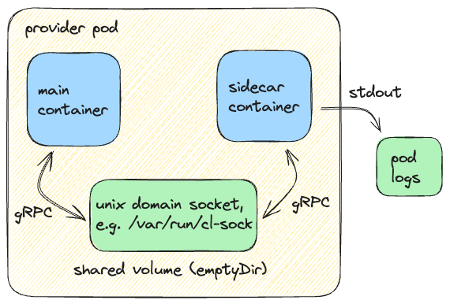

# Change Logs

* Owner: Jared Watts (@jbw976)
* Status: Proposed
* Issue: [#5477](https://github.com/crossplane/crossplane/issues/5477)

## TL;DR

* To build further trust and confidence in Crossplane, we will log every
  operation that is performed on all managed resources
* The managed reconciler will generate a record of each change made to an
  external system, as well as the full desired and observed state of the
  resource before the operation is performed
* Each change log entry will be sent over gRPC to a sidecar container in the
  provider pod, where it will be persisted as a standard pod log
* Pod logs are a very standard location that allows many different tools to view
  and interact with the change log data
* Change log data is the only content in these logs, so it can also easily be
  sent to observability systems for further processing and analysis using a
  component like the OpenTelemetry Collector

## Background

Crossplane is deployed to manage the most critical infrastructure resources for
many of the organizations that have chosen to adopt it. Crossplane acts in a
continuously reconciling loop to drive the state of external systems and
resources to match the desired state declared by a user's platform. If changes
between the observed state of the real world and the desired state from the
users are detected, Crossplane will automatically update the resources to remove
this difference.

This means that it is possible for Crossplane to make changes to external
systems even when no user is actively interacting with the control plane.
Consider the scenario when someone updates a resource outside of Crossplane,
e.g. via the AWS console or `gcloud` CLI. When Crossplane detects this
"configuration drift", it will enforce its "source of truth" to eventually
correct this unexpected change without any user interaction with the control
plane.  Currently, there is no mechanism for users of Crossplane to have
visibility into these types of "unexpected" changes that Crossplane is reverting
on their behalf.

With Crossplane acting continuously and autonomously to update critical
infrastructure, it is vital for users to have insight into the operations being
performed, so they can build and maintain a strong sense of confidence and trust
in their control planes.

There are many approaches that can (and should) be taken to build trust along
the various phases of the lifecycle of control planes and the infrastructure
that they manage, but this design will focus specifically on the observability
of changes that the control plane makes to external systems at runtime. This is
not intended to facilitate review or approve the changes before they are made,
but rather to provide an auditable record of all changes that have been
performed.

This means that Crossplane (and its Providers) should start to expose data about
all changes that the control plane is making to external systems, with as much
detail as possible so the platform team can understand what is changing, for
what reason it is changing, and the outcome of the change. With this
information, Crossplane users will be able to build deeper trust and confidence
in the operation of their control planes, as well as have forensic data
available to them in the event that an unexpected change occurs.

## Proposal

### Change Log Entry Format

The change log will be a series of individual entries that capture state about
the resources involved in every operation a provider performs on its
external system. Later in this document we will explore HOW the logs are
generated and stored, but for now we will focus on WHAT will be collected.

As a general principal, we will be collecting raw observation data that has not
been processed in any significant way. A system of the users choosing that
collects the logs entries can perform opinionated calculations, analysis, or
alerting that is specific to their operating environment.

Each entry in the change log will contain the following data:

| Field Description | Example |
|-------------------| ------- |
| Timestamp | ISO 8601 format, e.g. `2023-04-01T12:34:56Z` |
| Provider name | `xpkg.upbound.io/upbound/provider-aws-ec2:v1.8.0` |
| API Version | `ec2.aws.upbound.io/v1beta2` |
| Kind | `Instance` |
| Name | `dev-instance-bt66d` |
| External Name | `vpc-4fa03d9fb92dfec50` |
| Operation Type | `create\|update\|delete` |
| Desired/observed state of resource before operation | `{full JSON dump of resource}` which includes desired `spec.forProvider` and observed `status.AtProvider` |
| Result of operation | `success` or error object |
| (optional) Additional information that Providers can set as they choose | `map[string]string` of arbitrary key value pairs |

An additional information field is available in each change log entry for
Providers to store any provider specific data they choose. Providers are not
required to store any data at all in this field, as it is optional. As an
example of data that could be stored here, `provider-aws` could store the
specific endpoints it called to perform the given operation captured in the
change log entry.

#### Quantity of Generated Data

From testing during prototyping, a typical change log entry was found to be
around 4KB in size, including both the full desired and observed state of the
resource. To get an idea of the total quantity of data this feature is expected
to generate, we can use the below calculations for a very rough estimate:

* 1 change log entry is ~4KB
* 1000 resources changing 1x per hour
* 4KB * 1000 changes/hour * 24 hours/day = ~94MB/day

Note that this estimate can vary depending on the frequency of changes being
made to the resources, and the number of fields each resource has. This estimate
gives us a reasonable order of magnitude starting point.

Also note that we only generate change log entries when actual changes are being
made to the external resources. We do NOT generate entries for each reconcile,
which would considerably increase the amount of data generated.

### Generating Change Logs

It is a goal that the change log data is generated as close to the source of
truth as possible. All Crossplane providers, both [classic
providers](https://github.com/crossplane/provider-template) and [Upjet generated
providers](https://github.com/crossplane/upjet-provider-template) make use of
the crossplane-runtime [managed
reconciler](https://github.com/crossplane/crossplane-runtime/blob/master/pkg/reconciler/managed/reconciler.go),
which calls into each provider to do specific CUD (Create, Update, and Delete)
operations on external resources.  Therefore, the managed reconciler is the
ideal place to generate the change log entries very close to the source of
truth.

The managed reconciler calls the provider's [`ExternalClient.Observe()`
method](https://github.com/crossplane/crossplane-runtime/blob/release-1.16/pkg/reconciler/managed/reconciler.go#L914)
before any CUD operation is performed, in order to understand the current state
of the external system before the provider acts upon it. This up to date
external state will be used to populate the desired/observed state field in the
change log entry.

Some helpful pointers to where CUD operations are performed in the managed
reconciler:

* [Create](https://github.com/crossplane/crossplane-runtime/blob/release-1.16/pkg/reconciler/managed/reconciler.go#L1058)
* [Update](https://github.com/crossplane/crossplane-runtime/blob/release-1.16/pkg/reconciler/managed/reconciler.go#L1189)
* [Delete](https://github.com/crossplane/crossplane-runtime/blob/release-1.16/pkg/reconciler/managed/reconciler.go#L954)

### Storage and Durability

We consider change logs entries to be related to both security and reliability
of the control plane, and therefore we will have a fairly low tolerance for data
loss of these logs. Change logs entries will be written to a local location
immediately, so that a healthy network connection is not required at the time an
entry is generated. This local location doesn't necessarily need to be a highly
durable and persistent location itself, the key is that we don't lose any data
if we temporarily lose network connectivity while entries are being generated.

We should also minimize any effort into building a novel or specific system for
storing the change logs, so we will favor reusing built in functionality of the
control plane when possible. For example, we do not want to build any logic to
perform log rotation, compression, or other log management tasks.

Change log entries will be written to `stdout` so they can be captured by the
standard logging system of the pod they are generated from, i.e. the provider
pod, where they can benefit from all the typical conveniences of pod logs. The
change logs can then be viewed directly by entities that have read access to the
pod logs, and they can also be exported to external/centralized systems for long
term storage and further inspection and analysis. One suggested means to collect
and export the change logs is to use the [OpenTelemetry
Collector](https://opentelemetry.io/docs/collector/), but a more detailed
analysis of that setup is out of scope for this document.

#### Pod Log Benefits

Pod logs are a good option for the change log location because they:

* are very standardized, with many tools capable of reading, interacting with,
  and scraping them
* have built in management features like log rotation
* provide sufficient durability for our needs, e.g. they can survive network
  outages and pod crashes

### Flow of Change Log Entries

As mentioned in the previous section, change log entries will be written to the
pod logs. However, there is some additional structure we will build in order to
keep change logs entirely separated from the regular provider log entries, which
will aid not only with human readability, but also post processing and analysis
by the system responsible for long term storage.

Each provider pod that generates change log entries will have a sidecar
container solely responsible for receiving the entries and writing them to
`stdout` (i.e. the pod logs for the sidecar container). This sidecar container
will be listening on a gRPC connection from the main provider container. This
gRPC connection between the two containers will be established over a Unix
domain socket on a shared `emptyDir` volume mounted by both containers. This
setup allows the main provider container to send the change log entries to the
sidecar container in a fairly performant manner without needing any network
access at all.

The change log entry data will be serialized in a binary protobuf format for
transmission over the gRPC connection, while the data will be persisted to the
pod logs in a JSON serialized format.

#### Summary: Change Log Entry Flow

* The provider will have a sidecar container where each entry is sent
* Main container will communicate through gRPC with the sidecar container over a
  Unix domain socket on a shared volume
* Data is serialized in a protobuf binary format and written to the sidecar
  container logs in JSON format

### General Architecture

The general architecture of the change log system is captured in the diagram
below:



### Setup and Configuration

This feature will be declared at an
[alpha](https://docs.crossplane.io/latest/learn/feature-lifecycle/#alpha-features)
level of maturity when it is first released, meaning that Crossplane users must
opt-in to using this functionality by setting an `--enable-change-logs` feature
flag. Note this flag will need to be set on each provider for which change
logs are desired, likely via a `DeploymentRuntimeConfig`.


Providers are not capable of defining many details about their runtime
environment, for example they are not able to influence the configuration of the
`Pod` that they run in. This capability is granted to two main paths:

* `Package Manager`: During installation of a provider's package, the package
  manager specifies many configuration options and details about the
  `Deployment`, `Pod`, `ServiceAccount`, etc. that constitute the provider's
  runtime environment.
* `DeploymentRuntimeConfig`: The user can also customize some of these runtime
  details through a
  [`DeploymentRuntimeConfig`](https://docs.crossplane.io/latest/concepts/providers/#runtime-configuration)
  resource. The specific details provided by the user are merged in with the
  defaults from the package manager for a complete runtime specification.

The `DeploymentRuntimeConfig` option is appealing, because it requires no code
changes to core Crossplane and its package manager. At least while this feature
is in Alpha, we will require users that want to enable change logs to do so via
a `DeploymentRuntimeConfig` resource. A single `DeploymentRuntimeConfig` can be
reused to configure multiple providers.

Below is an example, informed by recent prototyping efforts, of what a
`DeploymentRuntimeConfig` looks like that enables change logs for a provider.
Note that it configures the sidecar container, mounts an `emptyDir` shared
volume between the main provider and sidecar containers, and enables the alpha
feature with the `--enable-change-logs` flag.

```yaml
apiVersion: pkg.crossplane.io/v1beta1
kind: DeploymentRuntimeConfig
metadata:
  name: enable-change-logs
spec:
  deploymentTemplate:
    spec:
      selector: {}
      template:
        spec:
          containers:
          - name: package-runtime
            args:
            - --enable-change-logs
            volumeMounts:
            - name: change-log-vol
              mountPath: /var/run/change-logs
          - name: change-log-sidecar
            image: crossplane/change-log-sidecar:latest
            volumeMounts:
            - name: change-log-vol
              mountPath: /var/run/change-logs
          volumes:
          - name: change-log-vol
            emptyDir: {}
```

### Implementation Rollout

The general sequence of implementation work to roll this feature out is
described below.  As previously mentioned, the plan does not include any updates
to core Crossplane to support this feature, as we will rely on a
`DeploymentRuntimeConfig` to perform the injection of the sidecar container and
the setup of a shared volume between the main provider and sidecar containers.
The key code changes we will make are in `crossplane-runtime`, a new
`change-logs-sidecar` repo, the Upjet framework and template, and the ecosystem
of providers.

* `crossplane-runtime`:
  * Protobuf types are defined for change log entries and a gRPC client/server
    to send these entries from client to server
  * Managed reconciler is updated to generate change log entries for appropriate
  events and send them to the gRPC server (i.e. sidecar container)
* `change-logs-sidecar`
  * A new repository is created to build and publish the image used in the sidecar container
  * Consumes the protobuf types from `crossplane-runtime`
  * Starts the gRPC server and listens for change log entries
  * Writes all entries to `stdout` (i.e. pod logs)
* [Upjet framework](https://github.com/crossplane/upjet):
  * Controller templates are updated to use the new `crossplane-runtime` managed
    reconciler logic and initialize it with a gRPC client
* [Upjet provider
  template](https://github.com/crossplane/upjet-provider-template):
  * Consumes this new Upjet framework version
  * [`main.go`](https://github.com/crossplane/upjet-provider-template/blob/main/cmd/provider/main.go)
    is updated to create and initialize the gRPC client and then pass it into
    the setup for all of its controllers
* The major upjet based providers (e.g. `provider-upjet-aws`,
  `provider-upjet-gcp`, `provider-upjet-azure`, etc.)
  * Updated with changes similar to the upjet provider template (consumes new
    Upjet version and creates gRPC client to pass into its controllers)
* Classic providers:
  * At least one classic provider (e.g. `provider-kubernetes` and/or
  `provider-helm`) will be updated to create/initialize the gRPC client and pass
  it into its controllers
  * The classic
    [`provider-template`](https://github.com/crossplane/provider-template)
    should be updated with these changes as well

### Assumptions

Assumptions made for this proposal include:

* Managed resources throughout the Crossplane ecosystem implement full
  `spec.forProvider` and `status.atProvider` sections so that complete desired
  and observed state is included in the change log entries simply by serializing
  the full resource.

## Future Work

The below deliverables will not be included in the initial implementation of
this feature, but should be considered in future milestones:

* The [template repo](https://github.com/crossplane/provider-template) for
  classic providers (not generated with Upjet) should be updated to include
  initializing a gRPC connection and client, passing the client to the managed
  reconciler, etc.
* A configuration flag for Providers that allows the user to directly send the
  change log entries to an alternate destination of their choosing besides the
  sidecar container via gRPC connection.  This alternative would also need to
  include specifying certificates and setting up mTLS to secure the connection.
* Tracing of a change log entry all the way from a Claim down to a cloud API
  call, as described in
  https://github.com/crossplane/crossplane/issues/5477#issuecomment-1996303810.

## Alternatives Considered

The following alternative approaches have been considered for this change logs design:

### Kubernetes Events

We could generate standard Kubernetes events with that capture all of the data
we are proposing to store for each change log entry, likely stored as
annotations on the events. However, given that we propose to store the entire
object's state as well as other data, this would likely be too large for what a
standard `Event` and its annotations, or the underlying etcd storage, would
allow. Relying on annotations also would diminish the portability and ease of
access of the data to a wide variety of tools.

### Kubernetes Audit Logs

The Kubernetes [audit
logs](https://kubernetes.io/docs/tasks/debug/debug-cluster/audit/) capture a
similar concept to the change logs feature we are proposing, but are not an
ideal fit for our goals. Some challenges that utilizing the Kubernetes audit
logs would present are:

* **Indirect data**: Instead of directly asking the providers for details about
  the operations they are performing, we would be asking the API server what is
  being done to the resources the providers are reconciling, and then having to
  make a second order inference from that. Directly asking the providers can
  give us more precise context.
* **Crossplane code changes**: The "drift correction" scenario where a provider
  detects that the observed state in the external system has drifted from the
  desired state of the user typically happens without any user interaction
  during a regular polling `Reconcile()` call, which is not in response to any
  request at the API server level. In order to capture the change caused by this
  scenario in the audit logs, we would require a change to the managed
  reconciler in order to persist this temporary status diff to the API server,
  thereby leaving an audit log artifact.
* **Performance impact**: Enabling API server auditing resulted in a 10%
  performance penalty as observed in this
  [comment](https://github.com/crossplane/crossplane/pull/5822/files#r1670571938).
* **Cost**: We've already seen reports in the past from the community of very
  expensive cloud provider bills when auditing is turned on in a control plane
  with Crossplane, e.g. https://github.com/crossplane/crossplane/issues/5074 and
  https://github.com/crossplane/crossplane/issues/3540, so requiring audit logs
  for this feature could be cost prohibitive for some users.

### OpenTelemetry Logging Events

OpenTelemetry has a concept of [logging
events](https://opentelemetry.io/docs/specs/otel/logs/event-api/#event-data-model),
but they are not a great fit either for our needs. Probably the biggest blocker
now for using otel events is that they are not very mature yet, and the Go SDK
does not yet support this concept.

### Cloud Provider Audit Logs

Most cloud providers offer some type of audit log feature that provides
information about the operations being performed on resources in their system.
However, there are a few drawbacks that prevents us from relying completely on
these logs:

* Not all systems Crossplane has providers offer these audit logs.
* Crossplane change logs will provide a homogenous experience, so it's easier to
  configure them all to go to a single pane of glass destination, compared to
  configuring Google audit logs, and AWS audit logs, and others that may be in
  use by the control plane.
* Crossplane change logs take away any guesswork as to what changes Crossplane
  made, as opposed to trying to use indirect means like cloud identity, HTTP
  user agents, or other means to identify Crossplane changes being performed.

### After Operation State Collection

We explored the option of capturing the full state of the resource both
**before** and **after** the operation is performed. We decided against also
collecting the "after" state because:

* The full state of the resource from before the operation is performed has both
  `spec.forProvider` desired state and `status.atProvider` observed state. The
  observed state is very up to date with the external system because each
  reconciliation makes a `Observe()` call. Therefore the desired vs. observed
  state is effective to determine why a change is being made.
* In the Upjet based providers, we are not likely to see a difference in
  observed state at all because they perform their operations asynchronously. A
  second `Observe()` call directly after the operation is performed would very
  likely not discover any changes at all.
* There are concerns that a second `Observe()` call could cause too many calls
  to the external API and possibly induce rate limiting or throttling.