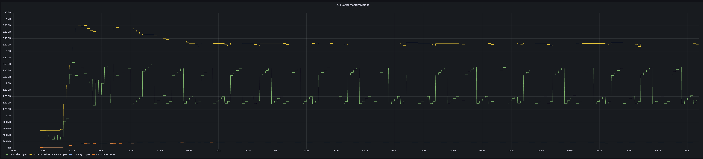
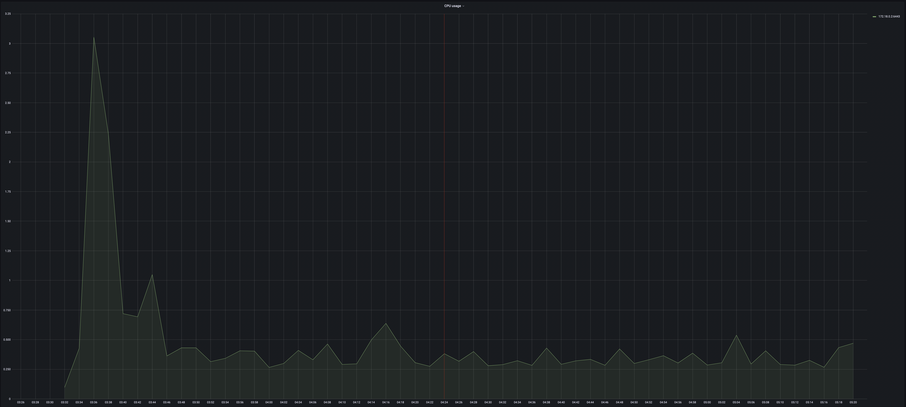
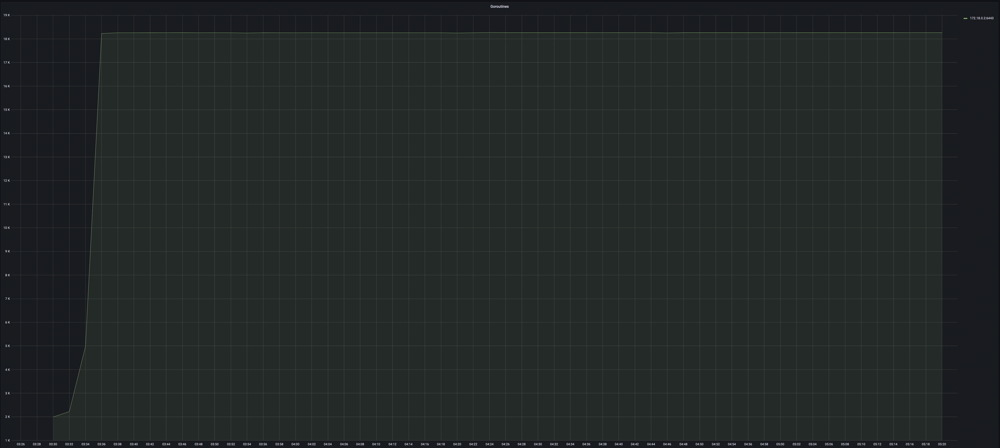

# Performance Issues of Deploying Thousands of CRDs
* Owner: Alper Rifat Uluçınar (@ulucinar)
* Reviewers: Crossplane Maintainers
* Status: Draft

## Background
With the release of the [Terrajet] based providers, the Crossplane community has
become more aware of some upstream scaling issues related to custom resource
definitions. We did some early analysis such as [[1]] and [[2]] to get a better
understanding of these issues and as we will discuss in more detail in the
“Issues” section, the broader K8s community has already been aware of especially
the client-side throttling problems for some time. It’s also not Crossplane
alone. [Azure Service Operator][aso], or [GCP Config
Connector][config-connector] are projects that rely on Kubernetes [custom
resources] as an extension mechanism and have many CRDs representing associated
Cloud resources. 

Kubernetes is a complex ecosystem with many moving parts and we need a deeper
understanding for the issues around scaling in the dimension of the total number
of CRDs per-cluster. This dimension is not yet officially considered in the
scalability thresholds document [[3]] but it will be with good probability. So,
as the Crossplane community, we would like to have our use cases considered in
relevant contexts, and we would like to gain a good understanding so that we
can:
- Establish a common understanding around relevant components and issues
- Discuss and contribute to relevant upstream discussions with the broader
  community
- Come up with tooling that can help reproducing the issues and assessing the
  effectiveness of considered solutions
- Establish a common understanding on the Crossplane scenarios and if possible,
  a set of “definition of done” criteria for the CRD scaling issues, i.e., have
  a clear expectation on the scenarios we would like to support and on the
  expected performance in those scenarios.

 

## Issues

We can categorize the issues that we observe when scaling a cluster in the
number of installed CRDs in two:
- Client-side issues: Clients of the control-plane (`kubectl`, controllers,
  etc.) experience extended delays in the requests they make. So far, our
  observation is that all the issues that we categorize as client-side issues
  are due to “client-side throttling”, and not caused by the API server itself.
  These clients can throttle the requests they make to the API server solely as
  a function of the [rate limiter] implementation they are using with no
  feedback from the server. Per our observations, the problematic client-side
  component that’s responsible for the high number of requests in a unit time
  (high request rate) is the [discovery client]. In the [Client-side
  Throttling](#client-side-throttling) section below, we will examine how
  `kubectl` behaves when there is a large number of CRDs installed in the
  cluster and how the discovery cache and the discovery client affect the
  perceived performance of the `kubectl` commands run. 
- Server-side issues: We also have some observations on the control-plane
  components such as increased resource consumption in `kube-apiserver`
  proportional to the number of CRDs we install in the cluster. While we expect
  more resources to be allocated as we install more CRDs, some detailed analysis
  presented in the [API Server Resource
  Consumption](#api-server-resource-consumption) section reveals some possible
  improvement points and some other points such as OpenAPI v3 schema sizes where
  we should be careful.


### Client-side Throttling
**NOTE**: With the following versions of `kubectl`, discovery client's rate
limiter parameters are correctly set to `(b=300, r=50.0 qps)` as detailed below
and thus, they provide a better experience especially with single provider
installations. We recommend using these or later versions of `kubectl`:

| Version   | Release Date    |
|-----------|-----------------|
| `v1.23.5` | 16th March 2022 |
| `v1.24.0` | 19th April 2022 |

`kubectl` maintains a discovery cache for the discovered server-side resources
under the (default) filesystem path of
`$HOME/.kube/cache/discovery/<host_port>/`. Here, `<host_port>` is a string
derived from the API server host and the port number it’s listening on. An
example path would be
`$HOME/.kube/cache/discovery/exampleaks_8e092dad.hcp.eastus.azmk8s.io_443`, or
`$HOME/.kube/cache/discovery/EB788B3B801893B684B4579B2ADF0171.gr7.us_east_1.eks.amazonaws.com`.
Under this cache, we have the `servergroups.json` file, which is a
JSON-serialized [`v1.APIGroupList`] object. Thus, the cache file
`$HOME/.kube/cache/discovery/<host_port>/servergroups.json` holds all of the
discovered API GroupVersions (GVs) together with their preferred versions from
that API service. And for each discovered API GroupVersion, we have a
`serverresources.json` that caches metadata about the discovered resources under
that GroupVersion, JSON-serialized as a [`v1.APIResourceList`]. This metadata
about resources is crucial for various tasks, such as: 
- Enabling [`meta.RestMapper`] implementations to map from GVRs to GVKs, or from
  GVKs to GVRs, or from partial resource specifications to potential GVRs, etc. 
- Discovery of potential GVRs based on the specified [short names][crds]
- Determining the scope of a GVR so that the associated resource path can be
  constructed properly
- Listing resources by category


The discovery client implementation is responsible for populating this cache
when:
- The cache does not yet exist on the filesystem (e.g., initial run)
- A cache entry has expired (currently the TTL is hardcoded to be [10
  minutes][discovery-cache-ttl])
- The cache is programmatically invalidated

Discovery client starts the discovery process by first
[fetching][discovery-fetch-groups] the [`v1.APIGroupList`] and then
[fetching][discovery-fetch-resources] the [`v1.APIResourceList`] for each GV
discovered in the first phase. In this second phase, the discovery client makes
[parallel requests] to the API server to fetch each [`v1.APIResourceList`].

Thus, if the discovery client needs to (re)discover the server-side resources,
it has to roughly make at least:
```
2 + <GV count> = 2 + $(kubectl api-versions | wc -l)
```
requests to the API server, assuming no errors are encountered. The initial two
HTTP GET requests are the ones to fetch the `v1.APIGroupList`s from the legacy
`/api` and `/apis` paths. Also if, for instance, a `kubectl get pods` command is
run, there will be a final request to the `/api/v1/namespaces/<namespace>/pods`
endpoint to fetch the actual `PodList` resource. As an example, with a
`provider-aws@v0.23.0` installation together with some other monitoring and
Cloud provider CRDs installed:
```bash
> kubectl api-versions | wc -l
93
```

```bash
> rm -fR  ~/.kube/cache/discovery/<host_port> && k -v=6 get pods 2>&1 | grep "GET" | wc -l
96
```
Please note that 93 of the HTTP GET requests in the above example invocation are
done in parallel. 

`kubectl@v1.24` has its discovery client configured with a
[`flowcontrol.tokenBucketRateLimiter`] with a default QPS of 50.0 and default
burst of 300.

**NOTE**: As of `kubectl` `v1.23`, the token bucket rate limiter of the
discovery client allows bursts of 100 but has a moderately low QPS parameter,
the bucket is filled only at 5.0 qps. I believe this is one of the common
misunderstandings regarding the behavior of the discovery client `kubectl` uses.
[This][discovery-tbrl-params-v1.23] has been fixed after the `v1.23.0` release,
and the fix should be available starting from `v1.24.0`. The [planned release
date][release-schedule-v1.24] for Kubernetes `v1.24` is **19th April 2022** and
the rate limiter parameters fix has not yet been cherry-picked to the other
active release branches.

In a `provider-jet-aws@v0.4.0-preview` installation, we have a total of 192 GVs
including some other external (to the Crossplane) CRDs. A measurement with the
`time` command reveals that it takes ~20.4s for `kubectl get pods` to run with
an empty discovery cache. In this scenario, the token bucket rate limiter
(b=100, r=5.0 qps) delays one of the discovery client requests for a max amount
of ~18.4s, which determines the total delay (because the [`v1.APIResource`]
discoveries for individual GVs are run in parallel). In this scenario, if we use
a token bucket rate limiter with (b=100, r=50.0 qps), then the max throttling
delay drops to ~1.8s. This in turn makes the total time spent for a `kubectl get
pods` with an empty cache drop to ~10s. It looks like we need an extra ~8s to
fully consume the response body in my setup, apart from the client-side
throttling. And with the current `v1.24` tbrl(b=300, r=50.0 qps), it takes ~10s
to run a `kubectl get pods`. Again, although not explicitly measured, we are
waiting for the API server's response body to be fully consumed, similar to the
case with tblr(b=100, r=50.0 qps). Token bucket rate limiter's throttling is no
longer the bottleneck. Also we no longer observe client-side throttling warning
logs in `kubectl@v1.24` output, as expected.

When we have `provider-jet-aws@v0.4.0-preview`,
`provider-jet-azure@v0.7.0-preview` and `provider-jet-gcp@v0.2.0-preview`
installed in a `kind` cluster (using node image `v1.23.1`) with some extra CRDs,
we have 368 GVs. `kubectl@v1.23.3` with discovery client tbrl(b=100, r=5.0 qps)
takes ~56s to run `kubectl get pods` with a cold cache, whereas a current master
build of `kubectl` with discovery client tbrl(b=300, r=50.0 qps) takes ~18s to
run the same command again with a cold cache, a threefold improvement.

With the above three providers installed on an EKS `v1.21.5-eks-bc4871b`
cluster, `kubectl@v1.23.3 get pods` takes ~50s (averaged over 5 samples) on a
cold cache, and a master build of `kubectl` takes ~29.8s to run the same command
on a cold cache. 

The following table summarizes the total execution times (averaged over 3
samples each) for running `kubectl get pods` on cold caches against:
- EKS `v1.21.5-eks-bc4871b` cluster with `provider-jet-aws@0.4.0-preview` (and
  prometheus operator and Crossplane) installed. We have 192 API GroupVersions
  in this cluster.
- EKS `v1.21.5-eks-bc4871b` cluster with `provider-jet-aws@0.4.0-preview`,
  `provider-jet-azure@v0.7.0-preview`, `provider-jet-gcp@v0.2.0-preview` (and
  prometheus operator and Crossplane) installed. We have 368 API GroupVersions
  in this cluster.

A custom build of `kubectl` that allows us to configure the discovery client's
tbrl burst size and fill rate is used for these experiments.

| tbrl(burst size, fill rate) | Single provider discovery delay | 3 providers discovery delay |
|------------------|-------|------|
| (100, 5.0 qps)   | 20.3s |  50s |
| (300, 50.0 qps)  | 9.6s | 29.8s |
| (400, 50.0 qps)  | 9.7s | 17.7s |
| (500, 100.0 qps) | 9.7s | 17.6s |
| disabled (r=-1)  | 9.8s | 17.8s |

The first two rows in the above table correspond to `kubectl@v1.23` and
`kubectl@v1.24` discovery client tbrl parameters, respectively. With a single
provider installed (a total of 192 GVs), after bumping the burst size to 300,
client-side throttling is no longer the bottleneck, as expected (i.e. `192 <
300`). And with three providers installed (a total of 368 GVs), after bumping
the burst size to 400, client-side throttling is no longer the bottleneck, again
as expected (i.e. `368 < 400`).

As an example, the following command can be used to run `kubectl get nodes` by
setting its discovery client's tbrl parameters to (b=400, r=50.0 qps):
```bash
docker run --rm -v ~/.kube/config:/.kube/config ulucinar/kubectl-tbrl:v1.24.0-alpha.3.245 --discovery-burst=400 --discovery-avg-rate=50.0 get nodes
```

To disable the discovery client's rate limiter, you can use:
```bash
docker run --rm -v ~/.kube/config:/.kube/config ulucinar/kubectl-tbrl:v1.24.0-alpha.3.245 --discovery-avg-rate=-1 get nodes
```

The increased latencies as exemplified above has the following drawbacks:
- Harms interactive user experience and degrades performance: Cluster admins
  running `kubectl` commands against their clusters
  [observe][throttling-observation] these “client-side” throttling messages,
  even if `kubectl` verbosity level is at 0.
- Has the potential to break shell scripts due to timeouts if the discovery
  phase is taking longer than anticipated
- Has the potential to break K8s controller reconciliation loops by exceeding
  reconciliation context deadlines if the initial discovery phase is taking
  longer than anticipated

Crossplane community and the broader K8s community are aware of these
client-side throttling issues and have occasionally reported related issues.
Some examples are:
- https://github.com/kubernetes/kubernetes/pull/101634
- https://github.com/kubernetes/kubectl/issues/1126
- https://github.com/crossplane/terrajet/issues/47#issuecomment-916360747


### API Server Resource Consumption
**NOTE:** The initial high [CPU][6] (and high [memory][7]) consumption issues
observed in kube-apiserver during OpenAPI v2 spec marshaling have been
[addressed][8] by doing the marshaling lazily, i.e., the OpenAPI v2 spec is not
marshaled until the first request arrives. Prior to this fix, when Crossplane
package manager is installing CRDs from a provider package, the API server has
to constantly marshal the updated OpenAPI v2 spec for each CRD registered. This
updated behavior is available in the following Kubernetes branches and patch
releases (and thereafter):

| Release Branch | Patch Version |
|----------------|---------------|
| release-1.20   | v1.20.13      |
| release-1.21   | v1.21.7       |
| release-1.22   | v1.22.4       |
| release-1.23   | v1.23.0       |


Apart from the client-side throttling issues we have described above, we also
observe increased resource (memory/CPU/goroutines, etc.) consumption when
installing CRDs, as expected. The following plot shows the [`heap_alloc_bytes`],
[`stack_sys_bytes`], [`stack_inuse_bytes`] and [`process_resident_memory_bytes`]
metrics during the time `provider-jet-aws@v0.4.0-preview` is installed into the
cluster:



And the following plot shows how CPU utilization is affected when
`provider-jet-aws@v0.4.0-preview` is installed:



Finally, here is a plot that shows how the number of Go routines in the
kube-apiserver change vs time as we install `provider-jet-aws@v0.4.0-preview`
into the cluster:



As seen in the memory metrics plot, as we install
`provider-jet-aws@v0.4.0-preview`, the resident set size (RSS) of kube-apiserver
jumps from ~600 MB to ~3.8 GB and then settles ~3.2 GB. However, the heap space
used shows the common sawtooth pattern with periodic GC activity and it looks
like we have 1.4 GB of persistent heap allocation for the 780 CRDs in the
cluster. Even when the allocated stack space is considered, we cannot account
for the ~3.2 GB of RSS of kube-apiserver process. Further investigation reveals
that starting from `v1.12`, Go runtime uses the [`MADV_FREE`] advice by
[default][golang-default-mem-advice] to release the unused memory. This implies
that even if the Go runtime releases memory pages, the Linux kernel may not
reclaim those released pages from the `kube-apiserver` process unless there is
memory pressure in the system. Thus, `MADV_FREE` provides a plausible
explanation for the large difference between `process_resident_memory_bytes` and
`(heap_alloc_bytes + stack_inuse_bytes)`.

Heap profiling data collected from the `kube-apiserver` process also supports
this hypothesis. Profiling data collected after
`provider-jet-aws@v0.4.0-preview` is installed shows that ~1.16 GB of heap space
is [allocated][kube-apiserver-heap-profile]. Some interesting observations from
the heap allocation for 780 CRDs are as follows:
- The largest hotspot (the code site where the largest chunk of heap space is
  allocated) is by far the [`zapcore.newCounters`] function. [`zap`] is a
  structured and leveled logging library written in Go, and [`zapcore`]
  implements its low-level interfaces. Further investigation reveals that
  `zapcore.newCounters` has allocated 815 objects in the process heap (where
  there are 780 CRDs) and [each allocation][zapcore-sampler-alloc] is
  `_numLevels * _countersPerLevel * (Int64 + Uint64) = 7 * 4096 * (8+8) = 448
  KB`! Thus, for 780 CRDs (plus other `zap` loggers), we are using `815 * 448 KB
  = ~356 MB` of heap space. `zapcore.newCounters` is responsible for the ~31% of
  the heap space allocated! Some deeper investigation reveals that
  `apiextensions-apiserver` uses [`apiserver.crdHandler`] to serve the `/apis`
  endpoint, and `apiserver.crdHandler` in turns embodies a
  [`customresource.CustomResourceStorage`] for each served version of a CRD.
  `customresource.CustomResourceStorage` represents the etcd v3 storage, which
  in turn embodies an etcd v3 client and that client [has][etcdv3-client-logger]
  a `zap.Logger`. These relationships reveal that we spend 448 KB of heap space
  for each version served of each CRD. That's currently roughly 5 times larger
  than the total amount of heap space needed to store the deserialized OpenAPI
  v3 schemas of `provider-jet-aws` CRDs.
- We allocate persistent (during the lifetime of an installed CRD) heap space
  that's proportional to the size of the OpenAPI v3 schema of a CRD in the
  [`SharedIndexInformer`] caches of various CRD controllers such as the
  [`establish.EstablishingController`] or the [`finalizer.CRDFinalizer`]
  controller, and for some other purposes such as CRD resource handler caches.
  Currently, for `provider-jet-aws@0.4.0-preview`, such caches consume less than
  ~80 MB of heap space.
- However, to exacerbate the situation, we have generated ~190 CRDs each with
  5000 OpenAPI v3 schema properties. Even with only 190 such CRDs, heap
  profiling [data][kube-apiserver-heap-profile-5000-props] reveals that ~5 GB of
  heap space is allocated and `zapcore.newCounters` is no longer the largest
  allocation site anymore, as expected. This profiling data better emphasizes
  allocation sites which are inflated with large (deserialized) OpenAPI v3 CRD
  schemas. One can generate such CRDs using the following command:
```
github.com/ulucinar/terrajet-scale/cmd/apigen generate -g 200 -c 200 --property-count 5000
```


## Criteria Set for Ideal State

In this section, we would like to discuss some Crossplane scenarios that we
would like to support and that involve large numbers of CRDs:

| Scenario Definition                             | Target Discovery Time on Cold-cache |
|-------------------------------------------------|:-----------------------------------:|
| Single provider (~200 GVs registered)           | ~10s                                |
| Three providers (~400 GVs registered)           | ~20s                                |


As indicated in this table, we consider two main benchmark scenarios:
1. Installation of a single provider with hundreds of CRDs: As discussed above,
   installation of a single provider, such as `provider-jet-aws` preview
   edition, results in ~190 GVs being served by the API server. With the current
   (`v1.23`) set of client-side throttling parameters of `kubectl`, this has
   adverse effects on the perceived user performance. However, situation
   improves as the burstiness and the fill rate of the token bucket rate limiter
   are increased in `kubectl@v1.24`.
2. Installation of multiple providers, such as `provider-jet-{aws,gcp,azure}`
   preview editions, into the same cluster results in ~370 GVs being served by
   the API server. Even with the updated client-side throttling parameters of
   `kubectl@v1.24`, client-side performance is severely affected. We also
   observe issues related to HA in managed control planes with such large
   numbers of CRDs.

As the Crossplane community, what we would expect in these scenarios are:
- No API service disruptions like the incidents described in [[4]] in cases
  where we have ~2000 CRDs installed.
- It takes the discovery client no more than 10s to discover all available GVs
if a single provider is installed, and no more than 20s if three providers are
installed. This would cover both the initial discovery needed by the controllers
and periodic discoveries triggered by other clients such as `kubectl`. We
propose a 10s goal for the single provider case because even if client-side
throttling is no longer the bottleneck, it looks like that the REST client needs
~8s to fully consume responses (probably another investigation and improvement
point). Similarly, for the three provider case, even if the discovery client's
rate limiter is disabled, we currently need ~18s to discover all available GVs.
These proposals are purely technical "rate limiter centric" proposals, meaning
that the proposed thresholds are the lower bounds on the end-to-end delays for
running `kubectl` commands when there is no client-side throttling for the
discovery client (e.g. disabled rate limiter, see the tbrl parameter exploration
table above). They have also been selected to satisfy common client timeout
configurations. Better alternatives could be derived from real-world use-cases
and needs.

For the 1st scenario above, we are already in a good position
[except][crossplane-2895] for GKE zonal and regional clusters as of Kubernetes
`v1.23.1`, probably due to the initial control-plane sizing chosen in their
control-planes. And regarding the client-side throttling issues, as discussed in
the "Cient-side Throttling" section above, with Kubernetes `v1.24` the token
bucket rate limiter used by the discovery client allows request bursts upto 300,
which is well above a singe provider's (`provider-jet-aws@v0.4.0-preview`) GVs
(~200 GVs). So we anticipate an improved UX with the upcoming Kubernetes
`v1.24`.

For the 2nd scenario above, we reach ~370 GVs (including some other "external"
CRDs) in the cluster, which is above the allowed burstiness of even the `v1.24`
discovery client. And again client-side throttling becomes a bottleneck if the
discovery client needs to discover the whole API (empty cache, cache
invalidation, etc.). Also even on an AKS `v1.22.4` cluster, we were not able to
install `provider-jet-{aws,gcp,azure}` `preview` editions together.

When the criteria discussed above are met for the Crossplane scenarios we
currently anticipate, and as long as we can satisfy these criteria with future
Crossplane or upstream changes, we should be in a good position.


## Testing Against the Criteria Set

One can use the simple Posix `time` utility to measure the time it takes for
`kubectl` to just establish the discovery cache:
```bash
rm -fR  ~/.kube/cache/discovery/<host_port> && time (kubectl api-resources > /dev/null)
```

A more realistic example that also performs a final HTTP GET to fetch a
`PodList` resource:
```bash
rm -fR  ~/.kube/cache/discovery/<host_port> && time (kubectl get pods > /dev/null)
```

## Summary
- On AKS and EKS clusters, we can successfully install a single large provider
(such as `provider-jet-aws@v0.4.0-preview`) with around 200 GVs, and we observe
no service disruptions. On GKE regional clusters, installation of a single large
provider succeeds (i.e., provider revision transitions to the `Healthy` state)
**but those clusters consistently cycle through 3 reconciliation phases (RUNNING
-> RECONCILING -> RUNNING -> RECONCILING -> RUNNING -> RECONCILING -> RUNNING)
shortly after the provider revision becomes healthy**. This stabilization period
for the GKE regional clusters can take ~40min and during this period we observe
intermittent failures for API server requests (such as those done with
`kubectl`), such as TLS handshake timeouts or connection timeouts. After this
stabilization period (after the managed control-plane scales up to accommodate
the CRD load), things work as expected.
- With `kubectl@v1.23.4` and older versions, we experience client-side
  throttling against a cluster where a single large provider is installed. But
  starting with the upcoming  
`kubectl@v1.24.0` and `kubectl@v1.23.5` releases, client-side throttling is no
longer the bottleneck _under normal conditions_ (for instance, no errors
encountered that would cause requests to be repeated).
- With three large providers (i.e, `provider-jet-aws@v0.4.0-preview`,
  `provider-jet-azure@v0.7.0-preview` and `provider-jet-gcp@v0.2.0-preview`), we
  have a worse situation:
  - On EKS, the initial attempt of installing `provider-jet-gcp@v0.2.0-preview`
  as the third provider failed (the corresponding provider revision being stuck
  in the installed but not-healthy state with some CRDs installed). Crossplane
  debug logs just told that the provider revision was unhealthy, and it looked
  like it was not taking any actions to recover (to be verified), or may be
  taking actions but with no sign of progress. After deleting the corresponding
  `provider.pkg` and reinstalling it, `provider-jet-gke` preview edition was
  successfully installed in ~1min. We have also observed restarts of the core
  Crossplane and RBAC manager pods due to timeouts and also OOM killings.
  Regarding the OOM killings, we may need to revisit the resource quotas put on
  these nodes for these scenarios.
  - On AKS, installation of `provider-jet-gcp@v0.2.0-preview` as the third
  provider was not possible or was progressing very slowly due to frequent
  Crossplane pod restarts (again due to timeouts while communicating with the
  control-plane).
- And according to our measurements on an EKS cluster with these three large
  providers installed, `kubectl@v1.24.0`'s discovery client tbrl parameters of
  `(b=300, r=50.0 qps)` still result in client-side throttling with a cold
  cache, but using a `b=400` prevents client-side throttling, as expected (due
  to the total API GV count in the cluster). Also, even if we completely disable
  discovery client's rate limiter, it takes ~18s to complete the discovery.

## Action Items
- We can consider [cherry-picking][cp-burst-fix] [[5]] to the release branch
  `v1.23`, as the anticipated release date for the `v1.24` release is in April,
  2022. We cannot cherry-pick it to the older release branches such as `v1.22`
  and `v1.21` because of the missing discovery burst and discovery QPS
  configuration options. Tracking Crossplane issue: [[9]]
- Open issues regarding API service disruptions for managed control-planes (GKE
  regional, AKS, EKS, etc.), where we expect high-availability. Tracking
  Crossplane issue: [[10]]
- With some insight on server-side issues, we will also need to pursue a set of
  issues in kube-apiserver and possibly in other control-plane components.
  Tracking Crossplane issue: [[11]]
- Initiate further discussions with Kubernetes [sig-scalability] community
  regarding CRD-scalability and bring agreed-upon Crossplane scenarios into
  their attention. Tracking Crossplane issue: [[12]]
- We can propose, in upstream Kubernetes community, bumping the client-go
  discovery client's burst to 300. `kubectl`'s discovery burst has already been
  bumped to 300 but the burstiness of the default discovery client is still 100.
  Clients of the API server other than `kubectl` (such as Helm) are still
  limited to make a burst of 100 discovery requests at most. A PR for bumping
  the default has been opened: [13]


## Prior Art
- Some early analysis that revealed OpenAPI spec aggregation as a point for
  potential improvement: [[1]], [[2]]
- Kubernetes scalability thresholds document: [[3]]
- GA Scale targets for CRDs:
  https://github.com/kubernetes/enhancements/tree/master/keps/sig-api-machinery/95-custom-resource-definitions#scale-targets-for-ga 
- Analysis of high CPU utilization in kube-apiserver after >700 CRDs are
  installed: https://github.com/crossplane/terrajet/issues/47
- Associated upstream issue: [[6]]
- Related upstream issue with similar observations but concentrating on high
  memory consumption during OpenAPI spec aggregation:
  https://github.com/kubernetes/kubernetes/issues/101755 
- Kermit Alexander II’s upstream OpenAPI spec lazy-marshalling fix: [[8]]
- Proposed PR to trigger OpenAPI spec marshaling after a cooldown period:
  https://github.com/kubernetes/kube-openapi/pull/278
- Core crossplane issue where we also considered two workarounds:
  https://github.com/crossplane/crossplane/issues/2649 
    - A packaging workaround for granularly packaging CRDs instead of putting
      them into one big provider (especially motivated for the terrajet-based
      providers)
    - A runtime workaround where packaging is kept intact but a ProviderConfig
      tells which CRDs in a given provider package are to be installed and their
      associated controllers be started
- Kubectl discovery client throttling issue (moved to kubectl repo):
  https://github.com/kubernetes/kubernetes/issues/105489 
- Corresponding kubectl client-side throttling issue in the kubectl repo:
  https://github.com/kubernetes/kubectl/issues/1126 
    - Closed by https://github.com/kubernetes/kubernetes/pull/105520
      ineffectively bumping discovery burst to 300 
- PR for fixing the burstiness parameter bump: [[5]] 
- A blogpost on client-side throttling from that fix’s author:
  https://jonnylangefeld.com/blog/the-kubernetes-discovery-cache-blessing-and-curse 
- An issue for making the discovery cache TTL configurable (currently hard-coded
  at 10 min): https://github.com/kubernetes/kubernetes/issues/107130 
- PR that adds “cache-ttl” flag to make the TTL configurable:
  https://github.com/kubernetes/kubernetes/pull/107141 
- Nic’s proposal (PR) to disable client-side throttling and leave rate-limiting
  to AFP: https://github.com/kubernetes/kubernetes/pull/106016 
- Nic’s message about his rate-limit disabling PR in slack:
  https://kubernetes.slack.com/archives/C0EG7JC6T/p1636491191187300 
- Discussion on the server-side issues on slack that Nic initiated:
  https://kubernetes.slack.com/archives/C0EG7JC6T/p1634838218016300 


[1]: https://github.com/crossplane/terrajet/issues/47#issuecomment-920316141
[2]: https://github.com/crossplane/terrajet/issues/47#issuecomment-920441882
[3]:
    https://github.com/kubernetes/community/blob/master/sig-scalability/configs-and-limits/thresholds.md
[4]: https://github.com/crossplane/crossplane/issues/2895
[5]: https://github.com/kubernetes/kubernetes/pull/107131
[6]: https://github.com/kubernetes/kubernetes/issues/105932
[7]: https://github.com/kubernetes/kubernetes/issues/101755
[8]: https://github.com/kubernetes/kube-openapi/pull/251
[9]: https://github.com/crossplane/crossplane/issues/2963
[10]: https://github.com/crossplane/crossplane/issues/2964
[11]: https://github.com/crossplane/crossplane/issues/3042
[12]: https://github.com/crossplane/crossplane/issues/3043
[13]: https://github.com/kubernetes/kubernetes/pull/109141

[cp-burst-fix]: https://github.com/kubernetes/kubernetes/pull/108401
[Terrajet]: https://github.com/crossplane/terrajet
[aso]: https://github.com/Azure/azure-service-operator
[config-connector]: https://github.com/GoogleCloudPlatform/k8s-config-connector
[custom resources]:
    https://kubernetes.io/docs/concepts/extend-kubernetes/api-extension/custom-resources/
[rate limiter]: https://pkg.go.dev/k8s.io/client-go/util/flowcontrol#RateLimiter
[discovery client]:
    https://pkg.go.dev/k8s.io/client-go/discovery#DiscoveryInterface
[`v1.APIGroupList`]:
    https://pkg.go.dev/k8s.io/apimachinery/pkg/apis/meta/v1#APIGroupList
[`v1.APIResourceList`]:
    https://pkg.go.dev/k8s.io/apimachinery/pkg/apis/meta/v1#APIResourceList
[`meta.RestMapper`]:
    https://pkg.go.dev/k8s.io/apimachinery/pkg/api/meta#RESTMapper
[crds]:
    https://kubernetes.io/docs/tasks/extend-kubernetes/custom-resources/custom-resource-definitions/
[discovery-cache-ttl]:
    https://github.com/kubernetes/cli-runtime/blob/09dc8675ba9e1a3291e3f4b7f83a48ecc72e8625/pkg/genericclioptions/config_flags.go#L287
[discovery-fetch-groups]:
    https://github.com/kubernetes/kubernetes/blob/d5263feb038825197ab426237b111086822366be/staging/src/k8s.io/client-go/discovery/discovery_client.go#L258
[discovery-fetch-resources]:
    https://github.com/kubernetes/kubernetes/blob/d5263feb038825197ab426237b111086822366be/staging/src/k8s.io/client-go/discovery/discovery_client.go#L267
[parallel requests]:
    https://github.com/kubernetes/kubernetes/blob/d5263feb038825197ab426237b111086822366be/staging/src/k8s.io/client-go/discovery/discovery_client.go#L363
[`flowcontrol.tokenBucketRateLimiter`]:
    https://github.com/kubernetes/kubernetes/blob/d5263feb038825197ab426237b111086822366be/staging/src/k8s.io/client-go/util/flowcontrol/throttle.go#L53
[discovery-tbrl-params-v1.23]:
    https://github.com/kubernetes/kubernetes/blob/39369f1d5432ae97668e39d6e2e5f2c5d60c0340/staging/src/k8s.io/kubectl/pkg/cmd/cmd.go#L297
[release-schedule-v1.24]:
    https://github.com/kubernetes/sig-release/tree/master/releases/release-1.24
[`v1.APIResource`]:
    https://pkg.go.dev/k8s.io/apimachinery/pkg/apis/meta/v1#APIResource
[throttling-observation]:
    https://github.com/kubernetes/kubernetes/pull/101634#issuecomment-933851060
[kube-apiserver-mem-metrics]: images/kube-apiserver-mem-metrics.png
[kube-apiserver-cpu-usage]: images/kube-apiserver-cpu-usage.png
[kube-apiserver-goroutines]: images/kube-apiserver-goroutines.png
[kube-apiserver-heap-profile]: images/kube-apiserver-heap-profile.pdf
[kube-apiserver-heap-profile-5000-props]:
    images/kube-apiserver-heap-profile-5000-props.pdf
[`heap_alloc_bytes`]:
    https://github.com/prometheus/client_golang/blob/1f81b3e9130fe21c55b7db82ecb2d61477358d61/prometheus/go_collector.go#L74
[`stack_sys_bytes`]:
    https://github.com/prometheus/client_golang/blob/1f81b3e9130fe21c55b7db82ecb2d61477358d61/prometheus/go_collector.go#L130
[`stack_inuse_bytes`]:
    https://github.com/prometheus/client_golang/blob/1f81b3e9130fe21c55b7db82ecb2d61477358d61/prometheus/go_collector.go#L122
[`process_resident_memory_bytes`]:
    https://github.com/prometheus/client_golang/blob/1f81b3e9130fe21c55b7db82ecb2d61477358d61/prometheus/process_collector.go#L95
[`MADV_FREE`]: https://man7.org/linux/man-pages/man2/madvise.2.html
[golang-default-mem-advice]:
    https://github.com/golang/go/blob/6a70ee2873b2367e2a0d6e7d7e167c072b99daf0/src/runtime/mem_linux.go#L37
[`zap`]: https://github.com/uber-go/zap
[`zapcore`]: https://pkg.go.dev/go.uber.org/zap/zapcore
[`zapcore.newCounters`]:
    https://github.com/kubernetes/kubernetes/blob/86ec240af8cbd1b60bcc4c03c20da9b98005b92e/vendor/go.uber.org/zap/zapcore/sampler.go#L42
[zapcore-sampler-alloc]:
    https://github.com/kubernetes/kubernetes/blob/86ec240af8cbd1b60bcc4c03c20da9b98005b92e/vendor/go.uber.org/zap/zapcore/sampler.go#L39
[`apiserver.crdHandler`]:
    https://github.com/kubernetes/kubernetes/blob/86ec240af8cbd1b60bcc4c03c20da9b98005b92e/staging/src/k8s.io/apiextensions-apiserver/pkg/apiserver/customresource_handler.go#L95
[`customresource.CustomResourceStorage`]:
    https://github.com/kubernetes/kubernetes/blob/86ec240af8cbd1b60bcc4c03c20da9b98005b92e/staging/src/k8s.io/apiextensions-apiserver/pkg/registry/customresource/etcd.go#L39
[etcdv3-client-logger]:
    https://github.com/kubernetes/kubernetes/blob/86ec240af8cbd1b60bcc4c03c20da9b98005b92e/vendor/go.etcd.io/etcd/client/v3/client.go#L359
[`SharedIndexInformer`]:
    https://github.com/kubernetes/kubernetes/blob/86ec240af8cbd1b60bcc4c03c20da9b98005b92e/staging/src/k8s.io/client-go/tools/cache/shared_informer.go#L186
[`establish.EstablishingController`]:
    https://github.com/kubernetes/kubernetes/blob/86ec240af8cbd1b60bcc4c03c20da9b98005b92e/staging/src/k8s.io/apiextensions-apiserver/pkg/controller/establish/establishing_controller.go#L40
[`finalizer.CRDFinalizer`]:
    https://github.com/kubernetes/kubernetes/blob/86ec240af8cbd1b60bcc4c03c20da9b98005b92e/staging/src/k8s.io/apiextensions-apiserver/pkg/controller/finalizer/crd_finalizer.go#L59
[crossplane-2895]: https://github.com/crossplane/crossplane/issues/2895
[sig-scalability]:
    https://github.com/kubernetes/community/tree/master/sig-scalability
