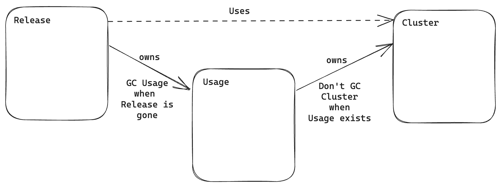

# Generic `Usage` Type for Deletion Ordering

* Owner: Hasan Türken (@turkenh)
* Reviewers: @bobh66, @negz
* Status: Draft

## Background

Crossplane is built on Kubernetes, which leans into eventual consistency. When
several things need to happen in a particular order the "Kubernetes way" is to
specify the desired end state and rely on the relevant controllers to ensure the
system eventually arrives at that state, largely through the use of constant
reconciliation (aka retries).

Take for example the creation of a VPC Network and a Subnet. The VPC must be
created and ready before a Subnet can be created within it. In Kubernetes, it’s
typical to request both resources be created at once (thereby declaring the
desired state). The creation of the Subnet will simply fail until its
dependency - the VPC - becomes available.

This loosely coupled, eventually consistent approach is simple and resilient,
but it can appear chaotic. Operations must be attempted more times than would be
necessary in a "smarter" system, and often the temporarily failing operations
will emit warnings that may be confusing or concerning to the uninitiated. Some
other systems - notably Terraform - avoid this by computing a dependency graph
before attempting to enact the desired state. This allows the system to avoid
trying operations it knows will fail due to missing dependencies until those
dependencies are expected to be satisfied.

A frequent negative side-effect of the eventually consistent approach that we
see in Crossplane is resources becoming orphaned at delete time because their
successful deletion depends on the existence of other resources which are often
deleted before their dependents. It’s possible to author a set of interdependent
resources that will eventually create successfully, but may not eventually
delete successfully.

Two variants of this problem are:

- **Orphaned Managed Resources (MRs).** Consider a Helm Release MR that is
deployed to an EKS Cluster MR. The Helm Release has a dependency on the EKS
Cluster’s connection details - it uses them as Provider credentials. If the EKS
Cluster is deleted before the Helm Release the Helm Release controller becomes
unable to connect to its Provider in order to delete the Release. In practice
the Release External Resource (ER) was implicitly deleted along with the EKS
Cluster - there’s actually no work left for the Helm release controller to do -
but it cannot know that. This results in the Helm Release MR being ‘orphaned’
in a pending deletion that can never be satisfied.

- **Orphaned ‘Side-Effect’ Resources.** Consider the same example as above, and
assume the Helm Release includes a Kubernetes Service resource of type:
LoadBalancer. A side-effect of the creation of this Service will be to create an
ELB in the EKS cluster’s VPC. This ELB is not managed by or even known to
Crossplane, and is not deleted along with the EKS cluster. This means that the
Helm Release (and therefore its Service) must be deleted before the EKS cluster
in order to ensure the EKS cluster’s controllers trigger deletion of the ELB.
If it is not, the ELB will be orphaned, costing money and blocking the deletion
of the VPC it was created in.

These problems are exacerbated by the fact that Kubernetes uses "background
cascading deletion" by default. Put otherwise, the successful deletion of a
parent resource is not dependent on the successful deletion of its children.
Instead, the parent resource will be deleted successfully and the children
(i.e. resources that declare the parent as an owner reference) will later be
deleted by the Kubernetes garbage collector. This makes it difficult to diagnose
or even notice resources that become orphaned when their parent XR is deleted.

## Goals

- Support "cross-provider" dependencies, for example an MR from provider-helm
depending on a ProviderConfig from provider-aws.
- Don’t require Crossplane users to manage fine-grained RBAC access.
- Don’t grant Crossplane providers broad RBAC access (e.g. to all other providers).

## Proposal

We propose introducing a new `Usage` type that can be used to declare usage
relationships between Crossplane resources. This type will be defined by the
Core Crossplane repository, and also be available for use as part of a
composition.

The relations defined by this type will be enforced by an admission webhook that
will be running as part of the Crossplane core. Similar to the upstreams [liens
proposal], the webhook will reject deletions of resources that are in use by
other resources with a ["409 Conflict" error code] as `metav1.Status` as part of
the admission response (not the actual http code of the admission request).

The RBAC manager already grants Crossplane RBAC access to all types in order for
it to do Composition. Therefore, there's no need for extra RBAC permissions to
interact with resources across providers.

### API

We will introduce a new `Usage` type as follows:

```yaml
apiVersion: apiextensions.crossplane.io/v1alpha1
kind: Usage
metadata:
  name: release-uses-cluster
spec:
  # Reason is optional when this Usage defines a "Dependency" type relationship,
  # i.e. when the `spec.by` field is defined.
  # It is required when the Usage is meant to be used for "Protection" purposes,
  # i.e. when the `spec.by` is NOT defined.
  reason: "Release uses Cluster"
  # Reference to the resource that is being used.
  of:
    apiVersion: eks.upbound.io/v1beta1
    kind: Cluster
    resourceRef:
      name: my-cluster
  # Reference to the resource that is using the other resource.
  # This field is optional and can be omitted when the Usage is meant to be used
  # for "Protection" purposes.
  by:
    apiVersion: helm.crossplane.io/v1beta1
    kind: Release
    resourceRef:
      name: my-prometheus-chart
```

The `spec.by` field will define the resource that will be using the resource
defined in `spec.of`. Both will support only cluster-scoped resources, namely
`Composites` and `Managed Resources`.

In this example, we define a usage relationship between a Helm `Release` and an
EKS `Cluster`. The deletion of the `Cluster` resource will be rejected as long
as this `Release` resource exists.

In addition to direct referencing with names, we will also support selectors to
match labels or controller reference. This will allow us to define usage
relationships between resources created by the same composition instance.

```yaml
apiVersion: apiextensions.crossplane.io/v1alpha1
kind: Usage
metadata:
  name: release-uses-cluster
spec:
  of:
    apiVersion: eks.upbound.io/v1beta1
    kind: Cluster
    resourceSelector:
      matchControllerRef: true
      matchLabels:
        foo: bar
  by:
    apiVersion: helm.crossplane.io/v1beta1
    kind: Release
    resourceSelector:
      matchControllerRef: true
      matchLabels:
        baz: qux
```

Another use case for `Usage` is to protect a resource from being deleted without
necessarily being used by another resource. For example, a `Usage` that will
prevent the deletion of a database instance could be defined as follows:

```yaml
apiVersion: crossplane.io/v1
kind: Usage
spec:
  reason: "Production Database - should never be deleted"
  of:
    apiVersion: rds.aws.upbound.io/v1beta1
    kind: Instance
    resourceRef:
      name: my-cluster
```

### Implementation

The implementation of this feature will be done in two parts:

1. The `Usage` type and its controller, which will manage the lifecycle of the
   resource.
2. The admission webhook that will enforce the usage relationships.

Both will be implemented in the Crossplane core repository and would not require
any changes in the providers.

#### Usage Controller

The usage controller will be responsible for managing the lifecycle of the usage
relationship by:

- Resolving selectors, if any.
- Adding owner reference from the using resource (i.e., `spec.by`) to the `Usage`.
- Adding/removing owner reference from the `Usage` resource to the used resource (i.e., `spec.of`).
- Preventing deletion of `Usage` before the using resource is deleted.
- Adding/removing `crossplane.io/in-use: true` label to ensure the `DELETE`
  request intercepted by matching the selector in admission webhook rule.

**Resolving selectors:**

The API will support defining selectors for both the using and used resource.
Initially, we will only support resolving references with the following rules:

- Resolution will be made once when the `Usage` is created.
- If multiple resources match the selector, a random one will be
  selected.

Once selectors are resolved, the controller will fill `resourceRef.name`.

Example:

```yaml
apiVersion: apiextensions.crossplane.io/v1alpha1
kind: Usage
metadata:
  name: release-uses-clusters
spec:
  of:
    apiVersion: eks.upbound.io/v1beta1
    kind: Cluster
    resourceSelector:
      matchControllerRef: true
      matchLabels:
         foo: bar
  by:
    apiVersion: helm.crossplane.io/v1beta1
    kind: Release
    resourceRef:
      name: my-prometheus-chart
```

to:

```yaml
apiVersion: apiextensions.crossplane.io/v1alpha1
kind: Usage
metadata:
  name: release-uses-clusters
spec:
  of:
    apiVersion: eks.upbound.io/v1beta1
    kind: Cluster
    resourceRef: # added by the controller based on the selectors
      name: my-cluster # added by the controller based on the selectors
    resourceSelector:
      matchControllerRef: true
      matchLabels:
         foo: bar
  by:
    apiVersion: helm.crossplane.io/v1beta1
    kind: Release
    resourceRef:
      name: my-prometheus-chart
```

The [existing policies] for resolving Managed Resource references does not
necessarily apply to the `Usage`. For example, supporting an `optional`
reference while defining a usage relationship does not make sense. Also, the
[reasoning behind] supporting different policies for MRs does not apply to
the `Usage`. However, depending on the feedback, we may consider supporting
resolve policies to configure whether the resolution should be made once or
continuously in a future iteration.

**Owner references:**

We want the `Usage` to be deleted when the using resource is deleted. This will
be achieved by adding an owner reference from the using resource to the `Usage`.

Another owner reference will be added from the `Usage` to the used resource to
prevent Garbage Collector from attempting to attempt to delete the used resource
before the `Usage` is deleted. This is mostly a mitigation for the case where
deletion process of composites, which rely on GC, could take too long because of
the exponential backoff in the Garbage Collector as a result of failed DELETE
API calls.

<div style="text-align: center;"></div>

**Preventing early deletion of the `Usage`:**

Typically, we expect a `Usage` resource to be defined as part of the same
composition as the using and used resources. This means the `Usage` will get
the delete request when the composite resource is deleted. In this case, the
controller will prevent the deletion of the `Usage` until the using resource is
deleted with the help of a finalizer.

**Adding/removing `crossplane.io/in-use: true` label:**

The admission webhook will intercept the `DELETE` requests for the used
resources with the following admission webhook rule:

```yaml
webhooks:
- name: nousages.apiextensions.crossplane.io
  objectSelector:
    matchLabels:
      crossplane.io/in-use: true
  rules:
  - operations: ["DELETE"]
    apiGroups: ["*"]
    apiVersions: ["*"]
    resources: ["*"]
    scope: "*"
```

To ensure any delete request is intercepted by our webhook for a resource that
is in use, the controller will add the `crossplane.io/in-use: true` label to the
used resource when a `Usage` is created. It is also the controller's job to
remove this labels when the `Usage` is deleted, and no other `Usage` resources
reference the same used resource.

#### Admission Webhook

The admission webhook will be responsible for intercepting the `DELETE` requests
for the used resource(s) and rejecting them with a ["409 Conflict" error code].
We will fail open in case of any errors from the webhook with
[`failurePolicy: Fail`].

The webhook will be implemented as a Kubernetes validating admission webhook
leveraging the [existing webhook machinery] in Crossplane and will be running
as part of the Crossplane core.

We will use the [Field Indexers] to efficiently query the used resource(s) when
a `DELETE` request is received.

Implementation of the core logic for the webhook handler:

```go
func (h *handler) validateNoUsages(ctx context.Context, u *unstructured.Unstructured) admission.Response {
	usageList := &v1alpha1.UsageList{}
	if err := h.reader.List(ctx, usageList, client.MatchingFields{inUseIndexKey: getIndexValueForObject(u)}); err != nil {
		return admission.Errored(http.StatusInternalServerError, err)
	}
	if len(usageList.Items) > 0 {
		return admission.Response{
			AdmissionResponse: admissionv1.AdmissionResponse{
				Allowed: false,
				Result: &metav1.Status{
					Code:   int32(http.StatusConflict),
					Reason: metav1.StatusReason(fmt.Sprintf("The resource is used by %d resource(s), including %s/%s", len(usageList.Items), usageList.Items[0].Spec.By.Kind, usageList.Items[0].Spec.By.Name)),
				},
			},
		}
	}
	return admission.Allowed("")
}
```

### User Experience

#### Defining a Usage Resource as part of a Composition

We expect a typical usage relationship to be defined as part of the same
composition as the using and used resources. In this case, the user will
define the `Usage` resource as part of the composition template.

Let's take [upbound/platform-ref-aws] as an example. In this composition, we
have a [composition for `XCluster`] which composes `XEKS` composing an EKS cluster,
and `XServices` composing a set of helm releases running on the cluster. In this
case, we will add the following resource to the same composition to define a
usage relationship between the `XServices` and the `XEKS` Composites:

```yaml
    - name: xservices-uses-xeks
      base:
        apiVersion: apiextensions.crossplane.io/v1alpha1
        kind: Usage
        spec:
          of:
            - apiVersion: aws.platformref.upbound.io/v1alpha1
              kind: XEKS
              selector:
                matchControllerRef: true
          by:
            apiVersion: aws.platformref.upbound.io/v1alpha1
            kind: XServices
            selector:
              matchControllerRef: true
```

#### Deleting a Claim or Composite which contains a Usage Relationship

**With the (default) background propagation policy**, we expect no different in user
experience. Users will be able to delete the Claim or Composite without any error. 
The Claim or Composite will be deleted immediately, and the Kubernetes garbage
collector will delete the Composed Resources together with the `Usage` resources
in the background. It will take longer until all Composed Resources are garbage
collected, however this will not be visible to the user.

**With the foreground propagation policy**, the only difference we expect is
that the deletion is taking longer than before. The user will be able to delete
the Claim or Composite without any error. The deletion of the Claim or Composite
will be blocked until all Composed Resources are deleted as before. It will take
longer because deletion of the used resource will be blocked until the used
resource hence `Usage` is deleted.

#### Directly Deleting a Composite or Managed Resource that is in Use

When trying to delete a Composite or managed resource directly, users will get
an error as follows:

```bash
Error from server (The resource is used by Release/my-release): error when deleting "my-cluster.yaml": admission webhook "nousages.apiextensions.crossplane.io" denied the request: The resource is used by Release/my-release
```

From the error message, it is clear that the resource is in use by a `Release`
resource. The user can then delete the `Release` resource and then delete the
Composite or managed resource again.

## Alternatives Considered

### Prior Art

Some alternatives considered in this [previous document], namely:

- Assume Implicit Deletion
- In-use Liens
- Composition-internal Dependencies
- Composition-ordered Dependencies
- Introduce a Global Dependency Object
- Introduce a Scoped Dependency Object
- Model Dependencies in Spec
- Dependent-managed Finalizers

Please see that document for further details on each of these alternatives.

Among these alternatives, this proposal focuses on the 
"Introduce a Global Dependency Object" option but with some implementation
differences which are explained in detail in the following section.

### Alternative Implementations with a Global `Usage` Object 

There are three distinct types of resources that we want to block the deletion
of when used by other resources:

1. A Managed Resource.
  - We control the deletion logic; we have the most power.
  - We can use an annotation or finalizer (or whatever we want) and handle the
    logic in managed reconciler for all managed resources, e.g., do not delete
    the external resource if the managed resource is in use.
2. A Composite Resource with the (default) background deletion policy.
  - We rely on the garbage collector for deletion. Composed Resources got the
    deletion request only after the Composite disappeared from the API.
  - So, we can still rely on a finalizer-based approach to block the deletion
    of the whole tree of owned (Composed) Resources.
3. A Composite Resource but with the foreground deletion policy.
  - We still rely on the garbage collector for deletion; however, Composed
    Resources got the deletion request immediately after the Composite got the
    deletion request, no matter whether it has additional finalizers or not.
  - Finalizer-based approaches wouldn't work out of the box.

So, we have three possible solutions to cover all the scenarios:

**Option A:** Block the delete request with the help of a webhook in any case.

**Option B:** When there is a dependency on a Composite Resource, resolve that
dependency down to all Composed Resources and only implement deletion prevention
logic for the Managed Resources.

**Option C:** For Composite resources, do not rely on the garbage collector by
removing owner references to delete Composed Resources and implement our custom
deletion logic.

Option C is not ideal because it requires us to implement our custom deletion
logic for Composites, and will break the tools using owner references
(e.g. ArgoCD) to track the relationship between Composites and Composed
Resources.

If we try to make a comparison between the other two approaches:

|  | Option A: Webhook & Reject Delete Requests | Option B: Delay Deletion Until No Usage with Resolved `Usages` |
|-------------------|--------------------------------------------|----------------------------------------|
| Implementation Complexity | Easier to implement, fewer complexities to handle during development. | More complex to implement due to the need to _continuously_ resolve dependencies to XRs down to nested XRs and MRs .  |
| User Experience | Provides immediate feedback, but users need to manually retry deletion after all usages are gone.  | Users do not need to manually retry deletions, which may be smoother, but the delay in deletion might be confusing if not properly communicated. |
| Alignment with the Kubernetes Philosophy | Aligned with Kubernetes' Liens KEP (still open), which advocates for proactive protection against deletion. | Aligned with Kubernetes' philosophy of eventual consistency and the existing behavior of PV/PVC protection and Crossplane ProviderConfigUsage. |
| Scalability | Scales better since it will require one `Usage` per XR. | Ends up with multiple `Usages` per XR and can grow quickly when there are nested XRs or multiple dependencies on the same parent. |
| User Error Protection | The upfront rejection of deletion requests can prevent accidental deletion when there are still usages. | While deletion will eventually occur when all usages are gone, there could be a risk of unintended consequences during the delay period. |
| Debugging/Troubleshooting | Easier to debug since only `Usage`s created by the user exists, and resources won't have deletion timestamp. | More difficult to debug since further `Usage`s created by the controllers, and it is not easy to identify whether a resource is being deleted or waiting for dependencies to be gone at a given moment.  |
| Ease of Rollout | Easier, only requires changes in the XP repo. | Requires changes in XP, runtime, and providers needs to be updated. |

Especially considering that there is no clear agreement in upstream, we
believe _it could be good to choose a practical approach and start with the
simpler solution, namely the webhook-based solution_. We think it's better to
start with the simple option, and then, if we find out that it's not enough, we
can think about changing to a more complex solution. If we check the above table,
it is clear that the webhook-based solution is the simpler one.

If we decide to change the underlying implementation later, we don't expect
an API change except getting rejected deletes vs. not. This also provides us a
good opportunity to test the webhook-based solution in the field and gather
feedback from the community before committing to a more complex solution.

[liens proposal]: https://github.com/kubernetes/enhancements/pull/2840
["409 Conflict" error code]: https://datatracker.ietf.org/doc/html/rfc2616#section-10.4.10
[existing policies]: https://github.com/crossplane/crossplane-runtime/blob/23eaff94e7385121bca832955c8885f925f55ae6/apis/common/v1/resource.go#L80
[reasoning behind]: https://github.com/crossplane/crossplane-runtime/pull/328
[webhook rules]: https://kubernetes.io/docs/reference/access-authn-authz/extensible-admission-controllers/#matching-requests-rules
[`failurePolicy: Fail`]: https://kubernetes.io/docs/reference/access-authn-authz/extensible-admission-controllers/#failure-policy
[existing webhook machinery]: https://github.com/crossplane/crossplane/pull/2919
[Field Indexers]: https://pkg.go.dev/sigs.k8s.io/controller-runtime/pkg/client#FieldIndexer
[previous document]: https://docs.google.com/document/d/1Yu3GxNMJOOMWMjD6gEw5QtT8Fz5qQSyo18ZZFKqcqKw
[upbound/platform-ref-aws]: https://github.com/upbound/platform-ref-aws/tree/v0.6.0
[composition for `XCluster`]: https://github.com/upbound/platform-ref-aws/blob/v0.6.0/package/cluster/composition.yaml