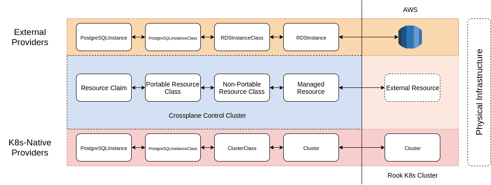

# Kubernetes-Native Providers
* Owner: Dan Mangum (@hasheddan)
* Reviewers: Crossplane Maintainers
* Status: Draft

## Introduction

Currently, all infrastructure provider stacks manage resources by creating an
external resource and keeping it in sync with a Kubernetes custom resource
(managed resource) in the Crossplane control cluster. CRUD operations are
executed on external resources using the API provided by the infrastructure
provider. However, there are a number of Kubernetes-native infrastructure
providers, with more being created every day, that only expose their APIs via
the Kubernetes API. As opposed to provisioning resources externally on
provider-owned infrastructure, a Kubernetes-native provider provisions resources
in-cluster, meaning that they can run on-premises or anywhere else you may be
running a Kubernetes cluster. This document proposes a common pattern for stacks
that utilize the Kubernetes client as their API. Motivation for this design
comes from the desire to support [Rook] as a provider in Crossplane.

Using the Kubernetes API to create objects in a controller's reconcile loop is
not a foreign concept in Crossplane. Existing claim reconcilers create a
Kubernetes object to represent the external resource. However, Kubernetes-native
providers differ in that the external resource is actually a Kubernetes object
itself. This concept is also not new in Crossplane, as [complex workloads]
operate in this manner. `KubernetesApplication` instances are first scheduled to
a Kubernetes cluster by the [scheduler controller], which causes them to pass
the predicates of the application controller. It uses the template(s) in the
`KubernetesApplication` instance to create one or more
`KubernetesApplicationResource` objects, which are then picked up by the managed
resource controller. It is responsible for actually creating the
Kubernetes-native (e.g. `Deployment`, `ConfigMap`, etc.) objects in the target
cluster, then managing them as a managed reconciler does for an external
resource. In this scenario, the Kubernetes-native objects are the external
resources.

## Goals

* Design an infrastructure stack that allows for in-cluster storage provisioning
  using Rook
* Create a common pattern that can be used across infrastructure stacks (and
  potentially the existing complex workload controllers) that utilize the
  Kubernetes API as the infrastructure provider API

## Differences from `KubernetesApplication`

While the `KubernetesApplication` pattern detailed above provides a starting
point for this design, a key difference is that `KubernetesApplication` does not
adhere to the separation of concern structure of other Crossplane resources
because Kubernetes resources are not modeled in a `claim <-> portable class <->
non-portable class <-> managed <-> external` workflow. Kubernetes-native
infrastructure resources, on the other hand, *should* be modeled with the same
separation of concern that other cloud-provider resources expose.

In addition, `KubernetesApplication` resources currently can only be scheduled
to Kubernetes clusters that were provisioned using Crossplane. This is due to
the fact that scheduling is accomplished by looking up `KubernetesCluster`
objects by label. This pattern prohibits the ability to schedule Kubernetes
resources to either the Crossplane control cluster or any preexisting cluster
that was not provisioned using Crossplane. This type of support is imperative
for Kubernetes-native infrastructure providers and can also be added for
`KubernetesApplication` resources by introducing a Crossplane Kubernetes
`ProviderConfig` custom resource.

## Proposal: Kubernetes `ProviderConfig` Kind

Existing infrastructure stacks such as AWS and GCP install a `ProviderConfig` custom
resource into the Crossplane control cluster which references a `Secret` that
contains credentials to authenticate with the cloud provider API. For example, a
GCP `ProviderConfig` may look as follows:

```yaml
---
# GCP Admin service account secret - used by GCP Provider
apiVersion: v1
kind: Secret
metadata:
  name: example-provider-gcp
  namespace: gcp-infra-dev
type: Opaque
data:
  credentials.json: BASE64ENCODED_GCP_PROVIDER_CREDS
---
# GCP Provider with service account secret reference - used to provision cache resources
apiVersion: gcp.crossplane.io/v1beta1
kind: ProviderConfig
metadata:
  name: example
  namespace: gcp-infra-dev
spec:
  credentialsSecretRef:
    name: example-provider-gcp
    key: credentials.json
  projectID: PROJECT_ID
```

Any GCP resource can then reference the `ProviderConfig`, which provides the necessary
information to the resource controller so that Crossplane can manage it.
`KubernetesApplication` resources and Kubernetes-native infrastructure providers
provision resources using the Kubernetes API rather than a cloud provider API.
Currently, the `KubernetesApplicationResource` controllers obtain credentials to
a Kubernetes cluster by reading the `Secret` that Crossplane creates when a
`KubernetesCluster` resource is created. However, this is just one example for
how a user may want to provision resources on a Kubernetes cluster. There are
three main scenarios, each which can be enabled by the introduction of a
Kubernetes `ProviderConfig` kind.

Managing Kubernetes resources in a **Crossplane provisioned external cluster**:
1. Provision a `KubernetesCluster` resource claim.
```yaml
apiVersion: compute.crossplane.io/v1alpha1
kind: KubernetesCluster
metadata:
  name: demo-cluster
  namespace: my-infra-dev
spec:
  writeConnectionSecretToRef:
    name: demo-cluster-creds
```    
2. Create a Kubernetes `ProviderConfig` whose `credentialsSecretRef` references the
   `KubernetesCluster` `writeConnectionSecretToRef`.
```yaml
apiVersion: kubernetes.crossplane.io/v1beta1
kind: ProviderConfig
metadata:
  name: demo-k8s-provider
  namespace: my-infra-dev
spec:
  credentialsSecretRef:
    name: demo-cluster-creds
```
3. Provision your Kubernetes resource using the aforementioned `ProviderConfig`.

Managing Kubernetes resources in an **existing external cluster**:
1. Create a Kubernetes `ProviderConfig` whose `credentialsSecretRef` references a hand
   curated `Secret` using the same format as that of a `KubernetesCluster`
   claim.
```yaml
---
apiVersion: v1
kind: Secret
metadata:
  name: demo-cluster-creds
  namespace: my-infra-dev
type: Opaque
data:
  endpoint: MY_K8S_ENDPOINT
  username: MY_K8S_USERNAME
  password: MY_K8S_PASSWORD
  clusterCA: MY_K8S_CLUSTER_CA
  clientCert: MY_K8S_CLIENT_CERT
  clientKey: MY_K8S_CLIENT_KEY
  token: MY_K8S_TOKEN
---
apiVersion: kubernetes.crossplane.io/v1beta1
kind: ProviderConfig
metadata:
  name: demo-k8s-provider
  namespace: my-infra-dev
spec:
  credentialsSecretRef:
    name: demo-cluster-creds
```
2. Provision your Kubernetes resource using the aforementioned `ProviderConfig`.

Managing Kubernetes resources in the **Crossplane control cluster**:
1. Create a Kubernetes `ServiceAccount` and grant it the RBAC permissions
   required to execute necessary Kubernetes actions.
```yaml
apiVersion: v1
kind: ServiceAccount
metadata:
  name: my-service-account
---
apiVersion: rbac.authorization.k8s.io/v1
kind: ClusterRole
metadata:
  name: my-role
rules:
- apiGroups:
  - ""
  resources:
  - events
  verbs:
  - create
  - update
  - patch
  - delete
- apiGroups:
  - ""
  resources:
  - secrets
  - deployments
  verbs:
  - get
  - list
  - watch
  - create
  - update
- apiGroups:
  - minio.rook.io
  - cockroachdb.rook.io
  resources:
  - "*"
  verbs:
  - "*"
---
apiVersion: rbac.authorization.k8s.io/v1
kind: ClusterRoleBinding
metadata:
  name: my-role-binding
roleRef:
  apiGroup: rbac.authorization.k8s.io
  kind: ClusterRole
  name: my-role
subjects:
- kind: ServiceAccount
  name: my-service-account
  namespace: my-infra-dev
```
2. Create a Kubernetes `ProviderConfig` whose `credentialsSecretRef` references the
   aforementioned `ServiceAccount` token.
```yaml
apiVersion: kubernetes.crossplane.io/v1beta1
kind: ProviderConfig
metadata:
  name: demo-k8s-provider
  namespace: my-infra-dev
spec:
  credentialsSecretRef:
    # Get secret name from service account
    name: my-service-account-secret
```
3. Provision your Kubernetes resource using the aforementioned `ProviderConfig`.

## Workflow Design for Kubernetes-Native Infrastructure Providers

### Portable Resources

The general design from a user experience perspective should differ very little
from utilizing any other infrastructure provider stack. Developers should be
able to request the creation of an abstract resource type via a claim, and
cluster administrators should be able to define the classes of service available
to satisfy that claim kind.

As an example, Rook provides the option to run [CockroachDB] in a Kubernetes
cluster. Assuming you have installed the Rook CockroachDB operator into a
cluster, you should be able to dynamically provision a CockroachDB cluster into
the Kubernetes cluster from your Crossplane control cluster. The experience
would look as follows:

1. Create a Kubernetes `ProviderConfig` for target cluster (using one of scenarios
   outlined above):

```yaml
---
apiVersion: kubernetes.crossplane.io/v1beta1
kind: ProviderConfig
metadata:
  name: demo-k8s-provider
  namespace: my-infra-dev
spec:
  credentialsSecretRef:
    name: demo-cluster-creds
```

2. Create a non-portable Rook CockroachDB `ClusterClass` that references the
   `ProviderConfig` in its `providerConfigRef`:

```yaml
apiVersion: cockroachdb.rook.crossplane.io/v1alpha1
kind: ClusterClass
metadata:
  name: rook-cockroachdb
  namespace: rook-infra-dev
specTemplate:
  providerConfigRef:
    name: demo-k8s-provider
    namespace: my-infra-dev
  # full documentation on all available settings can be found at:
  # https://rook.io/docs/rook/master/cockroachdb-cluster-crd.html
  scope:
    nodeCount: 3
    # You can only have one PersistentVolumeClaim in this list!
    volumeClaimTemplates:
    - metadata:
        name: rook-cockroachdb-data
      spec:
        accessModes: [ "ReadWriteOnce" ]
        # Uncomment and specify your StorageClass, otherwise
        # the cluster admin defined default StorageClass will be used.
        #storageClassName: "your-cluster-storageclass"
        resources:
          requests:
            storage: "1Gi"
  network:
    ports:
    - name: http
      port: 8080
    - name: grpc
      port: 26257
  secure: false
  cachePercent: 25
  maxSQLMemoryPercent: 25
  # A key/value list of annotations
  annotations:
  #  key: value
```

3. Create a portable `PostgreSQLInstanceClass`:

```yaml
apiVersion: database.crossplane.io/v1alpha1
kind: PostgreSQLInstanceClass
metadata:
  name: postgresql-standard
  namespace: app-project1-dev
classRef:
  kind: ClusterClass
  apiVersion: cockroachdb.rook.crossplane.io/v1alpha1
  name: rook-cockroachdb
  namespace: rook-infra-dev
```

4. Create a `PostgreSQLInstance` claim:

```yaml
apiVersion: database.crossplane.io/v1alpha1
kind: PostgreSQLInstance
metadata:
  name: app-postgresql
  namespace: app-project1-dev
spec:
  classRef:
    name: postgresql-standard
  writeConnectionSecretToRef:
    name: postgresqlconn
  engineVersion: "12"
```

On creation of the `PostgreSQLInstance` claim, the claim controller would
configure and create a `Cluster` (`cockroachdb.rook.crossplane.io/v1alpha1`)
instance. Then, the managed controller would use the Crossplane `Cluster`
instance to create a `Cluster` (`cockroachdb.rook.io/v1alpha1`) in the target
Kubernetes cluster where the Rook CockroachDB operator is installed. This
workflow is similar to dynamic provisioning in a typical infrastructure
provider:



### Non-Portable Resources

Some resources exposed by Kubernetes-native infrastructure providers may not be
initially supported by dynamic provisioning. This is true for existing
infrastructure stacks as well, as types like `VirtualNetwork` in Azure can be
provisioned statically, but not in the dynamic `claim <-> class` pattern. These
types of resources may eventually be supported by portable claim types in core
Crossplane.

An example of this type of resource for Rook would be a [Minio] `ObjectStore`.
While Crossplane does support a `Bucket` claim type for dynamic provisioning of
object storage, the Minio `ObjectStore` type is actually setting up a storage
service, much like AWS S3. Once an `ObjectStore` is provisioned, individual
object storage "buckets" can be created. However, Rook does not currently expose
a Kubernetes custom resource kind to provision buckets in the Minio object
store, so buckets must be created directly by interacting with the Minio API.

For an initial implementation of the Rook stack, users should be able to
provision Minio `ObjectStores` statically, but support for creating buckets in
that object store will likely either be deferred to a later implementation (see
[Future Considerations]). 

It may also be desirable to create an `ObjectStore` claim type in Crossplane in
order to be able dynamically provision `ObjectStores` in Rook. However, like the
networking types in other stacks, it is likely not a pressing issue to support
dynamic provisioning for this resource type in the initial implementation.

## Technical Design

### The Kubernetes ProviderConfig Kind

The Kubernetes `ProviderConfig` kind will be implemented in core Crossplane in a new
API group: `kubernetes.crossplane.io`. This will allow it to be used by core
Crossplane custom resources as well as Kubernetes-native infrastructure stacks
like Rook.

### Kubernetes-Native Provider Stacks

Kubernetes-native provider stacks, such as Rook, should utilize the same shared
reconcilers that existing infrastructure stacks do, but instead of implementing
their own `ProviderConfig` kind, would utilize the core Crossplane Kubernetes
`ProviderConfig`. 

#### Claim Reconciler

The claim controllers could use the same shared [claim reconciler] that other
existing infrastructure stacks use currently, providing their own
`ManagedConfigurators` to configure the managed resource instance using the
referenced class.

#### Managed Reconciler

Kubernetes-native infrastructure providers can make use of the shared managed
reconciler in `crossplane-runtime` in the same manner as traditional
infrastructure providers. However, instead of creating a new client for a cloud
provider API, Kubernetes-native infrastructure providers will return a
Kubernetes client that is configured to talk to the target cluster using the
`providerConfigRef` to a Crossplane Kubernetes `ProviderConfig` object. 

## Future Considerations

### Provisioning Buckets in Rook `ObjectStores`

The ability to provision buckets in the `ObjectStore` options provided by Rook
will need to be supported in the future. Three main options to implement this
functionality include waiting until the functionality is natively added to Rook,
exposing a Crossplane concept of a Rook bucket via controller logic, or the
implementation of a Minio stack. Deferring the functionality to Rook
implementation would allow for `Buckets` to be created in the traditional manner
by the stack, but the remaining two options create additional complexity.

If using controller logic, the workflow would look as follows:

1. Install the Rook stack into the Crossplane control cluster and create a
   Kubernetes `ProviderConfig` kind to connect to a target cluster where the Rook
   Minio operator has been installed. 
1. Create an `ObjectStore` (`minio.rook.crossplane.io`) in Crossplane, which
   will statically provision an `ObjectStore` (`minio.rook.io`) in the target
   cluster (additional object storage provider types, including [EdgeFS] and
   [Ceph], are also exposed by Rook).
1. The `ObjectStore` controller should write any required connection secrets to
   a Kubernetes `Secret` in the Crossplane control cluster.
1. The Rook stack should expose an additional `ProviderConfig`
   (`objectstore.rook.crossplane.io`) kind that can reference the aforementioned
   `Secret`. Create a `ProviderConfig` of this kind.
1. The Rook stack should also expose `Bucket` and `BucketClass` resources that
   reference a Rook object store `ProviderConfig`. A `Bucket` may now be provisioned
   either dynamically using a `Bucket` claim type or the Rook `Bucket` kind
   directly.

If using a separate Minio stack, the workflow would look as follows:

1. Install the Rook stack and the Minio stack into the Crossplane control
   cluster and create a Kubernetes `ProviderConfig` kind to connect to a target
   cluster where the Rook and Minio operators have been installed. 
1. Create an `ObjectStore` (`minio.rook.crossplane.io`) in Crossplane, which
   will statically provision an `ObjectStore` (`minio.rook.io`) in the target
   cluster.
1. The `ObjectStore` controller should write any required connection secrets to
   a Kubernetes `Secret` in the Crossplane control cluster.
1. The Minio stack should expose a `ProviderConfig` (`minio.crossplane.io`) kind that
   can reference the aforementioned `Secret`. Create a `ProviderConfig` of this kind.
1. The Minio stack should also expose `Bucket` and `BucketClass` resources that
   reference a Minio `ProviderConfig`. A `Bucket` may now be provisioned either
   dynamically using a `Bucket` claim type or the Minio `Bucket` kind directly.

Though the Minio stack strategy is somewhat cumbersome in that multiple
Crossplane stacks must be installed in order to provision consumable object
storage using Rook, it is more in-line with the structure of the Crossplane
stack isolation model. In contrast, using controller logic in the Rook stack to
provision buckets would be a divergence from our desire to model provider APIs
in a high-fidelity manner. **For this reason, either waiting for support to be
natively provided by Rook or creating a separate Minio stack appears to be the
sensible direction forward.**

### Stack Bundles

If a separate Minio stack were to be implemented as detailed above, it may
improve user experience to provide the ability to install multiple stacks
together. This could either be exposed through releasing bundled distributions
(i.e. Rook with Minio / Ceph / EdgeFS / etc.) or via a [Crossplane CLI] command.

### More Sophisticated Scheduling

It is possible that we will want to be able to schedule Kubernetes-native
infrastructure resources in a more intelligent manner than the currently
proposed `providerConfigRef` pattern. This could include implementing scheduling
policies that allow for resources to be provisioned based on geography, resource
requirements, etc. An initial scheduler implementation may look similar to the
updated `KubernetesApplication` scheduler controller, as outlined in [crossplane
#859]. Because the scheduling behavior for most Kubernetes-native infrastructure
components will look very similar, a shared scheduler reconciler could be added
to [crossplane-runtime]. In fact, the `KubernetesApplication` scheduler
controller may also be able to make use of the shared `crossplane-runtime`
scheduler reconciler after it is implemented.

### Automatic Operator Installation

For any Kubernetes-native provider, there must be an operator installed in the
target cluster for the resources to be provisioned. However, it would be nice to
be able to provision resources in a cluster where the operator is not currently
installed. This could be implemented by checking if the operator exists in the
target cluster in the managed reconciler's `Create` method, and installing it if
not. This may not be part of initial implementation, but should definitely be
tracked and supported.

### Generalized Managed Reconciler

Though this design is motivated by the desire to support Rook, the pattern can
be generalized to be applicable to other Kubernetes-native infrastructure
providers. While most existing infrastructure provider stacks must create a
client wrapper library to use the CRUD functions of the provider API, every
Kubernetes-native infrastructure stack will use the [client-go] SDK for CRUD
operations. Therefore, the pluggable `Observe`, `Create`, `Update`, `Delete`
functions in the [crossplane-runtime] can likely have a common implementation
for some Kubernetes-native infrastructure stacks.

This can be done via generic `NativeConnecter` and `nativeExternal` types in
`crossplane-runtime`. Similar to the `clusterConnecter` in the
`KubernetesApplicationResource` controller, it would get the cluster connection
information of the Kubernetes cluster that the managed resource was scheduled to
by the scheduler controller, then return a `nativeExternal` type that implements
the `ExternalClient` interface. Because external client functions will
essentially be making sure the "external resource" in the target cluster matches
the "managed resource" (i.e. they should be nearly identical Kubernetes
resources), it should be possible to have generic implementations of the
`ExternalClient` functions. However, if it proves difficult to do so, or it just
does not work for a specific resource type, manual implementation of the
`connecter` and `external` types would always be possible, just as they are for
existing infrastructure stacks.

Implementation of the shared managed reconciler for the managed CockroachDB
`Cluster` controller (`cockroachdb.rook.crossplane.io/v1alpha1`) if a
`nativeExternal` type was able to be utilized could look as follows:

```go
func (c *ClusterController) SetupWithManager(mgr ctrl.Manager) error {
  r := resource.NewManagedReconciler(mgr,
    resource.ManagedKind(v1alpha1.ClusterGroupVersionKind),
    resource.WithExternalConnecter(&resource.NativeConnecter{client: mgr.GetClient(), kind: v1alpha1.Cluster}))

  name := strings.ToLower(fmt.Sprintf("%s.%s", v1alpha1.ClusterGroupKind, v1alpha1.Group))

  return ctrl.NewControllerManagedBy(mgr).
    Named(name).
    For(&v1alpha1.Cluster{}).
    Complete(r)
}
```

## Relevant Issues

- [crossplane-runtime #22]: Allow existing resources to be "imported" into Crossplane to be managed
- [crossplane-runtime #34]: Automatically install required operators in target cluster if not present
- [crossplane #859]: Use Kubernetes Provider kind instead of KubernetesCluster for KubernetesApplications

[Rook]: https://github.com/rook/rook
[complex workloads]: design-doc-complex-workloads.md
[CockroachDB]: https://github.com/cockroachdb/cockroach
[Minio]: https://min.io/
[EdgeFS]: http://edgefs.io/
[Ceph]: https://ceph.io/
[Future Considerations]: #future-considerations
[Crossplane CLI]: https://github.com/crossplane/crossplane-cli
[client-go]: https://github.com/kubernetes/client-go
[managed reconciler]: https://github.com/crossplane/crossplane/blob/14fa6dda6a3e91d5f1ac98d1020a151b02311cb1/pkg/controller/workload/kubernetes/resource/resource.go#L401
[claim reconciler]: https://github.com/crossplane/crossplane-runtime/blob/master/pkg/resource/claim_reconciler.go
[scheduler controller]: https://github.com/crossplane/crossplane/blob/master/pkg/controller/workload/kubernetes/scheduler/scheduler.go
[crossplane-runtime]: https://github.com/crossplane/crossplane-runtime
[crossplane-runtime #22]: https://github.com/crossplane/crossplane-runtime/issues/22
[crossplane-runtime #34]: https://github.com/crossplane/crossplane-runtime/issues/34
[crossplane #859]: https://github.com/crossplane/crossplane/issues/859
