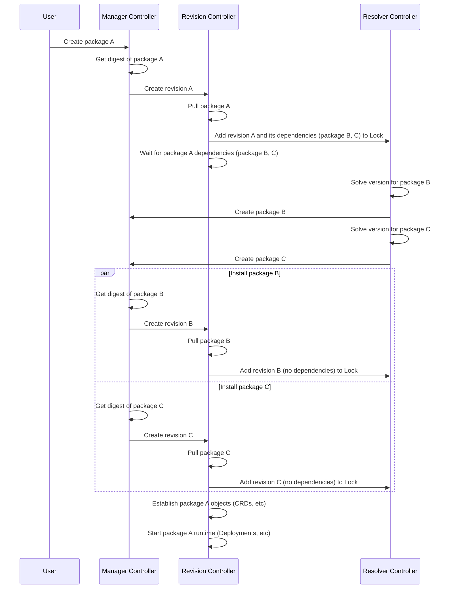

# Moving Package Dependencies

* Owner: Nic Cope (@negz)
* Reviewers: Hasan Turken (@turkenh), Philippe Scorsolini (@phisco)
* Status: Accepted

## Background

Crossplane packages can express dependencies on other packages. Crossplane uses
this to automatically install a package's dependencies.

Consider a Configuration that packages a Composition of managed resources (MRs).
The Configuration can depend on the Providers that implement those MRs.
Crossplane will automatically install the Providers before installing the
Configuration.

Crossplane packages are uniquely identified by OCI reference. Typically this is
a registry, organization, repository, and semantic version tag. For example
`xpkg.upbound.io/crossplane-contrib/configuration-getting-started:v0.2.0`.

Today the package manager can't handle dependencies that have moved -
dependencies that have a new OCI reference. Dependencies move for one of two
reasons.

The first reason is a package maintainer who wants to rename the package's
authoritative organization or repository. For example the maintainer wants to
move `crossplane-contrib/configuration-getting-started` to
`crossplane-contrib/configuration-get-started`, or
`crossplane/configuration-get-started`.

The second reason is package replication. For example you want to replicate
`xpkg.upbound.io/crossplane-contrib/configuration-getting-started` and all of
its dependencies to `acme.co/crossplane-contrib/configuration-getting-started`.
The authoritative OCI `xpkg.upbound.io` dependency references still exist, but
you expect Crossplane to pull the dependencies from the same registry as the
dependent. Many Crossplane users replicate packages to internal OCI registries
in order to comply with organizational policies.

A package's author configures its dependencies. The dependencies are expressed
in the package's metadata - its `crossplane.yaml` file. For example:

```yaml
apiVersion: meta.pkg.crossplane.io/v1
kind: Configuration
metadata:
  name: configuration-getting-started
  annotations:
    meta.crossplane.io/maintainer: Upbound <support@upbound.io>
    meta.crossplane.io/source: github.com/upbound/configuration-getting-started
    meta.crossplane.io/license: Apache-2.0
spec:
  crossplane:
    version: ">=v1.15.2"
  dependsOn:
    - provider: xpkg.upbound.io/crossplane-contrib/provider-nop
      version: "v0.2.1"
    - function: xpkg.upbound.io/crossplane-contrib/function-kcl
      version: "v0.8.0"
    - function: xpkg.upbound.io/crossplane-contrib/function-auto-ready
      version: "v0.2.1"
```

The below sequence diagram illustrates how Crossplane resolves package
dependencies.



When you install a package, three controllers cooperate to reconcile it:

* The manager controller
* The revision controller
* The resolver controller

The manager controller determines the package's OCI digest by making a HEAD
request to the registry, and ensues a package revision exists for that digest.

The revision controller pulls, caches, and unpacks the package's OCI image from
the registry. A package is ultimately a YAML stream beginning with package
metadata, and followed by zero or more packaged resources - CRDs, XRDs, or
Compositions. The revision controller creates the packaged resources. It also
creates the package's runtime (e.g. a Provider's Deployment), where appropriate.

The revision controller adds the package and its dependencies to the package
lock. The package lock is a singleton resource that always exists in any control
plane. The revision controller adds the package before it creates its packaged
resources, or its runtime. It doesn't create the packaged resources or runtime
until it sees that all of the package's dependencies have been installed.

Given the above Configuration, the package lock looks like this:

```yaml
apiVersion: pkg.crossplane.io/v1beta1
kind: Lock
metadata:
  name: lock
packages:
- name: upbound-configuration-getting-started-26746e8e7abb
  type: Configuration
  source: xpkg.upbound.io/upbound/configuration-getting-started
  version: v0.2.0
  dependencies:
  - constraints: v0.2.1
    package: xpkg.upbound.io/crossplane-contrib/provider-nop
    type: Provider
  - constraints: v0.8.0
    package: xpkg.upbound.io/crossplane-contrib/function-kcl
    type: Function
  - constraints: v0.2.1
    package: xpkg.upbound.io/crossplane-contrib/function-auto-ready
    type: Function
- name: crossplane-contrib-provider-nop-ecc25c121431
  type: Provider
  source: xpkg.upbound.io/crossplane-contrib/provider-nop
  version: v0.2.1
  dependencies: []
- name: crossplane-contrib-function-kcl-881c80e51634
  type: Function
  source: xpkg.upbound.io/crossplane-contrib/function-kcl
  version: v0.8.0
  dependencies: []
- name: crossplane-contrib-function-auto-ready-ad9454a37aa7
  type: Function
  source: xpkg.upbound.io/crossplane-contrib/function-auto-ready
  version: v0.2.1
- dependencies: []
```

The resolver controller resolves and installs package dependencies. For each
unsatisfied dependency it:

1. Lists all OCI tags in the source repository
2. Filters down to the set that are valid semantic versions
3. Selects the highest version that satisfies the dependency's constraints
4. Creates a new package using the selected version

The resolver derives the name of the new package from its organization and
repository names. For example it creates a Provider named
`crossplane-contrib-provider-nop` to satisfy a dependency on
`xpkg.upbound.io/crossplane-contrib/provider-nop`.

Moving a dependency breaks because Crossplane doesn't know the package moved.
Assume you install a Configuration that depends on
`xpkg.upbound.io/crossplane-contrib/provider-nop`, which is later renamed to
`xpkg.upbound.io/crossplane/provider-nop`. You then install an updated version
of the Configuration, which now depends on the renamed Provider. These providers
are the identical, but Crossplane considers them to be different because the OCI
reference changed.

The resolver controller creates a new Provider named `crossplane-provider-nop`,
which conflicts with the existing Provider named
`crossplane-contrib-provider-nop`. The conflict occurs because both Providers
want to have an active ProviderRevision that controls their CRDs, but only one
ProviderRevision may be the CRDs' [controller reference][controller-ref].

Replicating a dependency breaks because dependency references are hardcoded in
package metadata, and are fully qualified - they specifically include the OCI
registry to pull from. You can replicate a package from `xpkg.upbound.io` to
`pkg.internal.acme.co`, but its dependencies are still hard coded to
`xpkg.upbound.io`.

## Goals

The goal of this proposal is to support:

1. Moving a dependency to a different registry, organization, or repository
2. Replicating a dependency to a different, potentially private, registry

Handling private registry authentication for dependencies isn't in scope for
this design. It's covered by the [package `ImageConfig` proposal][imageconfig].

## Proposal

I propose we do two things:

1. Allow packages to specify that they replace another package
2. Allow packages to specify partially qualified dependencies

These proposed changes correspond to the goals above. The first addresses
moving dependencies, while the second addresses replicating dependencies.

### Moving a Package

I propose we support moving a package by adding a `replaces` stanza to package
metadata.

For example, assume the maintainers of `provider-family-aws` move it from
`xpkg.upbound.io/upbound/provider-family-aws` to
`xpkg.upbound.io/crossplane-contrib/provider-family-aws`. The maintainers would
add the following `replaces` stanza to the moved provider:

```yaml
apiVersion: meta.pkg.crossplane.io/v1
kind: Provider
metadata:
  name: provider-family-aws
spec:
  replaces:
  - xpkg.upbound.io/upbound/provider-family-aws
```

This tells Crossplane that the `crossplane-contrib/provider-family-aws` package
replaces the `upbound/provider-family-aws` package.

When the revision controller encounters a package with a replaces stanza, it'll
deactivate the replaced package(s) before installing the new package.

When the replaced package is deactivated, the new package can be installed
without a conflict. A deactivated package [owns][owner-ref] but doesn't
[control][controller-ref] its payload (e.g. a Provider's MR CRDs). This
eliminates the controller reference conflict.

A deactivated package exists, but in an inactive state. Specifically:

* It appears under (e.g.) `kubectl get providers`
* At least one revision appears under (e.g.) `kubectl get providerrevisions`
* The package's `spec.revisionActivationPolicy` is set to `Manual`
* All revisions have `spec.desiredState` set to `Inactive`
* It has no runtime - e.g. no Deployment of a provider's runtime binary
* It owns but doesn't control its package payload - e.g. a provider's MR CRDs

Crucially, deactivating a package doesn't remove its payload. For example
deactivating a provider doesn't remove its MR CRDs like uninstalling it would.
The new package shares ownership (in the [owner reference][owner-ref] sense)
with the replaced package, until the replaced package is manually uninstalled.
This allows the package manager to seamlessly handover ownership and control of
a package's payload.

To deactivate a replaced packaged, the revision controller will:

1. Map the replaced source to its active package revision using the Lock
2. Map the package revision to its package using its owner reference
3. Set the package's `spec.revisionActivationPolicy` to `Manual`
4. Set the package revision's `spec.desiredState` to `Inactive`

One the replace source no longer appears in the Lock, the revision controller
will proceed to install the new package.

Dependency installation is ultimately handled by the revision controller - see
the sequence diagram in [the background section](#background). Handling the
`replaces` stanza in the revision controller means the package manager will
transparently handle `replaces` for dependencies, not only top level packages.

A package can declare that it replaces another package without the replaced
package's consent. This means a malicious package could replace another package
that wasn't actually moved. Making the `replaces` stanza part of the package
metadata reduces this risk. Crossplane-aware package registries (e.g.
https://marketplace.upbound.io) can use the package metadata to prominently
display the fact that a package will replace another package. This will help
avoid unintentionally installing a package that replaces another.

### Replicating a Package

I propose we support replicating a package by supporting partially qualified
dependencies.

For example, the maintainers of `xpkg.upbound.io/upbound/provider-family-aws`
could express its dependencies like this:

```yaml
apiVersion: meta.pkg.crossplane.io/v1
kind: provider-aws-s3
metadata:
  name: provider-family-aws
spec:
  dependsOn:
    - provider: crossplane-contrib/provider-family-aws
      version: "v1.15.0"
```

Or like this:

```yaml
apiVersion: meta.pkg.crossplane.io/v1
kind: Provider
metadata:
  name: provider-aws-s3
spec:
  dependsOn:
    - provider: provider-family-aws
      version: "v1.15.0"
```

Note that:

* The dependency in the first example doesn't specify a registry
* The dependency in the second example doesn't specify a registry or an
  organization

These are partially qualified dependencies - they only specify part of the URL
that fully qualifies a dependency.

In either of these cases, the revision controller will fill in the missing
components of the package source URL by copying them from the immediate
dependent.

For example, assume `xpkg.upbound.io/crossplane-contrib/configuration-example`
has the following package metadata:

```yaml
apiVersion: meta.pkg.crossplane.io/v1
kind: Configuration
metadata:
  name: configuration-example
spec:
  dependsOn:
    - provider: crossplane-contrib/provider-dependency-a
      version: ">= v1.0"
    - provider: provider-dependency-b
      version: ">= v1.0"
```

When you install that package, the revision controller adds the following entry
to the Lock:

```yaml
apiVersion: pkg.crossplane.io/v1beta1
kind: Lock
metadata:
  name: lock
packages:
- name: crossplane-contrib-configuration-example-26746e8e7abb
  type: Configuration
  source: xpkg.upbound.io/crossplane-contrib/configuration-example
  version: v0.2.0
  dependencies:
  - constraints: ">= v1.0"
    package: xpkg.upbound.io/crossplane-contrib/provider-dependency-a
    type: Provider
  - constraints: ">= v1.0"
    package: xpkg.upbound.io/crossplane-contrib/provider-dependency-b
    type: Provider
```

The registry for provider-dependency-a is copied from the dependent package.
Similarly, the registry and organization for provider-dependency-b is copied
from the dependent.

Now assume `xpkg.upbound.io/crossplane-contrib/configuration-example` you
replicate to `pkg.acme.co/internal/provider-dependency-a` - an internal
registry.

When you install that package, the revision controller adds the following entry
to the Lock:

```yaml
apiVersion: pkg.crossplane.io/v1beta1
kind: Lock
metadata:
  name: lock
packages:
- name: internal-configuration-example-26746e8e7abb
  type: Configuration
  source: pkg.acme.co/internal/configuration-example
  version: v0.2.0
  dependencies:
  - constraints: ">= v1.0"
    package: pkg.acme.co/crossplane-contrib/provider-dependency-a
    type: Provider
  - constraints: ">= v1.0"
    package: pkg.acme.co/internal/provider-dependency-b
    type: Provider
```

Again, the registry for provider-dependency-a is copied from the dependent
package. The registry and organization for provider-dependency-b is
copied from the dependent.

Dependencies can still be fully qualified. This may be desirable - for example
for internal packages. Fully qualifying a dependency ensures it'll always be
installed from your internal registry.

Crossplane uses the [go-containerregistry] to parse OCI references. It
configures the library to use `xpkg.crossplane.io` as the default registry. You
can override this by passing the `--registry` flag to Crossplane.

At the time of writing, Crossplane does support partially qualified
dependencies, but not in the proposed way. Currently:

* If the registry is omitted, it's defaulted to `xpkg.upbound.io`
* If the organization is omitted, it's defaulted to `library`

This means defaulting to the dependent's registry and organization would be a
breaking behavior change. A partially qualified dependency would have a
different meaning before and after the change.

We have two tools available to manage this breaking change:

1. Put it behind a feature flag - e.g. `--enable-derive-dependencies-from-parent`
2. Use a package's `spec.crossplane.version` to restrict it to new versions

## Alternatives Considered

I considered the following alternatives while writing this proposal.

### Manual Migration

It's possible to move a package by manually following the steps I propose the
revision controller take in the [Moving a Package](#moving-a-package) section:

1. Deactivate the old package and its revisions
1. Install the new package
3. Optionally, delete the old package

This is too laborious to do at scale, e.g. if an entire provider family moves.

### Rewrite Dependency Prefixes

- https://github.com/crossplane/crossplane/issues/4299#issuecomment-1698902848
- https://github.com/crossplane/crossplane/issues/4299#issuecomment-1699021832

The preceding comments propose two different approaches to rewrite a
dependency, either at package install time or as part of Crossplane's control
plane wide configuration. For example to rewrite any dependency that matches
`xpkg.upbound.io/crossplane-contrib` with `pkg.acme.co/internal`.

I have two concerns with this approach:

* As control-plane-wide configuration it's quite magic. If you didn't know the
  configuration existed you could easily be surprised to have your seemingly
  explicit, fully qualified dependencies rewritten.
* As either control-plane-wide or package-specific configuration, it breaks if
  the package changes its dependency prefix or adds new dependencies with a
  different prefix.

[imageconfig]: ./one-pager-package-image-config.md
[controller-ref]: https://github.com/kubernetes/design-proposals-archive/blob/main/api-machinery/controller-ref.md
[owner-ref]: https://kubernetes.io/docs/concepts/overview/working-with-objects/owners-dependents/
[go-containerregistry]: https://github.com/google/go-containerregistry