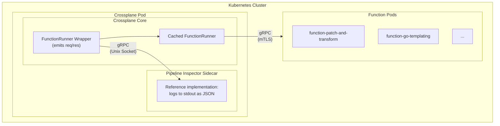

# Function Pipeline Inspector

* Owner: [Philippe Scorsolini] (@phisco)
* Reviewers: Crossplane Maintainers
* Status: Draft, revision 0.1

## Background

Crossplane Compositions are defined as pipelines—a sequence of Functions called one after another, where each function receives the previous step's output combined with the observed state, and can modify the desired state, emit events, or return an error. If no failures occur, Crossplane applies the resulting desired state to both the composite resource and all composed resources.

While this pipeline-based model is powerful and flexible, it presents significant challenges for debugging and observability. When something goes wrong—or behaves unexpectedly—platform engineers have limited visibility into what actually happened during pipeline execution.

### Current State

Today, users rely on a combination of tools to debug composition pipelines:

- **`crossplane render`**: Enables local rendering and testing of compositions before deployment. Useful during development but cannot capture real-world behavior with actual observed state from a live cluster.

- **`crossplane beta trace`**: Traces resource relationships to understand the hierarchy of composite and composed resources. Helps with understanding "what exists" but not "how it got there."

- **Function outputs (logs, events, conditions)**: Functions can emit logs, report events on the composite resource, and set conditions. While these provide some visibility into function behavior, correlating this information across multiple functions in a pipeline, understanding the data flow between them, and reconstructing the full sequence of events is manual and error-prone.

### Pain Points

1. **Debugging failures**: When a pipeline fails, users cannot easily determine which function failed or what input caused the failure.

2. **Understanding state evolution**: Users cannot see how the desired state transforms as it passes through each function in the pipeline.

3. **Inspecting function inputs and outputs**: There is no way to see the actual `RunFunctionRequest` and `RunFunctionResponse` data that flows through the pipeline during a live reconciliation.

4. **Tracing composed resources**: Users struggle to understand why a specific composed resource was or wasn't created, modified, or deleted.

## Goals

- Provide a mechanism to capture `RunFunctionRequest` and `RunFunctionResponse` data for pipeline reconciliations.
- Enable the capture of data for all reconciles, including cache hits.
- Expose captured data via a configurable interface that downstream consumers can implement.
- Provide a minimal reference implementation that logs pipeline data to stdout.
- Allow consumers to correlate steps in a same pipeline.

### Non-Goals

- Providing storage, querying, or visualization of pipeline data (left to downstream implementations).
- Replacing local development workflows (`crossplane render` remains the tool for local testing).
- Providing an audit log or compliance record.
- CLI access to pipeline data.

## Proposal

This design introduces a hook in the Crossplane core that emits `RunFunctionRequest` and `RunFunctionResponse` data for each function invocation. This follows the pattern established by [Change Logs](https://github.com/crossplane/crossplane/blob/main/design/one-pager-change-logs.md): minimal upstream hooks with a reference implementation, enabling downstream commercial or community implementations to build richer functionality.

### Architecture Overview



### FunctionRunner Wrapper

A new `FunctionRunner` wrapper that emits pipeline execution data after each function call. This follows the existing pattern in Crossplane where `FunctionRunner` implementations can be composed (e.g., the caching `FunctionRunner` wraps the base `PackagedFunctionRunner`).

```go
// InspectingFunctionRunner wraps another FunctionRunner, emitting request and
// response data to a PipelineInspector for debugging and observability.
type InspectingFunctionRunner struct {
    wrapped   FunctionRunner
    inspector PipelineInspector
}

func (r *InspectingFunctionRunner) RunFunction(ctx context.Context, name string, req *fnv1.RunFunctionRequest) (*fnv1.RunFunctionResponse, error) {
    // Extract metadata from context and request
    meta := extractMeta(ctx, name, req)

    // Emit request before execution (non-blocking, fire-and-forget)
    r.inspector.EmitRequest(ctx, req, meta)

    // Run the wrapped function
    rsp, err := r.wrapped.RunFunction(ctx, name, req)

    // Emit response after execution (non-blocking, fire-and-forget)
    r.inspector.EmitResponse(ctx, rsp, err, meta)

    return rsp, err
}

// extractMeta builds StepMeta from the context and request.
// - trace_id identifies the entire pipeline execution (all steps in one reconciliation)
// - span_id is generated as a UUID for each function invocation
// - iteration is extracted from context (counts how many times this step was called)
// - XR metadata (name, namespace, UID, GVK) is extracted from req.Observed.Composite
// - function_name, step_index, and composition_name are extracted from context
func extractMeta(ctx context.Context, functionName string, req *fnv1.RunFunctionRequest) StepMeta {
    meta := StepMeta{
        FunctionName: functionName,
        Timestamp:    time.Now(),
    }

    // Extract step index, composition name, and iteration from context (set by FunctionComposer)
    if v, ok := ctx.Value(ContextKeyStepIndex).(int); ok {
        meta.StepIndex = v
    }
    if v, ok := ctx.Value(ContextKeyCompositionName).(string); ok {
        meta.CompositionName = v
    }
    if v, ok := ctx.Value(ContextKeyIteration).(int64); ok {
        meta.Iteration = v
    }

    // Extract trace_id from context (set by FunctionComposer at the start of reconciliation)
    if v, ok := ctx.Value(ContextKeyTraceID).(string); ok {
        meta.TraceID = v
    }

    // Generate a unique span_id for this function invocation
    meta.SpanID = uuid.NewString()

    // Extract XR metadata from the request
    xr := req.GetObserved().GetComposite().GetResource()
    if xr != nil {
        meta.CompositeResourceAPIVersion = getStringField(xr, "apiVersion")
        meta.CompositeResourceKind = getStringField(xr, "kind")
        if metadata := getStructField(xr, "metadata"); metadata != nil {
            meta.CompositeResourceName = getStringField(metadata, "name")
            meta.CompositeResourceNamespace = getStringField(metadata, "namespace")
            meta.CompositeResourceUID = getStringField(metadata, "uid")
        }
    }

    return meta
}
```

### gRPC Interface

For the sidecar implementations, we define a gRPC service:

```protobuf
syntax = "proto3";

package crossplane.pipeline.v1alpha1;

import "google/protobuf/timestamp.proto";

// PipelineInspectorService receives pipeline execution data from Crossplane.
service PipelineInspectorService {
    // EmitRequest receives the function request before execution.
    // This is a fire-and-forget call; errors do not affect pipeline execution.
    rpc EmitRequest(EmitRequestRequest) returns (EmitRequestResponse);

    // EmitResponse receives the function response after execution.
    // This is a fire-and-forget call; errors do not affect pipeline execution.
    rpc EmitResponse(EmitResponseRequest) returns (EmitResponseResponse);
}

message EmitRequestRequest {
    // The original function request as JSON bytes (with credentials stripped).
    // This allows consumers to parse the request without needing the proto schema.
    bytes request = 1;

    // Metadata for correlation and identification.
    StepMeta meta = 2;
}

message EmitRequestResponse {
    // Empty - fire and forget.
}

message EmitResponseRequest {
    // The function response as JSON bytes (nil if function call failed).
    // This allows consumers to parse the response without needing the proto schema.
    bytes response = 1;

    // Error message if the function call failed.
    string error = 2;

    // Metadata for correlation and identification.
    // Must match the meta from the corresponding EmitRequest.
    StepMeta meta = 3;
}

message EmitResponseResponse {
    // Empty - fire and forget.
}

message StepMeta {
    // UUID identifying the entire pipeline execution (all steps in one reconciliation).
    string trace_id = 1;

    // UUID identifying this specific function invocation.
    string span_id = 2;

    // Zero-based index of this step in the function pipeline.
    int32 step_index = 3;

    // Counts how many times this step has been called, starting from 0.
    int64 iteration = 4;

    string function_name = 5;
    string composition_name = 6;
    string composite_resource_uid = 7;
    string composite_resource_name = 8;
    string composite_resource_namespace = 9;
    string composite_resource_api_version = 10;
    string composite_resource_kind = 11;
    google.protobuf.Timestamp timestamp = 12;
}
```

By using JSON bytes for the request and response payloads, consumers can parse the data without needing the function proto schema. This decouples the sidecar implementation from the Crossplane proto definitions entirely, making it simpler to build and maintain. Each message still stays within the default 4MB gRPC limit by splitting request and response into separate RPC calls. The `StepMeta` is included in both calls to allow the sidecar to correlate them using `trace_id`, `span_id`, `step_index`, and `composite_resource_uid`.

### Security: Credential Stripping

The `RunFunctionRequest` includes a `credentials` field that may contain sensitive data (secrets, connection details). **This field must be cleared before emission**:

```go
func (e *SocketPipelineInspector) EmitRequest(ctx context.Context, req *fnv1.RunFunctionRequest, meta StepMeta) {
    // Create a copy with credentials stripped for security
    sanitizedReq := proto.Clone(req).(*fnv1.RunFunctionRequest)
    sanitizedReq.Credentials = nil

    // Serialize the request to JSON bytes
    reqBytes, err := protojson.Marshal(sanitizedReq)
    if err != nil {
        e.log.Debug("Failed to marshal pipeline request", "error", err, "function", meta.FunctionName)
        return
    }

    ctx, cancel := context.WithTimeout(ctx, e.timeout)
    defer cancel()

    _, err = e.client.EmitRequest(ctx, &pipelinev1alpha1.EmitRequestRequest{
        Request: reqBytes,
        Meta:    toProtoMeta(meta),
    })
    if err != nil {
        e.log.Debug("Failed to emit pipeline request", "error", err, "function", meta.FunctionName)
    }
}
```

### Fail-Open Behavior

Since this feature is for debugging rather than security auditing or compliance, the system must **fail-open**: if the sidecar or emitter is unavailable, pipeline execution continues and data is simply not captured. This ensures the debugging feature cannot negatively impact production workloads.

### Configuration

The feature is enabled via a feature flag and configured with a socket path:

```yaml
# Crossplane deployment args (set automatically when pipeline inspector is enabled)
args:
  - --enable-pipeline-inspector
  - --pipeline-inspector-socket=/var/run/pipeline-inspector/socket
```

When the feature flag is not set, the `InspectingFunctionRunner` is not instantiated and there is zero overhead.

See [Helm Chart Changes](#helm-chart-changes) for the recommended configuration approach.

### Reference Implementation: Sidecar

A minimal reference sidecar implementation will be provided in a separate repository (following the pattern of [crossplane/changelogs-sidecar](https://github.com/crossplane/changelogs-sidecar)). The reference implementation:

1. Implements the `PipelineInspectorService` gRPC interface
2. Listens on a Unix domain socket
3. Logs received data to stdout as JSON
4. Accepts `--max-recv-msg-size` flag for configuring gRPC message size limits

This reference implementation is intentionally minimal. It demonstrates the interface and can be used for basic
debugging, but more sophisticated implementations (with storage, querying, visualization) are left to downstream
consumers.

### Correlation

Pipeline Inspector provides metadata for correlating function invocations:

- **`trace_id`**: A UUID identifying the entire pipeline execution. All function invocations within a single reconciliation share the same `trace_id`. Generated by `FunctionComposer` at the start of each reconciliation.

- **`span_id`**: A UUID generated for each function invocation. This uniquely identifies each step in the pipeline.

- **`step_index`**: The zero-based index of this step in the function pipeline. Indicates the order of execution.

- **`iteration`**: Counts how many times this step has been called, starting from 0. Useful for tracking retries or repeated calls to the same step.

- **`composite_resource_uid`**: The UID of the composite resource being reconciled. Can be used to group all function calls for the same resource.

**Naming Convention**: The `trace_id` and `span_id` naming
follows [OpenTelemetry (OTEL) conventions](https://opentelemetry.io/docs/concepts/signals/traces/). This intentional
alignment enables a future migration path: when Crossplane introduces OTEL tracing instrumentation, these fields can be
replaced with proper OTEL trace and span IDs, allowing seamless integration with distributed tracing backends (Jaeger,
Tempo, etc.) while maintaining backward compatibility for consumers already using these fields for correlation.

These fields allow downstream consumers to:
- Reconstruct the full pipeline execution sequence
- Correlate requests with their corresponding responses
- Group all steps within a single reconciliation using `trace_id`
- Track retries of the same step

## Data Volume Considerations

Each `RunFunctionRequest` and `RunFunctionResponse` can individually be up to 4MB (the default `MaxRecvMessageSize`). By splitting request and response into separate RPC calls, each message stays within the default gRPC limit. Optimizations at the storage layer are the responsibility of downstream implementations.

### gRPC Message Size Limits

By default, each `EmitRequest` and `EmitResponse` call stays within the 4MB gRPC limit. However, users who have increased the `--max-recv-msg-size` on their functions may have larger payloads.

**Sidecar configuration**: The reference sidecar (and any downstream implementations) should accept a `--max-recv-msg-size` flag to handle larger payloads if needed.

### Helm Chart Changes

The upstream Crossplane Helm chart has been extended to support sidecar containers via [PR #7007](https://github.com/crossplane/crossplane/pull/7007), which adds a `sidecarsCrossplane` value. This feature enables injecting additional containers into the Crossplane deployment pod.

Example `values.yaml` configuration for Pipeline Inspector:

```yaml
# Enable the pipeline inspector feature flag
args:
  - --enable-pipeline-inspector
  - --pipeline-inspector-socket=/var/run/pipeline-inspector/socket

# Inject the pipeline inspector sidecar
sidecarsCrossplane:
  - name: pipeline-inspector
    image: xpkg.crossplane.io/crossplane/pipeline-inspector-sidecar:v0.1.0
    args:
      - --socket=/var/run/pipeline-inspector/socket
      - --max-recv-msg-size=8388608  # 8MB
    volumeMounts:
      - name: pipeline-inspector-socket
        mountPath: /var/run/pipeline-inspector
    resources:
      requests:
        cpu: 10m
        memory: 64Mi
      limits:
        cpu: 100m
        memory: 128Mi

# Add the shared volume for Unix socket communication
extraVolumes:
  - name: pipeline-inspector-socket
    emptyDir: {}

extraVolumeMountsCrossplane:
  - name: pipeline-inspector-socket
    mountPath: /var/run/pipeline-inspector
```

This approach uses the generic sidecar injection mechanism rather than a feature-specific configuration block, keeping the Helm chart simple and reusable for other sidecar use cases.

## Alternatives Considered

### OpenTelemetry (OTEL) for Data Transport

We considered using OTEL instrumentation to emit spans containing the full pipeline data (request/response payloads).

**Pros:**
- Industry-standard observability format
- Existing ecosystem and tooling

**Cons:**
- Span attributes have size limits (Jaeger: 65KB, Tempo: 2KB per attribute) far below the 4MB per request/response we need
- Would require emitting as correlated logs, significantly increasing log volume for all users

**Conclusion**: OTEL is not suitable for transporting the full pipeline data. Instead, we generate our own `trace_id` and `span_id` UUIDs and use `iteration` counters for correlation. The naming follows OTEL conventions to enable future integration when Crossplane adds OTEL tracing instrumentation (see [Correlation](#correlation)).

### Proxy-Based Approaches

Multiple proxy-based approaches were evaluated (HTTP proxy, service rewriting, function sidecar injection). All failed due to a fundamental limitation: **Crossplane caches function responses**. When a cached response is used, no function call occurs and the proxy sees nothing.

The wrapper approach addresses this by capturing data before the cache is consulted.

### Modifying Functions Directly

Instrumenting functions themselves (as demonstrated by Apple at KubeCon NA 2024) was considered but rejected because:
- We do not control function implementations
- Would require changes to every function
- Does not address cache behavior

## Implementation Plan

### Phase 1: Core Hook (This Proposal)

1. Define the `PipelineInspector` interface
2. Implement the `InspectingFunctionRunner` wrapper
3. Implement the `SocketPipelineInspector` gRPC client
4. Define the gRPC protobuf interface (with `trace_id`, `span_id`, and `iteration` in `StepMeta`)
5. Add feature flag and configuration
6. Implement a `NopPipelineInspector` for when the feature is disabled

### Phase 2: Reference Sidecar (Separate Repository)

1. Create `crossplane/pipeline-inspector-sidecar` repository
2. Implement minimal gRPC server with configurable `--max-recv-msg-size`
3. Log received data as JSON to stdout
4. Publish container images

### Phase 3: Documentation

1. Document the feature flag and Helm values configuration
2. Document the gRPC interface for downstream implementers
