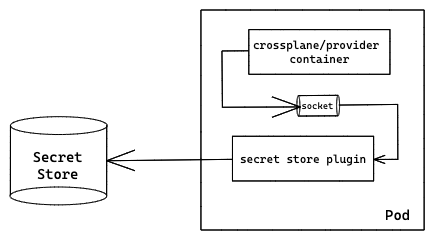

# Pluggable Secret Stores

* Owner: Hasan Türken (@turkenh)
* Reviewers: Crossplane Maintainers
* Status: Draft

## Background

In the [v1.7.0] release, we have introduced support for publishing connection
details secrets to [External Secret Stores] as an alpha feature. With this
initial iteration, we have focused on the _in-tree_ implementation of secret
stores by adding [Hashicorp's Vault] support as our first External Secret Store.
However, this approach introduces [additional dependencies] to Crossplane core
and would not scale once the community wants to support more secret stores.
Even further, it won't be possible to use an in-house secret store with
Crossplane since adding support for such a store to Crossplane core wouldn't
make sense. For this purpose, with the initial design, we set it as a [goal] to
support switching to an out-of-tree (plugin) model but intentionally left it
[out of scope] to avoid the upfront complexity.

With the gained confidence, we can now iterate with a more scalable option by
supporting pluggable secret stores.

## Goals

The goal of this document is to propose a pluggable secret store mechanism
that enables the development and consumption of out-of-tree secret store
plugins.

This new mechanism should:
- Allow building/using new secret stores for Crossplane without making any
changes in Crossplane and/or Provider repositories.
- Provide a smooth development and consumption experience. 
- Have secure communication with the plugin process.

## Proposal

This document proposes introducing a plugin mechanism for communicating with
External Secret Stores. We will follow a similar approach as [KMS plugins] used
by Kubernetes API Server for encryption at rest. A Secret Store plugin will
be serving a well-defined API via gRPC. For the sake of security, plugins will
be deployed as sidecars to Crossplane and Provider pods and communication will
be over Unix domain sockets.



### API

In addition to the existing Secret Store types, `Kubernetes` and `Vault`, we
will define a new type named as `External`. We will deprecate the existing type
`Vault` in favor of a plugin supporting **Vault** to remove the dependencies
already introduced. With this, `Kubernetes` and `External` will be the only two
built-in types going forward.

> This new type could be named as `Plugin` as well. However, after deprecating
> in tree `Vault` type in favor of a Vault plugin, all **External** Secret
> Stores will be over a plugin. So, `External` would always mean a Secret Store
> supported by a plugin and plugin will just be an implementation detail that
> does not need to be carried up to the API level.

Configuration of this type would require passing a typed reference to another
configuration custom resource defined by the deployed secret store plugin.

```yaml
apiVersion: gcp.crossplane.io/v1alpha1
kind: StoreConfig
metadata:
  name: vault
spec:
  type: External
  defaultScope: crossplane-system
  external:
    endpoint: unix:///@crossplane/secret/default.sock  # The default, can be changed.
    configRef:
      apiVersion: secrets.crossplane.io/v1alpha1
      kind: VaultConfig
      name: vault-internal
---
apiVersion: secrets.crossplane.io/v1alpha1
kind: VaultConfig
metadata:
  name: vault-internal
spec:
  server: http://vault.vault-system:8200
  mountPath: secrets/
  version: v2
  auth:
    method: Token
    token:
      source: Secret
      secretRef:
        namespace: crossplane-system
        name: vault-token
        key: token
```

There won't be any API changes at MR/XR/XRC level as they would still refer to
a `StoreConfig` resource as before.

### Implementation

We will implement the `External` [Secret Store] type in Crossplane Runtime which
will use a gRPC client to communicate with the plugin server using the service
definition below:

```protobuf
syntax = "proto3";

// This service defines the APIs for an External Secret Store plugin.
service ExternalSecretStoreService {
    rpc GetSecret(GetSecretRequest) returns (GetSecretResponse) {}
    rpc ApplySecret(ApplySecretRequest) returns (ApplySecretResponse) {}
    rpc DeleteKeys(DeleteKeysRequest) returns (DeleteKeysResponse) {}
}

message ConfigReference {
    string api_version = 1;
    string kind = 2;
    string name = 3;
}
message Secret {
    string scoped_name = 1;
    map<string, string> metadata = 2;
    map<string, bytes> data = 3;
}
message GetSecretRequest {
    ConfigReference config = 1;
    Secret secret = 2;
    GetOptions options = 3;
}
message GetSecretResponse {
    Secret secret = 1;
}
message ApplySecretRequest {
    ConfigReference config = 1;
    Secret secret = 2;
    ApplyOptions options = 3;
}
message ApplySecretResponse {
    bool changed = 1;
}
message DeleteKeysRequest {
    ConfigReference config = 1;
    Secret secret = 2;
    DeleteOptions options = 3;
}
message DeleteKeysResponse {}
message GetOptions {}
message ApplyOptions {}
message DeleteOptions {
    bool keep_empty_secret = 1;
}
```

A _Secret Store Plugin_:

- Will be a binary packaged as a container image.
- Should run a gRPC server listening at Unix domain socket.
- May support one or more Secret Stores.
- Should deploy CRD(s) for supported store configurations at startup.
- Will run as a sidecar next to Crossplane and Provider containers.

#### Plugin Binary vs Secret Store Implementation

All `rpc` methods have `ConfigReference` as their first parameter. So,
one Secret Store Plugin may support more than one Secret Store implementation,
e.g. Vault, AWS, GCP, Azure ... all in a single Plugin binary, and related
implementation could be called depending on a given config similar to how it is
being done in [RuntimeStoreBuilder] today. Implementation of individual Secret
Stores still need to satisfy the same [Store] interface today and could live in
separate repositories. However, they would need to be packaged and served by a
Secret Store Plugin binary to be used with Crossplane.

### Deployment

Crossplane helm chart will accept an optional container image for a secret
store plugin. When provided: 
- A sidecar container will be added to the Crossplane pod and the package
manager will inject the same sidecar to provider controller pods with proper
configuration. 
- The plugin process will create/apply CRDs during startup for the Secret Stores
it supports.

#### Communication over Unix Domain Sockets

In Unix based systems, two local process can communicate with each other
over a [Unix Domain Socket] which typically appears as a file on filesystem,
e.g. `/var/run/docker.sock`. Two containers in the same pod can communicate with
each other using Unix Domain sockets with a shared volume. However, in some
sandboxed environments like [gVisor], this [may not work] depending on the
isolation level.

[Abstract Unix Domain Sockets] on the other hand does not require sharing a path
on the filesystem and isolated at [network namespace] level. Given that
containers in the same Pod uses a shared [network namespace], we don't need
any specific setup and simply be able to communicate with a plugin sidecar over
a socket like `@crossplane/secret/default.sock`.

### Runtime

A typical flow during a Managed Resource publishing a connection secret to a
pluggable Secret Store will be as follows:

1. Managed reconciler of Crossplane Runtime will call [PublishConnection] method
   of `connection.DetailsManager`.
2. At [connectStore] step, a gRPC connection is created by dialing the gRPC
   server of the secret store plugin over a UNIX domain socket.
3. In `WriteKeyValues` method of `External` Secret Store, `ApplySecret` gRPC
   method called with `configReference` and `secret` parameters:

```go
func (ss *SecretStore) WriteKeyValues(ctx context.Context, s *store.Secret, _ ...store.WriteOption) (changed bool, err error) {
	// TODO(turkenh): handle write options.
	resp, err := pb.NewExternalSecretStoreServiceClient(ss.conn).ApplySecret(ctx, &pb.ApplySecretRequest{
		Config: &pb.ConfigReference{
			ApiVersion: ss.pluginConfigRef.APIVersion,
			Kind:       ss.pluginConfigRef.Kind,
			Name:       ss.pluginConfigRef.Name,
		},
		Secret: &pb.Secret{
			ScopedName: filepath.Join(s.Scope, s.Name),
			Metadata:   s.Metadata.Labels,
			Data:       s.Data,
		},
	})
	if err != nil {
		return false, err
	}
	return resp.Changed, nil
}
```

4. The plugin receives the `ApplySecret` request:
   1. It will fetch the referenced configuration object, e.g. `VaultConfig`,
      from the Kubernetes API.
   2. Using this configuration, it will connect to the External Secret Store,
      i.e. Vault, and write the secret data.

## Alternatives Considered

### Use a Mutating Webhook to Inject Plugin Sidecars

We could use a Mutating Webhook to inject plugin sidecars instead of modifying
the Crossplane helm chart and package manager code similar to the
[Vault agent injector]. However, this would mean introducing one more component
for a work that we could already accomplish with some simple changes in the
existing components. In other words, considering plugin sidecars will not need
to be injected to some arbitrary pods other than Crossplane and Providers, there
is not much need for this approach.

[v1.7.0]: https://github.com/crossplane/crossplane/releases/tag/v1.7.0
[External Secret Stores]: design-doc-external-secret-stores.md
[Hashicorp's Vault]: https://vaultproject.io/
[additional dependencies]: https://github.com/crossplane/crossplane-runtime/pull/322/files#diff-33ef32bf6c23acb95f5902d7097b7a1d5128ca061167ec0716715b0b9eeaa5f6R52
[goal]: design-doc-external-secret-stores.md#goals
[out of scope]: design-doc-external-secret-stores.md#out-of-tree-support-with-a-plugin-api
[KMS plugins]: https://kubernetes.io/docs/tasks/administer-cluster/kms-provider/#implementing-a-kms-plugin
[Secret Store]: https://github.com/crossplane/crossplane-runtime/blob/988c9ba9c255d7cade32e2c0135ce47b083eaf95/pkg/connection/interfaces.go#L35
[RuntimeStoreBuilder]: https://github.com/crossplane/crossplane-runtime/blob/0e8935d6d9a942825a29ab3ab34f057cfb1dc050/pkg/connection/stores.go#L38
[Store]: https://github.com/crossplane/crossplane-runtime/blob/0e8935d6d9a942825a29ab3ab34f057cfb1dc050/pkg/connection/interfaces.go#L35
[Unix Domain Socket]: https://man7.org/linux/man-pages/man7/unix.7.html
[gVisor]: https://github.com/google/gvisor
[may not work]: https://gitter.im/gvisor/community?at=5ff62cb3cd31da3d9a97372d
[Abstract Unix Domain Sockets]: https://utcc.utoronto.ca/~cks/space/blog/linux/SocketAbstractNamespace?showcomments
[network namespace]: https://man7.org/linux/man-pages/man7/network_namespaces.7.html
[PublishConnection]: https://github.com/crossplane/crossplane-runtime/blob/988c9ba9c255d7cade32e2c0135ce47b083eaf95/pkg/connection/manager.go#L94
[connectStore]: https://github.com/crossplane/crossplane-runtime/blob/988c9ba9c255d7cade32e2c0135ce47b083eaf95/pkg/connection/manager.go#L101
[Vault agent injector]: https://www.vaultproject.io/docs/platform/k8s/injector