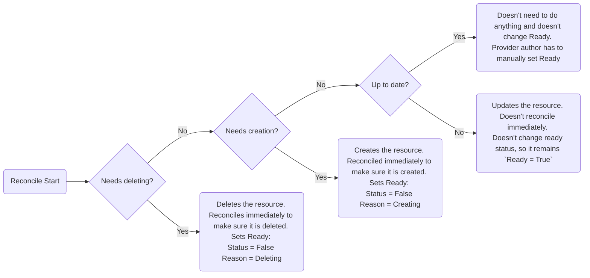

# Resource Status Improvements
* Owner: Terje Lafton (@TerjeLafton)
* Reviewers: Crossplane Maintainers
* Status: Draft

## Background
Accurately conveying the status of a resource has long been a challenging issue within the Kubernetes ecosystem.
[Kstatus](https://github.com/kubernetes-sigs/cli-utils/tree/master/pkg/kstatus) explains these issues well, while also providing a library that can help you work around these issues when creating tooling.

Crossplane already has quite good conditions implemented with `Synced` and `Ready`, but the documentation doesn't say much about the exact meaning of these. @negz commented on [this](https://github.com/crossplane/crossplane-runtime/pull/654) PR giving the following definitions:
>Today we have the following status conditions:  
>* Ready - The external resource is ready to use, (where applicable) according to its API.  
>* Synced - The managed resource's desired state has been successfully applied to the external resource.

These conditions are very important to users, as they rely on them to understand the true state of their managed resources. 
However, after making an update, the 'Ready' condition may not always reflect if the changes are fully applied, potentially leaving users uncertain about the resource's status. Provider tooling also makes it impossible to give a clear message when something goes wrong.

## Goals
* **Improve User Experience**: Users will gain a more accurate and timely understanding of the compliance of their managed resources with the desired state.
* **Enchance Provider Tooling**: Providers will have more granular control over communicating conditions, offering users better insight without digging through events and logs.

## Proposals
Quote from `api-conventions` document in `sig-architecture` [here](https://github.com/kubernetes/community/blob/master/contributors/devel/sig-architecture/api-conventions.md#typical-status-properties) about conditions:
>Conditions should be added to explicitly convey properties that users and components care about rather than requiring those properties to be inferred from other observations. Once defined, the meaning of a Condition can not be changed arbitrarily - it becomes part of the API, and has the same backwards- and forwards-compatibility concerns of any other part of the API.

To paraphrase, the conditions should, to the best of their ability, give the user and other components a precise status of the resource. A resource's conditions are also part of it's API, so changes should be well thought through.

These proposals try to make the API for resources managed by crossplane providers to give users the best possible status about the health of their resources. 

### 1: Improve Clarity of `Ready` Condition
#### Problem
If a user updates a managed resource in Crossplane today, there is no condition indicating this. The resource remains `Available` and no attempt is made at immediately observing the resource to check if it matches the desired state. Even if the update fails, the resource will be displayed as `Available`. 
This means that a user cannot trust that an `Available` resource is a compliant resource, which can cause misinterpretation of the resource's state.

Here is a diagram showing how the `Ready` condition is updated throughout the reconciler:
##### Current `Ready` Condition Update Behavior

#### Solution
Implement an `Updating` status, mimicking the `Creating` status. Setting this status every time an update request either succeeds or fails, informing a user that an update request has been requested, but we have not verified if the resource is compliant with the updated desired state.

This also requires updating the reconciler to immediately requeue a reconcile after a successfuly requested update. This ensures that an updated resource is immediatly checked for compliance, to give user quick feedback on if the resource is `Available` again after the update.

Note that this would technically change the definition of the `Ready` condition. However, this definition is not very well documented, so I am not sure how many know about it.  
Old definition:
>* Ready - The external resource is ready to use, (where applicable) according to its API.  

New definiton:
>* Ready - The external reosurce is compliant with the desired state and is ready to use. 

##### Alternative solution
I recommend the original solution with an Updating status for consistency and ease of use. However, as a possible alternative, we could forgo the Updating status entirely and simply trigger an immediate reconcile after successful updates.  This would retain the current Ready definition and allow providers complete control over how they implement a similar status if desired.

#### Benefits
* **Immediate Compliance Feedback**: All users will quickly know whether their resource matches the desired state, providing greater clarity and confidence.
* **Streamlined Understanding**: Eliminates the need to interpret multiple fields to assess resource status.
* **Focus on User-Centric Status**: While the external API's availability remains important, these changes emphasize a focus on the user's primary concern – whether their resource configuration is correct.

### 1: Improving Providers Control Over Condition Messages
#### Problem
Crossplane currently has primary control over the `Ready` condition, limiting the ability of providers to communicate detailed, human-readable status information to users via the `Message` field. While Crossplane's consistent conditions create predictable expectations for users, this generic nature leaves valuable context underutilized. Important status information for users and developers is often relegated to Kubernetes events and logs, which can be less convenient to access and interpret.

#### Solution
Modify the existing condition helper functions in Crossplane to optionally accept a string argument intended for the `Message` field of a condition. This would empower provider authors to provide human-readable summaries when setting condition states.

Crossplane would retain the ability to overwrite a provider-set `Reason` for the `Ready` condition if it's incorrect. This ensures consistency within the API, while providing more nuance in status reporting.

#### Benefits
* **Enhanced User Experience**: Users gain more informative insights into resource states directly from the conditions, reducing the need to consult events or logs for troubleshooting.
* **Improved Developer Tooling**: Developers building on top of Crossplane can create tools that leverage the more descriptive Message fields of conditions, presenting status updates in a user-friendly manner.
* **Maintains API Consistency**: Crossplane continues to enforce the correct Reason values, ensuring predictability for users and avoiding conflicts within the broader Kubernetes ecosystem.
