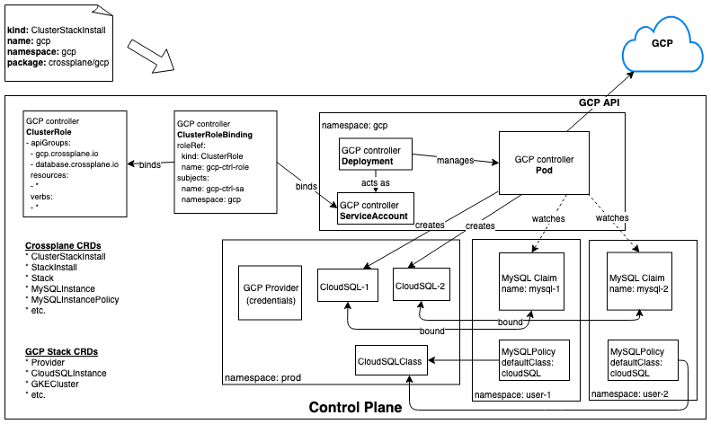
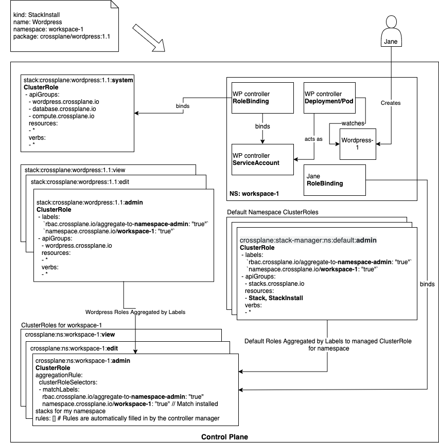

# Stacks Security and Isolation

* Owner: Jared Watts (@jbw976)
* Reviewers: Crossplane Maintainers
* Status: Draft, revision 1.0

## Background

The current model for Stacks, the means of extending Crossplane with new functionality, allows the stack author to declare arbitrary permissions that the stack will be granted by the Stack Manager.
If the Stack author declares they need to update nodes or create volumes, those permissions will be granted.

However, Crossplane is not itself an arbitrary Kubernetes cluster to run typical compute and storage workloads.
Crossplane can run within an arbitrary Kubernetes cluster, but as a platform, it is not intended to run typical in-cluster workloads itself.
Instead, it is a centralized control plane intended to manage resources external to the control plane (e.g. cloud provider services) and intelligently schedule compute workloads into remote clusters to consume these services.
There is not really a need for Stacks being installed into the control plane to request arbitrary permissions.
Crossplane can be more opinionated about the types of permissions granted within its control plane and lock things down in a more secure way.

Futhermore, stacks are currently scoped to a single type that is used in all scenarios and by all personas.
All new types of functionality, from an end user wanting to install a simple application to an administrator wanting to install support for low level infrastructure types, are all treated the same.
They have the same approach to security and access control and the artifacts that they install have the same scope of impact to the control plane.
This one size fits all approach is not ideal though; the multiple scenarios and personas need finer grain control around security, access, and isolation.

This design doc proposes a new approach for the Crossplane Stack Manager (SM) that will support a smaller set of security permissions and increased control for the installation of stacks.

## Design Summary

The key differences in this design update are in the **scope** of the permissions that stacks can be granted within the control plane.

* **Cluster Stacks** will be given permissions to watch, access, and create resources at a **cluster level**, i.e. across **all namespaces**.
* **Namespace Stacks** will be given permissions only within a **single namespace**.

This means that namespace stacks should not be able to directly affect any resources outside of the specific namespace they are installed into, while cluster stacks operate at a higher level of privilege and can affect the entire cluster.
This is a familiar concept to the Kubernetes permission scoping model of `ClusterRole` and `Role`.

Furthermore, the kinds of resources that stacks are granted permission to access will be restricted:

* All stacks will be granted permissions to a small subset of core Kubernetes resources as well as access to any CRDs they own and depend on.
* We are intentionally starting with a restrictive scope and will encourage feedback and real use cases to drive any expansion of this policy.

### CRD Scoping

To avoid a common point of confusion, let's review the available scoping of CRDs.
Custom resource **instances** can be scoped to either a single namespace or to the entire cluster.
It's important to note that this refers to the instances, not the CRD type definitions.
From the [Kubernetes documentation](https://kubernetes.io/docs/tasks/access-kubernetes-api/custom-resources/custom-resource-definitions/#create-a-customresourcedefinition):

> CustomResourceDefinitions themselves are non-namespaced and are available to all namespaces

Therefore, any time a CRD is created, it will also be at the cluster scope, even if instances of the CRD are scoped to a namespace.
This has caused confusion in the past, so it's important to clear that up here.

## Allowed Resource Access

As previously stated, Crossplane is not intended to be a typical/full Kubernetes cluster to run arbitrary workloads.
Once installed into the control plane, stacks will mostly target external resources and a known set of CRDs that they own and depend on.
Therefore, we can lock down the allowed permissions for stacks to a subset of all available permissions in the Kubernetes API.

The `rbac.yaml` file that allows a stack to specify the permissions it requires will be removed and no longer supported.
Instead, the permissions for a stack can be considered **implicit**.
The following permissions will be granted to a stack when it is installed:

* **Core Kubernetes API kinds:** Simple configuration and monitoring related types such as `ConfigMap`, `Secrets` and `Events`.
There should be no need for a stack to create a Deployment, Pod, Volume, or other types like that.
* **Owned CRDs:** All CRDs that the stack owns and are being installed by the stack.
* **Depends on CRDs:** All CRDs that the stack depends on and will consume to perform its primary operations (e.g. `MySQLInstance` claim).

The Stack Manager will create the necessary service account, role, and binding that includes these permissions and serves as the runtime security context that the Stack will operate in.
This is described in greater details in the sections below.

A few notes on the scope of access to CRDs:

* All CRDs the stack owns and depends on are expected to be namespace scoped CRDs. Access to cluster scoped CRDs will not be granted, even for Cluster Stacks.
* The allowed verbs for the CRDs the stack owns and depends on will be the same. Stacks will likely need full CRUD access, regardless of if the stack owns or depends on the CRD.

In the future, other security modes could be enabled such as a more explicit model, and the allowed set of permissions and scope could be expanded, but we are intentionally starting now with a restrictive scope.
We will allow feedback and real use cases from the community to inform any decisions to potentially expand this security model.
Any future expansions to the model should be accompanied by a thoughtful design.

## Cluster Stacks

Cluster Stacks can be thought of as a higher level of privilege than other types of stacks, similar to how kernel modules work in Linux.
The controllers contained in a cluster stack will usually reconcile resources that are external to the cluster, for example cloud provider managed services.
These controllers will also likely be written as full fledged controller-runtime based implementations, but that is not a requirement.

Let's look at a specific example of the [GCP cluster stack](https://github.com/crossplaneio/stack-gcp) to understand the security and isolation model more thoroughly.
First, the user will create an instance of a `ClusterStackInstall` that specifies which cluster stack they want to install.
Then, when the Stack Manager installs the GCP stack, a few things will happen:

* All CRDs related to GCP infrastructure and services will be installed to the cluster, such as `CloudSQLInstance`, `CloudSQLInstanceClass`, `GKECluster`, `GKEClusterClass`, `Network`, `Subnetwork`, etc.
* A `ClusterRole` will be created at the cluster level that includes the RBAC rules for the [allowed core Kubernetes kinds](#allowed-resource-access), the stack's owned CRDs, and the CRDs that it depends on.
* A `ServiceAccount` is created in the namespace that the stack's controller will be running.  This will serve as the runtime identity of the controller.
* A `ClusterRoleBinding` is created at the cluster level to bind the `ClusterRole` and the namespaced `ServiceAccount`
* A `Deployment` is created in the same namespace as the stack and it is expected to launch and manage the pod that hosts the GCP controllers.

Because the stack is given a `ClusterRole` and `ClusterRoleBinding`, its permissions to the allowed resources are across all namespaces.

### Architecture Diagram - Cluster Stack

The diagram below summarizes the artifacts in the control plane after the GCP stack has been installed and a couple example `MySQLInstance` claims have been created.



### Environments

While cluster stacks are installed at the cluster level (there is only one instance of each cluster stack), they can still support the concept of multiple "environments", each represented by a namespace.
For example, an admin can create a namespace to model their production "environment" and another namespace to model their development "environment".
All resources within each of those environments can share a common set of provider credentials.
This namespaced "environment" approach provides the administrator with a way to collect or aggregate all the infrastructure and services associated with a given environment.

#### Cluster Stack Single Instance Version Limitation

One caveat of this approach is that because there is only a single instance of the cluster stack in the cluster, it is therefore shared across all environments.
This means that all environments must use the same version of the stack.
If an admin wants to try a newer version of the stack for their dev environment, it will also result in the newer version of the stack being used in the production environment as well.

This limitation could be addressed in the future by allowing multiple versions of cluster stacks installed per control plane, which would require additional complexity and design work.
To get started, we will make the simplifying constraint that only a single version of a cluster stack can be installed and it will be shared across all namespaces (environments).

#### Environment Policies

Another potential advantage of supporting multiple namespace "environments" is that each one could be assigned their own specific policy, such as default resource classes.
The production environment could have a completely different set of default resource classes than the development environment.
Since these environments are simply represented by namespaces, they can take on any arbitrary meaning or scope.
For example, instead of dev vs. prod, they could represent entirely other dimensions, such as a high performance environment, a cheap environment, an AWS only environment, etc.

The full design for this support of different policies per environment is out of scope of this document, but this idea has interesting potential.
Also note that in the current implementation of policies, they must be in the same namespace as the claim referencing them.
This will likely be updated in the future to support cluster or environment scoped policies.

## Namespace Stacks

Namespace Stacks are likely to represent higher level "application" functionality, but are not required to do so.
Instead of providing the infrastructure and lower level platform components for entire environments like a cluster stack, they likely will merely provide the functionality to support a single application.
It is expected for namespace stacks to (indirectly) consume and build on functionality from cluster stacks in the form of resource claims.
For example, a namespace stack could generate a `MySQLInstance` claim that is fulfilled through a default resource class by a cluster stack in the form of a concrete MySQL database instance.

The key aspect of a namespace stack is that it will be installed with permissions to only watch for resources **within the namespace** it is running in.
This provides a nice isolation as well as versioning story.

* **Isolation:** The namespace stack should not be able to read or write any resources outside of its target namespace.
* **Versioning:** Multiple versions of the namespace stack can be installed within the control plane, each namespace can have their own independent version.

### Installation Flow

Let's look at a concrete example of what happens when the [WordPress stack](https://github.com/crossplaneio/sample-stack-wordpress/) is installed into Crossplane in a target namespace of the user's choice:

* The user creates a `StackInstall` and specifies the WordPress stack
* All CRDs defined by the WordPress stack will be installed into the cluster (remember that CRDs themselves are always cluster scoped).
In the case of WordPress, a single CRD is installed that represents a WordPress application instance, `WordPressInstance`.
* A `Role` will be created in the target namespace that includes the RBAC rules for the [allowed core Kubernetes kinds](#allowed-resource-access), the stack's owned CRDs, and the CRDs that it depends on.
Because this is a `Role`, this only grants the given permissions to namespaced resources in the target namespace.
* A `ServiceAccount` is created in the namespace that the stack's controller will be running that will serve as the runtime identity of the controller.
* A `RoleBinding` is created in the target namespace to bind the namespaced `Role` and the namespaced `ServiceAccount`.
* A `Deployment` is created in the same namespace as the stack and it is expected to launch and manage the pod that hosts the WordPress controller.

### Architecture Diagram - Namespace Stack

The diagram below summarizes the artifacts in the control plane after the WordPress stack has been installed and an example `WordPressInstance` custom resource has been created.
The diagram shows the result of the following sequence of actions:

1. The user creates a `StackInstall` and specifies the WordPress stack
1. The Stack Manager installs the CRDs defined in the stack, creates the necessary RBAC primitives, and starts up the WordPress controller in the same namespace as the stack.
1. The user creates an instance of the `WordPressInstance` custom resource in the same namespace.
1. The WordPress controller is watching for events on this CRD type in the namespace it is running in.
1. In response to seeing the creation event for this `WordPressInstance` custom resource, the WordPress controller creates claims for the services that the instance will need, such as a MySQL database and a Kubernetes cluster.
    1. Note: in order to have permissions to create instances of MySQL and Kubernetes cluster claims, the Wordpress stack will have to have declared those CRD types as dependencies.
    Full support of [dependency resolution](https://github.com/crossplaneio/crossplane/issues/434) is out of scope for this design document.
1. These claims are then serviced by the default resource classes in the environment that point to specific provisioners that were previously installed as part of a cluster stack.

This flow demonstrates how a namespace stack indirectly consumes a cluster stack and is represented in the diagram below:



### Multiple Versions

As previously mentioned, since namespace stacks will be installed per namespace, multiple instances of each namespace stack can be installed in the control plane.
This also means that multiple versions of the namespace stack can be installed side by side.
Because of the namespaced isolation, this is fine for the namespace stack's controllers, but it does cause a potential difficulty for the CRDs.

The custom resource **definitions** themselves are always cluster scoped.
If two versions of a namespace stack are installed in the control plane and they have identical CRD versions, there could be a conflict.
To illustrate this clearly, consider the following example:

1. Namespace Stack `foo-v1.0` is installed along with its CRD that has version `v1beta1`
1. A minor update to namespace stack foo is released as version `foo-v1.1`
    1. This update to the namespace stack adds a new field to the CRD but does **not** increment the CRD version
1. The control plane now has 2 versions of the namespace stack's controllers (`foo-v1.0` and `foo-v1.1`), but only 1 version of the CRD (`v1beta`)

Which CRD schema should "win" in the control plane?

* The **new CRD schema** with the new field that the **old controller** doesn't understand?
* The **old CRD schema** without the new field that the **new controller** wants to use?

This speaks to the importance of properly versioning CRDs when they have schema changes.
Kubernetes now supports [multiple versions of CRDs](https://kubernetes.io/docs/tasks/access-kubernetes-api/custom-resources/custom-resource-definition-versioning/#specify-multiple-versions) in the cluster, so this is actually possible in more recent versions of Kubernetes, even though the experience is slightly cumbersome.
We suspect (and hope) that this newer CRD versions functionality will encourage CRD authors to adopt a more strict process of updating their CRD versions, which would avoid the issue raised in this section.

## Permissions and Privileges

### Stack Manager

Currently, the Stack Manager that installs stacks into the cluster runs with a `ClusterRoleBinding` to the cluster-admin `ClusterRole` because it needs to create RBAC permissions for the arbitrary CRDs that are owned and depended on by arbitrary stacks.
A service account cannot grant RBAC permissions that it doesn't already have itself, so to support the arbitrary permissions needs of all stacks, we are currently using the cluster-admin role.

This is a similar problem to what Helm's Tiller has historically had and we can consider revisiting this in the future.
One possible solution would be to do more client side processing of stacks (instead of in-cluster processing) using the credentials and permissions of the interactive user,
which would be similar to [Helm 3's](https://github.com/helm/community/blob/master/helm-v3/000-helm-v3.md) major design change.

However, because we are limiting the [allowed set of resources](#allowed-resource-access) that a stack can have access to, this in-cluster Stack Manager model may be acceptable.
Furthermore, moving to a client side model may limit the full lifecycle management abilities available from an in-cluster Stack Manager, such as automatic stack upgrades.

A full exploration of this topic is out of scope for this version of the design document.

### Stack Package Author

The author of a stack will need to specify the intended scope of permissions for their stack.
This should be known at stack build time because the stack's controller(s) will need to know whether to watch resources in a single namespace or across all namespaces.

The `app.yaml` schema should be updated with a new field that captures the stack author's intended permission scope:

```yaml
# Human readable title of application.
title: Sample Crossplane Stack

# Scope of permissions needed by the stack once installed in the control plane,
# current supported values are:
#
# - Cluster
# - Namespaced
permissionScope: Cluster
```

### Stack Install

Since cluster stacks and namespace stacks have differing scopes of execution in the control plane, it will be wise to allow differing access to request their installation.
A simple way to approach this would be to create different installation request CRDs for each and then use RBAC to restrict access to them by different roles.
Currently, we use a single `StackRequest` type, but going forward we should differentiate by stack type:

* `ClusterStackInstall`: requests the installation of a cluster stack
* `StackInstall`: requests the installation of a namespace stack

With these two separate types, an administrator can allow access to installing cluster stacks to only certain restricted roles, then perhaps be more permissive with access to installing namespaced stacks.

If the install scope type does not match what the stack author has declared within their stack metadata, an error status should be set on the install resource and installation of the stack should not proceed.
