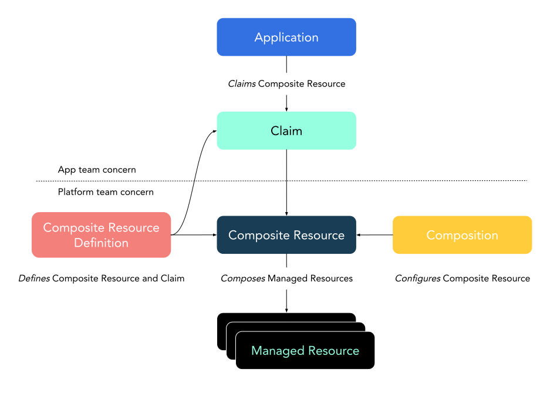
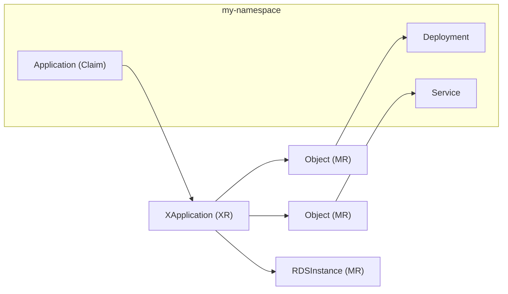
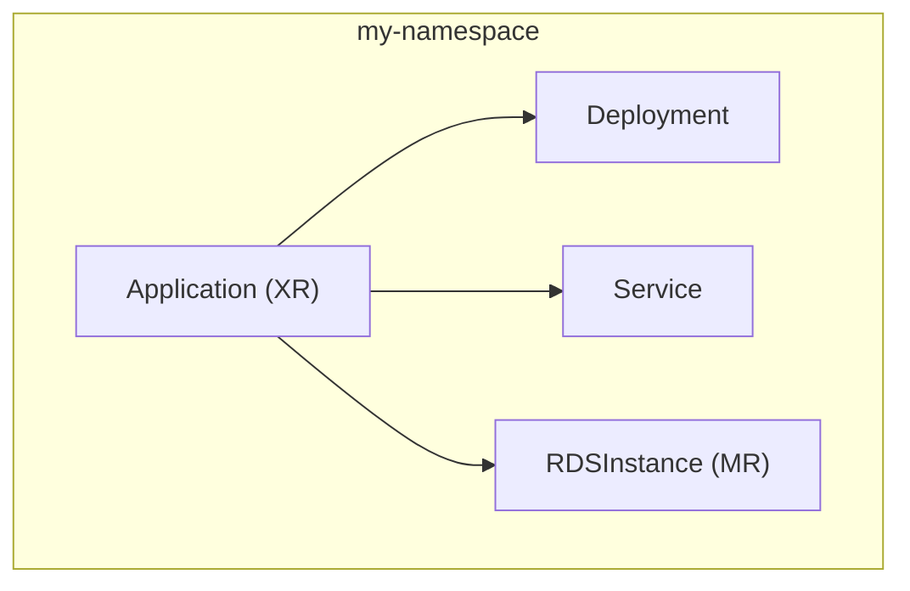
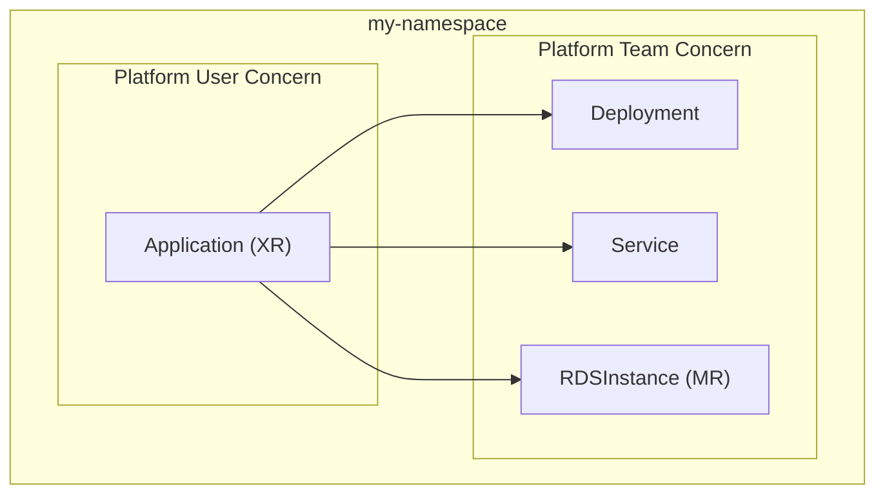
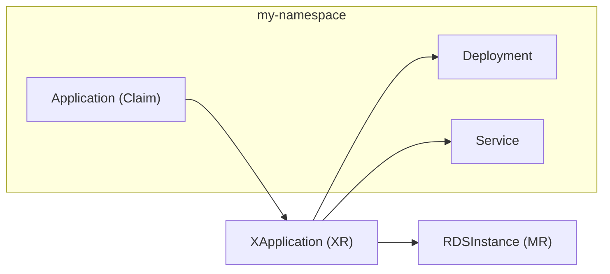

# Crossplane v2

* Owner: Nic Cope (@negz)
* Reviewers: Crossplane Steering Committee
* Status: Draft


## Executive Summary

This document proposes a new version of Crossplane that’s simpler and better
suited to managing applications, not just the infrastructure they depend on.

In Crossplane v2:

* Most composite resources (XRs) are namespaced
* All managed resources (MRs) are namespaced
* XRs can compose any Kubernetes resource - not just MRs
* Claims are removed

Under this proposal Crossplane v2 would be backward compatible with Crossplane
v1. Most Crossplane users could upgrade to Crossplane v2 without any breaking
changes.

Existing v1 style cluster scoped XRs with claims and cluster scoped MRs would
continue to work in Crossplane v2. These would be considered legacy features and
wouldn’t appear in Crossplane’s main documentation flows for new users. Existing
users could adopt v2 style XRs and MRs at their leisure.


## Background

We released Crossplane in December of 2018. In that time we’ve seen thousands of
production control planes built with Crossplane. Crossplane has a vibrant
community and is graduating from the CNCF.

I’ve been thinking for a while about what I’d change about Crossplane. About a
year ago I circulated my “Crossplane v2 wishlist” inside of
[Upbound](https://upbound.io). This document proposes an implementation of that
wishlist.

Crossplane has three main components:

* Composition - an engine used to build opinionated self-service APIs (composite
  resources, or XRs)
* Managed resources (MRs) - a library of Kubernetes APIs for managing popular
  cloud resources
* The package manager - a tool for declaratively extending Crossplane with new
  functionality

Most organizations use these components to manage cloud infrastructure. Platform
engineering teams use Composition to build opinionated, self-service APIs that
are abstractions of one or more kinds of MR.

What about applications, though? Cloud infrastructure exists to serve
applications. Composition offers all of the benefits for managing applications
that it does for infrastructure.

When a platform team offers an API for managing applications their developers
can self-service. With composition, the platform team can design their own
application model. This simplifies application management for their developers
by framing it in a way that makes sense to them. Defining their own application
model also allows the platform team to enforce policy. They only expose the
configuration parameters that they want to expose.

In practice a minority of folks use Crossplane to manage applications. You can
use Crossplane to manage applications, but it’s awkward. This document proposes
a set of changes to Crossplane that make it simpler and better suited to
managing applications, while retaining all the benefits of using Crossplane to
manage infrastructure.

If you look at Crossplane’s [Composition documentation](https://docs.crossplane.io/v1.18/concepts/composite-resources/)
today you’ll see this diagram:



The application isn’t managed by Crossplane. Instead it claims (uses)
infrastructure that’s defined and managed by Crossplane. This is an artifact of
Crossplane’s early design. We took the Kubernetes claim model used by
[persistent volumes](https://kubernetes.io/docs/concepts/storage/persistent-volumes/)
and extended it to handle any kind of infrastructure.

I believe two things make Crossplane awkward for composing applications:

1. Crossplane XRs and MRs are cluster scoped, while most Kubernetes resources
   are namespaced
2. Crossplane [doesn’t support](https://github.com/crossplane/crossplane/issues/1730)
   directly composing arbitrary (non-Crossplane) Kubernetes resources

When you build a Crossplane XR that represents an application today, it looks
like this:



The application developer creates an Application in their namespace. This is a
namespaced claim. Creating the claim ultimately causes Crossplane to create a
namespaced Deployment and Service, and a cluster scoped RDSInstance. These are
the composed resources. Between the claim and composed resources there’s a
cluster scoped XR. For the Deployment and Service there’s also cluster scoped
provider-kubernetes Object MRs.

What value does the creator of the Application get from the intermediary cluster
scoped resources? Why is the RDSInstance MR cluster scoped while the Deployment
and Service aren’t? They’re all components of the same application.

The following architecture achieves the same goal, but is simpler and more
intuitive:



The namespaced Application abstraction is directly composed of the three
resources that make up the logical application - a Deployment, a Service, and an
RDSInstance. They’re all composed in the same namespace as the abstraction.

This document proposes a set of changes to Crossplane that enable this simpler
architecture.

## Goals

The goal of this proposal is to:

* Make Crossplane less opinionated and more broadly useful
* Make Crossplane more intuitive and easier to use
* Avoid breaking existing Crossplane users

These goals are in service of making Crossplane a better tool for composing
applications _and_ infrastructure.

## Proposal

I propose we make the following changes in Crossplane v2.

In core I propose we:

* Make composite resources namespaced by default
* Support composing any Kubernetes resource
* Remove support for claims
* Move all Crossplane-specific XR fields to `spec.crossplane`
* Remove all deprecated features - e.g. native patch and transform composition

In providers I propose we:

* Make all managed resources namespaced
* Introduce a new ManagedResourceDefinition type
* Remove all deprecated features - e.g. `spec.deletionPolicy`

I propose we make these changes in a backward compatible, opt-in way.

To do this, I propose that Crossplane v2 introduce new v2 APIs that behave as
described above. It will maintain support for the existing v1 APIs, which will
continue to work the same way they do today.

For example, Crossplane v2.0.0 would serve the CompositeResourceDefinition (XRD)
API in both the apiextensions.crossplane.io/v2 and the
apiextensions.crossplane.io/v1 API groups. The v1 API served by Crossplane
v2.0.0 would be backward compatible with Crossplane v1.x. The v2 API wouldn’t.

The only exception is the removal of already deprecated features like native
patch and transform. These deprecated features will not appear in Crossplane
v2’s new v2 APIs and will also be removed from Crossplane v2’s otherwise
backward compatible v1 APIs.

The result is that Crossplane v1.x users could upgrade to Crossplane v2.0.0
without any breaking changes, _unless_ they were still using deprecated features
such as native patch and transform.

I’ll detail each of these changes below.

### Crossplane Core

We call the components that are installed by the Crossplane Helm chart
Crossplane core. These components are:

* The composition engine
* The package manager
* The RBAC manager

In this section I’ll detail the changes I propose we make to Crossplane core.

#### Namespace Composite Resources

I propose that Crossplane v2 use namespaced composite resources (XRs) by
default.

We’d do this by adding a `spec.scope` field to the CompositeResourceDefinition
type. This field would work similarly to the `spec.scope` field of Kubernetes’s
CustomResourceDefinition type. It would allow you to pick whether the defined XR
was namespaced or cluster scoped.

For backward compatibility Crossplane v2 would retain the v1
CompositeResourceDefinition API, which would default to cluster scoped.

Crossplane v2 would also introduce a new v2 CompositeResourceDefinition type.
This type would be schematically identical to the v1 type, except that
`spec.scope` field would default to namespaced.

This means users with v1 CompositeResourceDefinitions could upgrade to
Crossplane v2 without needing to make any changes. Their existing XRs would
remain cluster scoped, and they could begin using namespaced XRs at their
leisure.

```yaml
apiVersion: apiextensions.crossplane.io/v2
kind: CompositeResourceDefinition
metadata:
  name: applications.platform.example.org
spec:
  scope: Namespaced
  group: platform.example.org
  names:
    kind: Application
    plural: applications
  versions:
  - name: v1alpha1
  # Removed for brevity
```

In Crossplane v2 a namespaced XR would only compose resources in its own
namespace. It  wouldn’t support composing resources in other namespaces, or at
the cluster scope. [This is a Kubernetes limitation](https://github.com/kubernetes/community/blob/95af16e046ae65d7c9d6ba68eb1389bf8462301f/contributors/devel/sig-architecture/api-conventions.md#object-references).
A namespaced resource can’t own a resource at the cluster scope, or in another
namespace:

_Built-in types and ownerReferences do not support cross namespaces references._

A cluster scoped XR would be able to compose resources at the cluster scope, or
in any namespace(s).

With these changes, XRs would act more like idiomatic Kubernetes resources. I
expect that most XRs would become namespaced over time, and would represent
applications or infrastructure owned by application developers.

Cluster scoped XRs would be an edge case, just like cluster scoped resources are
an edge case in Kubernetes. I expect cluster scoped XRs would be used for APIs
that configure the control plane, for example by composing RBAC
ClusterRoleBindings, or CustomResourceDefinitions.

XRDs and Compositions would remain cluster scoped, as would the Configuration
package type that you use to install them.

#### Compose Any Kubernetes Resource

I propose that Crossplane v2 allow XRs to compose any type of Kubernetes
resource - not only Crossplane resources like MRs and XRs.

This is more of a change of position than a technical change. There’s no
technical reason you can’t compose arbitrary Kubernetes resources in Crossplane
today except that those resources must be cluster scoped, and most Kubernetes
resources aren’t. By introducing namespaced XRs that compose namespaced
resources we’d implicitly support composing any Kubernetes resource.

Composing arbitrary resources is a tradeoff.

When the resources Crossplane composes become less consistent, XRs become less
predictable. All Crossplane MRs have consistent schemas and behaviors:

* They all support consistent external identity (the
  [`crossplane.io/external-name`](http://crossplane.io/external-name)
  annotation)
* They all support consistent publishing of secret connection details
* They all support consistent, predictable status conditions
* They all support management policies to enable observe-only mode,
  orphan-on-delete, etc

MRs are all built using the same reconciler library. This means all MRs have the
same retry, polling, and rate limiting semantics

Controlling the entire stack allows Crossplane to serve its user base better.
Consider management policies, which allows any Crossplane MR to be put into an
observe-only mode (among other things). It’s controlling the MR layer that
allows us as Crossplane maintainers to solve such problems.

That all said, I feel we should let our users make this tradeoff. If it helps a
team to compose things that aren’t MRs we shouldn’t stop them. If the team would
benefit from MRs with consistent behaviour, it’ll still be possible to wrap
arbitrary resources using provider-kubernetes’ Object MR.

#### Remove Support for Claims

I propose that XRs defined using the new v2 CompositeResourceDefinition API
won’t support claims.

XRs defined using the existing v1 CompositeResourceDefinition API would still
support claims. Claims would be considered a legacy feature and wouldn’t appear
in Crossplane’s main documentation flows.

Today Crossplane uses resource scope to represent the separation of concerns
between platform users - typically application developers - and platform
engineers. Anything cluster scoped is the concern of the platform team. Claims
allow platform users to indirectly influence what happens at the cluster scope,
by acting as namespaced proxies for XRs.

The claim abstraction has been a frequent source of frustration and confusion
for platform users. It’s been hard for Crossplane to get bidirectional syncing
of claims and XRs right. Claim syncing has been a consistent source of bugs.
We’ve also found that platform users have a hard time debugging broken XRs,
because they need to know how to trace the claim to the XR to see useful status
conditions and events.

I propose Crossplane v2 embrace a more granular separation of concerns that is
type rather than scope based.

Assume a namespaced Application XR is composed of a namespaced Deployment,
Service, and RDSInstance. A platform team can use Kubernetes RBAC to model that:

* Platform users have full access to manage AcmeApp XRs in their namespace
* Platform users have read-only access to Deployments, Services, and
  RDSInstances in their namespace
* Platform engineers have full access to AcmeApp XRs, Deployments, and
  RDSInstances across all namespaces

This model still enforces a separation of concerns. The Application XR is the
concern of the platform users, while the composed Deployment, Service, and
RDSInstances are the concern of the platform team.



The model allows the platform team to grant platform users read-only access to
only the composed resources in their own namespaces. This is more granular than
today’s model. Today if the platform team wants to allow platform users to see
their own RDSInstaces they must grant them access to read _all_ RDSInstances at
the cluster scope - even those that belong to other teams.

It would be equally valid for the platform team to decide that platform users
have full RBAC access to Deployments, Services, and RDSInstances, making them
the concern of the platform users. This granular model is more flexible to suit
the needs of different organizations.

Removing claims would have no effect on what a platform user can or can’t
provision with Crossplane.

A platform user with access to create a claim in a namespace is indirectly able
to create the corresponding kind of cluster scoped XR. The claim pattern doesn’t
impose any limitations on the shape or number of cluster scoped XRs the user can
indirectly create. Therefore if a platform user needs to create cluster scoped
XRs, giving them RBAC access to create them directly is functionally equivalent
to giving them RBAC access to provision them indirectly via a claim.

Removing support for claims would remove support for the late binding pattern.
Late binding allows the platform team to pre-provision a cluster scoped XR,
which is later claimed by a platform user. The claim doesn’t create a new XR
on-demand - instead it binds to an existing one. In practice this feature is
little known and seldom used.

In order to remove support for claims (only) in the new v2 APIs, I propose that
the new `spec.scope` CompositeResourceDefinition (XRD) field proposed in
[Namespace Composite Resources](#namespace-composite-resources) would actually
have three possible values:

* Namespaced - Namespaced XR
* Cluster - Cluster scoped XR without claim support
* LegacyCluster - Cluster scoped XR with claim support

The `spec.scope` field would default to LegacyCluster when using the v1 API.
This ensures that behavior doesn’t change for existing Crossplane v1.x users
when they upgrade to Crossplane 2.0.

The `spec.scope` field would default to Namespaced when using the v2 API. The v2
API would only allow the `spec.scope` field to be set to Namespaced or Cluster
(not LegacyCluster) at creation time. The `spec.scope` field would be immutable
once set.

LegacyCluster must be a valid value in the v2 API in order to support
Kubernetes’s round-trip constraint, which requires that it be possible to
convert an API resource from v1 to v2 and back to v1 without data loss. This
means LegacyCluster may appear when reading an XRD using the v2 API, but only if
that XRD was created using the v1 API.

The `spec.claimNames` and `spec.compositeDeletionPolicy` fields (which only
apply to claims) must also appear in the v2 XRD API to satisfy the round-trip
constraint. I propose both of these fields only be allowed to be set when
`spec.scope` is `LegacyCluster`.

#### Introduce `spec.crossplane`

I propose v2 XRs nest all “Crossplane machinery” fields under `spec.crossplane`.

Platform teams use Crossplane to build APIs for their  customers. These APIs are
abstractions of their own design. They don’t want their users to have to
understand Crossplane. It’s an implementation detail.

However, when a platform user looks at the `spec` object of an XR today they see
a lot of “Crossplane machinery” front and center.

All XRs have the following Crossplane machinery fields:

* `spec.compositionRef`
* `spec.compositionSelector`
* `spec.compositionRevisionRef`
* `spec.compositionRevisionSelector`
* `spec.resourceRefs`
* `spec.writeConnectionSecretToRef`

When a platform team defines an XR their fields are interspersed with the
Crossplane machinery fields. So an XR might look like this:

```yaml
apiVersion: platform.example.org
kind: Application
metadata:
  name: my-app
spec:
  compositionSelector:
    matchLabels:
      region: us-east
  compositionRef:
    name: us-east-app
  image: example/my-app:v1
  features:
  - type: Cache
    engine: Redis
  - type: Database
    engine: PostgreSQL
  replicas: 3
  writeConnectionSecretToRef:
    name: my-app-details
```

Fields defined by the platform team like `spec.image` and `spec.features` are at
the same level as Crossplane machinery fields like `spec.compositionRef`. This
makes it hard for platform users with limited Crossplane knowledge to know which
fields are relevant to them and which aren’t.

This results in conventions like nesting the fields defined by the platform team
under `spec.parameters` - e.g. `spec.parameters.image`. I’d argue this is the
wrong way around. The fields defined by the platform team matter most, and
should be top-level. The Crossplane machinery fields should be nested.

With `spec.crossplane` the above example looks like this:

```yaml
apiVersion: platform.example.org
kind: Application
metadata:
  name: my-app
spec:
  crossplane:
    compositionSelector:
      matchLabels:
        region: us-east
    compositionRef:
      name: us-east-app
    writeConnectionSecretToRef:
      name: my-app-details
  image: example/my-app:v1
  features:
  - type: Cache
    engine: Redis
  - type: Database
    engine: PostgreSQL
  replicas: 3
```

While it’s equally verbose, it’s easier to visually distinguish which fields are
Crossplane machinery and which aren’t.

I propose that any XR defined by an XRD with `spec.scope` set to Namespaced or
Cluster use `spec.crossplane`. XRs defined by an XRD with `spec.scope` set to
LegacyCluster won’t use `spec.crossplane`, for backward compatibility with
existing XRs.

This proposal is tracked by [this issue](https://github.com/crossplane/crossplane/issues/5288).

#### Remove Deprecated Features

I propose that Crossplane v2 remove all core features that are currently marked
deprecated in Crossplane v1.18. Namely native patch and transform composition,
and the ControllerConfig type.

Crossplane uses native patch and transform when a Composition’s `spec.mode` is
set to Resources. This was deprecated in Crossplane v1.17 in favor of
composition functions.

The ControllerConfig type was marked deprecated in Crossplane v1.11, and
replaced by the DeploymentRuntimeConfig type in v1.14.

__I propose these features be removed entirely in Crossplane v2 - including from
v1 APIs. This means Crossplane v2 would be a breaking change for users still
using these deprecated features.__

### Providers

Providers extend Crossplane with support for new kinds of managed resources
(MRs). MRs are Kubernetes API representations of cloud APIs, like an AWS RDS
instance, a Google Compute VM, or a GitHub repository.

In this section I’ll detail the changes I propose we make to Crossplane
providers

#### Namespace Managed Resources

I propose that we make all managed resources (MRs) namespaced in Crossplane v2.

This enables a namespaced XR to be composed entirely of namespaced resources -
whether they’re Crossplane MRs like RDSInstance, or arbitrary Kubernetes
resources like Deployment or Service.


To make MRs namespaced, each provider must introduce a new set of custom
resources and controllers.

MRs are Kubernetes custom resources. A custom resource can’t be cluster scoped
in one version (e.g. `ec2.aws.upbound.io/v1`) and namespaced in another (e.g.
`ec2.aws.upbound.io/v2`). This means introducing namespaced MRs requires a new,
separate set of custom resources and controllers.

I propose namespaced MRs be implemented by a new provider variant that can be
installed alongside its cluster scoped equivalent. For example:

* `xpkg.upbound.io/provider-aws-ec2:v1.0.0`
* `xpkg.upbound.io/provider-aws-ec2:v1.0.0-namespaced`

This allows a provider to be installed with cluster scoped MRs, namespaced MRs,
or both.

Cluster scoped MRs would be considered a legacy feature, and would not appear in
Crossplane’s main documentation flows.

Namespaced MRs that represent shared or supporting infrastructure used by
resources in several namespaces could be placed in a special namespace, like
`shared-infra`. Historically Crossplane has followed Kubernetes API conventions
that didn’t allow references across namespaces. These conventions have since
been relaxed and there’s prior art for references across namespaces, including
the [Gateway API](https://gateway-api.sigs.k8s.io).

In order for namespaced MR CRDs to be installed alongside cluster scoped MR CRDs
either their kind (e.g.`VPC`) or API group (e.g. `ec2.aws.upbound.io`) must be
different. I propose namespaced MRs have a different API group format -
`<service>.<provider>.m.crossplane.io`. For example
`compute.gcp.m.crossplane.io`. The `m` is short for “managed”.

A refresher on how providers are implemented will help understand what changes
provider maintainers would need to make to support namespaced MRs.

Each Crossplane MR implementation consists of the following:

* A Go struct representing the MR
* The `managed.Reconciler` MR reconciler from
  [crossplane-runtime](https://github.com/crossplane/crossplane-runtime)
* An implementation of the MR reconciler’s `ExternalClient` interface

A provider consists of a `main.go` that sets up clients and caches, and starts a
controller using the MR reconciler and `ExternalClient` for each type of MR.

Each MR Go struct is annotated with [kubebuilder annotations](https://book.kubebuilder.io/reference/markers/crd),
which are used by controller-tools to generate CRD manifests.

All MR Go structs satisfy crossplane-runtime’s
[`resource.Managed` interface](https://pkg.go.dev/github.com/crossplane/crossplane-runtime@v1.18.0/pkg/resource#Managed).
This interface defines getters and setter methods for features common to all
MRs, like status conditions and management policies. MR Go structs satisfy the
interface by:

1. Embedding structs from crossplane-runtime (e.g. `xpv1.ResourceSpec`) in their
   spec and status
2. Generating getter and setter methods using
   [crossplane-tools](https://github.com/crossplane/crossplane-tools)

The MR reconciler works with any struct that satisfies the `resource.Managed`
interface. It orchestrates an `ExternalClient` implementation. An
`ExternalClient` is a set of create, read, update, and delete (CRUD) methods
that operate on a specific type of MR struct. Given an MR struct as input, they
either create, read, update, or delete the resource it represents in an external
system like AWS.

Upjet providers are the exception to this rule. Upjet MR structs also satisfy
the `resource.Terraformed` interface, using generated getters and setter
methods. Upjet providers use a single `ExternalClient` implementation that works
with any MR Go struct that satisfies this interface.

Given this context, the process to build a namespaced provider would be:

1. Duplicate all MR structs
    1. Remove the `// +kubebuilder:resource:scope=Cluster` comment marker
    2. Change the API group constant to end in `m.crossplane.io`
    3. Change to a namespaced variant of the embedded `xpv1.ResourceSpec`
    4. Re-run crossplane-tools and Upjet code generation against the updated
       types
2. Duplicate all `ExternalClient` implementations
    5. Change the duplicated implementations to use the duplicated structs
3. Duplicate main.go and a few “plumbing” files that register types and
   construct controllers

Upjet providers can skip step 2, as there are no unique `ExternalClient`
implementations to duplicate.

A namespaced variant of the embedded `xpv1.ResourceSpec` struct is required to
remove the `spec.writeConnectionSecretRef.namespace` field. Namespaced MRs will
only write connection secrets to their own namespace.

I propose these changes be made in a branch of existing provider repositories -
e.g. either by making the changes in a `namespaced` branch, or moving cluster
scoped development to a `cluster-scope` branch and switching the `main` branch
to the more modern, namespaced approach.

In Crossplane v1.x the package manager treats `v1.0.0-namespaced` as a
pre-release of semantic version `v1.0.0`. I propose that Crossplane v2 treat
hyphenated version suffixes as a “version modifier”.

This is common in official Docker images. For example `golang:1.23.5` and
`golang:1.23.5-alpine` both install Go 1.23.5, but the former uses a Debian base
image while the latter uses Alpine.

To do this, the package manager would consider only versions with matching
suffixes when solving a dependency. For example the constraint `>=
v1.0.0-namespaced` would be satisfied by `v1.1.0-namespaced`, but not by `v1.1.`
or `v1.1.0-other`.

#### Introduce `ManagedResourceDefinition`

I propose Crossplane v2 introduce a new ManagedResourceDefinition type.

Crossplane's CompositeResourceDefinition (XRD) type is a Crossplane-specific
artifact that defines a new type of composite resource (XR). You can list XRDs
to discover what types of XRs exist in a control plane. This means you can walk
the tree of Crossplane resources from a Configuration to the XRs defined by an
XRD with only RBAC access to read Crossplane types. You don’t need access to
generic Kubernetes types like CRDs.

You can’t do this for managed resources (MRs). To walk the tree from a provider
to a particular managed resource you need to traverse CRDs - e.g. Provider to
ProviderRevision to CustomResourceDefinition to the managed resources defined by
that CRD. In any particular Kubernetes cluster running Crossplane it's likely
that some subset of the CRDs don't have anything to do with Crossplane. A
control plane administrator might be reluctant to grant access to all CRDs when
in fact they really only want to enable a subject to map a particular
ProviderRevision to its packaged MRs.

Another nice property of the XRD type is that it’s a place to specify
configuration that applies to all XRs the XRD defines. For example an XRD can
specify a default Composition for all of the XRs it defines.

MRs would benefit from this too. Notably today the schema of an MR’s connection
details is undocumented. A new ManagedResourceDefinition (MRD) abstraction above
CRDs would be an ideal place to record what connection details a particular type
of MR supports.

This proposal is tracked by [this issue](https://github.com/crossplane/crossplane/issues/2262).
It also solves [this issue](https://github.com/crossplane/crossplane/issues/1143)
about documenting connection details, which is currently one of the top 3 most
upvoted Crossplane issues.

#### Remove Deprecated Features

I propose that namespaced managed resources (MRs) remove all MR features that
are currently marked deprecated.

I believe the only deprecated MR field is `spec.deletionPolicy`, which is
deprecated in favor of management policies.

## Open Questions

The following topics currently remain open questions in this proposal.

### Ancillary Cluster Scoped Types

Crossplane contains several ‘ancillary’ cluster scoped types. These types
support the core functionality of building API abstractions and controlling
external cloud systems.

* ProviderConfig - Configures providers, primarily how they should authenticate
* EnvironmentConfig - Acts as a Crossplane-specific ConfigMap-like data store
  for composition
* Usage - Tracks dependencies between XRs and MRs to enforce ordered deletion

Whether these types become namespaced, remain cluster scoped, or both is an open
question.

I propose all MRs become namespaced in Crossplane v2. Namespaced MRs could
benefit from namespaced ProviderConfigs; e.g. a ProviderConfig that may only be
used by MRs in a specific namespace.

However, I suspect namespacing ProviderConfigs would be awkward. It creates a
bootstrapping problem where each time you create a namespace you must create at
least one ProviderConfig in the namespace before you can create Crossplane MRs
there. This is toilsome for cases where you really only want one global
ProviderConfig per control plane.

Therefore it seems likely that ProviderConfig would benefit from existing at
both scopes. The Kubernetes convention in cases like this is to prefix the name
of the cluster scoped variant with “Cluster” - i.e. ClusterProviderConfig and
ProviderConfig.

Making contemporary cluster scoped ProviderConfig types namespaced would be a
breaking change. It likely makes sense for namespaced providers to introduce new
ProviderConfig types in the new `m.crossplane.io` suffixed API groups, e.g.:

* `ClusterProviderConfig.aws.m.crossplane.io` Cluster scoped
* `ProviderConfig.aws.m.crossplane.io` - Namespaced
* `ProviderConfig.aws.upbound.io` - Legacy cluster scoped

Assuming a ProviderConfig could be either cluster scoped or namespaced, MRs will
need to be able to differentiate between the two by adding `apiVersion` and
`kind` fields to the existing `spec.providerConfigRef` MR fields.

EnvironmentConfigs are selected and referenced by Compositions. Given that
Compositions remain (only) cluster scoped under this proposal, I lean toward
EnvironmentConfigs remaining (only) cluster scoped.

Purely namespaced EnvironmentConfigs would suffer the same bootstrapping issue
as ProviderConfigs. If a Composition referenced an EnvironmentConfig named
`default`, that EnvironmentConfig would need to exist in any namespace before a
namespaced XR could use it.

Unlike ProviderConfigs, there’s not an obvious non-breaking path to support
EnvironmentConfig at both the cluster and namespace scopes. Except perhaps
introducing the namespaced variant as e.g. NamespacedEnvironmentConfig. This
would work, but would be unidiomatic and potentially surprising.

The other option would be to make a breaking change to the EnvironmentConfig API
by renaming the existing type to ClusterEnvironmentConfig. The EnvironmentConfig
API is currently in beta (v1beta1), and therefore subject to breaking changes
per Crossplane’s [feature lifecycle](https://docs.crossplane.io/v1.18/learn/feature-lifecycle/#beta-features):

> The schema and/or semantics of objects may change in incompatible ways in a
> subsequent beta or stable release. When this happens, we will provide
> instructions for migrating to the next version. This may require deleting,
> editing, and recreating API objects. The editing process may require some
> thought. This may require downtime for applications that rely on the feature.

Under this proposal all MRs are namespaced, and XRs may be namespaced or cluster
scoped. A namespaced XR may only be composed of other namespaced resources (e.g.
XRs, MRs, or any Kubernetes resource). Cluster scoped XRs may be composed of
either cluster scoped or namespaced resources.

This means a Usage may need to track the following relationships:

* Namespaced type uses namespaced type
* Cluster scoped type uses cluster scoped type
* Cluster scoped type uses namespaced type

Therefore I believe the Usage type must have both namespaced and cluster scoped
variants. It’s subject to the same issue as EnvironmentConfigs - the Usage type
is currently cluster scoped. Renaming it to ClusterUsage would be a breaking
change.

Like EnvironmentConfigs, I believe the options for Usage are either:

* Introduce the namespaced variant as NamespacedUsage
* Make a breaking API change

Usages are currently an alpha feature, but at the time of writing code is
committed to promote them to beta in Crossplane v1.19.

### Promoting APIs to v2

This document proposes incrementing the CompositeResourceDefinition API to v2,
with the v2 API containing small changes from v1 - i.e. different default values
and different allowable values.

There’s no technical reason to promote any other core API to v2 - no changes are
proposed to these APIs. However if Crossplane as a whole becomes v2 it may make
sense to add identical v2 API variants of all core APIs for consistency.

There’s less of a clear path to promote MR APIs to v2. Maybe MR APIs are still
in v1betaX. MR API versions have not historically been coupled to the version or
stability of core Crossplane, but instead reflect the maturity of the underlying
provider and/or individual MR implementation.

## Future Improvements

This proposal opens a path for the following potential improvements.

### Per-namespace Providers

A Crossplane provider is ultimately a controller manager - a binary running a
series of MR controllers. The package manager deploys these controller managers
as Kubernetes pods.

Currently Crossplane deploys a single pod per provider to the
`crossplane-system` namespace. This pod reconciles all cluster scoped MRs.

Under this proposal Crossplane would continue to deploy a single provider pod to
the `crossplane-system` namespace. This pod would reconcile all MRs in any
namespace. This is a common pattern in Kubernetes. A controller pod must be
deployed to a specific namespace but typically reconciles custom resources in
any namespace.

It’s common for providers to use their pod identity to authenticate to the
external system they reconcile (e.g. a cloud provider like AWS). Currently
running a single provider pod for an entire control plane means the entire
control plane must use that single pod’s identity to authenticate.

With namespaced MRs, it would be possible to run a provider pod per namespace.
Each provider pod could have a different identity, and thus a different set of
permissions in an external system like AWS.

This would allow a namespace that only used RDSInstance MRs to be powered by a
provider pod with only access to the RDS instance API in AWS, as enforced by pod
identity. Meanwhile another namespace that only used VPCs could use a different
provider pod with only access to VPCs.

### Cross-Namespace ReferenceGrants

[Kubernetes API conventions](https://github.com/kubernetes/community/blob/95af16e046ae65d7c9d6ba68eb1389bf8462301f/contributors/devel/sig-architecture/api-conventions.md#object-references)
allow a resource in one namespace to reference a resource in another, but
cautions that there are potential security concerns in doing so. They advise:

> If a non-built-in types chooses to have cross-namespace references the
> semantics of the edge cases above should be clearly described and the
> permissions issues should be resolved. This could be done with a double opt-in
> (an opt-in from both the referrer and the refer-ee) or with secondary
> permissions checks performed in admission.

The Kubernetes Gateway API contains an implementation of an opt-in pattern in
the form of [the ReferenceGrant
API](https://gateway-api.sigs.k8s.io/api-types/referencegrant/), which acts as
an allow list of the types and namespaces that may reference a particular kind
of resource.

I believe it would be possible to introduce a ReferenceGrant-like API at a later
stage if demand arose.

## Alternatives Considered

The following alternatives were considered before arriving at this proposal.

### Compose Namespaced Resources in Contemporary Composition

Under this alternative we’d allow contemporary composition to directly compose
namespaced resources. All XRs and MRs remain cluster scoped.



This is the smallest possible change we could make to support composing
arbitrary namespaced resources.

I don’t feel this change goes far enough. It achieves the goal of composing
arbitrary resources, but the architecture is unintuitive and needlessly
complicated.

Under this model:

* Application XRs would frequently be a mix of namespaced and cluster scoped
  (MR) resources
* Claims and many composed resources are namespaced, but there’s a cluster
  scoped “middle” layer that adds no clear value
* The confusing and bug prone claim abstraction remains

### Add Namespaced Managed Resources to Existing Providers

Under this alternative providers would support being installed in different
scope modes - e.g. cluster scoped, namespaced, or both. A provider installed in
namespaced mode would only install CRDs for new namespaced MRs, while a provider
in “both” mode would install CRDs for both legacy cluster scoped MRs and new
namespaced MRs. This might be toggled using a flag on the provider binary.

A variant of this alternative would make the flag control plane scoped. All
providers in a control plane would be installed in either namespaced mode,
cluster scoped mode, or both.

This alternative would require adding provider scope to Crossplane’s package
dependency model.

Consider a Configuration that depends on a particular version of a Provider.
This information alone isn’t enough to know whether the Configuration depends on
cluster scoped or namespaced resources.

In particular an existing Configuration that depends on provider-aws-ec2 >=
v1.0.0 because it uses cluster scoped MRs would appear to have its dependency
satisfied if provider-aws-ec2 >= v1.0.0 was installed, but running in
namespace-only mode.

To support three possible modes of a single provider package, Crossplane would
need to track actual and desired package modes in at least the package metadata
(`crossplane.yaml`) and the Lock. Crossplane would also have to account for
cases where one Configuration depends on a provider in cluster scoped mode, and
another depends on the same provider in namespaced mode.
