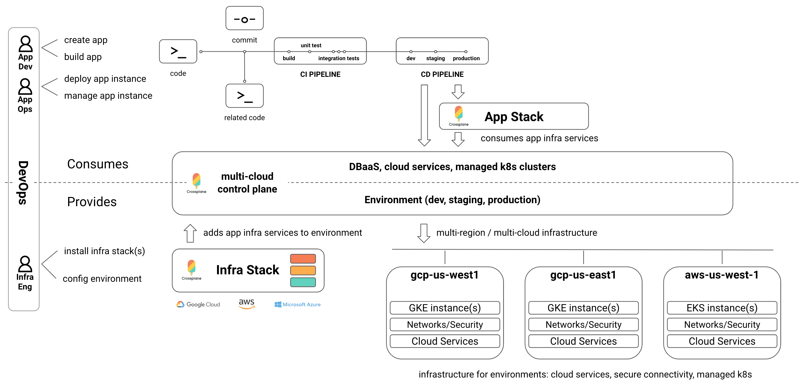

# Welcome to Crossplane!

Crossplane is an open source multicloud control plane to manage your
cloud-native applications and infrastructure across environments, clusters,
regions and clouds. It enables provisioning and full-lifecycle management
 of applications and managed services from your choice of cloud using `kubectl`.

Crossplane can be installed into an existing Kubernetes cluster to add managed
service provisioning or deployed as a dedicated control plane for multi-cluster
management and workload scheduling.

Crossplane enables the community to build and publish Stacks to add more clouds
and cloud services to Crossplane with support for out-of-tree extensibility and
independent release schedules. Crossplane includes Stacks for [GCP][stack-gcp], 
[AWS][stack-aws], and [Azure][stack-azure] today.

<h4 align="center"></h4>

Crossplane has four main feature areas that can be used independently:
1. Crossplane Services - provision managed services from kubectl.
1. Crossplane Stacks - extend Crossplane with new functionality.
1. Crossplane Workloads - define complete applications and schedule across
   clusters, regions, and clouds.
1. Crossplane Clusters - manage multiple Kubernetes clusters from a single
   control plane.

## Crossplane Services 
Crossplane Services supports managed service provisioning
using `kubectl`. It applies the Kubernetes pattern for Persistent Volume (PV)
claims and classes to managed service provisioning with support for a strong
separation of concern between app teams and cluster administrators. 

App teams can choose between cloud-specific and portable services including
managed databases, message queues, buckets, data pipelines, and more to define
complete applications, build once, and deploy into multiple clouds using
continuous delivery pipelines or GitOps flows. 

Cluster administrators can define self-service policies and best-practice
configurations to accelerate app delivery and improve security, so app teams can
focus on delivering their app instead of cloud-specific infrastructure details.

The [Crossplane Services Guide][services-user-guide] explores related concepts and
shows how to use Crossplane Services to deploy a Wordpress instance that
securely consumes a managed `MySQLInstance` from GCP, AWS, or Azure from
`kubectl`.

## Crossplane Stacks
Stacks extend Crossplane with new functionality and can be
installed using the [Stack
Manager][stacks-manager]
via the [Kubernetes
API][stack-install-docs]
or with the [crossplane kubectl
plugin][crossplane-cli] [`stack install`][crossplane-cli-usage] command.

Crossplane is built on the Kubernetes API machinery as a platform, and Stacks
simplify extending the Kubernetes API to provision and lifecycle manage apps and
the managed service infrastructure they depend on, including [Stack security and
isolation][stack-security-design].

The [Crossplane Stacks Guide][stack-user-guide] shows how to deploy a portable [Wordpress Stack][stack-wordpress-registry]
into multiple clouds using Infra Stacks including
[stack-gcp][stack-gcp], [stack-aws][stack-aws], and [stack-azure][stack-azure].

### Infrastructure Stacks 
Infra Stacks like [stack-gcp][stack-gcp], [stack-aws][stack-aws], and [stack-azure][stack-azure] 
extend the Kubernetes API to support managed service provisioning (DBaaS, cache, buckets), secure
connectivity (VPCs, subnets, peering, ACLs, secrets), and provisioning managed
Kubernetes clusters on demand to further isolate the blast radius of applications. 

Infra Stacks are pre-built and published to the [Stacks
registry][stack-registry] where they can
be installed by a Cluster Admin using a
[`ClusterStackInstall`][stack-install-docs]
Kubernetes API kind or with the [`stack
install`][crossplane-cli-usage] command that
installs a Stacks with permissions to watch resources at a cluster level, across
all namespaces.

Infra Stacks are covered in both the [Crossplane Services
Guide][services-user-guide] and the
[Crossplane Stacks Guide][stack-user-guide].

### Application Stacks 
App Stacks depend on Infra Stacks like
[stack-gcp][stack-gcp], [stack-aws][stack-aws], and [stack-azure][stack-azure]
to provide managed services via the Kubernetes API.

App Stacks are pre-built and published to the [Stacks
registry][stack-registry] where they can
be installed by an app team using a
[`StackInstall`][stack-install-docs]
Kubernetes API kind or with the [`stack
install`][crossplane-cli-usage] command that
installs Stacks with permissions only within a single namespace.

The [Crossplane Stacks Guide][stack-user-guide] covers how to deploy a portable 
[Wordpress Stack][stack-wordpress] into multiple clouds using Infra Stacks such
as [stack-gcp][stack-gcp], [stack-aws][stack-aws], and [stack-azure][stack-azure].

### Build your own Stack 
The [Crossplane Developer Guide][stack-developer-guide] shows how to
build and extend Infra Stacks and App Stacks. 

## Crossplane Workloads 
Crossplane includes an extensible workload scheduler that observes application 
policies to select a suitable target cluster from a pool of available clusters. 
The workload scheduler can be customized to consider a number of criteria including 
capabilities, availability, reliability, cost, regions, and performance while 
deploying workloads and their resources.

Complex workloads can be modeled as a
[`KubernetesApplication`][k8s-app-design]
resource as done by the portable [Wordpress Stack][stack-wordpress] which
automates the lifecycle of a
[`KubernetesApplication`][k8s-app-design]
including provisioning and secure connectivity to a managed `MySQLInstance`.

## Crossplane Clusters 
Crossplane supports dynamic provisioning of managed
Kubernetes clusters from a single control plane with consistent multi-cluster
best-practice configuration and secure connectivity between target Kubernetes
clusters and the managed services provisioned for applications. Managed
Kubernetes clusters can be dynamically provisioned with a `KubernetesCluster`
resource as done by the portable [Wordpress Stack][stack-wordpress] which
automates the lifecycle of a `KubernetesCluster`.

## Architecture and Vision

The full architecture and vision of the Crossplane project is described in depth
in the [architecture document][arch-doc].
It is the best place to learn more about how Crossplane fits into the Kubernetes
ecosystem, the intended use cases, and comparisons to existing projects.

## Learn More
If you have any questions, please drop us a note on [Crossplane Slack][join-crossplane-slack] or [contact us][contact-us]!

* [Quick Start Guide](quick-start.md)
* [Concepts](concepts.md)
* [Services Guide][services-user-guide] - upgrade an existing Kubernetes cluster
  to support managed service provisioning from kubectl.
* [Stacks Guide][stack-user-guide] - deploy a portable Wordpress Stack into
  multiple clouds.
* [API Reference](api.md)
* [Developer Guide](developer-guide.md)
* [Contributing](../CONTRIBUTING.md)
* [FAQs](faqs.md)
* [Learn More][learn-more]

<!-- Named links -->
[services-user-guide]: services-guide.md
[stack-user-guide]: stacks-guide.md
[stack-developer-guide]: developer-guide.md
[stacks-manager]: https://github.com/crossplaneio/crossplane/blob/master/design/design-doc-stacks.md#terminology
[crossplane-cli]: https://github.com/crossplaneio/crossplane-cli
[crossplane-cli-usage]: https://github.com/crossplaneio/crossplane-cli#usage
[stack-security-design]: https://github.com/crossplaneio/crossplane/blob/master/design/one-pager-stacks-security-isolation.md

[stack-wordpress-registry]: https://hub.docker.com/r/crossplane/sample-stack-wordpress
[stack-wordpress]: https://github.com/crossplaneio/sample-stack-wordpress

[stack-gcp]: https://github.com/crossplaneio/stack-gcp
[stack-aws]: https://github.com/crossplaneio/stack-aws
[stack-azure]: https://github.com/crossplaneio/stack-azure
[stack-registry]: https://hub.docker.com/search?q=crossplane&type=image
[stack-install-docs]: https://github.com/crossplaneio/crossplane/blob/master/design/design-doc-stacks.md#installation-flow

[k8s-app-design]: https://github.com/crossplaneio/crossplane/blob/master/design/design-doc-complex-workloads.md#design

[arch-doc]: https://docs.google.com/document/d/1whncqdUeU2cATGEJhHvzXWC9xdK29Er45NJeoemxebo/edit?usp=sharing

[contact-us]: https://github.com/crossplaneio/crossplane#contact
[join-crossplane-slack]: https://slack.crossplane.io
[learn-more]: learn-more.md

