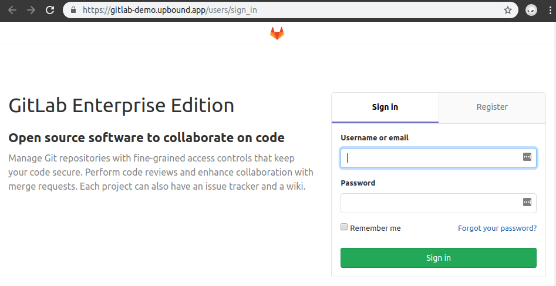

# Deploying GitLab in AWS

This user guide will walk you through GitLab application deployment using Crossplane managed resources and
the official GitLab Helm chart.

The following components are dynamically provisioned and configured during this guide:

* An RDS Postgres database
* A Redis cluster
* A sample Gitlab application


## Pre-requisites

* Before starting this guide, you should have already [configured your AWS account](../../cloud-providers/aws/aws-provider.md) for use with Crossplane.
* You should also have an AWS credentials file at `~/.aws/credentials` already on your local filesystem.
* [Helm](https://docs.helm.sh/using_helm/), minimum version `v2.10.0+`.
* [jq](https://stedolan.github.io/jq/) - commandline JSON processor `v1.5+`
* [AWS cli](https://docs.aws.amazon.com/cli/latest/userguide/cli-chap-install.html)

## Preparation

### EKS Cluster
Follow [GitLab instruction](https://docs.gitlab.com/charts/installation/cloud/eks.html#scripted-cluster-creation) to create and bootstrap EKS Kubernetes cluster

### Crossplane

Using the newly provisioned cluster:

- Install Crossplane from master channel using the [Crossplane Installation Guide](../install-crossplane.md#master)
- Install the AWS stack into Crossplane using the [AWS stack section](../install-crossplane.md#aws-stack) of the install guide.
- Obtain [Cloud Provider Credentials](../cloud-providers.md)

#### Region
- Export the region of the EKS cluster you're provisioned for this demo
```
export REGION=region-of-eks-west-1
```

#### EKS kubeconfig
- Obtain EKS Cluster credentials and set as your current context
```bash
aws eks --region $REGION update-kubeconfig --name [your-CLUSTER_NAME]
```

#### AWS provider

Create provider:
```console
sed -e "s|REGION|$REGION|g;s|BASE64ENCODED_AWS_PROVIDER_CREDS|`base64 ~/.aws/credentials | tr -d '\n'`|g;" cluster/examples/gitlab/aws/provider.yaml | kubectl create -f -
```

- Verify AWS provider was successfully registered by the crossplane
    ```bash
    kubectl get providers.aws.crossplane.io -n crossplane-system
    kubectl get secrets -n crossplane-system
    ```

    - You should see output similar to:

    ```bash
    NAME       PROJECT-ID            AGE
    demo-aws   your-project-123456   11m
    NAME                  TYPE                                  DATA   AGE
    default-token-974db   kubernetes.io/service-account-token   3      2d16h
    demo-aws-creds        Opaque                                1      103s
    ```

#### Create an RDS subnet group
1. Navigate to the aws console in same region as the EKS cluster
1. Navigate to `RDS` service
1. Navigate to `Subnet groups` in left hand pane
1. Click `Create DB Subnet Group`
1. Name your subnet i.e. `eks-db-subnets`
1. Select the VPC created in the EKS VPC step
1. Click `Add all subnets related to this VPC`
1. Click Create
1. Export the db subnet group name
    ```console
    export RDS_SUBNET_GROUP_NAME=replace-with-DBSubnetgroup-name
    ```
#### Create an RDS/Redis Security Group (example only)

> Note: This will make your RDS and Redis instance visible from anywhere on the internet.
This is for **EXAMPLE PURPOSES ONLY** and is **NOT RECOMMENDED** for production system.

1. Navigate to ec2 in the same region as the EKS cluster
1. Click: security groups
1. Click `Create Security Group`
1. Name it, ex. `bad-idea-public-visibility`
1. Give it a description
1. Select the same VPC as the EKS cluster.
1. On the Inbound Rules tab, choose `Add Rule`.
    - For Type, choose `Custom TCP Rule`
    - For Port Range, type `6379`
    - For Source, choose `Anywhere` from drop down or type: `0.0.0.0/0`
    - Click `Add Rule` again
    - For Type, choose `PostgreSQL`
    - For Source, choose `Anywhere` from drop down or type: `0.0.0.0/0`
1. Choose Add another rule if you need to add more IP addresses or different port ranges.
1. Click: Create
1. Export the security group id
    ```console
    export REDIS_SECURITY_GROUP=replace-with-security-group-id
    export RDS_SECURITY_GROUP=replace-with-security-group-id
    ```

#### Create an Elasticache Subnet Group
1. Navigate to the aws console in same region as the EKS cluster
1. Navigate to `Elasticache` service
1. Navigate to `Subnet groups` in left hand pane
1. Click `Create Subnet Group`
1. Name your subnet i.e. `redis-subnets`
1. Select the VPC created in the EKS VPC step
1. Click `Add all subnets related to this VPC`
1. Click Create
1. Export the db subnet group name

```console
export REDIS_SUBNET_GROUP=replace-me-with-redis-subnet-group
```


#### Resource Classes
Create Crossplane Resource Class needed to provision managed resources for GitLab applications

```bash
sed -e "s|REDIS_SECURITY_GROUP|$REDIS_SECURITY_GROUP|g;s|REDIS_SUBNET_GROUP|$REDIS_SUBNET_GROUP|g;s|REGION|$REGION|g;s|RDS_SUBNET_GROUP_NAME|$RDS_SUBNET_GROUP_NAME|g;s|RDS_SECURITY_GROUP|$RDS_SECURITY_GROUP|g" cluster/examples/gitlab/aws/resource-classes/* | kubectl create -f -
```

```
resourceclass.core.crossplane.io/standard-aws-bucket created
resourceclass.core.crossplane.io/standard-aws-postgres created
resourceclass.core.crossplane.io/standard-aws-redis created
```

Verify

```bash
kubectl get resourceclasses -n crossplane-system
```

```
NAME                    PROVISIONER                                                 PROVIDER-REF   RECLAIM-POLICY   AGE
standard-aws-bucket     s3buckets.storage.aws.crossplane.io/v1alpha1                demo-aws       Delete           17s
standard-aws-postgres   rdsinstance.database.aws.crossplane.io/v1alpha1             demo-aws       Delete           17s
standard-aws-redis      replicationgroup.cache.aws.crossplane.io/v1alpha1           demo-aws       Delete           17s
```

#### Resource Claims
Provision Managed Resources required by GitLab application using Crossplane Resource Claims.

Note: you can use a separate command for each claim file, or create all claims in one command, like so:

```bash
kubectl create -Rf cluster/examples/gitlab/aws/resource-claims/
```
```
postgresqlinstance.database.crossplane.io/gitlab-postgresql created
rediscluster.cache.crossplane.io/gitlab-redis created
bucket.storage.crossplane.io/gitlab-artifacts created
bucket.storage.crossplane.io/gitlab-backups-tmp created
bucket.storage.crossplane.io/gitlab-backups created
bucket.storage.crossplane.io/gitlab-externaldiffs created
bucket.storage.crossplane.io/gitlab-lfs created
bucket.storage.crossplane.io/gitlab-packages created
bucket.storage.crossplane.io/gitlab-pseudonymizer created
bucket.storage.crossplane.io/gitlab-registry created
bucket.storage.crossplane.io/gitlab-uploads created
```

Verify that the resource claims were successfully provisioned.
```bash
kubectl get -f cluster/examples/gitlab/aws/resource-claims/postgres.yaml
kubectl get -f cluster/examples/gitlab/aws/resource-claims/redis.yaml
```

```
NAME                STATUS   CLASS                   VERSION   AGE
gitlab-postgresql   Bound    standard-aws-postgres   9.6       5m27s
---
NAME           STATUS   CLASS                VERSION   AGE
gitlab-redis   Bound    standard-aws-redis   3.2       7m10s
```

```bash
# check all bucket claims
kubectl get -f cluster/examples/gitlab/aws/resource-claims/buckets/
```
```text
NAME                   STATUS   CLASS                 PREDEFINED-ACL   LOCAL-PERMISSION   AGE
gitlab-artifacts       Bound    standard-aws-bucket                                       4m49s
NAME                   STATUS   CLASS                 PREDEFINED-ACL   LOCAL-PERMISSION   AGE
gitlab-backups-tmp     Bound    standard-aws-bucket                                       4m49s
NAME                   STATUS   CLASS                 PREDEFINED-ACL   LOCAL-PERMISSION   AGE
gitlab-backups         Bound    standard-aws-bucket                                       4m49s
NAME                   STATUS   CLASS                 PREDEFINED-ACL   LOCAL-PERMISSION   AGE
gitlab-externaldiffs   Bound    standard-aws-bucket                                       4m49s
NAME                   STATUS   CLASS                 PREDEFINED-ACL   LOCAL-PERMISSION   AGE
gitlab-lfs             Bound    standard-aws-bucket                                       4m49s
NAME                   STATUS   CLASS                 PREDEFINED-ACL   LOCAL-PERMISSION   AGE
gitlab-packages        Bound    standard-aws-bucket                                       4m49s
NAME                   STATUS   CLASS                 PREDEFINED-ACL   LOCAL-PERMISSION   AGE
gitlab-pseudonymizer   Bound    standard-aws-bucket                                       4m49s
NAME                   STATUS   CLASS                 PREDEFINED-ACL   LOCAL-PERMISSION   AGE
gitlab-registry        Bound    standard-aws-bucket                                       4m49s
NAME                   STATUS   CLASS                 PREDEFINED-ACL   LOCAL-PERMISSION   AGE
gitlab-uploads         Bound    standard-aws-bucket                                       4m49s
```

What we are looking for is for `STATUS` value to become `Bound` which indicates the managed resource was successfully provisioned and is ready for consumption

##### Resource Claims Connection Secrets
Verify that every resource has created a connection secret
```bash
kubectl get secrets -n default
```
```
NAME                   TYPE                                  DATA   AGE
default-token-mzsgg    kubernetes.io/service-account-token   3      5h42m
gitlab-artifacts       Opaque                                4      6m41s
gitlab-backups         Opaque                                4      7m6s
gitlab-backups-tmp     Opaque                                4      7m7s
gitlab-externaldiffs   Opaque                                4      7m5s
gitlab-lfs             Opaque                                4      7m4s
gitlab-packages        Opaque                                4      2m28s
gitlab-postgresql      Opaque                                3      30m
gitlab-pseudonymizer   Opaque                                4      7m2s
gitlab-redis           Opaque                                1      28m
gitlab-registry        Opaque                                4      7m1s
gitlab-uploads         Opaque                                4      7m1s
```

Note: Kubernetes cluster claim is created in "privileged" mode; thus the kubernetes cluster resource secret is located in `crossplane-system` namespace, however, you will not need to use this secret for our GitLab demo deployment.

At this point, all GitLab managed resources should be ready to consume and this completes the Crossplane resource provisioning phase.

#### Managed Resource Secrets

##### Convert Secrets and Export Valuess
GitLab requires to provide connection information in the specific format per cloud provider.
In addition, we need to extract endpoints and additional managed resource properties and add them to helm values.

There is an [ongoing effort](https://github.com/crossplaneio/crossplane/issues/489) to improve secret consumption from GitLab such that secrets produced by Crossplane controllers are directly consumed without transformation.

We will use a convenience script for this purpose.
Note: your output may be different
```bash
./cluster/examples/gitlab/aws/secrets.sh
```
```
Current cluster kubectl context: eks_you-project-123456_us-central1-a_eks-a2345dfb1-asdf-11e9-ac37-9cb6d08bde99
---
Source cluster secrets:
NAME                   TYPE                                  DATA   AGE
default-token-mzsgg    kubernetes.io/service-account-token   3      2d7h
gitlab-artifacts       Opaque                                4      34h
gitlab-backups         Opaque                                4      34h
gitlab-backups-tmp     Opaque                                4      34h
gitlab-externaldiffs   Opaque                                4      34h
gitlab-lfs             Opaque                                4      34h
gitlab-packages        Opaque                                4      34h
gitlab-postgresql      Opaque                                3      2d2h
gitlab-pseudonymizer   Opaque                                4      34h
gitlab-redis           Opaque                                1      2d2h
gitlab-registry        Opaque                                4      34h
gitlab-uploads         Opaque                                4      34h
---
Generate PostgreSQL secret and values file
secret/gitlab-postgresql created
---
Generate Redis values file
---
Generate Buckets secrets
secret/bucket-artifacts created
secret/bucket-backups-tmp created
secret/bucket-backups created
secret/bucket-externaldiffs created
secret/bucket-lfs created
secret/bucket-packages created
secret/bucket-pseudonymizer created
secret/bucket-registry created
secret/bucket-uploads created

```

## Install
Render the official GitLab Helm chart with the generated values files, and your settings into a `gitlab-aws.yaml` file.
See [GitLab Helm Documentation](https://docs.gitlab.com/charts/installation/deployment.html) for the additional details

```bash
helm repo add gitlab https://charts.gitlab.io/
helm repo update
helm fetch gitlab/gitlab --version v1.7.1
helm template gitlab-1.7.1.tgz --name gitlab-demo --namespace default \
    -f cluster/examples/gitlab/aws/values-buckets.yaml \
    -f cluster/examples/gitlab/aws/values-redis.yaml \
    -f cluster/examples/gitlab/aws/values-psql.yaml \
    --set global.hosts.domain=[your.domain] \
    --set global.hosts.hostSuffix=demo \
    --set certmanager-issuer.email=email@account.io > gitlab-aws.yaml
```

Examine `gitlab-aws.yaml` to familiarize yourself with all GitLab components.

Install GitLab
Note: your output may look different:
```bash
kubectl create -f gitlab-aws.yaml
```

Validate GitLab components:

```bash
kubectl get jobs,deployments,statefulsets
```

It usually takes few minutes for all GitLab components to get initialized and be ready.

Note: During the initialization "wait", some pods could automatically restart, but this should stabilize once all the
dependent components become available.

Note: There also could be intermittent `ImagePullBackOff`, but those, similar to above should clear up by themselves.

Note: It appears the `gitlab-demo-unicorn-test-runner-*` (job/pod) will Error and will not re-run, unless the pod is resubmitted.

After few minutes your output for:
```bash
kubectl get pod
```
Should look similar to:
```bash
NAME                                                         READY   STATUS             RESTARTS   AGE
gitlab-demo-certmanager-59f887dc9-jppl7                      1/1     Running            0          9m
gitlab-demo-gitaly-0                                         1/1     Running            0          9m
gitlab-demo-gitlab-runner-fcc9cc7cf-c7pzz                    0/1     Init:0/1           0          9m
gitlab-demo-gitlab-shell-57b887755c-kqm89                    1/1     Running            0          8m
gitlab-demo-gitlab-shell-57b887755c-vzqkf                    1/1     Running            0          9m
gitlab-demo-issuer.0-ddzwp                                   0/1     Completed          0          9m
gitlab-demo-migrations.0-2h5px                               1/1     Running            2          9m
gitlab-demo-nginx-ingress-controller-7bf4f7574d-cznfl        1/1     Running            0          9m
gitlab-demo-nginx-ingress-controller-7bf4f7574d-f5wjz        1/1     Running            0          9m
gitlab-demo-nginx-ingress-controller-7bf4f7574d-mxqpz        1/1     Running            0          9m
gitlab-demo-nginx-ingress-default-backend-5886cb59c7-bjnrt   1/1     Running            0          9m
gitlab-demo-nginx-ingress-default-backend-5886cb59c7-gchhp   1/1     Running            0          9m
gitlab-demo-prometheus-server-64897864cf-p4sd7               2/2     Running            0          9m
gitlab-demo-registry-746bbb488f-xjlhp                        1/1     Running            0          8m
gitlab-demo-registry-746bbb488f-xxpcr                        1/1     Running            0          9m
gitlab-demo-shared-secrets.0-mr7-2v5cf                       0/1     Completed          0          9m
gitlab-demo-sidekiq-all-in-1-5dd8b5b9d-58p72                 1/1     Running            0          9m
gitlab-demo-task-runner-7c477b48dc-d5nf6                     1/1     Running            0          9m
gitlab-demo-unicorn-6dd757db97-4vqgc                         1/2     ImagePullBackOff   0          9m
gitlab-demo-unicorn-6dd757db97-nmglt                         2/2     Running            0          8m
gitlab-demo-unicorn-test-runner-f2ttk                        0/1     Error              0          9m
```

Note: if `ImagePullBackOff` error Pod does not get auto-cleared, consider deleting the pod.
A new pod should come up with "Running" STATUS.

## Use
Retrieve the DNS name using GitLab ingress componenet:
```bash
kubectl get ingress
```
You should see following ingress configurations:
```
NAME                   HOSTS                       ADDRESS          PORTS     AGE
gitlab-demo-registry   registry-demo.upbound.app   35.222.163.203   80, 443   14m
gitlab-demo-unicorn    gitlab-demo.upbound.app     35.222.163.203   80, 443   14m
```

Navigate your browser to https://gitlab-demo.[your-domain], and if everything ran successfully, you should see:



## Uninstall

### GitLab
To remove the GitLab application: run:
```bash
kubectl delete -f gitlab-aws.yaml
```

### Crossplane

Delete all managed resources by running:
```bash
kubectl delete -Rf cluster/examples/gitlab/aws/resource-claims
```
```
bucket.storage.crossplane.io "gitlab-artifacts" deleted
bucket.storage.crossplane.io "gitlab-backups-tmp" deleted
bucket.storage.crossplane.io "gitlab-backups" deleted
bucket.storage.crossplane.io "gitlab-externaldiffs" deleted
bucket.storage.crossplane.io "gitlab-lfs" deleted
bucket.storage.crossplane.io "gitlab-packages" deleted
bucket.storage.crossplane.io "gitlab-pseudonymizer" deleted
bucket.storage.crossplane.io "gitlab-registry" deleted
bucket.storage.crossplane.io "gitlab-uploads" deleted
postgresqlinstance.database.crossplane.io "gitlab-postgresql" deleted
rediscluster.cache.crossplane.io "gitlab-redis" deleted
```

Verify that all resource claims have been removed:
```bash
kubectl get -Rf cluster/examples/gitlab/aws/resource-claims
```
Note: typically it may take few seconds for Crossplane to process the request.
By running resource and provider removal in the same command or back-to-back, we are running the risk of having orphaned resource.
I.E., a resource that could not be cleaned up because the provider is no longer available.

Delete all resource classes:
```bash
kubectl delete -Rf cluster/examples/gitlab/aws/resource-classes/
```
```
resourceclass.core.crossplane.io "standard-aws-bucket" deleted
resourceclass.core.crossplane.io "standard-aws-postgres" deleted
resourceclass.core.crossplane.io "standard-aws-redis" deleted
```

Delete aws-provider and secrets
```bash
kubectl delete -f cluster/examples/gitlab/aws/provider.yaml
```
