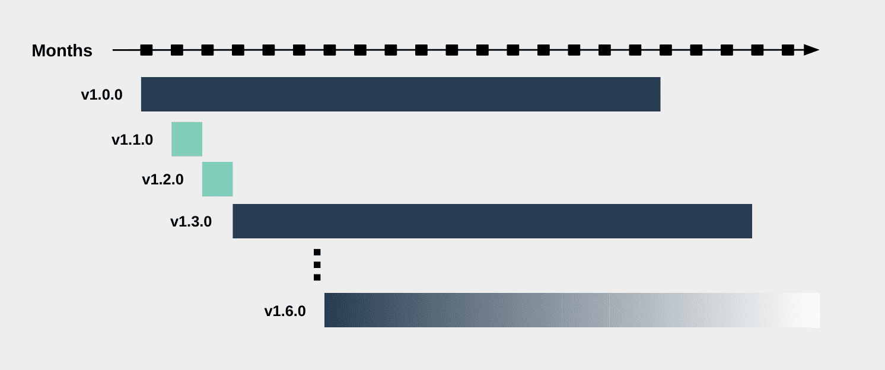

Starting with the v1.0.0 release, Crossplane is released on an eight week
cadence. A cycle is comprised of three general stages:

- Weeks 1-6: [Active Development]
- Week 7: [Feature Freeze]
- Week 8: [Code Freeze]

This results in six releases per year, with every third release being considered
an LTS (Long Term Support) release. The Crossplane community supports three LTS
releases at a time, meaning that a user that depends on an LTS release will not
be required to upgrade their version for up to 1.5 years. The Crossplane
community also supports the latest release, whether it is an LTS release or not.

For example, Crossplane v1.0.0 was the first LTS release, so the next one will
be v1.1.0 in February 2021. At that time, the Crossplane community will support
both v1.0.0 and v1.1.0. When v1.2.0 is released in April 2021, the community
will then support v1.0.0 and v1.2.0. The next release, v1.3.0, will be an LTS
release. The Crossplane community will support v1.0.0 and v1.3.0 until the
v1.4.0 release, at which point it will support all three. This pattern would
continue until the release of v1.9.0, at which time support for v1.0.0 will be
dropped.

This means that the Crossplane community will support at most four releases
(three LTS + one interim) at at a time.

### Definition of Support

The Crossplane community defines support in that relevant bug fixes that are
merged to the main development branch will be eligible to be back-ported to the
release branch of any currently supported version, and patch releases will be
cut appropriately. It is also possible that a fix may be merged directly to the
release branch if no longer applicable on the main development branch. Support
does not indicate any SLA on response time for user support in the form of Slack
messages or issues, but problems will be addressed on a best effort basis by
maintainers and contributors for currently supported releases.

### Patch Releases

_This policy is subject to change in the future._

Patch releases are cut for currently supported minor versions on an as-needed
basis. Any critical back-ported fixes will be included in a patch release as
soon as possible after merge.

### Pre-Releases

_This policy is subject to change in the future._

Alpha, Beta, and RC releases are cut for an upcoming release on an as-needed
basis. As a policy, at least one pre-release will be cut prior to any minor
release. Pre-releases will not be made on release branches.

### Provider Releases

The Crossplane release process is not required to be adhered to by any other
Crossplane projects, but a similar cadence is encouraged. Maintainers listed in
each repositories `OWNERS.md` file are responsible for determining and
publishing the release process for their project.

## Release Stages

The following stages are the main milestones in a Crossplane release.

### Active Development

During active development, any code that meets the requisite criteria (i.e.
passing appropriate tests, approved by a maintainer, etc.) will be merged into
the main development branch. At present, there is no requirement to formally
submit an enhancement proposal prior to the start of the release cycle, but
contributors are encouraged to open an issues and gather feedback before
starting work on a major implementation.

### Feature Freeze

During feature freeze, no new functionality should be merged into the main
development branch. Bug fixes, documentation changes, and non-critical changes
may be made. In the case that a new feature is deemed absolutely necessary for a
release, the Crossplane maintainers will weigh the impact of the change and make
a decision on whether it should be included. 

### Code Freeze

During code freeze, there should be no changes merged to the main development
branch with the following exceptions:
- Fixes to a failing test that is deemed to be incorrectly testing
  functionality.
- Documentation only changes. It is possible that a documentation freeze will be
  implemented in the future, but it is not currently enforced.
- Fixes to a critical bug that was not previously identified. Merging a bug fix
  during code freeze requires application for and approval of an exception by
  Crossplane maintainers. This process is currently informal, but may be
  formalized in the future.

<!-- Named links -->

[Active Development]: #active-development
[Feature Freeze]: #feature-freeze
[Code Freeze]: #code-freeze
