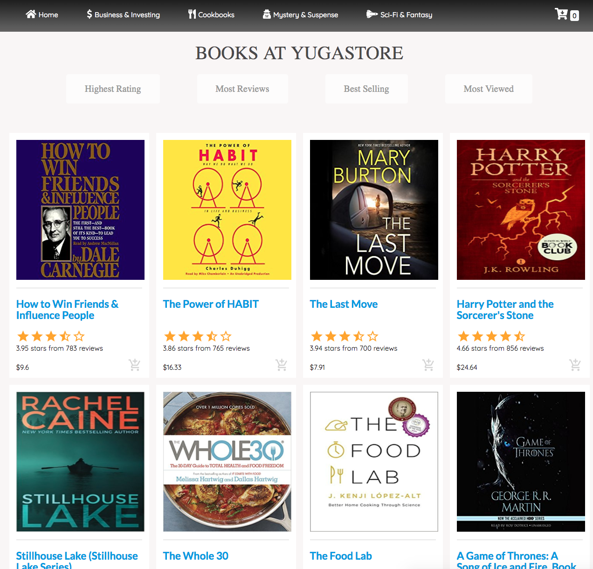

# Stacks Guide: Rook

> Note: this guide does not follow along with the other stacks guides. It
> deploys a different application (Yugastore) and involves using the GCP stack
> along with the Rook stack.

This user guide will walk you through [Yugastore] application deployment using
Crossplane's [Rook] stack to run [YugabyteDB] in a Google Cloud [GKE] Kubernetes
cluster. To do so, we will broadly:

1. Provision a GKE Kubernetes cluster
1. Install the Rook [Yugabyte operator] into the GKE cluster
1. Provision a YugabyteDB cluster and deploy the Yugastore app into the GKE
   cluster

... all using Crossplane!

## Table of Contents

1. [Pre-requisites](#pre-requisites)
1. [Preparation](#preparation)
1. [Set Up Crossplane](#set-up-crossplane)
    1. [Install in Standalone Control
       Cluster](#install-in-standalone-control-cluster)
    1. [GCP Provider](#gcp-provider)
    1. [Rook Provider](#rook-provider)
    1. [Resource Classes](#resource-classes)
1. [Provision Target Cluster](#provision-target-cluster)
    1. [Provision GKE Cluster with a Resource
       Claim](#provision-gke-cluster-with-a-resource-claim)
    1. [Install Rook Yugabyte Operator with a
       KubernetesApplication](#install-rook-yugabyte-operator-with-a-kubernetesapplication)
1. [Deploy Yugastore into Target Cluster](#deploy-yugastore-into-target-cluster)
    1. [Provision YugabyteDB with a Resource
       Claim](#provision-yugabytedb-with-a-resource-claim)
    1. [Provision Yugastore with a
       KubernetesApplication](#provision-yugastore-with-a-kubernetesapplication)
1. [Results](#results)
1. [Cleanup](#cleanup)
1. [Conclusion and Next Steps](#conclusion-and-next-steps)

## Pre-requisites

These tools are required to complete this guide. They must be installed on your
local machine.

* [kubectl][install-kubectl]
    * kubectl also be installed using the Azure CLI: `az aks install-cli`
* [Helm][using-helm], minimum version `v2.10.0+`.


## Preparation

This guide assumes that you have an existing Kubernetes cluster, which will
serve as the Crossplane control cluster. Good options for running local
Kubernetes clusters include [KIND] and [Minikube].

In order to utilize GCP services, we must set the `PROJECT_ID` of the GCP
project we want to use. Run the following:
```bash
export PROJECT_ID=crossplane-playground # the project that all resources reside.
```

## Set Up Crossplane

### Install in Standalone Control Cluster

Using your local Kubernetes cluster:

1. Install Crossplane from the alpha channel. (See the [Crossplane Installation
   Guide][crossplane-install] for more information.)

```bash
helm repo add crossplane-alpha https://charts.crossplane.io/alpha
helm install --name crossplane --namespace crossplane-system crossplane-alpha/crossplane
```

2. Install the GCP stack into Crossplane. (See the [GCP stack
   section][gcp-stack-install] of the install guide for more information.)

```bash
cat > stack-gcp.yaml <<EOF
apiVersion: stacks.crossplane.io/v1alpha1
kind: ClusterStackInstall
metadata:
  name: stack-gcp
  namespace: crossplane-system
spec:
  package: "crossplane/stack-gcp:v0.2.0"
EOF

kubectl apply -f stack-gcp.yaml
```

3. Install the Rook stack into Crossplane (See the [Rook stack
   section][rook-stack-install] of the install guide for more information.)

```bash
cat > stack-rook.yaml <<EOF
apiVersion: stacks.crossplane.io/v1alpha1
kind: ClusterStackInstall
metadata:
  name: stack-rook
  namespace: crossplane-system
spec:
  package: "crossplane/stack-rook:v0.1.0"
EOF

kubectl apply -f stack-rook.yaml
```

4. Obtain GCP credentials. (See the [Cloud Provider Credentials][cloud-creds]
   docs for more information.)

### GCP Provider

Using the service account json `crossplane-gcp-provider-key.json` that you
acquired from GCP:

* Generate Base64 encoded value to store in a `Secret`:

  ```bash
  export BASE64ENCODED_GCP_PROVIDER_CREDS=$(base64 crossplane-gcp-provider-key.json | tr -d "\n")
  ```

  * Define a GCP `Provider` (using the `PROJECT_ID` environment variable we set
    above) and `Secret`:

    ```bash
    cat > gcp-provider.yaml <<EOF
    ---
    apiVersion: v1
    data:
      credentials.json: $BASE64ENCODED_GCP_PROVIDER_CREDS
    kind: Secret
    metadata:
      name: gcp-provider-creds
      namespace: crossplane-system
    type: Opaque
    ---
    apiVersion: gcp.crossplane.io/v1alpha3
    kind: Provider
    metadata:
      name: gcp-provider
    spec:
      credentialsSecretRef:
        name: gcp-provider-creds
        namespace: crossplane-system
        key: credentials.json
      projectID: $PROJECT_ID
    EOF

    kubectl apply -f gcp-provider.yaml
    unset BASE64ENCODED_GCP_PROVIDER_CREDS # we don't need this anymore.
    ```

* Verify GCP provider was successfully registered by the crossplane

  ```bash
  kubectl get providers.gcp.crossplane.io
  kubectl -n crossplane-system get secrets
  ```

### Rook Provider

Rook differs from traditional cloud provider stacks in that it does not come
with a Rook `Provider` custom resource. The reason for this is that Rook runs in
any Kubernetes cluster. Therefore, it utilizes the general Kubernetes `Provider`
custom resource that is packaged as part of the core Crossplane installation. We
will see how to use this `Provider` type further along in this guide.

#### TL;DR

If you want to skip the rest of the guide and just deploy Yugastore, you can
run:

```bash
kubectl apply -k https://github.com/crossplaneio/crossplane//cluster/examples/rook/yugastore?ref=release-0.4
```

And you're done! You can check the status of the provisioning by running:

```bash
kubectl get -k https://github.com/crossplaneio/crossplane//cluster/examples/rook/yugastore?ref=release-0.4
```

If you did not opt for this shortcut, keep reading.

### Resource Classes

To keep all configuration organized in a single location, create a new
directory:

```bash
mkdir yugastore && cd $_
```

In order to dynamically provision resources, we need to create resources classes
that contain details about how the resources should be provisioned. For
Yugastore, we will need resource classes that are capable of fulfilling a
`KubernetesCluster` claim and a `PostgreSQLInstance` claim. The
`GKEClusterClass` is relatively straightforward in that it configures a
`GKECluster` and utilizes our previously created GCP `Provider` for
provisioning.

```bash
cat > gkeclass.yaml <<EOF
apiVersion: compute.gcp.crossplane.io/v1alpha3
kind: GKEClusterClass
metadata:
  name: standard-gke
  labels:
    app: yugastore
specTemplate:
  machineType: n1-standard-1
  numNodes: 1
  zone: us-central1-b
  providerRef:
    name: gcp-provider
  reclaimPolicy: Delete
  writeConnectionSecretsToNamespace: crossplane-system
EOF

kubectl apply -f gkeclass.yaml
```

The `YugabyteClusterClass` is less clear. Starting with the provider, we
reference a `Provider` that does not currently exist. Because resource classes
only store configuration data, this is okay as long as the provider exists when
the class is referenced by a claim. As previously mentioned, this provider will
be a Kubernetes `Provider` which we will create after the `GKECluster` is
created and its connection secret is propagated.

The `forProvider` section of the `YugabyteClusterClass` also differs somewhat
from other resource classes. While resource classes like `GKEClusterClass`
specify configuration for a 3rd party API, `YugabyteClusterClass` specifies
configuration for a Kubernetes [CustomResourceDefinition] (CRD) instance in a
target cluster. When the `YugabyteClusterClass` is used to create a
`YugabyteCluster` managed resource in the Crossplane control cluster, the Rook
stack reaches out to the target Kubernetes cluster using the Kubernetes
`Provider` referenced above and creates a Rook `YBCluster` [instance]. The stack
trusts that the CRD kind has been installed in the target cluster and it will
fail to provision the resource it has not (more on this below).

```bash
cat > yugabyteclass.yaml <<EOF
apiVersion: database.rook.crossplane.io/v1alpha1
kind: YugabyteClusterClass
metadata:
  name: yuga-cluster
  labels:
    app: yugastore
specTemplate:
  providerRef:
    name: yugastore-k8s-provider
  reclaimPolicy: Delete
  writeConnectionSecretsToNamespace: crossplane-system
  forProvider:
    name: hello-ybdb-cluster
    namespace: rook-yugabytedb
    master:
      # Replica count for Master.
      replicas: 3
      network:
        ports:
          - name: yb-master-ui
            port: 7000          # default value
          - name: yb-master-rpc
            port: 7100          # default value
      # Volume claim template for Master
      volumeClaimTemplate:
        metadata:
          name: datadir
        spec:
          accessModes: [ "ReadWriteOnce" ]
          resources:
            requests:
              storage: 1Gi
          storageClassName: standard
    tserver:
      # Replica count for TServer
      replicas: 3
      network:
        ports:
          - name: yb-tserver-ui
            port: 9000
          - name: yb-tserver-rpc
            port: 9100          # default value
          - name: ycql
            port: 9042          # default value
          - name: yedis
            port: 6379          # default value
          - name: ysql
            port: 5433          # default value
      # Volume claim template for TServer
      volumeClaimTemplate:
        metadata:
          name: datadir
        spec:
          accessModes: [ "ReadWriteOnce" ]
          resources:
            requests:
              storage: 1Gi
          storageClassName: standard
EOF

kubectl apply -f yugabyteclass.yaml
```

## Provision Target Cluster

### Provision GKE Cluster with a Resource Claim

Now that our classes have been created, we need to provision the GKE cluster by
creating a `KubernetesCluster` claim.

```bash
cat > k8sclaim.yaml <<EOF
apiVersion: v1
kind: Namespace
metadata:
  name: yugastore-app
  labels:
    app: yugastore
---
apiVersion: kubernetes.crossplane.io/v1alpha1
kind: Provider
metadata:
  name: yugastore-k8s-provider
  labels:
    app: yugastore
spec:
  credentialsSecretRef:
    name: yugastore-k8s-secret
    namespace: yugastore-app
---
apiVersion: compute.crossplane.io/v1alpha1
kind: KubernetesCluster
metadata:
  name: yugastore-k8s
  namespace: yugastore-app
  labels:
    app: yugastore
spec:
  classSelector:
    matchLabels:
      app: yugastore
  writeConnectionSecretToRef:
    name: yugastore-k8s-secret
EOF

kubectl apply -f k8sclaim.yaml
```

You can view the status of the `KubernetesCluster` claim as it waits for the GKE
cluster to come available:

*Command*
```bash
kubectl get kubernetesclusters -n yugastore-app
```
*Output*
```bash
NAME            STATUS   CLASS-KIND        CLASS-NAME     RESOURCE-KIND   RESOURCE-NAME                       AGE
yugastore-k8s   Bound    GKEClusterClass   standard-gke   GKECluster      yugastore-app-yugastore-k8s-vdhjq   23m
```

You can view the status of the `GKECluster` itself as it is created:

*Command*
```bash
kubectl get gkeclusters.compute.gcp.crossplane.io yugastore-app-yugastore-k8s-vdhjq
```
*Output*
```bash
NAME                                STATUS   STATE     CLUSTER-NAME                               ENDPOINT        CLUSTER-CLASS   LOCATION        RECLAIM-POLICY   AGE
yugastore-app-yugastore-k8s-vdhjq   Bound    RUNNING   gke-20a8dd85-b76c-4041-bc77-36c13ee28e37   35.224.89.145   standard-gke    us-central1-b   Delete           5m41s
```

Here we have created a namespace `yugastore-app` for our Yugastore namespaced
resources to use and also create a Kubernetes `Provider` the references the
secret propagated by the `KubernetesCluster` claim. If you look back at the
`YugabyteClusterClass` we created above, this `yugastore-k8s-provider` is
referenced, so once the secret is propagated, the Rook stack will be able to use
it to provision a `YugabyteCluster`. However, before we get to that, we need to
deploy the Rook Yugabyte operator into the Kubernetes cluster.

### Install Rook Yugabyte Operator with a KubernetesApplication

While this is quite a large set of configuration, all it is doing is taking the
Rook Yugabyte [operator YAML] and packaging it into a Crossplane
`KubernetesApplication` resource so that we can deploy it into our newly created
GKE cluster. The `KubernetesApplication` kind is a Crossplane custom resource
that allows you to provision a bundle of Kubernetes-native types into a remote
cluster (our GKE cluster in this scenario). For instance, the Rook operator
`KubernetesApplication` below specifies that we would like two `Namespace`
objects and one of each of the `CustomResourceDefinition`, `ClusterRole`,
`ServiceAccount`, `ClusterRoleBinding`, and `Deployment` types. For more
information on the fields and scheduling of the `KubernetesApplication`, check
out the [design doc][complex-workload-design] for complex workloads.

```bash
cat > rook-operator.yaml <<EOF
apiVersion: workload.crossplane.io/v1alpha1
kind: KubernetesApplication
metadata:
  name: rook-yugabyte
  namespace: yugastore-app
  labels:
    app: yugastore
spec:
  resourceSelector:
    matchLabels:
      operator: rook-yugabyte
  clusterSelector:
    matchLabels:
      app: yugastore
  resourceTemplates:
  - metadata:
      name: rook-namespace
      labels:
        operator: rook-yugabyte
    spec:
      template:
        apiVersion: v1
        kind: Namespace
        metadata:
          name: rook-yugabytedb-system
  - metadata:
      name: rook-app-namespace
      labels:
        operator: rook-yugabyte
    spec:
      template:
        apiVersion: v1
        kind: Namespace
        metadata:
          name: rook-yugabytedb
          labels:
            app: yugastore
  - metadata:
      name: rook-crds
      labels:
        operator: rook-yugabyte
    spec:
      template:
        apiVersion: apiextensions.k8s.io/v1beta1
        kind: CustomResourceDefinition
        metadata:
          name: ybclusters.yugabytedb.rook.io
        spec:
          group: yugabytedb.rook.io
          names:
            kind: YBCluster
            listKind: YBClusterList
            singular: ybcluster
            plural: ybclusters
          scope: Namespaced
          version: v1alpha1
  - metadata:
      name: rook-clusterrole
      labels:
        operator: rook-yugabyte
    spec:
      template:
        apiVersion: rbac.authorization.k8s.io/v1beta1
        kind: ClusterRole
        metadata:
          name: rook-yugabytedb-operator
        rules:
        - apiGroups:
          - ""
          resources:
          - pods
          verbs:
          - get
          - list
        - apiGroups:
          - ""
          resources:
          - services
          verbs:
          - get
          - list
          - watch
          - create
          - update
          - patch
          - delete
        - apiGroups:
          - apps
          resources:
          - statefulsets
          verbs:
          - get
          - list
          - watch
          - create
          - update
          - patch
          - delete
        - apiGroups:
          - yugabytedb.rook.io
          resources:
          - "*"
          verbs:
          - "*"
  - metadata:
      name: rook-serviceaccount
      labels:
        operator: rook-yugabyte
    spec:
      template:
        apiVersion: v1
        kind: ServiceAccount
        metadata:
          name: rook-yugabytedb-operator
          namespace: rook-yugabytedb-system
  - metadata:
      name: rook-serviceaccount
      labels:
        operator: rook-yugabyte
    spec:
      template:
        apiVersion: rbac.authorization.k8s.io/v1beta1
        kind: ClusterRoleBinding
        metadata:
          name: rook-yugabytedb-operator
          namespace: rook-yugabytedb-system
        roleRef:
          apiGroup: rbac.authorization.k8s.io
          kind: ClusterRole
          name: rook-yugabytedb-operator
        subjects:
        - kind: ServiceAccount
          name: rook-yugabytedb-operator
          namespace: rook-yugabytedb-system
  - metadata:
      name: rook-serviceaccount
      labels:
        operator: rook-yugabyte
    spec:
      template:
        apiVersion: apps/v1
        kind: Deployment
        metadata:
          name: rook-yugabytedb-operator
          namespace: rook-yugabytedb-system
          labels:
            app: rook-yugabytedb-operator
        spec:
          selector:
            matchLabels:
              app: rook-yugabytedb-operator
          replicas: 1
          template:
            metadata:
              labels:
                app: rook-yugabytedb-operator
            spec:
              serviceAccountName: rook-yugabytedb-operator
              containers:
              - name: rook-yugabytedb-operator
                image: rook/yugabytedb:master
                args: ["yugabytedb", "operator"]
                env:
                - name: POD_NAME
                  valueFrom:
                    fieldRef:
                      fieldPath: metadata.name
                - name: POD_NAMESPACE
                  valueFrom:
                    fieldRef:
                      fieldPath: metadata.namespace
EOF

kubectl apply -f rook-operator.yaml
```

You can view the status of the `KubernetesApplication` as its resources are
created:

*Command*
```bash
kubectl get kubernetesapplication -n yugastore-app
```
*Output*
```bash
NAME            CLUSTER         STATUS      DESIRED   SUBMITTED
rook-yugabyte   yugastore-k8s   Submitted   7         7
```

You can also view the individual `KubernetesApplicationResources` as they are
created:

*Command*
```bash
kubectl get kubernetesapplicationresources -n yugastore-app
```
*Output*
```bash
rook-app-namespace    Namespace                  rook-yugabytedb                 yugastore-k8s   Submitted
rook-clusterrole      ClusterRole                rook-yugabytedb-operator        yugastore-k8s   Submitted
rook-crds             CustomResourceDefinition   ybclusters.yugabytedb.rook.io   yugastore-k8s   Submitted
rook-namespace        Namespace                  rook-yugabytedb-system          yugastore-k8s   Submitted
rook-serviceaccount   Deployment                 rook-yugabytedb-operator        yugastore-k8s   Submitted
```

It is not unusual for the `rook-yugabytedb-operator` to fail on first attempt.
It is reliant on the `ClusterRole` and will fail if it is not present when the
container starts. However, the Crossplane `workload` controllers will take care
of recreating it for us!

## Deploy Yugastore into Target Cluster

### Provision YugabyteDB with a Resource Claim

Now that we have a GKE cluster up and running with the Rook Yugabyte operator
installed, we can create our YugabyteDB cluster.

```bash
cat > yugabyteclaim.yaml <<EOF
apiVersion: database.crossplane.io/v1alpha1
kind: PostgreSQLInstance
metadata:
  name: yugastore-db
  namespace: yugastore-app
  labels:
    app: yugastore
spec:
  classSelector:
    matchLabels:
      app: yugastore
  writeConnectionSecretToRef:
    name: yugastore-db-secret
EOF

kubectl apply -f yugabyteclaim.yaml
```

You can view the status of the `PostgreSQLInstance` claim as it waits for the
`YugastoreCluster` to come available:

*Command*
```bash
kubectl get postgresqlinstances -n yugastore-app
```
*Output*
```bash
NAME           STATUS   CLASS-KIND             CLASS-NAME     RESOURCE-KIND     RESOURCE-NAME                      AGE
yugastore-db   Bound    YugabyteClusterClass   yuga-cluster   YugabyteCluster   yugastore-app-yugastore-db-t9xmf   8m38s
```

You can view the status of `YugabyteCluster` itself as it is created:

*Command*
```bash
kubectl get yugabyteclusters.database.rook.crossplane.io yugastore-app-yugastore-db-t9xmf
```
*Output*
```bash
NAME                               AGE
yugastore-app-yugastore-db-t9xmf   12m
```

### Provision Yugastore with a KubernetesApplication

Now that we have a GKE cluster up and running with the Rook Yugabyte operator
installed, we can create our YugabyteDB cluster and install Yugastore alongside
it.

```bash
cat > yugastore.yaml <<EOF
apiVersion: workload.crossplane.io/v1alpha1
kind: KubernetesApplication
metadata:
  name: yugastore
  namespace: yugastore-app
  labels:
    app: yugastore
spec:
  resourceSelector:
    matchLabels:
      app: yugastore
  clusterSelector:
    matchLabels:
      app: yugastore
  resourceTemplates:
  - metadata:
      name: yugastore-namespace
      labels:
        app: yugastore
    spec:
      template:
        apiVersion: v1
        kind: Namespace
        metadata:
          name: rook-yugastore
          labels:
            app: yugastore
  - metadata:
      name: yugastore-deployment
      labels:
        app: yugastore
    spec:
      template:
        apiVersion: apps/v1
        kind: Deployment
        metadata:
          namespace: rook-yugastore
          name: yugastore
          labels:
            app: yugastore
        spec:
          selector:
            matchLabels:
              app: yugastore
          template:
            metadata:
              labels:
                app: yugastore
            spec:
              containers:
                - name: yugastore
                  image: gcr.io/crossplane-playground/yugastore:latest
                  imagePullPolicy: Always
                  command: ["/usr/local/yugastore/bin/start-for-crossplane.sh"]
                  env:
                  - name: DB_HOST
                    value: "yb-tserver-hello-ybdb-cluster-1.yb-tservers-hello-ybdb-cluster.rook-yugabytedb.svc.cluster.local"
                  - name: APP_HOST
                    value: "localhost"
                  - name: APP_PORT
                    value: "3001"
                  ports:
                    - containerPort: 3001
                      name: yugastore
                  livenessProbe:
                    exec:
                      command:
                      - cat
                      - healthy
                    initialDelaySeconds: 5
                    periodSeconds: 5
  - metadata:
      name: yugastore-service
      labels:
        app: yugastore
    spec:
      template:
        apiVersion: v1
        kind: Service
        metadata:
          namespace: rook-yugastore
          name: yugastore
          labels:
            app: yugastore
        spec:
          ports:
            - port: 3001
          selector:
            app: yugastore
          type: LoadBalancer
EOF

kubectl apply -f yugastore.yaml
```

You can view the status of the Yugastore `KubernetesApplication` as its
resources are created:

*Command*
```bash
kubectl get kubernetesapplication yugastore -n yugastore-app
```
*Output*
```bash
NAME        CLUSTER         STATUS      DESIRED   SUBMITTED
yugastore   yugastore-k8s   Submitted   3         3
```

You can also view the individual `KubernetesApplicationResources` as they are
created:

*Command*
```bash
kubectl get kubernetesapplicationresources -n yugastore-app --selector=app=yugastore
```
*Output*
```bash
NAME                   TEMPLATE-KIND   TEMPLATE-NAME    CLUSTER         STATUS
yugastore-deployment   Deployment      yugastore        yugastore-k8s   Submitted
yugastore-namespace    Namespace       rook-yugastore   yugastore-k8s   Submitted
yugastore-service      Service         yugastore        yugastore-k8s   Submitted
```

## Results

We are primarily interested in the `yugastore-service` as that is what will open
the Yugastore app to the internet. After it is assigned an external IP address,
it can be retrieved with the following:

*Command*
```bash
kubectl get kubernetesapplicationresources yugastore-service -n yugastore-app -o=jsonpath='{.status.remote.loadBalancer.ingress[0].ip}'
```
*Output*
```bash
130.211.206.157
```

Now if you point your browser to port `3001` at the external IP that the service
was assigned, you should see the Yugastore app running!



## Cleanup

Since all of our configuration is in a single directory, we can cleanup all of
our infrastructure with a single command:

```bash
kubectl delete -f yugastore/
```

## Conclusion and Next Steps

In this guide we:

* Setup a local Kubernetes cluster with Crossplane, stack-gcp, and stack-rook
  installed
* Provisioned a GKE Kubernetes cluster
* Installed the Rook Yugabyte operator into the GKE cluster
* Created a YugabyteDB cluster in the GKE cluster
* Deployed Yugastore to the GKE cluster, using the YugabyteDB cluster as its
  database

If you would like to learn more about stacks, checkout the other [stacks
guides][stacks]. If you have an existing cluster that you want to provision
resources in, checkout the [services guide][services].

<!-- Named links -->
[Yugastore]: https://github.com/yugabyte/yugastore
[Rook]: https://rook.io/
[Yugabyte operator]: https://rook.io/docs/rook/v1.1/yugabytedb.html
[YugabyteDB]: https://www.yugabyte.com/
[GKE]: https://cloud.google.com/kubernetes-engine/

[KIND]: https://kind.sigs.k8s.io/
[Minikube]: https://github.com/kubernetes/minikube

[install-kubectl]: https://kubernetes.io/docs/tasks/tools/install-kubectl/
[using-helm]: https://docs.helm.sh/using_helm/

[crossplane-install]: install-crossplane.md#alpha
[gcp-stack-install]: install-crossplane.md#gcp-stack
[rook-stack-install]: install-crossplane.md#rook-stack
[cloud-creds]: cloud-providers/gcp/gcp-provider.md

[CustomResourceDefinition]: https://kubernetes.io/docs/concepts/extend-kubernetes/api-extension/custom-resources/
[instance]: https://rook.io/docs/rook/v1.1/yugabytedb-cluster-crd.html
[operator YAML]: https://github.com/rook/rook/blob/master/cluster/examples/kubernetes/yugabytedb/operator.yaml
[complex-workload-design]: https://github.com/crossplaneio/crossplane/blob/master/design/design-doc-complex-workloads.md#design

[services]: services-guide.md
[stacks]: stacks-guide.md
