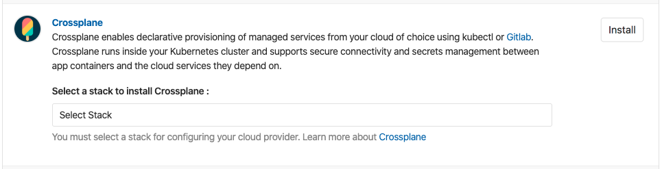

# Continuous Delivery with GitLab

To get started with GitLab and Crossplane see the [GitLab docs][GitLab
Crossplane docs].

## GitLab
[GitLab][GitLab Kubernetes docs] supports deploying Kubernetes applications
using GitLab pipelines today, but cloud service dependencies must be separately
provisioned, connected, and secured. 

## Provision cloud services for Kubernetes apps with Crossplane
With GitLab 12.5, Crossplane is now available as a [GitLab-managed app][GitLab
Crossplane docs] that can be installed into a GitLab-connected Kubernetes
cluster. Managed services from GCP, AWS, and Azure can be declaratively
provisioned and securely consumed using `kubectl` in standard GitLab pipelines
or with a single line of yaml in a GitLab Auto Deploy App.

## Self-service provisioning for project teams
Cluster admins can define the classes of cloud service they want to make
available to GitLab projects in a group, so project teams can securely
provision and consume the managed services that apps depend on, using familiar
GitLab and `kubectl` tooling.

## Securely connect cloud services to Kubernetes
Crossplane is designed to integrate with existing cloud networks, projects, and
resource groups, so managed services like RDS, CloudSQL, and Azure DB can be
provisioned and securely consumed by Kubernetes applications. This includes
[secure connectivity] between the Kubernetes cluster and the managed cloud
services.

## Next Steps
Get started with [GitLab and Crossplane][GitLab Crossplane docs] today!

<!-- Named links -->
[GitLab Crossplane docs]: https://docs.gitlab.com/ee/user/clusters/applications.html#crossplane
[GitLab Kubernetes docs]: https://about.gitlab.com/solutions/kubernetes/
[secure connectivity]: https://blog.crossplane.io/securely-connect-to-cloud-services-without-leaving-kubernetes/
