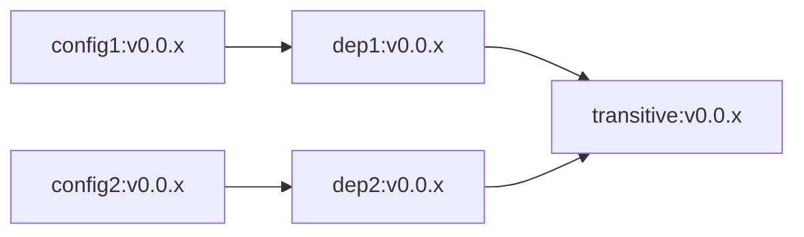

# About These Packages

The packages in this directory are used by e2e tests that exercise the package
manager's handling of transitive dependency upgrades. There are five packages,
with the following dependency relationships:

Note that the version numbers match for all dependency relationships.

Versions v0.0.2 and v0.0.3 of the `transitive` package are identical (i.e., have
identical digests). This tests a corner case of the package manager, since
package revisions are named by package digests and new revisions are created
only when the digest changes.
